# DAENEW Rust Rebuild Memo 2026-05-16

## 0. 目标和边界

目标：为后续用 Rust 100% 重构 `daenew` 建立前期资料。这个文件先把当前 Go 实现的模块、参数、功能、运行逻辑、关键流程、状态缓存、验证命令和 Rust 模块拆分建议记录下来。后续实现 Rust 时，以当前 `daenew` 源码行为为准，不能只按概念重写。

本备忘录只保留本地，不提交。当前已加入 `.git/info/exclude`。

本轮原则：

- 源码为唯一事实来源。旧 memo 只能作为历史背景，不作为正文依据。
- 中文记录行为和设计意图，文件路径、类型名、函数名、配置名保持英文原样。
- 每个模块最终需要达到：文件清单完整、公开类型和私有状态记录、goroutine/channel/ticker/cache 记录、正常/reload/shutdown/error 流程记录、测试覆盖和缺口记录、Rust 等价边界记录。
- 本文件是第一轮 rebuild 索引和主链路记录。后续要继续逐模块展开到函数级和测试级。

## 1. 当前基线

采集时间：2026-05-16

仓库：

- 路径：`/root/project/dae`
- 分支：`daenew`
- HEAD：`1cca04a338348a26710cf8b2008b22d9c9373d36`
- 工作区：`?? rust/`，这是未跟踪目录，本 memo 不读取其构建产物作为 `daenew` Go 源码索引。
- 本地 memo：`DAENEW_RUST_REBUILD_MEMO_2026-05-16.md`

基础命令：

```bash
git status --short --branch
git rev-parse HEAD
PATH=/root/.local/go1.25.9/bin:$PATH GOWORK=off go list ./...
git ls-files '*.go' '*.c' '*.h' 'Makefile' '*.md' '*.service' '*.yml' '*.yaml' | sort
```

`go list ./...` 当前包：

- `github.com/daeuniverse/dae`
- `github.com/daeuniverse/dae/cmd`
- `github.com/daeuniverse/dae/cmd/internal`
- `github.com/daeuniverse/dae/common`
- `github.com/daeuniverse/dae/common/assets`
- `github.com/daeuniverse/dae/common/bitlist`
- `github.com/daeuniverse/dae/common/consts`
- `github.com/daeuniverse/dae/common/json`
- `github.com/daeuniverse/dae/common/netutils`
- `github.com/daeuniverse/dae/common/subscription`
- `github.com/daeuniverse/dae/component`
- `github.com/daeuniverse/dae/component/dns`
- `github.com/daeuniverse/dae/component/outbound`
- `github.com/daeuniverse/dae/component/outbound/dialer`
- `github.com/daeuniverse/dae/component/routing`
- `github.com/daeuniverse/dae/component/routing/domain_matcher`
- `github.com/daeuniverse/dae/component/sniffing`
- `github.com/daeuniverse/dae/component/sniffing/internal/quicutils`
- `github.com/daeuniverse/dae/config`
- `github.com/daeuniverse/dae/control`
- `github.com/daeuniverse/dae/control/kern/tests`
- `github.com/daeuniverse/dae/engine`
- `github.com/daeuniverse/dae/pkg/anybuffer`
- `github.com/daeuniverse/dae/pkg/config_parser`
- `github.com/daeuniverse/dae/pkg/ebpf_internal`
- `github.com/daeuniverse/dae/pkg/ebpf_internal/internal/unix`
- `github.com/daeuniverse/dae/pkg/geodata`
- `github.com/daeuniverse/dae/pkg/geodata/protoext`
- `github.com/daeuniverse/dae/pkg/logger`
- `github.com/daeuniverse/dae/pkg/trie`
- `github.com/daeuniverse/dae/trace`

## 2. 完整模块索引

### 2.1 入口和 CLI

- `main.go`
- `cmd/cmd.go`
- `cmd/run.go`
- `cmd/reload.go`
- `cmd/suspend.go`
- `cmd/validate.go`
- `cmd/trace.go`
- `cmd/sysdump.go`
- `cmd/export.go`
- `cmd/completion.go`
- `cmd/honk.go`
- `cmd/internal/su.go`
- `cmd/internal/su_test.go`

### 2.2 配置系统

- `pkg/config_parser/config_parser.go`
- `pkg/config_parser/error.go`
- `pkg/config_parser/section.go`
- `pkg/config_parser/walker.go`
- `config/config.go`
- `config/parser.go`
- `config/config_merger.go`
- `config/patch.go`
- `config/marshal.go`
- `config/outline.go`
- `config/desc.go`
- `config/*_test.go`

### 2.3 Engine 生命周期

- `engine/runtime.go`
- `engine/helpers.go`
- `engine/runtime_test.go`

### 2.4 Control plane 和 active datapath

- `control/control.go`
- `control/control_plane.go`
- `control/control_plane_core.go`
- `control/tcp.go`
- `control/udp.go`
- `control/connectivity.go`
- `control/routing_matcher_builder.go`
- `control/routing_matcher_userspace.go`
- `control/domain_routing_tracker.go`
- `control/group_override_clone_cache.go`
- `control/runtime_stats.go`
- `control/runtime_stats_control.go`
- `control/bpf_*.go`
- `control/bpf_map_stats.go`
- `control/bpf_subobjects.go`
- `control/bpf_utils.go`
- `control/netns_utils.go`
- `control/sysctl.go`
- `control/addr.go`
- `control/utils.go`
- `control/*_pool.go`

### 2.5 eBPF/tproxy/kernel

- `control/kern/tproxy.c`
- `control/kern/tests/bpf_test.c`
- `control/kern/tests/bpf_test.go`
- `control/kern/headers/*`
- 生成文件：`control/bpf_bpfeb.go`、`control/bpf_bpfel.go`，由 `go generate ./control/control.go` 生成。

### 2.6 DNS

- `component/dns/dns.go`
- `component/dns/upstream.go`
- `component/dns/request_routing.go`
- `component/dns/response_routing.go`
- `component/dns/function_parser.go`
- `component/dns/upstream_stats.go`
- `control/dns.go`
- `control/dns_cache.go`
- `control/dns_cache_restore.go`
- `control/dns_control.go`
- `control/dns_listener.go`
- `control/dns_metrics.go`
- `control/dns_utils.go`
- `control/dns_http_test.go`

### 2.7 Routing

- `component/routing/function_parser.go`
- `component/routing/matcher_builder.go`
- `component/routing/domain_matcher.go`
- `component/routing/optimizer.go`
- `component/routing/domain_matcher/*`
- `control/routing_matcher_builder.go`
- `control/routing_matcher_userspace.go`

### 2.8 Outbound 和 dialer

- `component/outbound/outbound.go`
- `component/outbound/dialer_group.go`
- `component/outbound/dialer_selection_policy.go`
- `component/outbound/filter.go`
- `component/outbound/dialer/dialer.go`
- `component/outbound/dialer/register.go`
- `component/outbound/dialer/direct.go`
- `component/outbound/dialer/block.go`
- `component/outbound/dialer/annotation.go`
- `component/outbound/dialer/alive_dialer_set.go`
- `component/outbound/dialer/connectivity_check.go`
- `component/outbound/dialer/latencies_n.go`
- `component/outbound/dialer/latency_probe.go`
- `component/outbound/dialer/lazy_state_test.go`
- `component/outbound/dialer/sockopt.go`
- `component/outbound/dialer/utils.go`

### 2.9 Sniffing

- `component/sniffing/sniffing.go`
- `component/sniffing/sniffer.go`
- `component/sniffing/conn_sniffer.go`
- `component/sniffing/tls.go`
- `component/sniffing/http.go`
- `component/sniffing/quic.go`
- `component/sniffing/internal/quicutils/*`

### 2.10 支撑包

- `common/*`
- `common/assets/*`
- `common/bitlist/*`
- `common/consts/*`
- `common/json/*`
- `common/netutils/*`
- `common/subscription/*`
- `pkg/anybuffer/*`
- `pkg/ebpf_internal/*`
- `pkg/geodata/*`
- `pkg/logger/*`
- `pkg/trie/*`

### 2.11 Trace 和诊断

- `trace/trace.go`
- `trace/kallsyms.go`
- `trace/ringbuf.go`
- `trace/tracker.go`
- `trace/utils.go`
- `trace/kern/trace.c`
- `cmd/trace.go`
- `cmd/sysdump.go`

### 2.12 构建、服务、CI、文档

- `Makefile`
- `install/dae.service`
- `docker-compose.yml`
- `.github/workflows/daenew.yml`
- `.github/workflows/daenew-release.yml`
- `.github/workflows/release.yml`
- `.github/workflows/daecore.yml`
- `.github/workflows/bpf-test.yml`
- `.github/workflows/build.yml`
- `docs/en/how-it-works.md`
- `docs/zh/how-it-works.md`
- `docs/en/configuration/dns.md`
- `docs/en/configuration/routing.md`
- `docs/zh/configuration/dns.md`
- `docs/zh/configuration/routing.md`

## 3. 配置参数总表

### 3.1 `global`

| 参数 | 类型 | 默认值 | 当前含义 |
| --- | --- | --- | --- |
| `tproxy_port` | `uint16` | `12345` | tproxy 本地监听端口，同时写入 eBPF 加载选项。 |
| `tproxy_port_protect` | `bool` | `true` | 控制透明代理端口保护。 |
| `so_mark_from_dae` | `uint32` | `0` | dae 自身发起连接的 socket mark。 |
| `log_level` | `string` | `info` | logrus 日志等级。 |
| `tcp_check_url` | `[]string` | `http://cp.cloudflare.com,1.1.1.1,2606:4700:4700::1111` | TCP 健康检查 URL 和可选 IP。 |
| `tcp_check_http_method` | `string` | `HEAD` | TCP HTTP 健康检查方法，不合法时 patch 为 `CONNECT`。 |
| `udp_check_dns` | `[]string` | `dns.google:53,8.8.8.8,2001:4860:4860::8888` | UDP/DNS 健康检查目标。 |
| `check_interval` | `time.Duration` | `30s` | dialer 健康检查周期。 |
| `check_tolerance` | `time.Duration` | `0` | alive/latency 抖动容忍。 |
| `udp_endpoint_pool_size` | `int` | `4096` | UDP endpoint pool 最大条目数。 |
| `lan_interface` | `[]string` | 空 | 绑定 LAN 入口/出口 tc 程序，可用 `auto` 的只有 WAN 预处理，LAN 不自动展开。 |
| `wan_interface` | `[]string` | 空 | 绑定 WAN 入口/出口 tc 程序；`auto` 会在 engine 预处理为默认出口接口。 |
| `allow_insecure` | `bool` | `false` | outbound TLS 校验相关全局开关。 |
| `dial_mode` | `string` | `domain` | `ip`、`domain`、`domain+`、`domain++`。影响 sniffing 和拨号目标选择。 |
| `disable_waiting_network` | `bool` | `false` | 有 WAN 时是否跳过启动网络可用性等待。 |
| `enable_local_tcp_fast_redirect` | `bool` | `false` | 已弃用。 |
| `auto_config_kernel_parameter` | `bool` | `false` | 自动配置 ip_forward、send_redirects、IPv6 forwarding 等。 |
| `auto_config_firewall_rule` | `bool` | `false` | 已弃用。 |
| `sniffing_timeout` | `time.Duration` | `100ms` | TCP sniffing 超时；`dial_mode=ip` 时被置为 0。 |
| `tls_implementation` | `string` | `tls` | outbound extra option。 |
| `utls_imitate` | `string` | `chrome_auto` | outbound uTLS 指纹。 |
| `tls_fragment` | `bool` | `false` | TLS fragmentation。 |
| `tls_fragment_length` | `string` | `50-100` | TLS fragmentation 长度范围。 |
| `tls_fragment_interval` | `string` | `10-20` | TLS fragmentation 间隔。 |
| `pprof_port` | `uint16` | `0` | 非 0 时启动 `localhost:<port>` pprof。 |
| `mptcp` | `bool` | `false` | 通过 `common.MagicNetwork(..., mptcp)` 传入 TCP/UDP/DNS/检查拨号路径。 |
| `fallback_resolver` | `string` | `8.8.8.8:53` | bootstrap/direct resolver，必须是 `addr:port`。 |
| `bandwidth_max_tx` | `string` | `0` | outbound extra option。 |
| `bandwidth_max_rx` | `string` | `0` | outbound extra option。 |
| `udphop_interval` | `time.Duration` | `30s` | outbound extra option。 |

### 3.2 `subscription`

元素类型：`[]KeyableString`。

格式：支持 `tag:link` 风格，解析用 `common.GetTagFromLinkLikePlaintext`。支持：

- `file://...`：读取 config 目录内相对文件，拒绝绝对路径和越权路径。
- `http://...`、`https://...`：直接拉取。
- `http-file://...`、`https-file://...`：要求 tag，拉取后持久化到 `persist.d/<tag>.sub`，失败时尝试读取本地持久化副本。

订阅内容解析：

- 优先尝试 SIP008 JSON。
- 失败后按 base64/base64url 节点列表解析。
- 最大读取 `8 MiB`。

### 3.3 `node`

元素类型：`[]KeyableString`。手动节点直接加入 `tagToNodeList[""]`。后续 group 的 `filter` 对所有手动节点和订阅节点统一过滤，订阅 tag 通过 `Dialer.Property().SubscriptionTag` 保存。

### 3.4 `group`

每个子 section 是一个 group：

| 参数 | 类型 | 要求 | 含义 |
| --- | --- | --- | --- |
| section name | `string` | 必填 | group/outbound 名称。 |
| `filter` | `[][]*Function` | 可重复 | 过滤节点，支持 name/subtag。多条 filter 之间按命中任意组加入。 |
| `policy` | `FunctionListOrString` | 必填 | 选择策略。 |
| `tcp_check_url` | `[]string` | 可选 | 覆盖本 group 的 TCP 检查目标。 |
| `tcp_check_http_method` | `string` | 可选 | 覆盖本 group 的检查方法。 |
| `udp_check_dns` | `[]string` | 可选 | 覆盖本 group 的 UDP/DNS 检查目标。 |
| `check_interval` | `time.Duration` | 可选 | 覆盖本 group 检查周期。 |
| `check_tolerance` | `time.Duration` | 可选 | 覆盖本 group 容忍时间。 |

策略：

- `random`
- `fixed(index)`
- `min`
- `min_avg10`
- `min_moving_avg`

### 3.5 `routing`

结构：

- `rules []*config_parser.RoutingRule`
- `fallback FunctionOrString`，默认 `direct`

主要函数：

- `domain(full|keyword|suffix|regex)`
- `ip`
- `sip`
- `port`
- `sport`
- `l4proto(tcp|udp)`
- `ipversion(4|6)`
- `mac`
- `pname`
- `dscp`

outbound 参数：

- `mark:<uint32>`：覆盖 mark。
- `must`：强制行为。兼容 patch：`must_xxx` 会转为 outbound `xxx(must)`，保留 `must_rules`。

别名：

- `dport` -> `port`
- `dip` -> `ip`
- `domain(domain:)` 和空 key -> `suffix`
- `domain(contains:)` -> `keyword`

### 3.6 `dns`

| 参数 | 类型 | 默认/行为 | 含义 |
| --- | --- | --- | --- |
| `ipversion_prefer` | `int` | `0` | `0` 不偏好，`4` 偏好 A，`6` 偏好 AAAA。 |
| `fixed_domain_ttl` | `[]KeyableString` | 空 | `domain:ttl`，覆盖缓存 deadline，不改 `OriginalDeadline`。 |
| `upstream` | `[]KeyableString` | 空 | `tag:scheme://host:port/path`。 |
| `routing.request` | rules + fallback | fallback 缺省 patch 为 `asis` | DNS 请求路由。 |
| `routing.response` | rules + fallback | fallback 缺省 patch 为 `accept` | DNS 响应路由。 |
| `bind` | `string` | 空 | 本地 DNS listener，支持 `udp://addr:port`、`tcp://addr:port`、`tcp+udp://addr:port`、裸 `addr:port` 默认为 UDP。 |

上游 scheme：

- `udp`
- `tcp`
- `tcp+udp`，别名 `udp+tcp`
- `tls`
- `https`
- `quic`
- `h3`，别名 `http3`

## 4. 总体运行链路

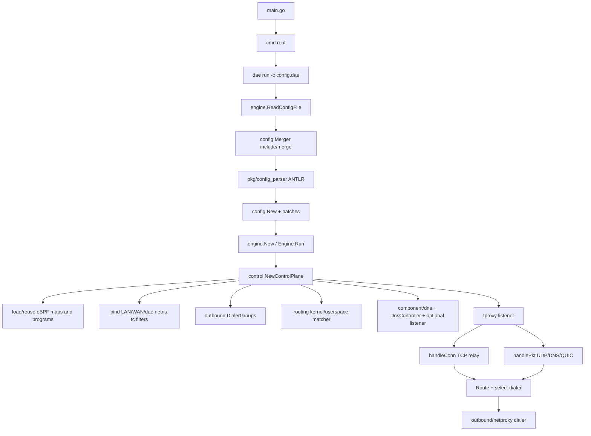
```mermaid
flowchart TD
  Main[main.go] --> Cobra[cmd root]
  Cobra --> Run[dae run -c config.dae]
  Run --> ReadConfig[engine.ReadConfigFile]
  ReadConfig --> Merge[config.Merger include/merge]
  Merge --> Parse[pkg/config_parser ANTLR]
  Parse --> NewConfig[config.New + patches]
  NewConfig --> Engine[engine.New / Engine.Run]
  Engine --> NewCP[control.NewControlPlane]
  NewCP --> BPF[load/reuse eBPF maps and programs]
  NewCP --> Bind[bind LAN/WAN/dae netns tc filters]
  NewCP --> Outbound[outbound DialerGroups]
  NewCP --> Routing[routing kernel/userspace matcher]
  NewCP --> DNS[component/dns + DnsController + optional listener]
  NewCP --> Listen[tproxy listener]
  Listen --> TCP[handleConn TCP relay]
  Listen --> UDP[handlePkt UDP/DNS/QUIC]
  TCP --> Select[Route + select dialer]
  UDP --> Select
  Select --> Dial[outbound/netproxy dialer]
```

Reload 链路：

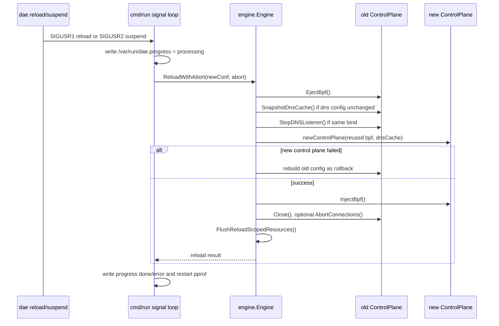
```mermaid
sequenceDiagram
  participant CLI as dae reload/suspend
  participant Run as cmd/run signal loop
  participant Engine as engine.Engine
  participant Old as old ControlPlane
  participant New as new ControlPlane

  CLI->>Run: SIGUSR1 reload or SIGUSR2 suspend
  Run->>Run: write /var/run/dae.progress = processing
  Run->>Engine: ReloadWithAbort(newConf, abort)
  Engine->>Old: EjectBpf()
  Engine->>Old: SnapshotDnsCache() if dns config unchanged
  Engine->>Old: StopDNSListener() if same bind
  Engine->>New: newControlPlane(reused bpf, dnsCache)
  alt new control plane failed
    Engine->>Old: rebuild old config as rollback
  else success
    Engine->>New: InjectBpf()
    Engine->>Old: Close(), optional AbortConnections()
    Engine->>Engine: FlushReloadScopedResources()
    Engine-->>Run: reload result
  end
  Run->>Run: write progress done/error and restart pprof
```

透明代理数据路径：

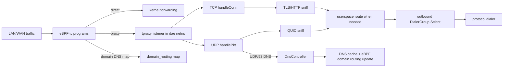
```mermaid
flowchart LR
  Client[LAN/WAN traffic] --> TC[eBPF tc programs]
  TC -->|direct| KernelForward[kernel forwarding]
  TC -->|proxy| TProxy[tproxy listener in dae netns]
  TC -->|domain DNS map| DomainRouting[domain_routing map]
  TProxy --> TCPPath[TCP handleConn]
  TProxy --> UDPPath[UDP handlePkt]
  UDPPath -->|UDP/53 DNS| DnsController
  TCPPath --> Sniff[TLS/HTTP sniff]
  UDPPath --> QuicSniff[QUIC sniff]
  Sniff --> Route[userspace route when needed]
  QuicSniff --> Route
  DnsController --> Cache[DNS cache + eBPF domain routing update]
  Route --> DialerGroup[outbound DialerGroup.Select]
  DialerGroup --> NodeDialer[protocol dialer]
```

## 5. 模块记录

### 5.1 CLI/runtime entry

文件：

- `main.go`
- `cmd/cmd.go`
- `cmd/run.go`
- `cmd/reload.go`
- `cmd/suspend.go`
- `cmd/validate.go`
- `cmd/trace.go`
- `cmd/sysdump.go`
- `cmd/export.go`
- `cmd/completion.go`
- `cmd/honk.go`
- `cmd/internal/su.go`

公开行为：

- `main.go` 调用 `cmd.Execute()`。
- `cmd/cmd.go` 定义 root cobra command，`Version` 默认 `unknown`，构建时由 `Makefile` `-ldflags -X github.com/daeuniverse/dae/cmd.Version=$(VERSION)` 注入，同时同步到 `config.Version`。
- `dae run` 是主运行入口。
- `dae reload [pid]` 发送 `SIGUSR1`。
- `dae suspend [pid]` 发送 `SIGUSR2`，进入 no-load 配置。
- `dae validate -c` 只读取并解析配置。
- `dae trace` 仅在 `trace` build tag 下存在。
- `dae export outline` 输出配置结构 JSON 给 UI/工具使用。
- `dae sysdump` 打包系统网络诊断信息。

`dae run` flags：

- `--config` / `-c`：必填。
- `--logfile`：空时 stdout/stderr。
- `--logfile-maxsize`：默认 30 MB。
- `--logfile-maxbackups`：默认 3。
- `--disable-timestamp`
- `--disable-pidfile`
- `--disable-sudo`

运行流程：

1. 必须提供 config。
2. 默认自动提权：`sudo` -> `doas` -> `run0/pkexec`，只保留 `TERM,LANG,LC_ALL,LC_CTYPE` 环境。
3. `engine.ReadConfigFile(cfgFile)` 读取配置。
4. 配置 logrus/lumberjack。
5. `engine.New`，`SubscriptionConfigDir=filepath.Dir(cfgFile)`，`OnReady` 中通知 systemd ready、写 pid、写 reload progress done。
6. 根据 `global.pprof_port` 启动 `localhost:<port>` pprof。
7. goroutine 中调用 `Engine.Run(log, conf, []string{filepath.Dir(cfgFile)}, disableTimestamp, false)`。
8. 主 goroutine 处理信号。

信号和状态文件：

- pid 文件：`/var/run/dae.pid`
- reload 进度：`/var/run/dae.progress`
- abort marker：`/var/run/dae.abort`
- `SIGUSR1`：reload config。
- `SIGUSR2`：构造 `EmptyConfig()`，保留 global，清空 WAN/LAN，log_level 设为 `warning`。
- `--abort`：reload/suspend 前创建 abort marker，run 端读取并决定是否断开旧连接。

Rust 对等建议：

- `dae-cli` crate：cobra 等价可用 `clap`。
- `dae-runtime` crate：提供 `Engine`。
- 信号、pid/progress、auto-su 必须保持路径和语义兼容，否则 daed/wing 链路会破坏。
- `trace` 应保持 feature-gated。

### 5.2 Config system

文件：

- `pkg/config_parser/*`
- `config/*`

解析链路：

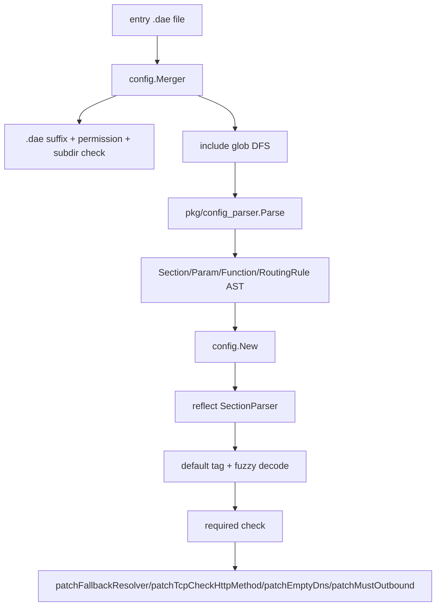
```mermaid
flowchart TD
  File[entry .dae file] --> Merger[config.Merger]
  Merger --> Secure[.dae suffix + permission + subdir check]
  Merger --> Include[include glob DFS]
  Include --> ANTLR[pkg/config_parser.Parse]
  ANTLR --> Section[Section/Param/Function/RoutingRule AST]
  Section --> ConfigNew[config.New]
  ConfigNew --> SectionParser[reflect SectionParser]
  SectionParser --> Defaults[default tag + fuzzy decode]
  Defaults --> Required[required check]
  Required --> Patches[patchFallbackResolver/patchTcpCheckHttpMethod/patchEmptyDns/patchMustOutbound]
```

AST 模型：

- `Section{Name, Items}`
- `Item{Type, Value}`，类型包括 routing rule、param、section。
- `Param{Key, Val, AndFunctions, Annotation}`
- `Function{Name, Not, Params}`
- `RoutingRule{AndFunctions, Outbound}`

配置安全：

- include 文件必须 `.dae` 后缀。
- include 路径必须在 entry 目录下。
- 文件权限不能 group writable，也不能 others 可访问或可写，建议 `0640`/`0600`。
- circular include 返回 `ErrCircularInclude`。

patch：

- `patchFallbackResolver`：验证 `global.fallback_resolver`。
- `patchTcpCheckHttpMethod`：不合法 HTTP method 改为 `CONNECT`。
- `patchEmptyDns`：空 DNS request fallback 为 `asis`，response fallback 为 `accept`。
- `patchMustOutbound`：兼容 `must_` 前缀。

导出：

- `Config.Marshal(indent)` 反向输出 `.dae` 风格配置。
- `ExportOutlineJson(version)` 给 UI 使用。
- `engine.ExportFlatDesc()` 输出扁平描述。

Rust 对等建议：

- `dae-config-parser`：ANTLR 可替换为 Rust parser，但 AST 结构和错误位置要对齐。
- `dae-config-model`：强类型 config + default + patch。
- 反序列化不要只用 serde TOML/JSON，因为 dae 配置语法有 routing rule、function、annotation、include merge 特性。

### 5.3 Engine lifecycle

文件：

- `engine/runtime.go`
- `engine/helpers.go`

核心类型：

- `Options`
- `Engine`
- `RuntimeOverview`
- `RuntimeTrafficSample`
- `reloadMessage`
- `serveResult`

Engine 持有状态：

- `controlPlane`
- `reloadCh`
- `exitCh`
- `subscriptionConfigDir`
- `checkNetworkLinks`
- `httpTransport`
- `netns`
- `udpEndpointPool`
- `udpTaskPool`
- `anyfromPool`
- `fallbackDNS`
- `bootstrapDirect`
- `bootstrapDirectFullcone`
- startup GC 状态。

启动流程：

1. 初始化 `exitCh`。
2. dry 模式只消费 reload message 并返回 nil。
3. `newControlPlane` 创建 control plane。
4. `maybePostStartupGC(force=true)`。
5. `controlPlane.ListenAndServe` 在 netns 中启动监听。
6. loop 消费 reload/serve result/stop。

`newControlPlane` 关键逻辑：

- `prepareRuntimeConfigView` 复制 global/routing/dns，展开 WAN `auto`。
- `applyGlobalRuntimeTuning` 设置 UDP endpoint pool size。
- 解析 `fallback_resolver`，构造 bootstrap direct/fullcone dialer。
- 手动节点加入 `tagToNodeList[""]`。
- WAN 不为空且未禁用等待网络时，等待网络可用。
- 并发解析 subscription，最大并发 `6`。
- 清理 `persist.d` 中未使用 tag 的持久化订阅。
- 调用 `control.NewControlPlane`。

Reload 行为：

- 复用旧 BPF 对象。
- 如果 DNS config 不变，clone DNS cache 并恢复。
- 如果新旧 DNS bind 都非空且相同，先 stop 旧 DNS listener，避免新 listener bind 冲突。
- 新 control plane 创建失败时尝试回滚旧配置。
- 成功后 close old，flush reload-scoped resources，并根据 heap 增长触发 GC。

Runtime overview：

- 汇总 active TCP、UDP sessions、UDP task queues/drop、packet sniffer sessions、RSS、heap、goroutines、DNS observability、traffic samples。
- traffic 记录在 `control/runtime_stats.go`，按 16 shard 和 250ms bucket 聚合，保留最多 1 小时。

Rust 对等建议：

- `dae-runtime-engine`：单 owner task，reload channel 可用 `tokio::sync::mpsc` + oneshot。
- control plane 资源必须遵守 reload 所需的 BPF eject/inject 和 DNS cache snapshot 语义。
- runtime overview 结构需要稳定，因为 daed/wing WebUI 依赖字段。

### 5.4 Control plane

文件：

- `control/control_plane.go`
- `control/control_plane_core.go`
- `control/tcp.go`
- `control/udp.go`
- `control/*_pool.go`
- `control/runtime_stats.go`

核心类型：

- `ControlPlane`
- `controlPlaneCore`
- `RuntimeDeps`
- `CacheStats`
- `RouteDialParam`
- `DialOption`
- `UdpEndpointPool`
- `UdpTaskPool`
- `AnyfromPool`
- `PacketSnifferPool`

初始化步骤：

1. 设置 `QUIC_GO_DISABLE_GSO=1`，除非环境已设置。
2. 检查 kernel version 和 eBPF feature：
   - `bpf_loop`
   - checksum 相关能力
   - WAN 绑定需要 BPF timer feature
   - LAN 绑定需要 sk_assign feature
   - basic feature version
3. `rlimit.RemoveMemlock()`。
4. runtime deps 补默认值。
5. 初始化 sysctl manager。
6. setup dae netns。
7. 创建 BPF pin path。
8. load 或复用 BPF objects。
9. 创建 `controlPlaneCore`。
10. bind LAN/WAN/dae netns。
11. 构造 direct/block 内置 outbound。
12. 从 node/subscription link 构造 dialer set。
13. 按 group filter 和 policy 构造用户 outbounds。
14. 构造 routing kernel/userspace matcher。
15. 构造 DNS upstream/controller/listener。
16. 检查 upstream format，异步初始化 upstream。

资源和关闭：

- `deferFuncs` 逆序执行。
- reload 复用 BPF 时旧 control plane 不关闭 BPF。
- `ControlPlane.Close` 负责 cancel 和资源关闭。
- pools 在 Engine stop/reload 中清理。

缓存和上限：

- real domain cache：正向 5 分钟，负向 30 秒，最大 4096。
- DNS cache：最大 4096，后台每分钟 sweep。
- DNS forwarder cache：最大 128，idle 15 分钟，每 5 分钟 sweep。
- UDP endpoint pool：默认 4096，后台 1 秒 sweep。
- UDP task pool：队列最大 2048，每队列 channel 长度 128。
- packet sniffer pool：TTL 3 秒，最大 1024。
- anyfrom pool：最大 256。

Rust 对等建议：

- `dae-control-plane`：资源 owner + reload-safe BPF object handle。
- `dae-datapath`：TCP/UDP handlers。
- `dae-pools`：UDP endpoint/task/anyfrom/sniffer pools。需要小心 Drop 顺序，保持 close 时异步任务能退出。
- `dae-kernel`：netlink、sysctl、netns、BPF attach。

### 5.5 TCP path

文件：`control/tcp.go`

流程：

1. tproxy accept 后进入 `handleConn`。
2. 创建 `ConnSniffer`，按 `sniffing_timeout` 读取 TCP 首包。
3. 尝试 TLS/HTTP sniff，得到 domain。sniffing error 不直接失败。
4. 从 eBPF map 取回 `src,dst,l4proto` 的 routing result。
5. 调用 `RouteDialTcp`。
6. 根据 dial mode 和 routing result 决定 dial target、是否 reroute。
7. 若 outbound 是 `control_plane_routing`，调用 userspace `Route` 再重新选择目标。
8. 默认 mark 为 `so_mark_from_dae`。
9. `DialerGroup.Select` 选择节点。
10. 用 `common.MagicNetwork("tcp", mark, mptcp)` 拨号。
11. `RelayTCP` 双向 copy，并记录上传/下载流量。

日志字段：

- `network`
- `outbound`
- `policy`
- `dialer`
- `sniffed`
- `ip`
- `pid`
- `dscp`
- `pname`
- `mac`

Rust 对等建议：

- TCP sniffed 首包必须还能被 relay 继续读取，不能吞包。
- relay 的 half-close 和 deadline 行为要对齐。
- `mptcp`、`mark`、`dscp` 等 socket option 不能只存在 config 层。

### 5.6 UDP path

文件：`control/udp.go`

流程：

1. eBPF/tproxy UDP 包进入 `handlePkt`。
2. 使用 UDP endpoint pool 按 client source 复用 full-cone endpoint。
3. 对目标端口 53 的 UDP 包尝试 DNS parse。
4. 非 DNS 且允许 sniff 时，使用 packet sniffer pool 组包 sniff QUIC SNI。
5. DNS 包交给 `DnsController.Handle_`。
6. 普通 UDP 选择 outbound/dialer，创建或复用 UDP endpoint。
7. response handler 用 anyfrom pool 从真实来源发回客户端。
8. 记录上传/下载流量。

重要行为：

- UDP 非 DNS 流量即使 sniff 到 domain，也默认保持 `realDst.String()` 作为 dial target，避免 QUIC 目标重写导致连接问题。
- 非 fixed 策略下，复用旧 endpoint 时如果旧 dialer 已不 alive，会删除 endpoint 并重新选择。
- DNS NAT timeout 为 17 秒，普通 UDP 默认 3 分钟。

Rust 对等建议：

- UDP task ordering 和 endpoint 生命周期是重构高风险点。
- packet buffer 使用 pool，Rust 需要明确 buffer ownership，避免复制过多。

### 5.7 DNS

文件：

- `component/dns/*`
- `control/dns*.go`

DNS upstream：

- `component/dns.New` 解析 `dns.upstream`，tag 必须存在且不能重复。
- 每个 upstream 用 `UpstreamResolver` 懒初始化/刷新。
- 默认 refresh interval 10 分钟，失败 retry 1 分钟。
- 初始化并发上限 16。
- `NewUpstreamWithResolver` 使用 fallback resolver 和 bootstrap dialer 解析 upstream hostname。

DNS request routing：

- 支持 `qname`、`qtype`。
- request outbound reserved：
  - `reject`
  - `asis`
  - `<OR>`
  - `<AND>`
- domain matcher 用 `AhocorasickSlimtrie`。

DNS response routing：

- 支持 `qname`、`qtype`、`ip`、`upstream`。
- response outbound reserved：
  - `accept`
  - `reject`
  - `<OR>`
  - `<AND>`
- `ip` 规则用 trie。

DNS controller：

- `DnsController` 管理 handling 去重、DNS cache、forwarder cache、fixed domain ttl、IP version prefer。
- DNS cache key：lowercase canonical qname + qtype + qclass。
- `DnsCache` 保存：
  - `RouteOwnerKey`
  - `DomainBitmap`
  - `Answer`
  - `IPs`
  - `HasAnyIP`
  - `Deadline`
  - `OriginalDeadline`
  - `PackedResponse`
- cache access/remove callback 会更新或删除 eBPF `domain_routing` map。

DNS forwarder：

- `DoUDP`
- `DoTCP`
- `DoTLS`
- `DoH` over HTTP/1/2
- `DoH` over HTTP/3
- `DoQ`
- HTTPS/H3/QUIC forwarder 可以被缓存复用，普通 UDP/TCP/TLS 依据 `dnsForwarderReusable` 判断。

DNS listener：

- `dns.bind` 空时不启动 listener。
- 裸 `addr:port` 默认为 UDP。
- `udp://` 只启动 UDP。
- `tcp://` 只启动 TCP。
- `tcp+udp://` 同时启动 TCP/UDP。
- listener 的 handler 转入 `ControlPlane` DNS controller。

Rust 对等建议：

- DNS 是 Rust 重构第一批最需要做行为测试的模块之一。
- `fixed_domain_ttl` 必须区分 `Deadline` 和 `OriginalDeadline`。
- reload 时 DNS config 未变才恢复 DNS cache。
- 本地 listener 的 TCP DNS 和透明代理 UDP/53 是两条不同入口，不能混为一谈。

### 5.8 Routing

文件：

- `component/routing/*`
- `component/routing/domain_matcher/*`
- `control/routing_matcher_builder.go`
- `control/routing_matcher_userspace.go`

主要流程：

1. config parser 产生 routing rule AST。
2. optimizers：
   - `AliasOptimizer`
   - `DatReaderOptimizer`
   - `MergeAndSortRulesOptimizer`
   - `DeduplicateParamsOptimizer`
3. `RulesBuilder` 将每个 rule 的 function 参数按 key 分组，展开为 match set。
4. control routing builder 构造 kernel map 和 userspace matcher。
5. active path 根据 eBPF routing result 或 userspace reroute 选择 outbound。

Domain matcher：

- `AhocorasickSlimtrie`
- `bruteforce`
- `go_regexp_nfa`

地理数据：

- `DatReaderOptimizer` 读取 geosite，支持 `code@attr`。
- `domain` 类型映射：
  - Full -> `full`
  - RootDomain -> `suffix`
  - Plain -> `keyword`
  - Regex -> `regex`

Rust 对等建议：

- domain matcher 是 Rust 重构可较早独立验证的模块。
- 需要固定 corpus：small/generated + live geosite fixture，避免 Go/Rust benchmark 不公平。
- kernel/userspace route bitset 和 max match set 长度必须和 `MaxMatchSetLen` 构建参数一致。

### 5.9 Outbound

文件：

- `component/outbound/*`
- `component/outbound/dialer/*`

协议注册：

`component/outbound/outbound.go` 通过 blank import 注册 outbound 库里的 dialer/protocol/transport：

- dialer：anytls、http、hysteria2、juicity、shadowsocks、shadowsocksr、socks、trojan、tuic、v2ray
- protocol：anytls、hysteria2、juicity、shadowsocks、trojanc、tuic、vless、vmess
- transport：simpleobfs、tls、ws

DialerSet：

- 从 `tagToNodeList` 转成 `Dialer`。
- 每个 node 保存 subscription tag。
- filter 支持：
  - `name(regex|keyword|full)`
  - `subtag(regex|full)`
- 多个 filter group 命中任意一个即纳入。

DialerGroup：

- 内置 direct/block 固定存在。
- 每个用户 group 根据 policy 建立 alive dialer sets。
- 6 个 alive 集合：
  - DNS TCP IPv4
  - DNS TCP IPv6
  - DNS UDP IPv4
  - DNS UDP IPv6
  - TCP IPv4
  - TCP IPv6
- UDP 非 DNS 复用 DNS UDP 的健康检查结果。

策略：

- `fixed`：按 index 选节点，不依赖 alive 状态。
- `random`：从 alive set 随机。
- `min`：最小最后一次延迟。
- `min_avg10`：最近 10 次平均最低。
- `min_moving_avg`：移动平均最低。

手动 probe：

- `Dialer.ProbeLatency()` 是 TCP-only，超时 4 秒。
- IPv4/IPv6 TCP check option 依次尝试。
- 成功返回 latency 和 `TCP-only`，失败返回错误消息或 `no latency result`。

Rust 对等建议：

- outbound 底层库目前是 Go 生态，Rust 100% 重构需要决定是直接重写协议栈，还是先做 FFI/sidecar。若目标是 100% Rust，协议和 transport 必须逐一列 parity 表。
- group min 策略依赖 alive set 的实时 latency，不可简单改成只读 UI 缓存。

### 5.10 Sniffing and dial mode

文件：

- `component/sniffing/*`
- `component/sniffing/internal/quicutils/*`

错误模型：

- `Error`
- `ErrNotApplicable`
- `ErrNeedMore`
- `ErrNotFound`
- `ErrDataTooLarge`
- `IsSniffingError(err)`

TCP sniff：

- `SniffTcp` 对 stream 读取一次，不足时可循环等待。
- 先 sniff TLS，再 sniff HTTP。
- 成功后 normalize domain。
- `ConnSniffer` 同时实现 `net.Conn` 读包装，保证 relay 能读到已缓存数据。

UDP sniff：

- 只 sniff QUIC。
- packet buffer 上限 64 KiB，最多 64 chunks。
- QUIC Initial 解密并重组 crypto frame，复用 TLS SNI 提取逻辑。

Dial mode 影响：

- `ip`：sniffing timeout 置 0，以 IP 拨号。
- `domain`、`domain+`、`domain++`：需要结合 `ChooseDialTarget` 和 route/reroute 继续逐函数展开。

Rust 对等建议：

- QUIC sniff 是高风险模块，应优先建立 fixture parity。
- sniffing 不能阻塞 active traffic 太久，超时语义要严格复刻。

### 5.11 eBPF/tproxy/netns

文件：

- `control/kern/tproxy.c`
- `control/control_plane_core.go`
- `control/bpf_utils.go`
- `control/netns_utils.go`
- `control/sysctl.go`
- `pkg/ebpf_internal/*`

当前 Go 层职责：

- 生成和加载 BPF object。
- pin maps 到 `/sys/fs/bpf/...`。
- attach tc clsact ingress/egress。
- 维护 LAN/WAN/dae netns 的绑定。
- 通过 maps 写入 routing、domain routing、socket 等状态。
- reload 时通过 flip handle 避免旧新 TC filter 冲突。

Rust 对等建议：

- 建议拆为：
  - `dae-ebpf-loader`
  - `dae-netns`
  - `dae-netlink`
  - `dae-kernel-owner`
- Rust 侧如果继续使用 C eBPF 源码，可以先保持 C 程序不变，重写 userspace loader/attach/mapper。
- 生成产物要和 Makefile/CI 对齐，避免手写 stale binding。

### 5.12 Support packages

`common/subscription`：

- 负责订阅拉取、持久化 fallback、SIP008/base64 解析。
- 安全点：tag 不能路径穿越，文件权限检查，最大 8 MiB。

`common/netutils`：

- DNS、IP v4/v6、URL、UDP netproxy 辅助。

`common/consts`：

- dialer policy、dial mode、DNS reserved index、routing function name、kernel feature version、BPF 常量等。

`pkg/geodata`：

- geosite/geoip dat 解析。

`pkg/trie`：

- IP prefix trie，DNS response route 和 routing IP 匹配使用。

`pkg/logger`：

- logrus 设置。

`pkg/ebpf_internal`：

- kernel version、ELF、rawsock、endianness、vDSO 等 eBPF loader 支撑。

### 5.13 Trace and diagnostics

`cmd/trace.go`：

- build tag：`trace`
- flags：
  - `--ipv4/-4`
  - `--ipv6/-6`
  - `--l4-proto/-p`
  - `--port/-P`
  - `--drop-only`
  - `--output/-o`
  - `--ringbuf-size`
- 调用 `trace.StartTrace`，读取 kallsyms，attach BPF trace programs，消费 ringbuf。

`cmd/sysdump.go`：

- 采集 route、net interfaces、sysctl、netfilter、iptables。
- 输出 `dae-sysdump.<unix>.tar.gz`。

Rust 对等建议：

- trace 可作为后置模块，但 CLI surface 和输出格式要保持兼容。
- sysdump 可先直接用 Rust netlink/procfs 或保留 shell 命令采集。

### 5.14 Build/CI/release

Makefile：

- `VERSION` 默认从 git 日期、commit count、short hash 生成。
- `dae` target：
  - `GOOS=linux`
  - 默认 `CGO_ENABLED=0`
  - 依赖 `ebpf`
  - `go build -tags=$(cat .build_tags)`
- `ebpf` target：
  - 设置 `BPF_CLANG`、`BPF_STRIP_FLAG`、`BPF_CFLAGS`、`BPF_TARGET`、`BPF_TRACE_TARGET`
  - `go generate ./control/control.go`
  - `go generate ./trace/trace.go`
  - 成功写 `.build_tags=trace`，失败写空。
- `ebpf-test` 生成并运行 `control/kern/tests`。

CI：

- `daenew.yml`：push/pull_request/workflow_dispatch on `daenew`，调用 `daecore.yml`。
- `daenew-release.yml`：手动输入 tag/ref/make_latest，调用 `release.yml`。
- `release.yml`：准备 tag，矩阵构建 Linux 多架构包，Go 版本 `1.25.9`，安装 clang/llvm，make，打包 service/config/geodata。

Rust 对等建议：

- release 输出包名、服务文件、默认安装路径要兼容。
- Rust 二进制仍需 Linux-only eBPF build pipeline。

## 6. Rust 重构初始架构建议

建议 crate/module 切分：

```text
dae-cli
  commands: run, reload, suspend, validate, trace, sysdump, export

dae-config-parser
  lexer/parser/ast/errors

dae-config
  model/defaults/patch/marshal/outline

dae-runtime-engine
  Engine, reload, stop, runtime overview, subscription resolve orchestration

dae-control-plane
  ControlPlane, lifecycle, route APIs, DNS integration, outbound integration

dae-kernel
  eBPF loader, map handles, tc attach, netns, sysctl, kernel version checks

dae-datapath
  TCP handler, UDP handler, relay, traffic stats

dae-dns
  upstream, request routing, response routing, controller, cache, forwarders, listener

dae-routing
  rule optimizer, matcher builder, domain matcher, IP trie

dae-outbound
  protocol registry, node parser, dialer, dialer group, alive/latency checks

dae-sniffing
  TLS/HTTP/QUIC sniffing, packet reassembly

dae-subscription
  file/http/http-file subscription, SIP008/base64 parsing

dae-observability
  runtime stats, DNS metrics, logs, trace bridge
```

依赖方向：

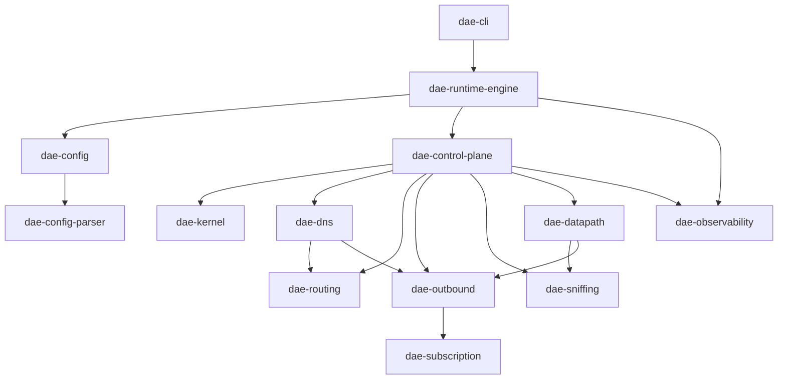
```mermaid
flowchart TD
  CLI[dae-cli] --> Engine[dae-runtime-engine]
  Engine --> Config[dae-config]
  Config --> Parser[dae-config-parser]
  Engine --> Control[dae-control-plane]
  Control --> Kernel[dae-kernel]
  Control --> DNS[dae-dns]
  Control --> Routing[dae-routing]
  Control --> Outbound[dae-outbound]
  Control --> Sniffing[dae-sniffing]
  Control --> DataPath[dae-datapath]
  DNS --> Routing
  DNS --> Outbound
  Outbound --> Subscription[dae-subscription]
  DataPath --> Sniffing
  DataPath --> Outbound
  Engine --> Observability[dae-observability]
  Control --> Observability
```

迁移顺序建议：

1. `config_parser` + `config`：可完全离线测试。
2. `routing/domain_matcher` + `trie`：可用 corpus 做 parity/benchmark。
3. `sniffing`：TLS/HTTP/QUIC fixtures。
4. `subscription`：HTTP/file/SIP008/base64 和安全边界。
5. `runtime_stats` 和无内核 pools：独立单测。
6. `DNS` request/response matcher、cache、forwarder。
7. `outbound` registry/dialer group/health policy。
8. `control` active datapath。
9. `kernel/eBPF/netns/tproxy`。
10. CLI/release/packaging 收口。

## 7. 验证计划

轻量验证：

```bash
PATH=/root/.local/go1.25.9/bin:$PATH GOWORK=off go list ./...
PATH=/root/.local/go1.25.9/bin:$PATH GOWORK=off go test ./pkg/config_parser ./config
PATH=/root/.local/go1.25.9/bin:$PATH GOWORK=off go test ./component/...
PATH=/root/.local/go1.25.9/bin:$PATH GOWORK=off go test ./engine
PATH=/root/.local/go1.25.9/bin:$PATH GOWORK=off go test ./control -run 'Test.*'
```

环境相关验证：

```bash
make ebpf
make ebpf-test
PATH=/root/.local/go1.25.9/bin:$PATH GOWORK=off go test ./...
```

注意：`control` 和 eBPF 测试可能依赖 root、kernel capability、clang/llvm、submodule 和本机网络环境。失败需要区分环境限制和产品缺陷。

### 7.1 本轮已执行验证

采集时间：2026-05-16

```bash
PATH=/root/.local/go1.25.9/bin:$PATH GOWORK=off go list ./...
```

结果：通过，包列表已记录在第 1 节。

```bash
PATH=/root/.local/go1.25.9/bin:$PATH GOWORK=off go test ./pkg/config_parser ./config
```

结果：通过。

```bash
PATH=/root/.local/go1.25.9/bin:$PATH GOWORK=off go test ./engine
```

结果：通过。

```bash
PATH=/root/.local/go1.25.9/bin:$PATH GOWORK=off go test ./component/...
```

结果：通过。

```bash
PATH=/root/.local/go1.25.9/bin:$PATH GOWORK=off go test ./control -run 'Test.*'
```

结果：通过。

本轮未执行：

- `make ebpf`
- `make ebpf-test`
- `go test ./...`

原因：本轮只建立 rebuild memo，不改业务代码；完整 eBPF 和全仓测试留到后续模块级审计或实现前验证。

## 8. 后续逐模块记录模板

每个模块继续展开时按以下格式记录：

```text
模块：
源码文件：
公开 API：
私有状态：
常量：
缓存：
goroutine/channel/ticker：
正常启动流程：
请求/数据处理流程：
reload 行为：
shutdown 行为：
错误处理：
测试文件：
现有测试覆盖：
测试缺口：
Rust 等价模块：
Rust parity 风险：
本轮验证命令：
验证结果：
```

## 9. 当前待办

1. 继续把 `control/routing_matcher_builder.go`、`control/routing_matcher_userspace.go`、`ChooseDialTarget`、`Route` 与 `control/kern/tproxy.c` 做逐字段 parity 表。
2. 继续把 `control/dns_control.go` 的 `Handle_`、cache 命中、response routing、fixed ttl、forwarder cache 做逐测试 fixture 表。
3. 为 outbound 协议注册写完整协议 parity 表：每种 link 参数、transport、TLS/utls、fragment、udp hop。
4. 为 eBPF map 写完整 map schema 表：key/value、生命周期、由哪个模块写入、由哪个 BPF 程序读取。
5. 为 Rust 重构建立 fixture/test matrix，优先 config/routing/sniffing/DNS。

## 10. 追加记录：routing/dial mode/DNS controller

采集时间：2026-05-16

本节继续展开第 9 节的前两项。仍然只记录当前 `daenew` 源码行为，不修改业务代码。

### 10.1 Routing matcher builder

源码：

- `control/routing_matcher_builder.go`
- `control/routing_matcher_userspace.go`
- `control/kern/tproxy.c`
- `common/consts/ebpf.go`

`RoutingMatcherBuilder` 状态：

- `outboundName2Id map[string]uint8`：group 名称到 BPF outbound id。
- `bpf *bpfObjects`：kernel maps。
- `rules []bpfMatchSet`：最终写入 kernel/userspace matcher 的 match set。
- `simulatedLpmTries [][]netip.Prefix`：userspace 和 kernel LPM map 的中间数据。
- `simulatedDomainSet []routing.DomainSet`：domain matcher 的中间数据。

builder 注册的 routing functions：

- `domain` -> `addDomain`
- `ip` -> `addIp`
- `sip` -> `addSourceIp`
- `port` -> `addPort`
- `sport` -> `addSourcePort`
- `l4proto` -> `addL4Proto`
- `mac` -> `addSourceMac`
- `pname` -> `addProcessName`
- `dscp` -> `addDscp`
- `ipversion` -> `addIpVersion`

outbound id 映射：

- `direct` = `0`
- `block` = `1`
- 用户 group 从 `2` 开始。
- `must_rules` = `0xFC`
- `<Control Plane Routing>` = `0xFD`
- `<OR>` = `0xFE`
- `<AND>` = `0xFF`

match type 顺序必须和 `control/kern/tproxy.c` 保持一致：

| Go const | C enum | 含义 |
| --- | --- | --- |
| `MatchType_DomainSet` | `MatchType_DomainSet` | domain bitmap 匹配。 |
| `MatchType_IpSet` | `MatchType_IpSet` | 目标 IP LPM。 |
| `MatchType_SourceIpSet` | `MatchType_SourceIpSet` | 源 IP LPM。 |
| `MatchType_Port` | `MatchType_Port` | 目标端口范围。 |
| `MatchType_SourcePort` | `MatchType_SourcePort` | 源端口范围。 |
| `MatchType_L4Proto` | `MatchType_L4Proto` | TCP/UDP bitmask。 |
| `MatchType_IpVersion` | `MatchType_IpVersion` | IPv4/IPv6 bitmask。 |
| `MatchType_Mac` | `MatchType_Mac` | MAC 转 16-byte LPM。 |
| `MatchType_ProcessName` | `MatchType_ProcessName` | WAN 路径进程名。 |
| `MatchType_Dscp` | `MatchType_Dscp` | DSCP/TOS。 |
| `MatchType_Fallback` | `MatchType_Fallback` | fallback rule。 |

规则展开语义：

- `routing.RulesBuilder.Apply` 会把每条 rule 的函数按参数 key 分组。
- 同一个函数多个 key group 会被展开成多个 match set。
- 同一个 key 内多个 value 对部分函数用 `<OR>` 串起来，例如 `port`、`sport`、`pname`、`dscp`。
- 一个 rule 的多个 function 用 `<AND>` 串起来。
- rule 尾部写入真实 outbound。
- fallback 必须是最后一个 match set。

kernel build：

1. `BuildKernspace` 为每个 `simulatedLpmTries` 创建 eBPF LPM map。
2. 把 LPM map 放入 `LpmArrayMap`。
3. 批量写 `RoutingMap`。
4. 日志输出 `Routing match set len: n/MaxMatchSetLen`。

userspace build：

1. `BuildUserspace` 构造 `AhocorasickSlimtrie` domain matcher。
2. 为每组 prefix 构造 `trie.Trie`。
3. 校验 fallback 是最后一个 match set。
4. 返回 `RoutingMatcher{lpmMatcher, domainMatcher, matches}`。

Rust parity 要求：

- `bpfMatchSet` 的二进制布局、字段宽度、大小端写入必须和 C BPF 程序一致。
- match type enum 顺序不能重排。
- `<OR>/<AND>` 尾部判定和 `OutboundLogicalMask` 规则必须完全一致。
- `MaxMatchSetLen` 是构建参数，Rust 侧需要同样从 build/release 注入或生成。

### 10.2 Userspace routing matcher

源码：`control/routing_matcher_userspace.go`

`RoutingMatcher.Match` 输入：

- `sourceAddr []byte`，必须 16 bytes。
- `destAddr []byte`，必须 16 bytes。
- `sourcePort uint16`
- `destPort uint16`
- `ipVersion consts.IpVersionType`
- `l4proto consts.L4ProtoType`
- `domain string`
- `processName [16]uint8`
- `tos uint8`
- `mac []byte`，必须 16 bytes，调用方用 10 个 0 + 6-byte MAC 组成。

匹配流程：

1. 如果 domain 非空，先用 domain matcher 得到 bitmap。
2. 遍历 `matches`。
3. `badRule || goodSubrule` 时跳过当前 match 判断，直接进入 rule/subrule 结算。
4. 各 match type 分别判断：
   - IP/source IP/MAC：从 `match.Value` 取 LPM index，查 trie。
   - domain：读 bitmap。
   - port/source port：解析 port range。
   - ipversion/l4proto：bitmask 命中。
   - pname：processName 首字节非 0 且 16-byte 完全相等。
   - dscp：等值。
   - fallback：直接命中。
5. 非 `<OR>` 时结算 subrule：`goodSubrule == match.Not` 表示该 subrule 不命中，设置 `badRule`。
6. outbound 非 logical mask 时结算整条 rule：
   - `badRule=false` 时 rule 命中。
   - 如果 outbound 是 `must_rules`，设置本地 `must=true` 并继续后续规则。
   - 如果之前命中过 `must_rules`，后续命中的真实 outbound 会带 `match.Must=true`。
   - 返回 outbound、mark、must。
7. 无命中返回 `no match set hit`。

与 kernel 的关键差异/注意：

- userspace matcher 注释要求和 `kern/tproxy.c` 保持同步。
- kernel 中 DNS UDP/53 且非 must 时会返回 `OUTBOUND_CONTROL_PLANE_ROUTING`，让 DNS controller 接管。
- userspace matcher 本身不内建 `isdns` 逻辑，DNS 路由在 userspace 由 `DnsController` 管理。

当前源码中一个需要后续判定的点：

- `ControlPlane.Route` 调用 `c.routingMatcher.Match(...)` 后，函数签名返回 `must bool`，但当前实际 `return outboundIndex, mark, false, nil`，没有把 matcher 返回的 `must` 传出。
- 当前 TCP/UDP 调用处都忽略 `Route` 的第三个返回值，因此这不一定立刻影响 active path；但 Rust 100% parity 时必须先判定这是既有行为、死字段、还是待修复缺陷。

现有测试：

- `TestRoutingMatcherUserspaceFallback`
- `TestRoutingMatcherUserspaceDomain`
- `TestRoutingMatcherUserspaceIpPort`

测试缺口：

- `must_rules` userspace 行为。
- `mark` 回传行为。
- `pname`、`dscp`、`mac` userspace 行为。
- userspace matcher 和 `kern/tproxy.c` 的系统化 parity fixture。

### 10.3 Dial mode 和 `ChooseDialTarget`

源码：`control/control_plane.go`

`ChooseDialTarget(ctx, src, routingResult, outbound, dst, domain)` 返回：

- `dialTarget string`
- `shouldReroute bool`
- `dialIp bool`

默认：

- 初始 `dialMode = ip`。
- 如果 `domain != "" && dst.Addr().IsUnspecified()`，强制 domain 拨号。这个路径用于控制面或域名目标没有真实 IP 的情况。
- 如果 outbound 是 reserved，或者 domain 为空，不进入 `global.dial_mode` 的 domain 逻辑。

`global.dial_mode = ip`：

- 不做 domain rewrite。
- `dialTarget = dst.String()`。
- `dialIp = true`。

`global.dial_mode = domain`：

1. 只在 `!outbound.IsReserved() && domain != ""` 时尝试。
2. 先查 DNS response cache：`LookupDnsRespCache(cacheKey(domain, AddrToDnsType(dst.Addr())), true)`。
3. cache 存在表示这是 real domain，使用 domain 拨号。
4. cache 不存在时查 `realDomainCache`。
5. realDomainCache 没命中时，调用 `DnsController.ResolveIp46` 主动解析 A/AAAA。
6. 解析到任意 A/AAAA 即认为 real domain，使用 domain 拨号，并缓存正向结果 5 分钟。
7. 未解析到则缓存负向结果 30 秒，保持 IP 拨号。
8. 该模式主动解析成功后不设置 `shouldReroute`。

`global.dial_mode = domain+`：

- 只要满足非 reserved outbound 且有 domain，直接使用 domain 拨号。
- 不主动要求 reroute。

`global.dial_mode = domain++`：

- 在 `domain+` 基础上设置 `shouldReroute = true`。
- TCP 路径中 `shouldReroute` 会先把 outbound 改为 `OutboundControlPlaneRouting`，随后调用 `Route` 用 domain 再做 userspace routing。

domain 目标格式化：

- `[IPv6]` sniff 结果会去掉方括号。
- 如果 domain 字符串本身是 IP literal，使用 `net.JoinHostPort(domain, dst.Port)`，并设置 `dialIp=true`。
- 如果 domain 已经是 `host:port`，直接使用。
- 其他情况使用 `net.JoinHostPort(domain, dst.Port)`。

现有测试：

- `TestChooseDialTargetUsesDomainForUnspecifiedDest`
- `TestChooseDialTargetDomainModeDoesNotRerouteAfterActiveResolve`

测试缺口：

- `domain+` 必定 rewrite。
- `domain++` rewrite + reroute。
- realDomainCache 正负缓存 TTL。
- domain 是 IP literal 或已带端口的格式化行为。
- reserved outbound 不触发 domain mode 的行为。

### 10.4 DNS controller cache

源码：`control/dns_control.go`、`control/dns_cache.go`、`control/dns_cache_restore.go`

缓存 key：

- `dnsCacheKey{qname, qtype, qclass}`
- `qname` 为 lower-case canonical name。
- string 格式是 `qname|qtype|qclass`。
- restore 兼容旧格式：`qname.qtype`，默认 class `INET`。

cache 查找：

- `LookupDnsRespCache(cacheKey, ignoreFixedTtl)`。
- `ignoreFixedTtl=false` 时用 `cache.Deadline` 判定是否还能回给客户端。
- `ignoreFixedTtl=true` 时用 `cache.OriginalDeadline` 判定，主要供内部 domain 判定和 synthetic lookup 使用。
- 如果 fixed TTL 过期但 original TTL 没过期，`ignoreFixedTtl=false` 会返回 nil 但不删除 cache。
- 如果 `cacheExpiresAt(cache)` 也过期，则删除 cache 并触发 remove callback。
- cache 命中会触发 access callback，刷新 eBPF domain routing。

`fixed_domain_ttl` 行为：

- `updateDnsCacheTtl` 先计算 `OriginalDeadline = now + upstream ttl`。
- 如果 `fixedDomainTtl[host]` 存在，`Deadline = now + fixed ttl`。
- `OriginalDeadline` 不受 fixed TTL 影响。
- `fixed TTL = 0` 时，客户端响应 cache 立即不可用，但内部可在 original TTL 内继续用于 domain 判定。

cache 写入：

- `NormalizeAndCacheDnsResp_` 只处理 response 且至少一个 question。
- 非 success rcode 不缓存。
- success 但 empty answer 不缓存。
- TTL 使用所有 answers 的最小 TTL。
- A/AAAA 响应会把 answer TTL 改成 0，迫使客户端继续向 dae 查询。
- `updateDnsCacheTtl` 会跳过纯 IP host。
- 写入时会设置 `RouteOwnerKey`，预打包 `PackedResponse`，并把 `Answer` 清空以降低常驻内存。

cache eviction：

- `dnsCacheMaxEntries = 4096`。
- 每分钟 sweep 过期 cache。
- 写入前如果满了，先删过期，再删最早过期项。

restore：

- reload 时只有 DNS config 完全相同时才 snapshot/restore。
- restore 时从 cache 中取回 answers，重新走 `__updateDnsCacheDeadline`，从而重建 domain routing map。

现有测试覆盖：

- cache key 包含 qtype/qclass。
- fixed_domain_ttl。
- packed response。
- empty success 不缓存。
- min TTL。
- eviction。
- restore legacy/structured key。
- cache stats 只统计 live entry。

### 10.5 DNS controller request/response 流程

源码：`control/dns_control.go`

入口：

- 透明代理 UDP/53：`handlePkt` 解析 DNS 后调用 `DnsController.Handle_`。
- 本地 `dns.bind` listener：`dnsHandler.ServeDNS` 构造 fake `udpRequest`，调用 `HandleWithResponseWriter_`。
- synthetic resolver lookup：`ResolveIp46` 构造临时 DNS request，设置 `disallowAsIs=true`，调用 `handleWithResponseWriter_(needResp=false)`。

`HandleWithResponseWriter_` 流程：

1. 拒绝 DNS response 输入：这里期望 request。
2. 读取第一个 question 的 qname/qtype/qclass。
3. 如果 qtype 不是 A/AAAA，直接进入 `handleWithResponseWriter_`。
4. 如果没有 `ipversion_prefer`，直接进入 `handleWithResponseWriter_`。
5. 如果请求 qtype 正好是 preferred qtype，直接进入 `handleWithResponseWriter_`。
6. 如果请求 qtype 不是 preferred qtype，则并发查询请求 qtype 和 preferred qtype。
7. preferred qtype 有任意 IP 时，对原请求返回 empty answer reject。
8. 否则尽量返回 requested qtype cache；两个查询都错才 join error。

`handleWithResponseWriter_` 流程：

1. `routing.RequestSelect(qname, qtype)` 选择 request upstream。
2. synthetic lookup 不允许 `asis`。
3. 本地 DNS listener 不允许 `asis`。
4. request routing 是 `reject` 时删除 cache，必要时发送 empty answer。
5. 用 `handling sync.Map` + per-key mutex 阻止同一 lookup 并发打上游。
6. 查 cache；命中则直接写 responseWriter 或 `sendPkt`。
7. cache 未命中则 pack request，调用 `dialSend`。

`dialSend` 流程：

1. 防止 response routing 无限递归：最大深度 `MaxDnsLookupDepth = 3`。
2. 如果 upstream 为 nil，表示 `asis`，构造到原始 `req.realDst` 的 UDP upstream。
3. `bestDialerChooser` 选择 DNS 出站 path。
4. `forwardDnsUpstream` 发送请求。
5. 校验 response：是否 response、ID 是否匹配、question 是否匹配。
6. 如果是 `tcp+udp` upstream 且 UDP response truncated，则改用 TCP 重试并记录 counter。
7. `routing.ResponseSelect(respMsg, upstream)` 做响应路由。
8. response route 为 `accept`：接受。
9. response route 为 `reject`：清空 answer，但仍会缓存 reject response。
10. response route 指向另一个 upstream：递归 `dialSend`。
11. `NormalizeAndCacheDnsResp_` 写 cache。
12. `needResp=true` 时，保持原 request ID，pack 后发送给客户端。

DNS forwarder cache：

- `dnsForwarderReusable` 为 true 才入 cache。
- 可复用：
  - TCP path 上的 `https`
  - UDP path 上的 `h3`
  - UDP path 上的 `quic`
- 不复用：
  - 普通 UDP
  - TCP
  - TLS
- `dnsForwarderIdleTimeout = 15m`。
- `dnsForwarderCacheMaxEntries = 128`。
- entry 有 `refs` 和 `stale`。
- failure 会把 reusable entry 标 stale 并删除，refs 归零后 close。

DNS forwarder：

- `DoUDP`：最多 3 次，单次间隔 1 秒，总超时最多 5 秒；仅 timeout 重试。
- `DoTCP`：TCP stream DNS。
- `DoTLS`：TLS handshake 后 stream DNS。
- `DoQ`：QUIC connection，可复用连接；DNS ID 置 0。
- `DoH`：HTTP/1/2 或 HTTP/3，GET 小请求，POST 大请求；DNS ID 置 0；校验 status 和 content-type。

best DNS dialer selection：

- `ControlPlane.chooseBestDnsDialer` 从 upstream 支持的 ipversions/l4protos 组合中选择。
- 每个组合先用 `ControlPlane.Route(req.realSrc, upstreamIP:port, upstream.Hostname, proto, routingResult)` 选 outbound。
- mark 为 0 时使用 `so_mark_from_dae`。
- DNS dialer selection 使用 `DialerGroup.Select(networkType{IsDns:true}, strictIpVersion=true)`。
- 选择 latency 最低的可用 path；latency 为 0 可提前结束内层循环。
- DNS 永远拨 upstream IP，不拨 upstream hostname。
- 返回 `dialArgument`，包含 l4proto/ipversion/dialer/outbound/target/mark/mptcp。

本地 `dns.bind` listener：

- `dnsHandler.ServeDNS` 用本地/远端 socket address 构造 fake request。
- fake routing result 的 outbound 是 `OutboundControlPlaneRouting`。
- listener 路径不允许 request routing fallback `asis`，否则返回 server failure。

测试覆盖：

- `TestHandleWithResponseWriterRejectsAsIsForLocalListener`
- `TestResolveIp46SyntheticLookupRejectsAsIsOriginalTarget`
- `TestDNSForwarderReusable`
- `TestDialSendUsesRequestContext`
- `TestDialSendRetriesTruncatedTCPUDPResponseOverTCP`
- `TestDialSendDoesNotRetryTruncatedPureUDPResponseOverTCP`
- `TestDialSendRejectsMismatchedResponseQuestion`
- `TestDialSendRejectsMismatchedResponseIDForUdpUpstream`
- `TestDialSendAllowsZeroResponseIDForDoH`
- DoH request/status/content-type/path escaping 测试。

Rust parity 风险：

- `ipversion_prefer` 的并发双查询和 early reject 语义容易被简化错。
- fixed TTL 的 `Deadline`/`OriginalDeadline` 双时间轴必须保留。
- packed response 预生成和 `Answer=nil` 的内存优化要保留，否则 Rust 重构的 RSS 对比会失真。
- `handling` 去重必须保持，否则大量同域并发 DNS 会放大上游请求。
- `asis` 在透明 UDP/53 和本地 listener/synthetic lookup 中语义不同，不能统一处理。
- DNS response routing 可能递归切 upstream，必须保留深度限制。
- `tcp+udp` truncated fallback 只对 UDP path 生效，纯 UDP 不回退 TCP。

### 10.6 本轮追加验证

采集时间：2026-05-16

```bash
PATH=/root/.local/go1.25.9/bin:$PATH GOWORK=off go test ./control ./component/dns ./component/routing
```

结果：通过。

覆盖面：

- `control`：routing userspace、`ChooseDialTarget`、DNS controller/cache/forwarder/listener、runtime/control plane 单测。
- `component/dns`：upstream resolver、request/response matcher 基础行为。
- `component/routing`：routing parser/optimizer 相关基础行为。

未覆盖：

- `make ebpf` / `make ebpf-test` 尚未在本轮执行。
- userspace matcher 与 `control/kern/tproxy.c` 的完整逐 fixture parity 尚未建立。
- outbound 协议参数矩阵尚未展开。

## 11. 追加记录：eBPF map schema 和 ownership

采集时间：2026-05-16

本节目标：

- 固化 `control/kern/tproxy.c` 中所有 eBPF map 的 ABI，作为 Rust 重构时和 C/eBPF 程序对接的硬边界。
- 标记 Go userspace、BPF kernel program 对每个 map 的读写所有权。
- 标记 reload 时哪些 map 复用、哪些 map 必须重建/清空。
- 标记 Rust 侧最容易破坏现有行为的 parity 风险。

源码入口：

- `control/kern/tproxy.c`
- `control/bpf_bpfel.go`
- `control/bpf_bpfeb.go`
- `control/bpf_utils.go`
- `control/control_plane.go`
- `control/control_plane_core.go`
- `control/routing_matcher_builder.go`
- `control/domain_routing_tracker.go`
- `control/connectivity.go`
- `control/utils.go`
- `control/bpf_map_stats.go`
- `engine/runtime.go`

### 11.1 map 总表

| map | 类型 | key | value | max entries | pinning | userspace owner | BPF owner | reload 行为 | Rust parity 风险 |
| --- | --- | --- | --- | --- | --- | --- | --- | --- | --- |
| `outbound_connectivity_map` | `BPF_MAP_TYPE_HASH` | `outbound,l4proto,ipversion` | `u32 bool` | `256*2*2` | 不 pin | `connectivity.go` 按 dialer alive 状态写 | BPF route 后检查 outbound 是否可用 | 跟随对象复用，但内容由 dialer alive callback 更新 | 不能只按 outbound 存活；必须保留 l4proto/ipversion 维度。UDP/53 DNS 例外要保持。 |
| `listen_socket_map` | `BPF_MAP_TYPE_SOCKMAP` | `u32`，`0=tcp`，`1=udp` | socket fd | `2` | 不 pin | `Serve` 启动 TCP/UDP listener 后写 | BPF 用 `bpf_sk_assign` 指向 tproxy listener | reload 新 listener 创建后重新写 fd | Rust listener 必须能取 raw fd 并按同一 key 写入。 |
| `redirect_track` | `BPF_MAP_TYPE_LRU_HASH` | `redirect_tuple{sip,dip}` | `redirect_entry{ifindex,smac,dmac,from_wan}` | `65536` | 不 pin | 只用于 stats 读取 | BPF 写入/读取 direct/return path 信息 | 随 eBPF 对象复用，LRU 自然淘汰 | 这是 kernel path 状态，不应由 Rust 主动清空。 |
| `tgid_pname_map` | `BPF_MAP_TYPE_LRU_HASH` | `u32 tgid` | `u32[4] pname` | `8192` | `LIBBPF_PIN_BY_NAME` | 只用于 stats 读取 | BPF 作为旧 redirect/WAN process name fallback 读写 | pinned map 复用；schema 不兼容时 loader 删除后重建 | Rust struct layout 必须等价于 `TASK_COMM_LEN=16`。 |
| `routing_tuples_map` | `BPF_MAP_TYPE_LRU_HASH` | `tuples_key` | `routing_result` | `65536*2` | `LIBBPF_PIN_BY_NAME` | `RetrieveRoutingResult` 读取单连接路由结果；stats 读取计数 | BPF 在新连接/UDP flow 上写，后续包读取 | pinned map 复用；schema 不兼容时 loader 删除后重建 | 这是连接级运行态。Rust reload 不能无条件丢，否则既影响观测也可能改变已有流行为。 |
| `fast_sock` | `BPF_MAP_TYPE_SOCKHASH` | `tuples_key` | socket fd | `65535` | 不 pin | 当前 Go 侧不直接读写 | BPF 用于 `sk_msg/fast_redirect` 快速转发，socket 关闭后自动删除 | 不 pin，跟随对象生命周期 | Rust 侧不要假设需要手动 GC；socket close 自动清理是现有语义。 |
| `unused_lpm_type` | `BPF_MAP_TYPE_LPM_TRIE` | `lpm_key{prefix_len,data[4]}` | `u32 rule index` | `2048000` | 不 pin | 作为模板，`newLpmMap` 读取 spec 后创建实际 LPM map | BPF 不直接作为业务 map 使用 | 每次 routing build 创建新 LPM maps | Rust 必须按模板 flags/key/value/max_entries 创建 per-rule LPM map。 |
| `lpm_array_map` | `BPF_MAP_TYPE_ARRAY_OF_MAPS` | `u32 index` | LPM map fd | `MAX_MATCH_SET_LEN+8` | 不 pin | `BuildKernspace` 将每个 LPM map fd 写入 | BPF route loop 查 IP/domain/source IP/mac 等集合 | reload 时按新 routing 重建 | Rust 要处理 map-in-map 写入，不可用普通 value batch update。 |
| `routing_map` | `BPF_MAP_TYPE_ARRAY` | `u32 rule index` | `match_set` | `MAX_MATCH_SET_LEN` | 不 pin | `BuildKernspace` batch 写所有 match set | BPF route loop 按 index 顺序读取 | reload 时按新 routing 重建 | `match_set` enum/order/union layout 是硬 ABI，必须和 `common/consts/ebpf.go`、C 保持完全一致。 |
| `domain_routing_map` | `BPF_MAP_TYPE_LRU_HASH` | `be32[4] ip-as-v6` | `domain_routing bitmap` | `65536` | 不 pin | DNS cache callback 写/删；stats 读取；reload with `_bpf` 会先清空再 restore cache | BPF domain rule 匹配时读取 bitmap | reload 复用对象时先清空，再由 DNS cache snapshot restore 重建 | 同一 IP 可来自多个 DNS cache owner，必须合并 bitmap，删除单 owner 时不能删掉其他 owner 的 bitmap。 |
| `cookie_pid_map` | `BPF_MAP_TYPE_LRU_HASH` | `u64 socket cookie` | `pid_pname{pid,pname[16]}` | `65536` | `LIBBPF_PIN_BY_NAME` | 只用于 stats 读取 | cgroup hooks 写/删，route path 读取 pname/pid | pinned map 复用；socket release 删除 | Rust 不能用变长 pname；必须保持 16 字节 task comm。 |
| `udp_conn_state_map` | `BPF_MAP_TYPE_HASH` | `tuples_key` | `udp_conn_state{direction,timer}` | `65536*2` | 不 pin | stats 读取 | BPF 写方向状态，并用 `bpf_timer` 300s 清理 | 跟随 eBPF 对象复用，timer 归 kernel 管 | Rust 不能用 userspace timer 替代这个 map 语义；否则 UDP 对称路径会变。 |

常量约束：

- `MAX_MATCH_SET_LEN` 默认 `1024`，由 Makefile 注入 `-DMAX_MATCH_SET_LEN=$(MAX_MATCH_SET_LEN)`，同时 Go build 注入 `common/consts.MaxMatchSetLen_`。
- `MAX_LPM_SIZE = 2048000`。
- `MAX_LPM_NUM = MAX_MATCH_SET_LEN + 8`。
- `MAX_DST_MAPPING_NUM = 65536 * 2`。
- `MAX_TGID_PNAME_MAPPING_NUM = 8192`。
- `MAX_COOKIE_PID_PNAME_MAPPING_NUM = 65536`。
- `MAX_DOMAIN_ROUTING_NUM = 65536`。
- `TASK_COMM_LEN = 16`。

### 11.2 `PARAM` 常量注入

`control/bpf_utils.go` 的 `fullLoadBpfObjects` 在加载 BPF collection 前设置只读全局变量 `PARAM`：

| 字段 | 来源 | 用途 | Rust 要求 |
| --- | --- | --- | --- |
| `tproxy_port` | `common.Htons(global.TproxyPort)` | BPF 识别/重写到 tproxy listener 端口 | 必须写 big-endian port，不能写 host-endian。 |
| `control_plane_pid` | `os.Getpid()` | BPF 区分 dae control plane 自身进程 | Rust daemon 进程 PID 必须注入。 |
| `dae0_ifindex` | `netns.Dae0().Attrs().Index` | dae0 interface 重定向/过滤判断 | netns 初始化后读取，不能提前固定。 |
| `dae_netns_id` | `netns.NetnsID()` | 识别 dae netns | Rust netns 层要暴露等价 ID。 |
| `dae0peer_mac` | `netns.Dae0Peer().Attrs().HardwareAddr` | 二层路径重写 MAC | 必须是 6 字节，后面有 2 字节 padding。 |

### 11.3 generated Go struct layout

`control/bpf_bpfel.go` / `control/bpf_bpfeb.go` 由 `bpf2go` 生成，并通过 `structs.HostLayout` 锁定 host layout。Rust FFI 不能只按字段语义重建，必须按 C layout 固定：

| Go struct | C struct / map value | 关键字段 |
| --- | --- | --- |
| `bpfDaeParam` | `struct dae_param` | `TproxyPort, ControlPlanePid, Dae0Ifindex, DaeNetnsId, Dae0peerMac, Padding` |
| `bpfDomainRouting` | `struct domain_routing` | `Bitmap [32]uint32`，受 `MAX_MATCH_SET_LEN/32` 影响 |
| `bpfMatchSet` | `struct match_set` | `Value[16], Not, Type, Outbound, Must, Mark` |
| `bpfOutboundConnectivityQuery` | `struct outbound_connectivity_query` | `Outbound, L4proto, Ipversion` |
| `bpfPidPname` | `struct pid_pname` | `Pid, Pname[16]` |
| `bpfRedirectEntry` | `struct redirect_entry` | `Ifindex, Smac, Dmac, FromWan, padding` |
| `bpfRedirectTuple` | `struct redirect_tuple` | `Sip[16], Dip[16]` |
| `bpfRoutingResult` | `struct routing_result` | `Mark, Must, Mac[6], Outbound, Pname[16], Pid, Dscp, padding` |
| `bpfTuplesKey` | `struct tuples_key` | `Sip[16], Dip[16], Sport, Dport, L4proto, padding` |
| `bpfUdpConnState` | `struct udp_conn_state` | `IsWanIngressDirection, padding, Timer opaque[2]uint64` |

Rust rebuild 建议：

- 为这些结构使用 `#[repr(C)]`，并加 compile-time size/alignment checks。
- 对 endian 字段单独建 newtype，避免 `tproxy_port`、IP bytes、port range 被误按 host endian 写入。
- 不能用 Rust `bool` 的业务语义推断 C bool 的 ABI；需要通过 bindgen 或明确 size check 固化。
- `routing_result.must` 当前会被 BPF 写入并进入 userspace `RetrieveRoutingResult` 的结果结构；10.3 中记录过 userspace `ControlPlane.Route` 返回值当前丢弃 matcher `must`，后续 Rust parity 决策要单独判断。

### 11.4 reload 和 pinned map 行为

reload 流程：

1. `engine/runtime.go` 收到 reload signal。
2. `current.EjectBpf()` 从旧 control plane 移出同一个 `bpfObjects`，避免旧 control plane close 时关闭 BPF 对象。
3. 如果 `conf.Dns` 与 `newConf.Dns` 完全相同，取 `SnapshotDnsCache()`。
4. 新 control plane 调 `NewControlPlane(..., _bpf=obj, dnsCache=...)`。
5. `_bpf != nil` 时不重新 `fullLoadBpfObjects`，而是复用旧 `bpfObjects`。
6. 新 control plane 会重新构建 routing/dialer/DNS controller。
7. `_bpf != nil` 时先遍历删除 `domain_routing_map`，然后 `restoreDnsCacheSnapshot` 通过 DNS cache callback 重建 domain bitmap。
8. `next.InjectBpf(obj)` 把复用的 BPF 对象挂回新 control plane 生命周期。
9. 旧 control plane close，reload scoped pools flush，触发内存回收策略。

pinned map 兼容：

- `routing_tuples_map`、`tgid_pname_map`、`cookie_pid_map` 通过 `LIBBPF_PIN_BY_NAME` pin 到 bpffs。
- `fullLoadBpfObjects` 遇到 `ebpf.ErrMapIncompatible` 时，从错误文本解析 map name，删除旧 pinned map 后 retry。
- `bpf_loader_upgrade_test.go` 覆盖：
  - pinned `routing_tuples_map` 可复用。
  - pinned map schema 不兼容时会删除并重建。

Rust parity 风险：

- 如果 Rust loader 没有实现 incompatible pinned map 删除重试，用户升级后可能因为旧 pinned map schema 卡死。
- 如果 Rust reload 直接重新 load 全套 BPF 对象，会丢失 pinned/非 pinned map 的当前行为差异。
- 如果 Rust reload 不先清空 `domain_routing_map` 再 restore DNS cache，旧 domain bitmap 会污染新 routing。

### 11.5 domain routing owner tracker

背景：

- 一个 IP 可能由多个 DNS cache key 产生。
- 一个 DNS cache key 对应一个 `RouteOwnerKey`。
- 不同 owner 对同一个 IP 的 `DomainBitmap` 必须 OR 合并。
- 删除一个 owner 时，只能移除该 owner 贡献的 bitmap，不能删除其他 owner 的 bitmap。

现有实现：

- `domainRoutingTracker.owners`：`ownerKey -> snapshot{bitmap, ips}`。
- `domainRoutingTracker.ips`：`ip -> owners + merged bitmap`。
- `syncOwner` 先计算 old/new snapshot 的 affected IP 集合。
- 对每个 affected IP 计算 desired bitmap。
- 批量 update/delete `domain_routing_map`。
- 成功后再更新内存 tracker。

测试覆盖：

- `TestDomainRoutingTrackerMergesSharedIPAcrossOwners`
- `TestDomainRoutingTrackerKeepsStructuredOwnersSeparateOnRemove`
- `TestDomainRoutingTrackerReplacesOwnerSnapshotWithoutLeakingRefs`
- `TestUpdateDnsCacheDeadlineAssignsRouteOwnerKey`

Rust parity 风险：

- 不能只维护 `ip -> bitmap`；必须能按 owner 回滚。
- `RouteOwnerKey` 需要包含 qname/qtype/qclass，否则同域不同 DNS class/type 会互相覆盖。
- map update/delete 要在内存状态提交前完成；否则 batch 失败会造成 userspace tracker 与 kernel map 不一致。

### 11.6 eBPF 生成和测试环境记录

本机环境检查：

```bash
clang --version
llvm-strip --version
mount | rg 'bpf|cgroup2|tracefs|debugfs'
```

结果：

- 已有 `clang 14.0.6`。
- 已有 `llvm-strip 14.0.6`。
- 已挂载 `cgroup2`、`bpffs`、`debugfs`、`tracefs`。

CI 参考：

- `.github/workflows/bpf-test.yml` 使用 `sudo CLANG=clang-$VERSION make ebpf-test`。
- `.github/workflows/daecore.yml` / release workflow 常用 `clang-15`、`llvm-15`。

本地策略：

- 先用现有 `clang`/`llvm-strip` 验证是否能生成和测试。
- 如果生成失败且错误指向 clang 版本，再安装或切换 clang-15。
- `make ebpf` / `make ebpf-test` 会执行 `clean-ebpf`，会重写或删除 ignored generated files，包括 `control/bpf_bpf*.go`、`control/kern/tests/bpftest_bpf*_test.go`、trace 侧 `trace/bpf_${GOARCH}_bpf*.go` / `.o` 和 `.build_tags`，因此每次执行后必须检查实际文件是否存在，不能只看 `git status`。

### 11.7 本轮追加验证

采集时间：2026-05-16

控制面强制重跑：

```bash
PATH=/root/.local/go1.25.9/bin:$PATH GOWORK=off go test -count=1 ./control
```

结果：通过。

```text
ok github.com/daeuniverse/dae/control 6.505s
```

eBPF 生成：

```bash
PATH=/root/.local/go1.25.9/bin:$PATH GOWORK=off make ebpf
```

结果：通过。

生成后检查：

```bash
git status --short
git diff --stat
git diff -- .build_tags control/bpf_bpfel.go control/bpf_bpfeb.go control/kern/tests/bpftest_bpfel_test.go control/kern/tests/bpftest_bpfeb_test.go
```

结果：

- 没有生成产物 diff。
- 工作树仍只有既有未跟踪目录 `rust/`。

eBPF kernel test：

```bash
PATH=/root/.local/go1.25.9/bin:$PATH GOWORK=off make ebpf-test
```

结果：通过。

覆盖项：

- `AndMatch1`
- `AndMatch2`
- `AndMismatch`
- `DportMatch`
- `DportMismatch`
- `DscpMatch`
- `DscpMismatch`
- `IpsetMatch`
- `IpsetMismatch`
- `IpversionMatch`
- `IpversionMismatch`
- `L4protoMatch`
- `L4protoMismatch`
- `MacMatch`
- `MacMismatch`
- `NotMatch`
- `NotMismtach`
- `SourceIpsetMatch`
- `SourceIpsetMismatch`
- `SportMatch`
- `SportMismatch`
- `TestPinnedMapReuse`
- `TestPinnedMapIncompatibleError`

结论：

- 本机当前具备 eBPF 生成和测试环境，不需要换机。
- `control/kern/tproxy.c` 的 routing matcher fixture 在本机内核上通过。
- pinned map 复用和 schema 不兼容错误路径通过测试。
- 生成产物未引入可提交源码变更。
- 注意：`make ebpf-test` 会先 `clean-ebpf`，然后只生成 `control/kern/tests/bpftest_*` 测试产物；`control/bpf_bpf*` 和 trace 侧 generated files 是 ignored generated files，`git status` 不会提示它们缺失。执行 `make ebpf-test` 后如果还要跑 `./control`，需要重新执行 `make ebpf`。

## 12. 追加记录：outbound 节点解析、协议矩阵和 group selection

采集时间：2026-05-16

本节目标：

- 记录 `node` / `subscription` 到 dialer pool 的完整路径。
- 固化 daenew 当前支持的 link scheme、协议参数和传输层组合。
- 记录 group filter、annotation、latency selection 的运行逻辑。
- 标记 Rust 重构时哪些行为属于 dae 本仓库，哪些行为来自 replace 后的 outbound 模块。

源码入口：

- `engine/runtime.go`
- `component/outbound/outbound.go`
- `component/outbound/filter.go`
- `component/outbound/dialer/register.go`
- `component/outbound/dialer/dialer.go`
- `component/outbound/dialer/direct.go`
- `component/outbound/dialer/block.go`
- `component/outbound/dialer/alive_dialer_set.go`
- `component/outbound/dialer_group.go`
- `component/outbound/dialer_selection_policy.go`
- module replace：`github.com/daeuniverse/outbound => github.com/ksong008/outbound v0.0.0-20260503111656-34ca7d09e020`

### 12.1 outbound 模块边界

`dae` 本仓库负责：

- 读取 `node` section 的 link 字符串，归入 `tagToNodeList[""]`。
- 解析 `subscription` section，调用 `subscription.ResolveSubscription`，按 subscription tag 归入 `tagToNodeList[tag]`。
- 把所有 link 交给 `component/outbound.NewDialerSetFromLinks`。
- 对 group 执行 filter，得到 dialer slice。
- 为 group 构造 `DialerGroup` 和 6 个 alive set。
- 在 routing / DNS dial path 上按 group selection policy 选择实际 dialer。
- 把 group 存活状态写到 `outbound_connectivity_map`。

`github.com/ksong008/outbound` 模块负责：

- 注册 URL scheme 到 parser。
- 解析单条 link。
- 构造 transport stack。
- 构造 protocol dialer。
- 导出 `Property{Name,Address,Protocol,Link}`。
- 实现具体协议的 TCP/UDP tunnel 行为。

Rust 重构含义：

- 如果目标是 100% 实现 daenew，Rust 侧不能只重写 `dae` 本仓库逻辑；还必须等价实现当前 replace 后 outbound 模块的行为。
- 至少要把 outbound 模块作为一个明确 crate/workspace 子系统纳入设计，不能把 link parser 当成黑盒跳过。

### 12.2 link chain 语义

入口：`component/outbound/dialer/register.go` -> outbound module `dialer.NewNetproxyDialerFromLink`

流程：

1. `common.GetTagFromLinkLikePlaintext(link)` 先解析可覆盖节点名的 tag。
2. 对剩余 linklike 按 `->` 拆分。
3. 从右向左逐段解析 URL。
4. 每段按 scheme 查 `fromLinkCreators`。
5. 每段 creator 以上一层 dialer 作为 `nextDialer`，构成链式 transport/protocol stack。
6. `Property.Name/Protocol/Address` 也按链拼接为 `a->b`。
7. 如果 plaintext tag 覆盖了名称，最终 `Property.Name = overwrittenName`。

Rust parity 风险：

- `->` 是链式 dialer 组合，不是 UI 展示用字符串。
- 解析顺序是从右向左；写反会改变 transport nesting。
- 名称覆盖只覆盖最终 name，不覆盖 protocol/address/link。
- `Property.Link` 保留的是去除 plaintext tag 后的 linklike。

### 12.3 daenew 注册的 link scheme

来自 `component/outbound/outbound.go` 和 outbound module `dialer.FromLinkRegister`：

| scheme | parser | protocol property | 备注 |
| --- | --- | --- | --- |
| `vmess` | `dialer/v2ray` | `vmess` | 支持 AEAD；`aid` 必须为空或 `0`。 |
| `vless` | `dialer/v2ray` | `vless` | 支持 `tcp/ws/grpc/http/h2/meek/httpupgrade/xhttp`，支持 `tls/reality`。 |
| `ss` | `dialer/shadowsocks` | `shadowsocks` | SIP002；2022 cipher 会选择 `shadowsocks_2022` protocol。 |
| `shadowsocks` | `dialer/shadowsocks` | `shadowsocks` | 同 `ss`。 |
| `ssr` | `dialer/shadowsocksr` | `shadowsocksr` | base64 SSR 格式。 |
| `shadowsocksr` | `dialer/shadowsocksr` | `shadowsocksr` | 同 `ssr`。 |
| `trojan` | `dialer/trojan` | `trojan` | 默认 TLS；无 `type` 时普通 trojan。 |
| `trojan-go` | `dialer/trojan` | `trojan-go` | 支持 `ws/grpc/httpupgrade` 和 `encryption=ss;...`。 |
| `socks` | `dialer/socks` | `socks5` | parser 会把 scheme 改为 `socks5`。 |
| `socks5` | `dialer/socks` | `socks5` | 支持 username/password。 |
| `http` | `dialer/http` | `http` | 默认端口 80。 |
| `https` | `dialer/http` | `https` | 默认端口 443，支持 `sni` / allow insecure aliases。 |
| `hysteria2` | `dialer/hysteria2` | `hysteria2` | 支持 `hy2` alias。 |
| `hy2` | `dialer/hysteria2` | `hysteria2` | alias。 |
| `tuic` | `dialer/tuic` | `tuic` | TLS1.3 QUIC，支持 `udp_relay_mode=quic`。 |
| `juicity` | `dialer/juicity` | `juicity` | TLS1.3/H3，支持 certchain pin。 |
| `anytls` | `dialer/anytls` | `anytls` | `anytls://auth@host:port?sni=...`。 |

### 12.4 VLESS / VMess 参数和 transport stack

V2Ray parser 结构：`V2Ray{Ps,Add,Port,ID,Aid,Net,Type,Host,SNI,Path,XHTTPMode,XHTTPExtra,TLS,Flow,Alpn,AllowInsecure,Fingerprint,PublicKey,ShortId,SpiderX,V,Protocol}`

VLESS：

- URL：`vless://uuid@host:port?...#name`
- `type` -> `Net`，默认 `tcp`。
- `headerType` -> `Type`，默认 `none`。
- `security` -> `TLS`，默认 `none`。
- `flow=none` 会被规范化为空。
- `fp` 会覆盖 global `utls_imitate`。
- `allowInsecure` 支持 common allow-insecure aliases。
- `type=grpc` 时 `serviceName` 写入 `Path`。
- `type=meek` 时 `url` 写入 `Path`。
- `type=kcp/mkcp` 时 `seed` 写入 `Path`，但当前 Dialer switch 没有实际 kcp 分支。

VMess：

- URL：`vmess://base64(json)` 或兼容旧式 query。
- `aid` 只允许 `0` 或空；否则返回 unsupported AEAD 错误。
- `websocket` 会修正为 `ws`。
- 如果 `Host` 以 `/` 开头且 `Path` 为空，会把 `Host` 修正为 `Path`。

transport stack：

| `Net` | TLS/Security | stack 行为 | 关键参数 |
| --- | --- | --- | --- |
| `tcp` | `none` | 直连到 protocol dialer | `headerType` 必须为空或 `none`。 |
| `tcp` | `tls` | `tls.NewTls` 后接 protocol | `sni` fallback `host`，`fp` 覆盖 `utlsImitate`，保留 `alpn`。 |
| `tcp` | `reality` | `tls.NewReality` 后接 VLESS protocol | 仅 VLESS，参数 `sni/fp/pbk/sid/spx`。 |
| `ws` | `none/tls/reality` | `ws.NewWs` 后接 protocol | scheme `ws/wss`，`host/sni/path/allowInsecure`。 |
| `grpc` | implicit TLS in grpc dialer | `grpc.Dialer` 后接 protocol | `serviceName` 默认 `GunService`，`sni` fallback `host`。 |
| `http/h2/http2` | optional tls | `http.NewHTTPProxy(... transport=1)` 后接 protocol | `host/path/sni/alpn/tlsImplementation/utlsImitate`。 |
| `meek` | requires tls when URL is https | `meek.NewDialer` 后接 protocol | `url/alpn/serverName/allowInsecure`。 |
| `httpupgrade` | optional tls | `httpupgrade.NewDialer` 后接 protocol | `host/path/serverName/allowInsecure`。 |
| `xhttp` | `none/tls/reality` | `xhttp.NewDialer` 后接 protocol | `mode/extra/security/alpn/fp/pbk/sid/spx`，`sni` fallback `host` 再 fallback `add`。 |

最后统一调用：

- `protocol.NewDialer(s.Protocol, d, protocol.Header{ProxyAddress, Cipher, Password, IsClient, Feature1=flow})`
- `s.Protocol` 为 `vmess` 或 `vless`。

Rust parity 风险：

- `VLESS + flow=xtls-rprx-vision` 不是 transport type；它写入 protocol `Feature1`，UI 可显示 VISION，但 active dialer 仍可能是 TCP/TLS transport。
- `flow=none` 要规范化为空，否则导入导出和显示会偏差。
- `xhttp` 的 `mode/extra/reality` 参数必须保留，daed2.0 之前问题集中在这里。
- `fp` 对 TLS 和 xhttp 都可能覆盖 `utls_imitate`。

### 12.5 Shadowsocks / SSR

Shadowsocks：

- schemes：`ss`、`shadowsocks`。
- 支持两种 userinfo：
  - `method:password` 明文。
  - base64/url-base64 后的 `method:password`。
- 支持整体 base64 fallback。
- `plugin` 按 SIP003 解析。
- `plugin=simple-obfs` / `obfs-local` / `simpleobfs`：
  - canonical name `simple-obfs`。
  - 支持 `obfs=http|tls`。
  - `host` 默认 `cloudflare.com`。
  - 走 `simpleobfs.NewSimpleObfs`。
- `plugin=v2ray-plugin`：
  - `tls` 时先加 TLS transport。
  - 再加 WS transport。
  - 再加 `mux.Mux{PassthroughUdp:true}`。
  - 当前只支持空 `obfs` mode，其他 mode 报错。

cipher -> protocol：

| cipher family | protocol dialer |
| --- | --- |
| `aes-256-gcm`, `aes-128-gcm`, `chacha20-poly1305`, `chacha20-ietf-poly1305` | `shadowsocks` |
| `2022-blake3-aes-256-gcm`, `2022-blake3-aes-128-gcm`, `2022-blake3-chacha20-poly1305` | `shadowsocks_2022` |
| stream ciphers such as `aes-*-cfb`, `aes-*-ctr`, `chacha20`, `rc4-md5`, `none`, `plain` | `shadowsocks_stream` |

SSR：

- schemes：`ssr`、`shadowsocksr`。
- 格式：`server:port:proto:method:obfs:base64(password)/?remarks=&protoparam=&obfsparam=`，整体外层 base64。
- host 中包含 `:` 时会重新拼接，避免 IPv6/特殊 host 被错误拆分。
- stack：`obfs.NewDialer` -> `protocol.NewDialer("shadowsocks_stream")` -> `proto.Dialer`。

Rust parity 风险：

- SS2022 识别依赖 cipher family，不是 scheme；Rust parser 不能把所有 `ss://` 都归为普通 shadowsocks。
- SIP003 path 修正逻辑当前是如果不以 `/` 开头则追加 `/`，这个行为虽然可疑但属于现状。
- SSR base64 padding 兼容和 host colon 兼容要保留。

### 12.6 Trojan / HTTP / SOCKS / QUIC 类协议

Trojan：

- schemes：`trojan`、`trojan-go`。
- `trojan://password@host:port#name` 默认加 TLS 后接 `trojanc` protocol。
- `allowInsecure` aliases：`allowInsecure`、`allow_insecure`、`allowinsecure`、`skipVerify`。
- `sni` fallback：`peer` -> `sni` -> hostname。
- 如果 URL 有 `type`，parser 会把 scheme 视为 `trojan-go`。
- `trojan-go` 支持：
  - `type=ws`：TLS -> WS -> optional SS layer -> trojanc。
  - `type=grpc`：grpc dialer 内含 TLS；`serviceName` fallback `path`。
  - `type=httpupgrade`：TLS -> HTTP upgrade -> trojanc。
  - `encryption=ss;cipher;password`：在 trojanc 前叠一层 shadowsocks。

HTTP/HTTPS：

- schemes：`http`、`https`。
- 默认端口：`http=80`，`https=443`。
- username/password 来自 URL userinfo。
- query：`sni`、allow insecure aliases。
- stack：`protocol/http.NewHTTPProxy`。

SOCKS：

- schemes：`socks`、`socks5`。
- `socks` 会 canonicalize 成 `socks5`。
- 支持 username/password。
- stack：`socks5.NewSocks5Dialer`。

Hysteria2：

- schemes：`hysteria2`、`hy2`。
- URL user/password 写入 `User/Password`。
- query：`insecure`、`sni`、`pinSHA256`、`maxTx`、`maxRx`。
- 如果 link 没写带宽，使用 global `bandwidth_max_tx/rx`。
- `UDPHopInterval` 使用 global `udphop_interval`。
- cert pin 使用 SHA256 raw cert hash。

TUIC：

- scheme：`tuic`。
- URL user/password 写入 `User/Password`。
- TLS 固定 `MinVersion TLS1.3`。
- query：`sni/peer`、allow insecure aliases、`disable_sni`、`congestion_control`、`alpn`、`udp_relay_mode`。
- `disable_sni=true` 会清空 SNI 并强制 allow insecure。
- `udp_relay_mode=quic` 设置 `Flags_Tuic_UdpRelayModeQuic`。

Juicity：

- scheme：`juicity`。
- TLS 固定 `NextProtos=["h3"]`、`MinVersion TLS1.3`。
- query：`sni/peer`、allow insecure aliases、`congestion_control`、`pinned_certchain_sha256`。
- pinned certchain 支持 url-base64/std-base64/hex decode，命中后强制自定义 verify。

AnyTLS：

- scheme：`anytls`。
- URL user 作为 auth。
- `sni` fallback：`peer` -> `sni` -> hostname。
- query：`insecure=1`。
- 如果 SNI 为空，TLS config 会设置 `127.0.0.1` 作为 server name。

### 12.7 group filter、annotation 和 selection

node pool：

- `node` section 进入 `tagToNodeList[""]`，表示自定义节点。
- `subscription` 解析成功后进入 `tagToNodeList[tag]`。
- `NewDialerSetFromLinks` 对每条 link 调 `dialer.NewFromLink`。
- parse 失败只 `Infof("failed to parse node")`，不会中断整个启动。
- `Dialer.Property().SubscriptionTag` 记录来源 tag。

filter：

- filter groups 是 OR：命中任意一组即可进入 group。
- 单个 filter group 内是 AND。
- `name(...)` 支持：
  - `name(value)` 精确等于。
  - `name(keyword: value)` 包含。
  - `name(regex: value)` 使用 `regexp2`。
- `subtag(...)` 支持：
  - `subtag(value)` 精确等于。
  - `subtag(regex: value)`。
- 当前 `FilterInput_Link = "link"` 常量存在，但 `filterHit` 没有实现 link filter；Rust parity 要么保留未实现行为，要么作为功能变更单独评估。

annotation：

- 目前只有 `add_latency`。
- `add_latency` 解析为 `time.Duration`。
- 每个 filter group 对应一组 annotation。
- 只取第一个有效 `add_latency`。

selection policy：

- `fixed`：不需要 alive state，直接按 `FixedIndex` 选节点。
- `random`：需要 alive set，从 alive nodes 中随机选。
- `min_last_latency`：按最近一次延迟。
- `min_avg10` / `min_average10`：按最近 10 次平均。
- `min_moving_avg`：按 moving average snapshot。
- group 会为 6 种 network type 建 alive set：
  - DNS TCP IPv4
  - DNS TCP IPv6
  - DNS UDP IPv4
  - DNS UDP IPv6
  - normal TCP IPv4
  - normal TCP IPv6
- normal UDP 复用 DNS UDP alive set。
- `strictIpVersion=false` 时，当前 IP version 无 alive node 会 fallback 到另一 IP version。
- 如果 group 只有一个 dialer 且无 alive node，会 fallback 到 fixed index 0，并返回 timeout latency。

Rust parity 风险：

- `fixed` 当前不主动依赖 alive state；如果 Rust 为 fixed 也默认 probe，会改变打开 WebUI/运行态资源占用。
- min/random policy 和 `outbound_connectivity_map` 联动，影响 eBPF 是否允许 outbound。
- `add_latency` 只影响排序 latency，不应改写 raw probe latency。
- normal UDP 借 DNS UDP 健康检查结果，这会影响 DNS 和普通 UDP 的一致性判断。

### 12.8 本轮追加验证

采集时间：2026-05-16

dae 本仓库 outbound 测试：

```bash
PATH=/root/.local/go1.25.9/bin:$PATH GOWORK=off go test -count=1 ./component/outbound/...
```

结果：通过。

```text
ok github.com/daeuniverse/dae/component/outbound 0.003s
ok github.com/daeuniverse/dae/component/outbound/dialer 0.047s
```

replace 后 outbound 模块测试：

```bash
cd /root/go/pkg/mod/github.com/ksong008/outbound@v0.0.0-20260503111656-34ca7d09e020
PATH=/root/.local/go1.25.9/bin:$PATH GOWORK=off go test -count=1 ./dialer/... ./protocol/... ./transport/...
```

结果：通过。

覆盖重点：

- `dialer/v2ray`：VLESS vision、xhttp、reality、allow insecure aliases、export/import。
- `dialer/shadowsocks`：SS2022 和 SIP003 解析。
- `dialer/http`：allow insecure aliases。
- `protocol/shadowsocks_2022`、`protocol/vless/vision`、`transport/xhttp` 等 active protocol/transport 单测。
- `transport/grpc/httpupgrade/meek/mux/tls/ws/simpleobfs` 等 transport 单测。

结论：

- 第 12 节记录的 scheme 注册、VLESS xhttp/reality、SS2022 cipher 分流、group filter/selection 逻辑与当前代码和测试面一致。
- outbound 行为依赖 replace 后的 `github.com/ksong008/outbound`，Rust 重构资料不能只引用 upstream `github.com/daeuniverse/outbound`。

## 13. 追加记录：subscription 解析、持久化和节点池合并

采集时间：2026-05-16

本节目标：

- 记录 `subscription` section 如何变成 nodes。
- 记录远程订阅、文件订阅、`http-file`/`https-file` 持久化 fallback 行为。
- 记录 SIP008 与 base64 解析顺序。
- 标记 Rust 重构时不能改变的安全边界和错误处理行为。

源码入口：

- `common/subscription/subscription.go`
- `common/subscription/subscription_test.go`
- `engine/runtime.go`
- `common.GetTagFromLinkLikePlaintext`

### 13.1 engine 集成流程

入口：`engine.runtime.newControlPlane`

流程：

1. 先把 `conf.Node` 加入 `tagToNodeList[""]`。
2. 如果存在 `conf.Subscription`，要求 `e.subscriptionConfigDir != ""`，否则返回错误。
3. 订阅拉取使用 `http.Client`，transport 的 `DialContext` 走 `bootstrapDirect`，network 使用 `common.MagicNetwork("tcp", so_mark_from_dae, mptcp)`。
4. 并发解析订阅，concurrency 固定为 `6`。
5. 每个 subscription 调用 `subscription.ResolveSubscription(log, &client, e.subscriptionConfigDir, rawSub)`。
6. 解析失败只记录 warning，并设置 `resolvingFailed=true`；不会中断整个 control plane。
7. 解析成功且 nodes 非空时，按 `tagToNodeList[tag] = append(...nodes)` 合并。
8. 订阅解析完成后，清理 `subscriptionConfigDir/persist.d` 中已经不再出现在当前 tag 集合里的 `.sub` 文件。
9. 如果最终 node pool 为空：
   - 订阅都失败时 log：`No node found because all subscription resolving failed.`
   - 否则 log：`No node found.`

Rust parity 风险：

- subscription 拉取用 direct bootstrap，不走 group/proxy；Rust 不能在 control plane 尚未建立前依赖 proxy dialer。
- 单个订阅失败不能导致整体启动失败，除非所有节点都为空后由后续 group/routing 行为暴露。
- `persist.d` 清理按当前 tag 集合执行，不是按 URL 执行。

### 13.2 subscription URL 和 tag

`ResolveSubscription` 第一行：

```go
tag, subscription = common.GetTagFromLinkLikePlaintext(subscription)
```

含义：

- subscription 可以带 plaintext tag。
- tag 是后续 group `subtag(...)` filter 的来源。
- `http-file` / `https-file` 强制要求 tag，因为持久化文件名来自 tag。

支持 scheme：

| scheme | 行为 |
| --- | --- |
| `file` | 从 `configDir` 下相对路径读取订阅文件。 |
| `http` | HTTP GET 拉取，不持久化。 |
| `https` | HTTPS GET 拉取，不持久化。 |
| `http-file` | 实际替换为 `http` 拉取，成功后写入 `persist.d/<tag>.sub`；失败时读本地 persist fallback。 |
| `https-file` | 实际替换为 `https` 拉取，成功后写入 `persist.d/<tag>.sub`；失败时读本地 persist fallback。 |

HTTP request：

- Method：`GET`。
- `User-Agent`：`dae/<config.Version> (like v2rayA/1.0 WebRequestHelper) (like v2rayN/1.0 WebRequestHelper)`。
- status 必须是 `200 OK`，否则视为失败。
- body 最大 `MaxSubscriptionBytes = 8 MiB`。

### 13.3 文件读取安全边界

`file://`：

- 不支持 absolute path。
- 要求 `u.Host != ""`。
- 实际路径：`filepath.Join(configDir, u.Host, u.Path)`。
- 用 `common.EnsureFileInSubDir(path, configDir)` 防路径逃逸。

`readSubscriptionFile`：

- 目标不能是目录。
- 文件权限不能 group writable，也不能 others accessible。
- 即 `fi.Mode() & 0037` 必须为 0。
- 建议权限 `0640` 或 `0600`，但从位判断看 `0640` 的 group readable 会触发 `0037`，实际更接近要求 `0600`。
- 如果首字节是 `@`，读取并跳过第一行 instruction；instruction 暂不支持。
- 读取 body 同样受 8 MiB 限制。
- 返回 `bytes.TrimSpace(b)`。

`persistSubscriptionPath`：

- tag 不能为空。
- tag 不能包含 `/` 或 `\`。
- tag 不能是 `.` 或 `..`。
- 文件路径固定为 `configDir/persist.d/<tag>.sub`。
- 再用 `EnsureFileInSubDir(path, persistDir)` 做二次保护。

Rust parity 风险：

- `file://` 不是任意本地路径读取；必须限定在 config dir 内。
- `http-file` 持久化文件名必须使用 tag 安全校验，不能直接使用 URL/host。
- fallback 本地文件权限检查必须保留，否则订阅持久化会引入弱权限读取面。

### 13.4 内容解析顺序

解析顺序：

1. 先尝试 `ResolveSubscriptionAsSIP008`。
2. SIP008 解析失败后记录 debug，再尝试 `ResolveSubscriptionAsBase64`。
3. base64 解析不会返回 error，只返回识别出的 node lines。

SIP008：

- JSON struct：`{version, servers, bytes_used, bytes_remaining}`。
- 要求 `version == 1`。
- 要求 `servers != nil`。
- 每个 server 转成 `ss://`：
  - scheme `ss`
  - userinfo `method:password`
  - host `server:server_port`
  - query `plugin=<plugin_opts>`
  - fragment `remarks`
- 当前代码没有使用 `server.Plugin` 字段，只使用 `PluginOpts` 写入 `plugin` query。

Base64：

- 先尝试 standard base64。
- 失败后尝试 URL base64。
- 解码后按 `\n` 分行。
- trim 空白。
- 只保留包含 `://` 且 protocol/suffix 都非空的行。
- 不校验 scheme 是否受支持，后续 `dialer.NewFromLink` 失败时再跳过。

Rust parity 风险：

- SIP008 优先级高于 base64；同一 payload 被 JSON 成功解析时不会再走 base64。
- base64 解析容错很强，不能因为某一行非法而失败整个订阅。
- SIP008 中 `plugin` 字段当前未使用；如 Rust 修正这个行为，会改变现有兼容性。

### 13.5 `http-file` fallback 行为

成功路径：

1. tag 校验。
2. `http-file://` 或 `https-file://` 替换成 `http://` / `https://`。
3. 发起 GET。
4. status 200 且 body 未超过 8 MiB。
5. 确保 `persist.d` 存在，权限 `0700`。
6. 以 `0600` 写入 `persist.d/<tag>.sub`，覆盖旧文件。
7. 解析 body。

失败路径：

- GET 出错或 status 非 200 时：
  - log warning。
  - 尝试读取 `persist.d/<tag>.sub`。
  - 如果本地 persist 不存在或权限不合规，返回错误。
  - 读取成功后解析本地 body。

Rust parity 风险：

- `http-file` 是“远程优先，本地 fallback”，不是“只读本地缓存”。
- status 非 200 也会 fallback，不只是网络错误。
- 持久化只保存原始订阅 payload，不保存解析后的 node 列表。

### 13.6 当前测试覆盖和缺口

已有测试：

- `TestHTTPFileSubscriptionPersistsSafeTag`
  - 验证 safe tag 会写入 `persist.d/<tag>.sub`。
  - 验证返回 tag 和 nodes。
- `TestHTTPFileSubscriptionRejectsTagPathTraversal`
  - 验证 `../../escape` tag 会在请求远程前被拒绝。
  - 验证不会写出 config dir。

缺口：

- `file://` 安全路径和权限检查没有单测。
- HTTP status 非 200 fallback 没有单测。
- HTTP client error fallback 没有单测。
- SIP008 转 `ss://` 没有单测。
- base64 URL-safe decoding 没有单测。
- 8 MiB limit 没有单测。
- stale persist cleanup 在 `engine.runtime.newControlPlane` 中，没有 subscription package 单测。

Rust 重构建议：

- 先保持行为等价，再决定是否修正 `0640` 文案和实际权限位不一致的问题。
- 给 Rust 版本补齐上述缺口测试，作为 rewrite parity fixtures。

### 13.7 本轮追加验证

采集时间：2026-05-16

```bash
PATH=/root/.local/go1.25.9/bin:$PATH GOWORK=off go test -count=1 ./common/subscription
```

结果：通过。

```text
ok github.com/daeuniverse/dae/common/subscription 0.002s
```

结论：

- `http-file` safe tag 持久化和 tag path traversal 拒绝路径通过本机单测。
- 其余解析/权限/fallback 缺口已记录为 Rust parity fixture 候选。

## 14. 追加记录：sniffing、dial target rewrite 和 packet sniffer pool

采集时间：2026-05-16

本节目标：

- 记录 TCP/UDP sniffing 支持的协议和错误语义。
- 记录 sniffing 与 `dial_mode`、`ChooseDialTarget`、reroute 的关系。
- 记录 UDP QUIC 多包重组和 packet sniffer pool 生命周期。
- 标记 Rust 重构时 active datapath 最容易偏离的地方。

源码入口：

- `component/sniffing/sniffer.go`
- `component/sniffing/sniffing.go`
- `component/sniffing/tls.go`
- `component/sniffing/http.go`
- `component/sniffing/quic.go`
- `component/sniffing/internal/quicutils/*`
- `control/tcp.go`
- `control/udp.go`
- `control/packet_sniffer_pool.go`
- `control/control_plane.go`

### 14.1 sniffing timeout 和 dial_mode

`NewControlPlane` 中：

- `dialMode = consts.ParseDialMode(global.DialMode)`。
- `sniffingTimeout = global.SniffingTimeout`。
- 当 `dial_mode == ip` 时，`sniffingTimeout = 0`。
- `disableKernelAliveCallback = dialMode != ip`。

含义：

- `ip` 模式本质上禁用 TCP stream 等待 sniffing 数据。
- `domain/domain+/domain++` 模式允许 sniffing，默认 timeout 来自 `global.sniffing_timeout`，默认 `100ms`。
- `domain++` 的重新路由不在 sniffer 内做，而是在 `ChooseDialTarget` 返回 `shouldReroute=true` 后由 TCP/UDP control plane 决定是否改成 `OutboundControlPlaneRouting`。

Rust parity 风险：

- sniffing timeout 是运行态行为，不只是配置展示；Rust 不能把 `dial_mode=ip` 仍然等待 first payload。
- `domain++` reroute 只对有 sniffed domain 的场景有意义；direct traffic 和 DNS 处理有额外分支。

### 14.2 Sniffer 对象模型

`Sniffer` 分 stream 和 packet 两类：

| 类型 | 构造 | 数据来源 | 用途 |
| --- | --- | --- | --- |
| stream | `NewStreamSniffer(r, timeout)` | `io.Reader` 一次次读入 buffer | TCP TLS/HTTP sniff。 |
| conn | `NewConnSniffer(conn, timeout)` | 包装 net.Conn | TCP listener 入口，sniff 后继续 relay 原始 buffered data。 |
| packet | `NewPacketSniffer(data, timeout)` | UDP packet chunks | QUIC Initial 多包 sniff。 |

资源管理：

- buffer 来自 outbound module `pool.GetBuffer()`。
- stream sniffer 初始 `Grow(AssumedTlsClientHelloMaxLength)`，即 4096。
- `Close()` 会 cancel context、等待 active read、归还 buffer、清空 data。
- `Data()` 返回深拷贝。
- `DataView()` 返回内部 slice 只读视图，调用者不能在 `AppendData` 或 `Close` 后继续使用。

packet 限制：

- `PacketSnifferMaxBufferedBytes = 64 KiB`。
- `PacketSnifferMaxChunks = 64`。
- 超限时设置 `ErrDataTooLarge`，后续 `SniffUdp` 返回错误并且 `NeedMore=false`。

错误语义：

- `ErrNotApplicable`：当前 payload 不是该协议。
- `ErrNeedMore`：协议像目标协议，但数据不完整；TCP 会继续读，UDP 会保持 session 等下一包。
- `ErrNotFound`：像目标协议但没找到域名，例如 QUIC 已确认但 SNI 仍不可得。
- `ErrDataTooLarge`：UDP sniffing 缓存超限。
- `IsSniffingError` 使用 `errors.Is(err, Error)` 判断可忽略 sniffing 失败。

### 14.3 TCP sniffing

入口：`control/tcp.go handleConn`

流程：

1. 建 `ConnSniffer(lConn, c.sniffingTimeout)`。
2. 调 `sniffer.SniffTcp()`。
3. 非 sniffing error 直接返回。
4. 读取 BPF `routing_tuples_map` 中的 `routingResult`。
5. 调 `RouteDialTcp`。
6. `RouteDialTcp` 通过 `ChooseDialTarget` 决定拨 IP 还是 domain。
7. relay 时使用 `RelayTCP(sniffer, rConn)`，先把 sniffer buffer 中已读 payload 发给远端。

`SniffTcp()`：

- 如果已经 sniffed，直接返回缓存 domain。
- stream 模式每轮只 `ReadFromOnce` 一次。
- 等待数据直到 timeout。
- buffer 为空返回 `ErrNotApplicable`。
- sniff 顺序固定：
  1. TLS
  2. HTTP
- TLS/HTTP 都不适用时返回 `ErrNotApplicable`。
- TLS 返回 `ErrNeedMore` 时会继续读。

TLS sniff：

- 只支持 TLS ClientHello 里的 SNI。
- record type 必须是 handshake `22`。
- record version 接受 `0x0301` 或 `0x0303`。
- handshake type 必须是 ClientHello `1`。
- ClientHello version 必须是 `0x0303`。
- 从 extensions 中查 `server_name` extension。
- 只取 `host_name` 类型。
- 返回时 trim trailing dot。

HTTP sniff：

- 首字节必须 printable。
- 前 12 字节内查第一个空格作为 method。
- method 必须通过 `common.IsValidHttpMethod`。
- 确认像 HTTP 后，不再返回 `ErrNotApplicable`。
- 扫描 CRLF header，找 `Host:`。
- 返回 value 原文，后续 `NormalizeDomain` 会 lower/trim/split hostport。

Rust parity 风险：

- `ConnSniffer` 同时是 reader，relay 依赖它保留已 sniffed buffer；Rust 如果 sniff 后直接读原 socket，会丢首包数据。
- HTTP 的 Host value 当前没有在 `SniffHttp` 内 trim，靠 `NormalizeDomain` 处理；需要保留最终效果。
- TLS 只看 ClientHello/SNI，不做完整 TLS parser。

### 14.4 UDP QUIC sniffing

入口：`control/udp.go handlePkt`

前置规则：

- DNS 判断优先：只在 `realDst.Port() == 53` 时尝试把 UDP packet 当 DNS request。
- `isDns` 时直接交给 DNS controller，不做普通 UDP dial。
- `routingResult.Must > 0` 时强制 `isDns=false`，把包当普通流量。
- 非 DNS、非 `skipSniffing`、且当前 UDP endpoint 不存在时，才尝试 QUIC sniffing。

QUIC sniff session：

1. key 是 `{LAddr: realSrc, RAddr: realDst}`。
2. 从 `DefaultPacketSnifferSessionMgr.GetOrCreate` 取 session。
3. 加锁后确认 session 仍在 pool。
4. `AppendData(data)`。
5. 调 `SniffUdp()`，目前 UDP sniff group 只有 `SniffQuic`。
6. 如果 `NeedMore()`，释放锁并返回 nil，等待后续 UDP 包。
7. 如果 sniff 完成或确定失败，defer remove session。
8. 若已缓存多个中间 packet，会复制中间 packet 并在当前处理成功后异步 re-handle。

QUIC sniff：

- 只处理 long header initial。
- 根据 destination connection ID 和 QUIC version salt 解 Initial keys。
- 解 header protection 和 payload。
- 从 CRYPTO frame 中重组 TLS ClientHello。
- 用同一套 TLS SNI extractor 解析 SNI。
- 如果 TLS SNI 还不可得，设置 `needMore=true` 并返回 `ErrNotFound`。
- 看到 QUIC ConnectionClose 时返回 `ErrNotFound`。

UDP dial target 当前行为：

- 即使 sniff 到 domain，普通 UDP 最终 `dialTarget` 仍固定为 `realDst.String()`，`dialIp=true`。
- `ChooseDialTarget` 仍会被调用一次，用来判断 `shouldReroute`。
- 注释说明这样做是为了避免 QUIC 到 Google 等服务因改拨 domain 出问题。
- 因此 `domain/domain+/domain++` 对 UDP 的主要效果是 domain++ 可触发 reroute，而不是改写 UDP remote target。
- UDP endpoint 会保存 `SniffedDomain`，后续 fast path 用于日志展示和复用。

Rust parity 风险：

- UDP sniff 到 domain 后不能像 TCP 那样直接拨 domain；当前实现明确保持 IP target。
- 多包 QUIC sniff 必须保留 session 和 re-handle 中间包，否则首批 UDP payload 可能丢失或乱序。
- `PacketSnifferKey` 只包含 client real src 和 real dst，不包含 outbound/dialer。

### 14.5 PacketSnifferPool 生命周期

常量：

- `PacketSnifferTtl = 3s`。
- `packetSnifferSweepInterval = 1s`。
- `packetSnifferPoolMaxEntries = 1024`。

行为：

- `NewPacketSnifferPool` 启动后台 cleanup goroutine。
- `GetOrCreate` 用 `createMuMap` 做 per-key 创建互斥。
- 命中已有 session 时 `Touch(now)`。
- 新建 session 默认 TTL 3s。
- 达到 max entries 时先淘汰 expired，否则淘汰 lastActive 最老的 session。
- `Remove` 使用 `CompareAndDelete`，如果传入 sniffer 不是当前 pool 对象，会 close 传入对象并返回错误。
- `Flush` 会删除并 close 所有 session。
- runtime stats 会读取 `DefaultPacketSnifferSessionMgr.Count()`。

测试覆盖：

- normal packet sniffer。
- mismatched key。
- sweep expired。
- touch keeps fresh。
- evict oldest。
- data copy / view。
- close waits active stream read。
- append data cap。

Rust parity 风险：

- pool 不是单纯 cache；它承载 QUIC 多包状态。
- 超限和 TTL 的行为会影响 RSS 和 UDP 首包处理。
- close 必须等待 active stream read，否则 buffer pool 可能被提前复用。

### 14.6 NormalizeDomain

`NormalizeDomain(host string)`：

- `strings.ToLower(strings.TrimSpace(host))`。
- 如果以 `]` 结尾，按 IPv6 literal bracket 处理，`strings.Trim(host, "[]")`。
- 如果 `net.SplitHostPort(host)` 成功，返回 host 部分。
- 否则 trim trailing dot。

含义：

- HTTP Host 可以带端口。
- TLS SNI trailing dot 会被去掉。
- IPv6 literal bracket 会被去掉。

Rust parity 风险：

- domain normalize 在所有 sniffer 成功后统一调用，不能在各 parser 中各自做不一致处理。

### 14.7 本轮追加验证

采集时间：2026-05-16

第一次尝试：

```bash
PATH=/root/.local/go1.25.9/bin:$PATH GOWORK=off go test -count=1 ./component/sniffing/... ./control -run 'Test(PacketSniffer|ChooseDialTarget)'
```

结果：

- `component/sniffing` 因 `-run` 过滤只跑了匹配测试子集，不作为完整 sniffing 验证。
- `control` build 失败，错误是 `undefined: bpfObjects` / `undefined: bpfRoutingResult`。

原因：

- 前面执行过 `make ebpf-test`。
- `make ebpf-test` 运行 `clean-ebpf` 后只生成 `control/kern/tests/bpftest_bpf*_test.go`。
- `control/bpf_bpf*.go` 属于 ignored generated files，缺失不会体现在 `git status` 里。

修复本地验证环境：

```bash
PATH=/root/.local/go1.25.9/bin:$PATH GOWORK=off make ebpf
```

结果：通过，重新生成 control/trace BPF 产物。

控制面 targeted 测试：

```bash
PATH=/root/.local/go1.25.9/bin:$PATH GOWORK=off go test -count=1 ./control -run 'Test(PacketSniffer|ChooseDialTarget)'
```

结果：通过。

```text
ok github.com/daeuniverse/dae/control 0.004s
```

sniffing 完整测试：

```bash
PATH=/root/.local/go1.25.9/bin:$PATH GOWORK=off go test -count=1 ./component/sniffing/...
```

结果：通过。

```text
ok github.com/daeuniverse/dae/component/sniffing 0.022s
ok github.com/daeuniverse/dae/component/sniffing/internal/quicutils 0.002s
```

结论：

- TCP TLS/HTTP sniffing、UDP QUIC sniffing、QUIC crypto utils、packet sniffer pool、`ChooseDialTarget` targeted tests 在本机通过。
- 本地验证顺序要注意：`make ebpf-test` 后跑 Go control tests 前必须重新 `make ebpf`。

补充完整控制面验证：

```bash
PATH=/root/.local/go1.25.9/bin:$PATH GOWORK=off go test -count=1 ./control
```

结果：通过。

```text
ok github.com/daeuniverse/dae/control 6.454s
```

## 15. 追加记录：runtime / CLI / reload / control API 生命周期

采集时间：2026-05-16

源码范围：

- `cmd/cmd.go`
- `cmd/run.go`
- `cmd/reload.go`
- `cmd/suspend.go`
- `cmd/validate.go`
- `cmd/export.go`
- `cmd/trace.go`
- `common/consts/reload.go`
- `engine/runtime.go`
- `engine/helpers.go`
- `control/control_plane.go`

本节目标：

- 为 Rust 重构记录 daemon 启动、reload、suspend、停止、控制面 listener 复用、运行态观测、API outbound HTTP transport 的完整生命周期。
- Rust 版本必须兼容现有命令行、signal/progress 文件语义、BPF 生命周期、DNS cache 迁移条件、reload rollback 行为。

### 15.1 CLI 入口与命令语义

根命令：

- `cmd/cmd.go`
- `AbortFile = /var/run/dae.abort`
- `Version` 默认 `unknown`，通过构建注入。
- `config.Version = Version`
- `rootCmd.Version` 展示：
  - dae 版本
  - Go runtime 版本和平台
  - copyright
  - AGPLv3 license

`run`：

- 文件：`cmd/run.go`
- 主要 flag：
  - `--config` / `-c`
  - `--logfile`
  - `--logfile-maxsize`，默认 `30` MB
  - `--logfile-maxbackups`，默认 `3`
  - `--disable-timestamp`
  - `--disable-pidfile`
  - `--disable-sudo`
- 权限行为：
  - 未设置 `--disable-sudo` 时走 `internal.AutoSu()`。
  - 设置 `--disable-sudo` 且当前用户不是 root，直接 fatal。
- 配置读取：
  - `daeengine.ReadConfigFile(cfgFile)`
  - include 文件列表会输出日志。
- logger：
  - 使用 `conf.Global.LogLevel`
  - 可选 lumberjack rotation。
- Runtime 初始化：

```go
daeengine.New(daeengine.Options{
    SubscriptionConfigDir: filepath.Dir(cfgFile),
    CheckNetworkLinks: CheckNetworkLinks,
    OnReady: func() {
        sdnotify.Ready()
        if !disablePidFile {
            os.WriteFile("/var/run/dae.pid", pid, 0644)
        }
        os.WriteFile("/var/run/dae.progress", []byte{ReloadDone}, 0644)
    },
})
```

`OnReady` 的外部兼容语义：

- systemd 收到 ready。
- `/var/run/dae.pid` 可供 `dae reload` / `dae suspend` 默认读取。
- `/var/run/dae.progress` 写入 `ReloadDone`，表示启动完成或 reload 完成。

pprof：

- `global.pprof_port != 0` 时启动。
- 地址固定为 `localhost:<port>`。
- reload 成功后会按新配置重启 pprof server。

signal 行为：

- `SIGUSR1`：reload。
- `SIGUSR2`：suspend/no-load reload。
- `SIGINT` / `SIGTERM` / `SIGQUIT` / `SIGKILL` / `SIGILL`：调用 `runtimeEngine.Stop(10s)` 后退出，并删除 pid 文件。
- `SIGHUP`：忽略。

注意：

- 代码注册了 `SIGKILL`，但操作系统层面 `SIGKILL` 不可捕获。Rust 重构可以保留接口对齐，但不能依赖它执行清理逻辑。

`reload`：

- 文件：`cmd/reload.go`
- 默认从 `/var/run/dae.pid` 读取 pid。
- `--abort` / `-a` 会创建 `/var/run/dae.abort`。
- reload 前读取 `/var/run/dae.progress` 第一行：
  - 不是 `ReloadDone` 或 `ReloadError` 时，认为另一个 reload 正在进行。
- reload 请求流程：
  - 写入 `ReloadSend`。
  - 发送 `SIGUSR1`。
  - 等待 500ms。
  - 如果仍是 `ReloadSend`，认为旧版本 daemon 不支持 progress 协议，fallback 输出 `OK`。
  - 否则每 200ms 轮询，直到 `ReloadDone` 或 `ReloadError`。

`suspend`：

- 文件：`cmd/suspend.go`
- 默认从 `/var/run/dae.pid` 读取 pid。
- `--abort` / `-a` 会创建 `/var/run/dae.abort`。
- 发送 `SIGUSR2` 后直接输出 `OK`。
- 与 `reload` 不同，当前 `suspend` 命令不轮询 `/var/run/dae.progress`。

`validate`：

- 文件：`cmd/validate.go`
- `--config` / `-c` 必填。
- 只调用 `daeengine.ReadConfigFile(cfgFile)`。
- 不启动 runtime，不触发订阅获取，不加载 eBPF。

`export outline`：

- 文件：`cmd/export.go`
- 输出 `config.ExportOutlineJson(Version)`。
- 主要服务 UI / 外部配置结构消费方。

`trace`：

- 文件：`cmd/trace.go`
- build tag：`trace`
- flag：
  - `--ipv4` / `-4`
  - `--ipv6` / `-6`
  - `--l4-proto` / `-p`
  - `--port` / `-P`
  - `--drop-only`
  - `--output` / `-o`
  - `--ringbuf-size`
- 默认 IPv4。
- IPv4 和 IPv6 不能同时开启。
- `l4-proto` 只接受 `tcp` / `udp`。
- 启动前调用 `trace.ReadKallsyms()`，运行时调用 `trace.StartTrace(...)`。

Rust parity 要求：

- CLI 兼容 cobra 现有命令/flag/输出语义。
- `reload` progress 文件协议必须保持兼容，否则 daed / systemd / 外部脚本会误判 reload 状态。
- `trace` 属于可选构建能力，Rust 重构可以拆成 feature，但命令参数和输出路径需要有迁移映射。

### 15.2 reload progress 文件状态机

文件：

- `common/consts/reload.go`

状态：

```go
ReloadSend = '0' + iota
ReloadProcessing
ReloadDone
ReloadError
```

外部文件：

- `/var/run/dae.pid`
- `/var/run/dae.progress`
- `/var/run/dae.abort`

语义：

- `dae reload` 写 `ReloadSend` 后发送 signal。
- daemon 收到 reload/suspend signal 后写 `ReloadProcessing`。
- reload 成功写：

```text
ReloadDone
OK
```

- reload 失败写：

```text
ReloadError
<error>
```

`/var/run/dae.abort` 是一次性标记：

- `dae reload -a` 或 `dae suspend -a` 创建文件。
- daemon 收到 signal 后执行 `os.Remove(AbortFile)`。
- 删除成功表示本次 reload 需要 `abortConnections=true`。
- 文件会被消费掉，不是持久配置。

Rust parity 风险：

- progress 文件第一行必须仍然是单字节状态。
- `reload` 客户端已有旧版本 fallback：500ms 后仍是 `ReloadSend` 就输出 `OK`。Rust 版本如果启动慢但没有及时写 `ReloadProcessing`，会造成误判。
- abort 文件必须保持 one-shot 消费语义，不能做成长期配置开关。

### 15.3 Engine 结构与启动

文件：

- `engine/runtime.go`

核心结构：

- `controlPlane`
- `reloadCh`
- `exitCh`
- `subscriptionConfigDir`
- `checkNetworkLinks`
- `onReady`
- `httpTransport`
- `netns`
- reload scoped pools：
  - `udpEndpointPool`
  - `udpTaskPool`
  - `anyfromPool`
- bootstrap resolver/dialer：
  - `fallbackDNS`
  - `bootstrapDirect`
  - `bootstrapDirectFullcone`
- post-startup GC tracking：
  - `lastPostStartupGC`
  - `lastPostStartupHeapAlloc`

`New`：

- 如果未传入 `CheckNetworkLinks`，使用默认探测地址：
  - `http://edge.microsoft.com/captiveportal/generate_204`
  - `http://www.gstatic.com/generate_204`
  - `http://www.qualcomm.cn/generate_204`
- 创建 `control.NewDaeNetns(nil)`。
- 创建 scoped UDP endpoint/task/anyfrom pool。
- 创建 route-aware `http.Transport`：
  - `DialContext = e.routeAwareDialContext`
  - 禁用 keepalive
  - 支持 HTTP/2

`Run` 启动路径：

1. 创建 `exitCh`。
2. defer 清理：
   - `setControlPlane(nil)`
   - close netns
   - flush scoped UDP endpoint/task/anyfrom pool
3. dry mode：
   - 输出 `Dry run in api-only mode`
   - reload 消息直接 callback nil
   - nil 消息退出
4. normal mode：
   - `newControlPlane(log, nil, nil, conf, externGeoDataDirs)`
   - `setControlPlane(current)`
   - `maybePostStartupGC(force=true)`
   - `ListenAndServe`
   - listener ready 后：
     - `listen.ready`
     - `startup.total`
     - `Ready`
     - `onReady()`

`newControlPlane`：

- `prepareRuntimeConfigView`：
  - 复制 `global`。
  - 复制 `lan_interface` / `wan_interface` slice。
  - 处理 `wan_interface: auto`。
  - 不直接修改源配置。
- `applyGlobalRuntimeTuning`：
  - 当前会将 `global.udp_endpoint_pool_size` 写入 scoped endpoint pool。
- 解析 `global.fallback_resolver`。
- 创建 bootstrap direct/fullcone dialer。
- `conf.Node` 写入 `tagToNodeList[""]`。
- `global.disable_waiting_network=false` 且 `wan_interface` 非空时，启动时只执行一次 `waitForNetwork`。
- 订阅：
  - 要求 `subscriptionConfigDir` 非空。
  - 并发度 `subscriptionResolveConcurrency = 6`。
  - 单个订阅失败只 warning，不阻断全部启动。
  - 成功订阅写入 `tagToNodeList[tag]`。
  - 清理 `persist.d` 下当前配置不再使用的 `*.sub`。
- 最后调用 `control.NewControlPlane(...)`，传入：
  - BPF object
  - DNS cache
  - RuntimeDeps
  - tagToNodeList
  - group / routing / global / dns
  - extern geodata dirs

`waitForNetwork`：

- 使用 bootstrap direct dialer。
- `MagicNetwork("tcp", so_mark_from_dae, mptcp)`。
- HTTP status `200 <= code < 500` 视为网络可用。
- timeout 会立即重试。
- 非 timeout 失败 sleep 5s。

Rust parity 要求：

- startup 阶段必须保持同样的 gate 顺序：配置解析 -> bootstrap direct -> 等待网络 -> 订阅解析 -> control plane 创建 -> listener ready。
- 订阅失败不能导致全部启动失败，除非没有任何节点且后续控制面无法成立。
- route-aware HTTP transport 是控制面内部 API/订阅等网络访问的重要边界，不能退回系统 DNS + 普通 dial。

### 15.4 reload 算法

reload 消息结构：

- `Config`
- `Callback`
- `AbortConnections`
- `ServeResult`

`reloadCh` 同时承载两类事件：

- 外部 reload/stop 请求。
- control plane serve goroutine 返回的 `ServeResult`。

reload 主流程：

1. 收到 reload message。
2. 使用新配置 log level 重建 logger，但保留旧输出 `log.Out`。
3. `obj := current.EjectBpf()`。
4. 如果 `conf.Dns` 与 `newConf.Dns` 完全相同：
   - `dnsCache = current.SnapshotDnsCache()`
5. 如果旧/新 `dns.bind` 都非空且相同：
   - 先 `current.StopDNSListener()`，避免新 control plane 绑定同一地址冲突。
6. 调用 `newControlPlane(log, obj, dnsCache, newConf, externGeoDataDirs)`。
7. 新 control plane 构建失败时：
   - 记录 `reloadErr = nextErr`
   - 尝试用旧配置 `conf` rollback。
   - rollback 失败：
     - 如果之前停了旧 DNS listener，尝试重启。
     - `obj.Close()`
     - `current.Close()`
     - fatal。
   - rollback 成功：
     - `newConf = conf`
     - 继续用回旧配置。
8. 构建成功时：
   - `reloadErr = nil`
9. `next.InjectBpf(obj)`。
10. 更新当前 control plane 指针：
    - `old := current`
    - `current = next`
    - `e.setControlPlane(next)`
    - `conf = newConf`
11. 标记 `reloading=true`，保存 callback。
12. 如果 `AbortConnections`：
    - `old.AbortConnections()`
13. `old.Close()`：
    - 取消旧 context。
    - old `Serve` 循环退出。
14. `control.FlushReloadScopedResources(...)`。
15. `maybePostStartupGC(force=false)`。
16. 等待旧 control plane 的 `ServeResult`。
17. 收到旧 `ServeResult` 后：
    - listener 为空或 serve err 导致 reload/run 失败。
    - listener 可用时，调用 `startServe(current, result.listener, log)`。
    - 新 control plane 复用旧 listener。
    - ready 后 callback reload 结果。

重要语义：

- reload 时不是重新 listen 端口。
- reload 成功路径复用旧 `Listener`，用新 control plane 调用 `Serve`。
- BPF object 被旧 control plane eject 后交给新 control plane inject。
- DNS cache 只在 DNS 配置完全相等时迁移。
- reload 成功后才 flush reload scoped resources。

Rust parity 风险：

- 如果 Rust 版本 reload 时直接 close/listen，会引入端口短暂不可用和连接竞争，行为不同。
- BPF object owner 转移必须是线性的：old eject -> new build -> new inject，失败 rollback 也必须清理或归还。
- DNS cache 迁移条件必须足够保守，不能在 DNS 配置变化时复用旧 cache。
- old ServeResult 和 listener 复用的时序是当前 reload 正确性的核心，不能简化成“构建成功即完成 reload”。

### 15.5 ControlPlane Listen / Serve / Close

文件：

- `control/control_plane.go`

`Listener`：

- `tcpListener net.Listener`
- `packetConn net.PacketConn`
- `port uint16`

`ListenAndServe`：

- 使用 `net.ListenConfig`。
- `Control` 使用 `dialer.TproxyControl`。
- TCP listen：`net.JoinHostPort(c.listenIp, port)`。
- UDP listen：同一地址。
- TCP/UDP listener 创建成功后调用 `c.Serve(readyChan, listener)`。
- `Serve` 正常返回后返回 listener，用于 reload 复用。

`Serve`：

- 要求 UDP 为 `*net.UDPConn`。
- 要求 TCP 为 `*net.TCPListener`。
- 写 BPF listen socket map：
  - key `0`：TCP listener fd。
  - key `1`：UDP conn fd。
- socket map 写入成功后发送 `ready=true`。
- TCP accept loop：
  - deadline = `controlPlaneServePollInterval`
  - timeout 继续循环。
  - 每个连接进入 goroutine。
  - 活跃连接记录到 `inConnections`。
  - handler：`handleConn`。
- UDP read loop：
  - deadline = `controlPlaneServePollInterval`
  - 使用 pooled buffer。
  - 读取 payload 和 oob。
  - `RetrieveOriginalDest(oob)`。
  - `RetrieveRoutingResult(src, pktDst, UDP)`。
  - 按 converged src 进入 `udpTaskPool.EmitTask(...)`。
  - handler：`handlePkt`。
- `ActivateCheck()` 在 Serve 循环启动后调用。
- `Close` cancel context 后，Serve 最多等待：
  - `controlPlaneServeShutdownGraceTime = 2s`

`Close`：

- `c.cancel()`
- 逆序执行 `deferFuncs`
- 关闭 core

`AbortConnections`：

- 遍历 `inConnections` 并关闭 TCP conn。
- 用于 `reload --abort` / `suspend --abort`。

`CacheStats`：

- Packet sniffer entries。
- UDP task queue entries/drop total。
- active TCP connections。
- UDP endpoint pool entries。
- anyfrom pool entries。
- DNS cache / DNS forwarder cache entries。
- DNS observability stats。
- real domain cache live entries。
- BPF map stats。

`TriggerLatencyChecks`：

- 遍历所有 outbound group 的 dialers。
- 按 dialer 指针去重。
- 调用 `NotifyCheck()`。

`SnapshotNodeLatencies`：

- 遍历所有 outbound group 的 dialers。
- 按 dialer 指针去重。
- 按 link 去重。
- 当前只看普通 TCP4/TCP6 latency。
- 同一 link 多个 dialer 取更优 latency snapshot。

`FlushReloadScopedResources`：

- `grpc.CleanGlobalClientConnectionCache()`
- `meek.CleanGlobalRoundTripperCache()`
- `xhttp.CleanGlobalPools()`
- flush UDP endpoint pool。
- flush anyfrom pool。
- flush UDP task pool。
- flush default packet sniffer session manager。

Rust parity 要求：

- listener socket fd 写入 BPF map 必须在 ready 之前完成。
- TCP/UDP loop 要能被 context cancel 驱动退出，reload 需要 bounded shutdown。
- UDP task queue 是 per-client 收敛维度，不能改成全局无序并发，否则会影响同一源 UDP 包处理顺序和资源控制。
- 运行态观测依赖这些 cache/pool 计数，Rust 重构需要提供同等 snapshot API。

### 15.6 Engine API 与运行态观测

`ReloadWithContext` / `ReloadWithAbortContext`：

- 通过 `reloadCh` 发送 reload message。
- 等待 callback 或 context done。
- 如果 runtime 未在 Run 中服务，发送会阻塞到 context 超时。

`Stop(timeout)`：

- timeout <= 0：
  - 发送 nil。
  - 等待 `exitCh`。
- timeout > 0：
  - 限时发送 nil。
  - 限时等待 `exitCh`。

`ControlPlane()`：

- control plane 为空时返回 `ErrControlPlaneNotInit`。

`GetRuntimeOverview(windowSec, maxPoints)`：

- 从 control plane 读取 active TCP 数。
- 从 scoped UDP endpoint pool 读取 UDP sessions。
- 调用 `control.SnapshotRuntimeStats(...)`。
- 用 scoped UDP task pool 覆盖 snapshot 里的队列数和 drop 总数。
- 输出：
  - UpdatedAt
  - UploadRate / DownloadRate
  - UploadTotal / DownloadTotal
  - ActiveConnections
  - UDPSessions
  - UDPTaskQueues
  - UDPTaskDropTotal
  - PacketSnifferSessions
  - RSSBytes
  - HeapAllocBytes
  - Goroutines
  - DnsObservabilityStats
  - Samples

`HTTPTransport()`：

- 返回 route-aware `http.Transport`。
- `routeAwareDialContext`：
  - `net.SplitHostPort(addr)`
  - IP host：domain 为空，dest 为真实 IP:port。
  - domain host：domain 为原始 host，dest 为 `0.0.0.0:port`。
  - 调用 `ControlPlane.RouteDialTcp`。
  - outbound 固定为 `OutboundControlPlaneRouting`。

Rust parity 风险：

- route-aware HTTP transport 必须避免对 domain 做系统 DNS 解析，否则控制面请求会绕过 dae 自身路由/DNS 策略。
- `GetRuntimeOverview` 的 sample/downsample 语义要与 WebUI 观测兼容，不能为了降内存直接丢失最近窗口准确性。
- latency snapshot 是 WebUI 和 daed 观测面的输入之一，Rust 重构应区分“读取已有健康检查结果”和“主动触发全量 probe”。

### 15.7 post-startup GC 与 reload 后清理

参数：

- `postStartupGCMinInterval = 5s`
- `postStartupGCHeapGrowthBytes = 64 MiB`

`maybePostStartupGC`：

- startup 首次 force=true，强制执行。
- 后续 force=false：
  - 距离上次 GC 小于 5s 时跳过。
  - heap 未增长至少 64 MiB 且未达到上次 GC 后 1.5 倍时跳过。
- 执行后记录 `lastPostStartupHeapAlloc`。

reload 后清理：

- `FlushReloadScopedResources` 在 replacement control plane 构建完成并替换 current 后执行。
- 目的是清理 reload 后不应保留的连接池、UDP endpoint、anyfrom、UDP task、packet sniffer session。

Rust parity 风险：

- GC 策略是 Go runtime 专属，Rust 版本不需要逐字实现，但需要保留 reload 后主动释放 scoped pool/cache 的行为。
- Rust 版本应区分：
  - daemon 生命周期级别资源。
  - control plane reload 级别资源。
  - per-connection/per-session 资源。

### 15.8 Rust 重构架构落点

建议 crate / 模块边界：

- `dae-cli`
  - run/reload/suspend/validate/export/trace 命令。
  - 负责 signal/progress 文件兼容。
- `dae-runtime`
  - Engine。
  - reload coordinator。
  - scoped pools。
  - runtime overview snapshot。
- `dae-control`
  - ControlPlane。
  - listener serve loops。
  - route dial。
  - BPF object ownership。
- `dae-dns`
  - DNS controller。
  - DNS listener。
  - DNS cache snapshot/restore。
- `dae-subscription`
  - subscription resolve/persist/parse。
- `dae-observability`
  - runtime stats。
  - cache stats。
  - latency snapshot。
  - trace feature。

建议 reload 状态图：

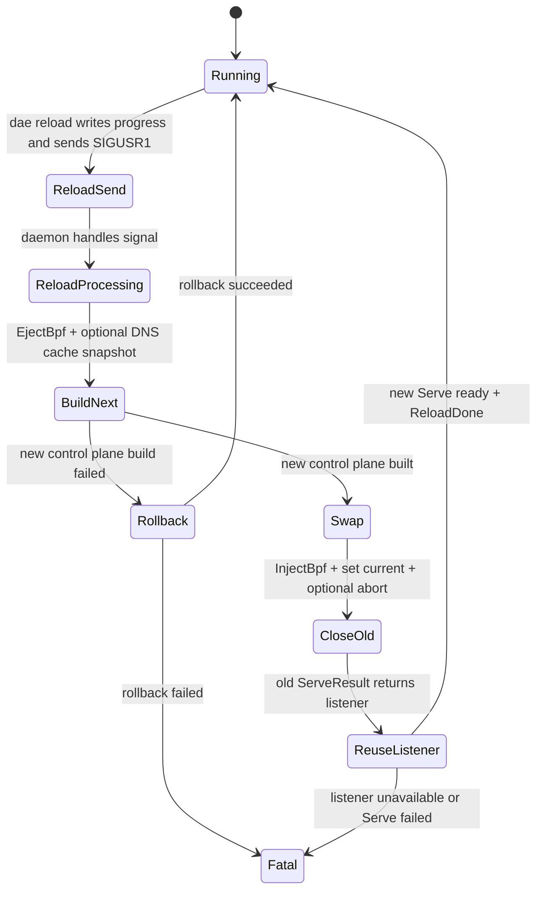
```mermaid
stateDiagram-v2
    [*] --> Running
    Running --> ReloadSend: dae reload writes progress and sends SIGUSR1
    ReloadSend --> ReloadProcessing: daemon handles signal
    ReloadProcessing --> BuildNext: EjectBpf + optional DNS cache snapshot
    BuildNext --> Rollback: new control plane build failed
    Rollback --> Running: rollback succeeded
    Rollback --> Fatal: rollback failed
    BuildNext --> Swap: new control plane built
    Swap --> CloseOld: InjectBpf + set current + optional abort
    CloseOld --> ReuseListener: old ServeResult returns listener
    ReuseListener --> Running: new Serve ready + ReloadDone
    ReuseListener --> Fatal: listener unavailable or Serve failed
```

建议资源所有权图：

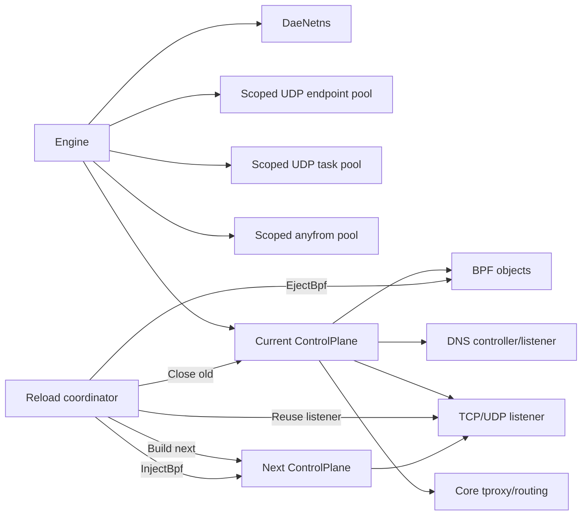
```mermaid
flowchart LR
    Engine[Engine] --> Netns[DaeNetns]
    Engine --> UdpEndpointPool[Scoped UDP endpoint pool]
    Engine --> UdpTaskPool[Scoped UDP task pool]
    Engine --> AnyfromPool[Scoped anyfrom pool]
    Engine --> Current[Current ControlPlane]
    Current --> Bpf[BPF objects]
    Current --> Dns[DNS controller/listener]
    Current --> Listener[TCP/UDP listener]
    Current --> Core[Core tproxy/routing]
    Reload[Reload coordinator] -->|EjectBpf| Bpf
    Reload -->|Build next| Next[Next ControlPlane]
    Reload -->|InjectBpf| Next
    Reload -->|Close old| Current
    Reload -->|Reuse listener| Listener
    Next --> Listener
```

Rust 实现注意：

- `Engine` 应持有 reload scoped pools，`ControlPlane` 只借用或 Arc 持有可控引用。
- reload coordinator 应是唯一能转移 BPF object ownership 的地方。
- listener 复用需要显式建模，不能隐含在 `Drop` 里。
- progress 文件写入应集中封装，避免 CLI/daemon 两边状态不一致。

### 15.9 本节验证

验证命令：

```bash
PATH=/root/.local/go1.25.9/bin:$PATH GOWORK=off make ebpf
PATH=/root/.local/go1.25.9/bin:$PATH GOWORK=off go test -count=1 ./engine ./cmd ./control
```

结果：通过。

输出摘要：

```text
ok   github.com/daeuniverse/dae/engine  0.014s
?    github.com/daeuniverse/dae/cmd     [no test files]
ok   github.com/daeuniverse/dae/control 6.430s
```

结论：

- runtime reload API、route-aware dial target、runtime overview、post-startup GC、control plane cleanup、DNS/cache/control 相关现有测试在本机通过。
- `make ebpf` 后 control generated BPF 文件可用，`./control` 测试通过。
- 本节只更新本地 ignored 备忘录，不涉及业务源码修改。

## 16. 追加记录：diagnostics / observability / trace

采集时间：2026-05-16

源码范围：

- `control/runtime_stats.go`
- `control/runtime_stats_control.go`
- `control/dns_metrics.go`
- `control/bpf_map_stats.go`
- `trace/trace.go`
- `trace/ringbuf.go`
- `trace/tracker.go`
- `trace/kallsyms.go`
- `trace/utils.go`
- `cmd/trace.go`
- `cmd/sysdump.go`

本节目标：

- 记录 WebUI / daed runtime overview 所依赖的运行态观测数据。
- 记录 DNS observability counter、BPF map stats、traffic sample、trace、sysdump 的输入输出和资源边界。
- 为 Rust 重构保留可观测性接口，避免重构后“功能可跑但排障能力缺失”。

### 16.1 runtime traffic stats

文件：

- `control/runtime_stats.go`
- `control/runtime_stats_control.go`

核心常量：

- `maxRuntimeHistorySeconds = 60 * 60`
- `defaultRuntimeWindowSec = 30 * 60`
- `defaultRuntimeMaxPoints = 180`
- `runtimeBucketDuration = 250ms`
- `runtimeRateWindow = 1s`
- `maxRuntimeHistoryBuckets = 14400`
- `runtimeHistoryTrimBatch = 256`
- `runtimeStatsShardCount = 16`

核心数据：

- `RuntimeTrafficSample`
  - `Timestamp`
  - `UploadRate`
  - `DownloadRate`
- `RuntimeStatsSnapshot`
  - `UpdatedAt`
  - `UploadRate`
  - `DownloadRate`
  - `UploadTotal`
  - `DownloadTotal`
  - `ActiveConnections`
  - `UDPSessions`
  - `UDPTaskQueues`
  - `UDPTaskDropTotal`
  - `PacketSnifferSessions`
  - `RSSBytes`
  - `HeapAllocBytes`
  - `Goroutines`
  - `DnsObservabilityStats`
  - `Samples`

写入路径：

- TCP：
  - `control/tcp.go`
  - upload writer 记录 `RecordUploadTraffic`
  - download writer 记录 `RecordDownloadTraffic`
- UDP：
  - `control/udp.go`
  - 发送方向记录 upload。
  - 返回方向记录 download。

实现逻辑：

- 全局 `globalRuntimeStats` 使用 16 个 shard，降低热点锁竞争。
- 每次记录按 atomic round-robin 选择 shard。
- 每个 shard 内按 250ms bucket 聚合上传/下载字节。
- snapshot 时：
  - 每个 shard 先 `advanceLocked(nowBucketStart)`，把当前 bucket 推进到当前时间。
  - 读取 `startTime` 之后的历史 bucket。
  - 附加当前 bucket。
  - 多 shard 按 timestamp 聚合。
  - 按 timestamp 排序。
  - 最近 1s 计算当前上传/下载速率。
  - 根据 `maxPoints` downsample。

downsample 逻辑：

- 如果 samples 数量小于等于 maxPoints，原样返回。
- 否则按 bucketSize 分组。
- 每组取最后一个 sample 的 timestamp。
- 每组的 upload/download rate 取组内最大值。

RSS / heap：

- RSS 从 `/proc/self/statm` 第二列读取 resident pages，再乘以 page size。
- Heap 使用 `runtime.ReadMemStats(&memStats).HeapAlloc`。
- Goroutine 使用 `runtime.NumGoroutine()`。

occupancy hook：

- `runtime_stats.go` 中默认：

```go
runtimeStatsOccupancySnapshot = func() (0, 0, 0)
```

- `runtime_stats_control.go` 在完整 control build 中替换为：

```go
DefaultUdpTaskPool.Count()
DefaultUdpTaskPool.DropCount()
DefaultPacketSnifferSessionMgr.Count()
```

注意：

- `engine.GetRuntimeOverview` 会再次用 Engine scoped UDP task pool 覆盖 `UDPTaskQueues` / `UDPTaskDropTotal`。
- 这意味着 Rust 重构要区分默认全局 pool 统计和 Engine scoped pool 统计。

Rust parity 要求：

- WebUI traffic chart 依赖 `Samples` 的 timestamp/rate；Rust 版不能只保留总量。
- `windowSec` 和 `maxPoints` 必须继续由调用方控制。
- 1 分钟、5 分钟、30 分钟等窗口不能出现大量空白，snapshot 应只返回窗口内实际 sample。
- 如果 Rust 改成 ring buffer，仍要保留：
  - 最近 1s 当前速率。
  - 1 小时历史上限。
  - maxPoints downsample。
  - RSS/heap/goroutine 等价观测字段。

### 16.2 DNS observability counters

文件：

- `control/dns_metrics.go`
- `component/dns/upstream_stats.go`

字段：

- `dnsCacheHitTotal`
- `dnsCacheExpiredRemovalTotal`
- `dnsUdpRetryTotal`
- `dnsTruncatedTcpFallbackTotal`
- `dnsDohStatusFailureTotal`
- `dnsDohContentTypeFailureTotal`
- `dnsUpstreamRefreshSuccessTotal`
- `dnsUpstreamRefreshFailureTotal`
- `dnsUpstreamRefreshStaleReuseTotal`

计数来源：

- DNS cache hit：
  - `control/dns_control.go`
  - `recordDnsCacheHit()`
- DNS cache expired removals：
  - `recordDnsCacheExpiredRemovals(n)`
- UDP retry：
  - `control/dns.go`
  - `recordDnsUDPRetry()`
- truncated UDP fallback to TCP：
  - `control/dns_control.go`
  - `recordDnsTruncatedTcpFallback()`
- DoH failure：
  - status failure
  - content-type failure
- upstream resolver refresh：
  - `component/dns.SnapshotUpstreamResolverStats()`

实现：

- control 内 DNS counters 使用 `atomic.Uint64`。
- upstream resolver counters 在 `component/dns` 中维护，snapshot 时合并。

Rust parity 要求：

- counters 是进程级累计值，不是 per-control-plane 值。
- reload 不应把这些 observability counters 清零，除非明确重启进程。
- WebUI 或 HTTP API 如果展示 DNS 健康，需要读取同一组字段。

### 16.3 BPF map stats

文件：

- `control/bpf_map_stats.go`

字段：

- `redirectTrackEntries`
- `routingTuplesEntries`
- `domainRoutingEntries`
- `udpConnStateEntries`
- `cookiePidEntries`
- `tgidPnameEntries`

实现：

- `controlPlaneCore.BPFMapStats()` 对每张 map 迭代计数。
- map 为 nil 时返回 0。
- 任一 map 迭代出错时返回 error。
- `ControlPlane.CacheStats()` 调用 `core.BPFMapStats()`，失败只 debug log，不阻断整个 cache stats。

Rust parity 要求：

- BPF map stats 是排查泄漏、连接残留、routing tuple 增长的重要接口。
- Rust 版应提供同名或可映射字段，至少覆盖以上 6 张 map。
- map 计数不应在高频路径主动调用，应只在 snapshot/API 请求时采集。

### 16.4 trace CLI 与 BPF trace

文件：

- `cmd/trace.go`
- `trace/trace.go`
- `trace/ringbuf.go`
- `trace/tracker.go`
- `trace/kallsyms.go`
- `trace/utils.go`

构建：

- `cmd/trace.go` 使用 build tag `trace`。
- `Makefile ebpf` 会执行：
  - `go generate ./control/control.go`
  - `go generate ./trace/trace.go`
  - 成功后写入 build tag 文件 `trace`
- `trace/trace.go` 的 `go:generate` 使用 `bpf2go` 生成 trace BPF。
- `BPF_TRACE_TARGET = $(GOARCH)`。

trace 命令参数：

- IPv4/IPv6：
  - 默认 IPv4。
  - 两者不能同时开启。
- L4：
  - `tcp`
  - `udp`
- port：
  - 默认 80。
- drop-only：
  - 只输出带 drop reason 的 skb 链路。
- output：
  - 默认 `/dev/stdout`。
- ringbuf-size：
  - 默认 `64MiB`。

ringbuf size 规则：

- 空值使用 `64MiB`。
- 支持后缀：
  - `gib` / `gb` / `g`
  - `mib` / `mb` / `m`
  - `kib` / `kb` / `k`
  - `b`
- 最小 4KiB。
- 必须 4KiB 对齐。
- 必须是 2 的幂。
- 不能超过 uint32。

StartTrace 流程：

1. 检查 kernel version。
2. 要求支持 `bpf_get_func_ip`，版本至少 `consts.HelperBpfGetFuncIpVersionFeatureVersion`。
3. `rewriteAndLoadBpf`：
   - 重写 `tracing_cfg`：
     - port，网络字节序。
     - l4 proto。
     - ip version。
   - 设置 `events` ringbuf map size。
   - 加载 BPF。
   - verifier error 时尽量输出 verifier log。
4. `searchAvailableTargets`：
   - 加载 kernel BTF。
   - 解析 `kfree_skb_reason` / `skb_drop_reason`。
   - 遍历 BTF function，查找前 5 个参数中包含 `struct sk_buff *` 的函数。
5. `attachBpfToTargets`：
   - 尝试 attach `kfree_skbmem`。
   - 按 skb 参数位置 attach 不同 kprobe program。
   - 如果一个 target 都 attach 不上，返回错误。
6. `handleEvents`：
   - 创建 output file。
   - 从 ringbuf 读取 event。
   - 根据 native endian decode。
   - `NearestSymbol(event.Pc)` 找符号。
   - tracker 按 skb 汇总事件。
   - skb 释放时输出完整链路。

输出字段：

- skb pointer
- mark
- netns
- ifindex/ifname
- pid/pname
- src/dst addr:port
- TCP flags
- payload length
- symbol name
- drop reason

`skbTraceTracker`：

- `maxTrackedSkbs = 4096`
- `maxEventsPerSkb = 64`
- `maxSymbolsPerSkb = 64`
- 超过 tracked skb 上限时驱逐最旧 skb。
- 每个 skb 的 event/symbol slice 都 capped，避免 trace 模式下无限增长。

`kallsyms`：

- 从 `/proc/kallsyms` 读取。
- `sync.Once` 保证只读一次。
- 按地址排序。
- `NearestSymbol` 用二分查找最近小于等于目标地址的 symbol。

Rust parity 要求：

- trace 属于高级排障能力，Rust 重构可以 feature-gate，但 CLI 参数、ringbuf size 规则、输出字段应兼容。
- tracker 的 bounded memory 行为必须保留。
- BTF target 自动发现是 trace 的核心；不能只固定少数 kprobe，否则覆盖面会下降。
- `drop-only` 语义依赖 `kfree_skb_reason`，旧 kernel 不支持时要有清晰降级或错误。

### 16.5 sysdump

文件：

- `cmd/sysdump.go`

行为：

- 创建临时目录。
- 收集：
  - routing
  - network interfaces
  - sysctl
  - nftables
  - iptables
  - ip6tables
- 输出归档：

```text
dae-sysdump.<unix>.tar.gz
```

采集内容：

- `dumpRouting`
  - netlink route list
  - route scope/type/protocol 等枚举转文字。
- `dumpNetInterfaces`
  - gopsutil net interfaces。
- `dumpSysctl`
  - 多个网络相关 sysctl 路径。
- `dumpNetfilter`
  - `nft list ruleset`
- `dumpIPTables`
  - `iptables-save -c`
  - `ip6tables-save -c`

安全细节：

- 创建 tar 时使用相对路径。
- 拒绝绝对路径或 `..` 前缀路径。

Rust parity 要求：

- sysdump 是现场排障工具，Rust 重构要保留至少相同的网络状态采集能力。
- 外部命令缺失时应记录错误内容，而不是让整个 sysdump 失败。
- tar 路径安全检查需要保留。

### 16.6 本节验证

验证命令：

```bash
PATH=/root/.local/go1.25.9/bin:$PATH GOWORK=off go test -count=1 ./trace ./control -run 'Test(ParseRingbufSizeBytes|SkbTraceTracker|RuntimeStatsSnapshot)'
```

结果：通过。

输出摘要：

```text
ok   github.com/daeuniverse/dae/trace   0.002s
ok   github.com/daeuniverse/dae/control 0.003s
```

结论：

- runtime stats aggregation / DNS observability snapshot 相关测试通过。
- trace ringbuf size parser 通过。
- skb trace tracker eviction/cap 逻辑通过。
- 本节只更新本地 ignored 备忘录，不涉及业务源码修改。

## 17. 追加记录：build / CI / release / install 链路

采集时间：2026-05-16

源码范围：

- `Makefile`
- `.github/workflows/daenew.yml`
- `.github/workflows/daecore.yml`
- `.github/workflows/seed-build.yml`
- `.github/workflows/release.yml`
- `.github/workflows/daenew-release.yml`
- `.github/workflows/bpf-test.yml`
- `.github/workflows/lint.yml`
- `install/dae.service`
- `install/package_after_install.sh`
- `install/package_after_remove.sh`
- `install/friendly-filenames.json`

本节目标：

- 记录 daenew 当前构建、测试、eBPF 生成、发布、安装服务的完整链路。
- Rust 重构后需要保留同等交付面：多架构二进制、eBPF artifact、systemd service、配置验证、release package。

### 17.1 Makefile 构建入口

主要变量：

- `CLANG ?= clang`
- `STRIP ?= llvm-strip`
- `CFLAGS := -O2 -Wall -Werror`
- `TARGET ?= bpfel,bpfeb`
- `OUTPUT ?= dae`
- `MAX_MATCH_SET_LEN ?= 1024`
- `NOSTRIP ?= n`
- `BUILD_TAGS_FILE := .build_tags`
- `GOARCH ?= $(shell go env GOARCH)`

版本号：

- 有 `.git` 时：

```text
unstable-<git-date>.r<commit-count>.<short-commit>
```

- 无 `.git` 时：

```text
unstable-0.nogit
```

build ldflags：

- `cmd.Version=$(VERSION)`
- `common/consts.MaxMatchSetLen_=$(MAX_MATCH_SET_LEN)`
- `-trimpath`
- `-s -w`

`dae` target：

- 强制 `GOOS=linux`。
- 默认 `CGO_ENABLED=0`。
- 依赖 `ebpf`。
- 执行：

```bash
go build -tags=$(cat .build_tags) -o $(OUTPUT) $(BUILD_ARGS) .
```

Rust parity 要求：

- Rust binary 版本号必须继续能由构建系统注入。
- `MAX_MATCH_SET_LEN` 当前既影响 C eBPF 编译，也写入 Go const；Rust 重构要保留“用户态与 eBPF 常量一致”的机制。
- 输出文件名由 `OUTPUT` 控制，发布 workflow 依赖这个行为。

### 17.2 eBPF 生成链路

`clean-ebpf`：

- 删除 control BPF generated Go/object。
- 删除 trace BPF generated Go/object。
- 删除 control/kern/tests BPF test generated Go/object。

`ebpf`：

- 导出：
  - `BPF_CLANG`
  - `BPF_STRIP_FLAG`
  - `BPF_CFLAGS`
  - `BPF_TARGET`
  - `BPF_TRACE_TARGET`
- 依赖 submodule。
- unset：
  - `GOOS`
  - `GOARCH`
  - `GOARM`
- 执行：
  - `go generate ./control/control.go`
  - `go generate ./trace/trace.go`
- trace 生成成功时写 `.build_tags = trace`。
- 失败时写空 `.build_tags`。

`ebpf-test`：

- 同样导出 BPF 环境。
- 依赖 submodule 和 clean-ebpf。
- 执行：
  - `go generate ./control/kern/tests/bpf_test.go`
  - `go clean -testcache`
  - `go test -v ./control/kern/tests/...`

注意：

- `ebpf-test` 会清掉普通 control/trace generated BPF 文件，只生成 bpftest 产物。
- 执行过 `make ebpf-test` 后，如需跑 `./control` 测试，必须先重新 `make ebpf`。

Rust parity 要求：

- Rust 重构若继续使用 C eBPF，需要有等价 build.rs 或 xtask 生成流程。
- 生成 control BPF、trace BPF、BPF test artifact 的 target 要分开，避免 test target 破坏普通 build artifact。
- `.build_tags` 语义属于 Go 构建细节；Rust 可以不复用文件，但 release workflow 中的“trace feature 是否启用”要有等价判断。

### 17.3 daenew CI

`daenew.yml`：

- push 到 `daenew` 触发。
- pull request 到 `daenew` 触发。
- 支持手动触发。
- concurrency：

```text
daenew-${{ github.ref }}
```

- job 调用 reusable workflow：`.github/workflows/daecore.yml`。

`daecore.yml`：

- 可 workflow_call。
- 可 workflow_dispatch。
- push main / personal/** 且路径匹配时触发。
- pull_request 且路径匹配时触发。
- Go 版本：`1.25.9`
- runner：`ubuntu-22.04`
- 安装：
  - `clang-15`
  - `llvm-15`
- 准备 geodata：
  - `.github/dae-assets/geoip.dat`
  - `.github/dae-assets/geosite.dat`
- 生成 eBPF：

```bash
CLANG=clang-15 STRIP=llvm-strip-15 make ebpf
```

unit job：

- `go list ./...`
- 排除：
  - `github.com/daeuniverse/dae/control/kern/tests`
- 逐包执行：

```bash
go test -count=1 -v "$pkg"
```

- `DAE_LOCATION_ASSET` 指向 `.github/dae-assets`。
- 失败时把 failed package 写入 step summary。

build job：

- 同样生成 eBPF。
- 读取 `.build_tags`。
- 有 tags 时：

```bash
go build -tags="$tags" ./...
```

- 无 tags 时：

```bash
go build ./...
```

Rust parity 要求：

- Rust CI 应保留 unit 与 build 两类检查。
- geodata fixture 对测试是显式依赖，不能在 Rust 测试里硬编码系统路径。
- 生成 eBPF 必须在 unit/build 前运行。

### 17.4 seed build 多架构预览产物

文件：

- `.github/workflows/seed-build.yml`

触发：

- reusable workflow_call。

输入：

- `ref`
- `pr-number`
- `build-type`：
  - `pr-build`
  - `main-build`
  - `daily-build`
  - `release-build`

矩阵：

- linux arm64
- linux 386
- linux riscv64
- linux loong64
- linux mips64
- linux mips64le
- linux mipsle
- linux mips
- linux ppc64
- linux ppc64le
- linux s390x
- linux arm v5/v6/v7
- linux amd64 v1/v2/v3

构建环境：

- `CGO_ENABLED=0`
- Go `1.25.9`
- clang/llvm 15
- submodule recursive。
- local `go-mod` cache。

构建：

- `OUTPUT=build/dae-$ASSET_NAME`
- `VERSION` 由 workflow 生成。
- `make`
- 复制：
  - `install/dae.service`
  - `example.dae`
  - `geoip.dat`
  - `geosite.dat`

smoke test：

- 只在 `amd64 v1` 执行：

```bash
./build/dae-$ASSET_NAME --version
```

Rust parity 要求：

- Rust 重构的 release matrix 至少要覆盖现有 friendly filenames。
- 如果某些 arch 因 Rust/eBPF toolchain 无法支持，应在重构计划中提前列为差异，而不是发布时才发现包减少。

### 17.5 release workflow

文件：

- `.github/workflows/release.yml`
- `.github/workflows/daenew-release.yml`

`release.yml` 输入：

- `tag`
- `ref`
- `update_tag`
- `make_latest`

`prepare-tag`：

- checkout `inputs.ref`。
- 计算 source sha。
- fetch tags。
- tag 已存在且指向 source sha：直接通过。
- tag 已存在但不一致：
  - `update_tag != true` 时失败。
  - `update_tag == true` 时 force 更新 annotated tag。
- tag 不存在时创建 annotated tag。

`build`：

- checkout `inputs.tag`。
- 版本号直接等于 tag。
- 多架构矩阵与 seed build 基本一致。
- 构建 `pkgdir/usr/bin/dae`。
- 安装：
  - systemd service 到 `pkgdir/usr/lib/systemd/system/`
  - `example.dae` 到 `pkgdir/etc/dae/`
  - geodata 到 `pkgdir/usr/share/dae/`
- zip 目录包含：
  - `geoip.dat`
  - `geosite.dat`
  - `dae.service`
  - `empty.dae`
  - `example.dae`
  - `dae-$ASSET_NAME`
- 创建：
  - `.tar.xz`
  - `.zip`
  - deb/rpm/pacman package
  - digest 文件

package 条件：

- package 仅在 `GOARM == 7` 或 `GOARM == ''` 时执行。
- 某些架构只支持部分包类型。
- pacman 文件最后重命名为 `.pkg.tar.zst`。

`upload-release`：

- download artifacts。
- 上传到 GitHub release。
- `make_latest` 由输入控制。
- token 使用 `GH_TOKEN` 或 `github.token`。

`daenew-release.yml`：

- 手动触发。
- 默认 ref：`daenew`。
- 默认 `make_latest=false`。
- 调用 `release.yml`：
  - `update_tag=false`

Rust parity 要求：

- Rust release 必须保留 tag/ref 校验，避免 tag 指向旧 commit。
- daenew 手动 release 默认不标记 latest，这个行为需要明确继承或有迁移说明。
- package 阶段依赖 `pkgdir` 布局，Rust 输出路径要能适配。

### 17.6 BPF test / lint workflow

`bpf-test.yml`：

- PR 且 C/H/go.mod/go.sum/workflow 变化触发。
- clang matrix：
  - 15
  - 16
  - 17
  - 18
  - 19
- `continue-on-error: true`
- 执行：

```bash
sudo CLANG=clang-$VERSION make ebpf-test
```

`lint.yml`：

- PR 且 C/H/workflow 变化触发。
- Perl 5.38。
- 执行：

```bash
make ebpf-lint
```

`ebpf-lint`：

- 基于 `scripts/checkpatch.pl`。
- 对 `control/kern/tproxy.c` 做 kernel style 检查。
- ignore 一组当前项目接受的规则。

Rust parity 要求：

- C eBPF 如果保留，lint/test workflow 也必须保留。
- Rust 重构不会减少 eBPF 的内核兼容测试需求。

### 17.7 install / systemd

`install/dae.service`：

- `Type=notify`
- `User=root`
- `LimitNPROC=512`
- `LimitNOFILE=1048576`
- `ExecStartPre=/usr/bin/dae validate -c /etc/dae/config.dae`
- `ExecStart=/usr/bin/dae run --disable-timestamp -c /etc/dae/config.dae`
- `ExecReload=/usr/bin/dae reload $MAINPID`
- `Restart=on-abnormal`
- `TimeoutStartSec=120`
- `After=network-online.target docker.service systemd-sysctl.service`
- `Wants=network-online.target`

package hooks：

- after install：
  - `systemctl daemon-reload`
  - 如果 dae 正在运行，restart dae.service
- after remove：
  - `systemctl daemon-reload`

friendly filenames：

- `linux-x86_64`
- `linux-x86_64_v2_sse`
- `linux-x86_64_v3_avx2`
- `linux-armv5/v6/v7`
- `linux-arm64`
- `linux-riscv64`
- `linux-loongarch64`
- `linux-powerpc64/le`
- `linux-s390x`
- mips variants

Rust parity 要求：

- `validate` 必须保持轻量且可用于 `ExecStartPre`。
- `run` 必须继续支持 systemd notify。
- `reload $MAINPID` 必须继续通过 pid/signal/progress 协议工作，除非同步修改 service 和 daed 调用方。

### 17.8 本节验证

验证命令：

```bash
PATH=/root/.local/go1.25.9/bin:$PATH GOWORK=off OUTPUT=/tmp/dae-rebuild-memo-check make dae
/tmp/dae-rebuild-memo-check --version
```

结果：通过。

构建输出摘要：

```text
-DMAX_MATCH_SET_LEN=1024 -O2 -Wall -Werror
go build -tags=trace -o /tmp/dae-rebuild-memo-check -trimpath -ldflags "...cmd.Version=unstable-20260515.r970.1cca04a ...MaxMatchSetLen_=1024" .
```

版本输出摘要：

```text
dae version unstable-20260515.r970.1cca04a
go runtime go1.25.9 linux/amd64
```

结论：

- 本机构建链路可用。
- eBPF 生成、trace build tag、版本注入、最终二进制 smoke test 均通过。
- 输出文件放在 `/tmp/dae-rebuild-memo-check`，未向仓库添加二进制。

## 18. 阶段性收口：Rust rebuild parity checklist 和后续顺序

采集时间：2026-05-16

本节不是新源码审计，而是把第 10-17 节已经记录的行为整理成 Rust 重构执行清单。后续真正开写 Rust 时，应以这些 checklist 作为“不丢行为”的验收线。

### 18.1 已完成的高优先级记录

已展开并验证：

- routing / dial mode / DNS controller。
- eBPF map schema / ownership。
- outbound 节点解析、协议矩阵、group selection。
- subscription 解析、持久化、节点池合并。
- sniffing、dial target rewrite、packet sniffer pool。
- runtime / CLI / reload / control API 生命周期。
- diagnostics / observability / trace。
- build / CI / release / install 链路。

已验证命令集合：

```bash
PATH=/root/.local/go1.25.9/bin:$PATH GOWORK=off go test ./control ./component/dns ./component/routing
PATH=/root/.local/go1.25.9/bin:$PATH GOWORK=off make ebpf
PATH=/root/.local/go1.25.9/bin:$PATH GOWORK=off make ebpf-test
PATH=/root/.local/go1.25.9/bin:$PATH GOWORK=off go test -count=1 ./component/outbound/...
PATH=/root/.local/go1.25.9/bin:$PATH GOWORK=off go test -count=1 ./component/sniffing/...
PATH=/root/.local/go1.25.9/bin:$PATH GOWORK=off go test -count=1 ./engine ./cmd ./control
PATH=/root/.local/go1.25.9/bin:$PATH GOWORK=off go test -count=1 ./trace ./control -run 'Test(ParseRingbufSizeBytes|SkbTraceTracker|RuntimeStatsSnapshot)'
PATH=/root/.local/go1.25.9/bin:$PATH GOWORK=off OUTPUT=/tmp/dae-rebuild-memo-check make dae
```

外部 outbound module 已验证：

```bash
cd /root/go/pkg/mod/github.com/ksong008/outbound@v0.0.0-20260503111656-34ca7d09e020
PATH=/root/.local/go1.25.9/bin:$PATH GOWORK=off go test -count=1 ./dialer/... ./protocol/... ./transport/...
```

### 18.2 Rust crate 初始拆分建议

建议拆分：

- `dae-cli`
  - CLI 参数、signal、progress 文件、systemd notify。
- `dae-config`
  - config parser、include merge、section validation、outline export。
- `dae-routing`
  - routing matcher userspace。
  - domain/ip/sip/port/sport/l4proto/mac/pname/dscp/ipversion matcher。
  - logical AND/OR。
- `dae-ebpf`
  - BPF object load/eject/inject。
  - map schema。
  - pinned map compatibility。
  - map stats。
- `dae-control`
  - control plane。
  - TCP/UDP listener。
  - connection/session handling。
  - RouteDialTcp。
- `dae-dns`
  - DNS controller。
  - DNS listener。
  - cache。
  - upstream/forwarder。
  - response routing。
- `dae-outbound`
  - link parsing adapter。
  - protocol/transport abstraction。
  - group selection。
  - latency snapshot。
- `dae-subscription`
  - file/http/http-file subscription。
  - SIP008/base64 parser。
  - persisted raw payload。
- `dae-sniffing`
  - TLS/HTTP/QUIC sniffing。
  - packet sniffer pool。
  - domain normalization。
- `dae-runtime`
  - Engine。
  - reload coordinator。
  - runtime scoped pools。
  - route-aware HTTP transport。
- `dae-observability`
  - runtime stats。
  - DNS counters。
  - BPF map stats。
  - trace/sysdump。

建议依赖方向：

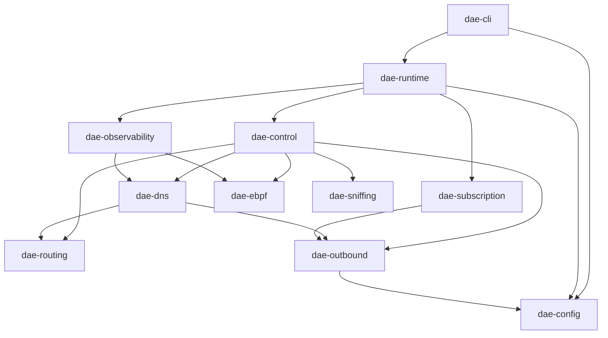
```mermaid
flowchart TD
    CLI[dae-cli] --> Runtime[dae-runtime]
    CLI --> Config[dae-config]
    Runtime --> Config
    Runtime --> Control[dae-control]
    Runtime --> Subscription[dae-subscription]
    Runtime --> Observability[dae-observability]
    Control --> Routing[dae-routing]
    Control --> Dns[dae-dns]
    Control --> Outbound[dae-outbound]
    Control --> Ebpf[dae-ebpf]
    Control --> Sniffing[dae-sniffing]
    Dns --> Routing
    Dns --> Outbound
    Outbound --> Config
    Subscription --> Outbound
    Observability --> Ebpf
    Observability --> Dns
```

原则：

- `dae-runtime` 是 orchestrator，不直接理解协议细节。
- `dae-control` 是 datapath owner，不直接读取配置文件。
- `dae-ebpf` 只负责 object/map/program 生命周期，不内嵌业务路由策略。
- `dae-dns` 和 `dae-routing` 需要可单测，不依赖真实 listener。
- `dae-observability` 不应反向依赖 UI 或 daed。

### 18.3 必须保持的兼容边界

CLI / service：

- `dae validate -c /etc/dae/config.dae`
- `dae run --disable-timestamp -c /etc/dae/config.dae`
- `dae reload $MAINPID`
- `/var/run/dae.pid`
- `/var/run/dae.progress`
- `/var/run/dae.abort`
- systemd `Type=notify`

配置：

- section 名称与字段名。
- 默认值。
- include merge 行为。
- `wan_interface: auto` 行为。
- `global.fallback_resolver` 解析。
- `fixed_domain_ttl` 只影响 DNS cache deadline，不改 original deadline。

datapath：

- TCP tproxy。
- UDP tproxy。
- DNS UDP/53 transparent path。
- local `dns.bind` UDP/TCP listener。
- `must_rules` 语义。
- `domain++` reroute。
- UDP QUIC sniff 只影响 reroute，不把普通 UDP dial target 改成 domain。

eBPF：

- map key/value layout。
- outbound id 保留值。
- match type 顺序。
- pinned map lifecycle。
- listen socket map key 0/1。
- BPF object reload ownership transfer。

outbound：

- link chain `->` 右到左解析。
- tag override。
- SS2022 由 cipher family 决定。
- VLESS vision 是 flow/protocol feature，不是 transport type。
- group filter OR/AND。
- min latency policy 的 alive set 行为。

observability：

- runtime traffic sample。
- RSS/heap/goroutine。
- DNS counters。
- BPF map stats。
- node latency snapshot。
- trigger latency checks 不应与普通 snapshot 混淆。

release：

- 多架构 matrix。
- friendly filenames。
- zip/tar/deb/rpm/pacman。
- geodata packaging。
- version injection。

### 18.4 建议实现顺序

第一阶段：纯函数和低外部依赖模块

1. `dae-config`
2. `dae-routing`
3. `dae-sniffing`
4. `dae-subscription`
5. runtime stats / DNS counters 数据结构

原因：

- 可用 fixture 做强 parity 测试。
- 不依赖真实 root 权限、netns、eBPF attach。
- 适合作为 Rust workspace 的基础 crate。

第二阶段：协议与 group selection

1. outbound link parser adapter。
2. protocol property normalization。
3. group filter。
4. latency policy。
5. snapshot 和 trigger 分离。

原因：

- 这部分直接影响 daed2.0 WebUI 展示和运行态选择。
- 需要重点保护 min 策略、健康检查缓存和手动 probe 行为。

第三阶段：DNS controller

1. cache key/deadline/original deadline。
2. upstream/forwarder。
3. request routing。
4. response routing。
5. synthetic ResolveIp46。
6. UDP truncated fallback TCP。

原因：

- DNS 是 daenew 的行为核心之一。
- 也是最容易因为缓存、routing、domain rewrite 细节丢 parity 的部分。

第四阶段：control plane 和 runtime reload

1. listener serve loops。
2. BPF map update。
3. TCP/UDP session handling。
4. reload coordinator。
5. DNS listener stop/restart。
6. listener reuse。
7. scoped pool flush。

原因：

- 这部分需要 root/eBPF/netns 环境。
- 要先有前面模块的稳定 API，再接 active datapath。

第五阶段：trace / sysdump / release

1. trace feature。
2. sysdump。
3. CI matrix。
4. release packaging。

原因：

- 对核心代理功能不是第一依赖，但对发布和排障是必需交付面。

### 18.5 fixture/test matrix 初稿

config：

- empty config。
- include merge。
- required field missing。
- default values。
- `wan_interface: auto`。
- `global.udp_endpoint_pool_size`。
- `fixed_domain_ttl`。

routing：

- domain。
- ip。
- sip。
- port/sport。
- l4proto。
- mac。
- pname。
- dscp。
- ipversion。
- must_rules。
- AND/OR。
- fallback。

DNS：

- cache hit。
- expired cache。
- `fixed_domain_ttl`。
- UDP retry。
- truncated TCP fallback。
- request routing。
- response routing。
- `domain` vs `domain+` vs `domain++`。
- transparent UDP/53。
- local dns.bind TCP/UDP。

outbound：

- vmess/vless/trojan/ss/ss2022/ssr/socks/http/hysteria2/tuic/juicity/anytls。
- VLESS vision。
- VLESS xhttp。
- REALITY。
- SIP003 plugin。
- link chain。
- tag override。

group：

- fixed。
- random。
- min_last。
- min_avg10。
- min_moving_avg。
- subscription tag filter。
- name regex/keyword/exact。
- `add_latency`。
- alive set fallback。

sniffing：

- TLS SNI。
- HTTP Host。
- QUIC SNI。
- IP literal normalization。
- trailing dot。
- no sniffing in dial_mode=ip。

runtime/reload：

- dry runtime reload。
- reload context timeout。
- reload rollback。
- abort connections。
- DNS cache restore only when DNS config equal。
- listener reuse。
- route-aware HTTP transport domain path。

observability：

- runtime sample aggregation。
- maxPoints downsample。
- DNS counters snapshot。
- BPF map stats nil map。
- latency snapshot dedup by link。
- trigger latency check dedup by dialer。

release/build：

- `make ebpf`。
- `make ebpf-test`。
- `make dae OUTPUT=/tmp/...`。
- `--version` smoke。
- package layout smoke。

### 18.6 下一步建议

下一轮优先做：

1. `config` parser / merger / desc / outline 的逐字段记录和 fixture 表。
2. `control/dns_control.go` 逐函数展开，补 DNS controller 的完整状态机图。
3. `control/tcp.go` / `control/udp.go` active datapath 逐行流程，和 eBPF routing result 对接。

当前阶段还不建议直接开始 Rust 代码：

- 主要 datapath 和 DNS 状态机虽然已有大图，但还需要更细的 fixture 输入输出。
- Rust 实现前先锁定 config/routing/DNS fixtures，可以降低后续重构时“跑得起来但行为不一致”的风险。

## 19. 追加记录：config parser / merger / schema / outline / marshal

采集时间：2026-05-16

源码范围：

- `pkg/config_parser/config_parser.go`
- `pkg/config_parser/walker.go`
- `pkg/config_parser/section.go`
- `pkg/config_parser/error.go`
- `config/config.go`
- `config/parser.go`
- `config/config_merger.go`
- `config/patch.go`
- `config/marshal.go`
- `config/outline.go`
- `config/desc.go`
- `engine/helpers.go`
- `common/utils.go`

本节目标：

- 记录 daenew 配置从文本到 runtime `Config` 的完整流程。
- 记录 include merge、默认值、required、反射解析、patch、outline、marshal 的行为。
- 为 Rust 重构中的 `dae-config` crate 建立 parity 边界和 fixture 初稿。

### 19.1 配置入口

主要入口：

- daemon / CLI 配置读取：

```go
daeengine.ReadConfigFile(cfgFile)
```

流程：

1. `config.NewMerger(cfgFile)`
2. `merger.Merge()`
3. `config.New(sections)`

辅助入口：

- `engine.ParseConfig(globalSection, dnsSection, routingSection)`

行为：

- nil section 会填充：
  - `global {}`
  - `dns {}`
  - `routing {}`
- 自动补空：
  - `group {}`
  - `subscription {}`
  - `node {}`
- 然后 `config_parser.Parse` + `config.New`。

空配置模板：

- `engine.EmptyConfig()` 基于 `global{} routing{}` 构建。
- suspend/no-load reload 会使用 `EmptyConfig()`，再拷贝旧 global 并清空 WAN/LAN interface。

Rust parity 要求：

- `ReadConfigFile` 和 `ParseConfig` 要分开建模：一个处理文件/include，一个处理已给定 section 字符串。
- `validate` 命令只需要走 `ReadConfigFile`，不应拉订阅、不应加载 eBPF。

### 19.2 ANTLR parser 和 AST 模型

文件：

- `pkg/config_parser/config_parser.go`
- `pkg/config_parser/walker.go`
- `pkg/config_parser/section.go`
- `pkg/config_parser/error.go`

parser 来源：

- `walker.go` 注释标明跟随：

```text
https://github.com/daeuniverse/dae-config-dist/blob/main/dae_config.g4
```

`Parse(in string)` 流程：

1. 创建 `ConsoleErrorListener`。
2. 创建 ANTLR lexer。
3. 移除默认 error listener，挂载自定义 listener。
4. 创建 token stream。
5. 创建 parser。
6. 移除默认 error listener，挂载自定义 listener。
7. `parser.BuildParseTrees = true`
8. `tree := parser.Start()`
9. `antlr.ParseTreeWalkerDefault.Walk(walker, tree)`
10. 如果 error listener 有内容，返回 error。
11. 返回 `walker.Sections`。

panic recovery：

- parser 层有 `recoveredParseError`。
- config 层也有 `recoveredConfigError`。

错误输出：

- `ConsoleErrorListener.SyntaxError` 只累计第一个错误。
- 错误包含：
  - line/column
  - 附近文本
  - caret 指示
  - ANTLR message

AST 类型：

- `Section`
  - `Name string`
  - `Items []*Item`
- `Item`
  - `Type ItemType`
  - `Value interface{}`
- `Param`
  - `Key string`
  - `Val string`
  - `AndFunctions []*Function`
  - `Annotation []*Param`
- `Function`
  - `Name string`
  - `Not bool`
  - `Params []*Param`
- `RoutingRule`
  - `AndFunctions []*Function`
  - `Outbound Function`

`ItemType`：

- `RoutingRule`
- `Param`
- `Section`

源码细节：

- `NewSectionItem(section)` 当前返回的 `Item.Type` 是 `ItemType_Param`，但 `Value` 是 `*Section`。
- 下游解析主要根据 `item.Value` 的实际类型 switch，不依赖 `Item.Type`。
- 这个 quirk 会影响 `Item.String()` 里显示的 type 文案，但不影响当前配置构建。

Rust parity 建议：

- Rust AST 应把 item kind 和 value kind 统一，避免复刻这个不一致。
- 如果需要严格兼容 debug 输出，再单独记录 Go 版这个历史 quirk。

### 19.3 literal / param / function / rule 解析

literal：

- quote literal 会去掉首尾引号。
- 非 quote literal 使用原始文本。

param：

- `key: value` 解析为：
  - `Param{Key: key, Val: value}`
- 单独 literal 解析为：
  - `Param{Key: "", Val: value}`

literal expression：

- 多个 literal 会递归收集并用逗号拼接：

```go
strings.Join(parser.literals, ",")
```

function prototype：

- 支持 `!` not operator。
- 函数必须有非空参数列表。
- 参数列表由 `parseNonEmptyParamList` 递归解析。

declaration：

- `key: literal expression` -> `Param.Val`
- `key: function && function` -> `Param.AndFunctions`
- declaration 可带 annotation。
- annotation 解析成 `Param.Annotation []*Param`。

routing rule：

- 左侧必须是 function prototype expression。
- 中间是 `->`。
- 右侧 outbound 可以是：
  - bare literal
  - function prototype
- 输出 `RoutingRule{AndFunctions, Outbound}`。

section：

- `name { ... }` 输出 `Section{Name, Items}`。
- section item 可以是：
  - routing rule
  - declaration
  - literal
  - nested expression/section

Rust parity 要求：

- 保留 quote 去壳行为。
- 保留 literal expression 逗号拼接行为。
- 保留 function 参数 key/value 和裸值两类参数。
- routing rule outbound bare literal 要等价为 `Function{Name: literal}`。
- annotation 虽然当前只在 group filter 侧保留，但 AST 和 marshal 忽略行为都要清楚建模。

### 19.4 include merger

文件：

- `config/config_merger.go`

`NewMerger(entry)`：

- 保存 entry。
- `entryDir = filepath.Dir(entry)`。
- 初始化 `entryToSectionMap`。

`Merge()`：

1. `dfsMerge(entry, "")`
2. 返回 top entry 对应 section map 转换后的 sections。
3. 返回 `entryToSectionMap` 的 key 列表作为 includes/entries。

`readEntry(entry)`：

- 如果 entry 已存在于 `entryToSectionMap`，返回 `ErrCircularInclude`。
- 文件名必须以 `.dae` 结尾。
- `common.EnsureFileInSubDir(entry, entryDir)`：
  - lexical path 不能逃出 entry dir。
  - symlink dir/file 也不能逃出 entry dir。
- 文件必须不是目录。
- 权限检查：

```go
fi.Mode() & 0037 > 0
```

含义：

- 允许 `0600`。
- 允许 `0640`。
- 拒绝 others 任意权限。
- 拒绝 group write / execute。
- group read 被允许。

`include` 解析：

- 只接受 include section 内的 Param/literal。
- 相对路径按 entry config 的目录解析，不按当前工作目录。
- 绝对路径按原样使用，但仍必须位于 entry dir 下。
- 支持 glob。
- glob 展开后只保留：
  - `.dae` 后缀。
  - 非目录。
- glob 无匹配时返回 nil，不报错。

merge 顺序：

- 先读取父文件。
- 提取 include。
- DFS 读取 child。
- child merge 回 father：

```go
fatherSectionMap[sec] = mergeItems(fatherSectionMap[sec], childSectionMap[sec])
```

也就是：

- 父 section items 在前。
- include child items 在后。

解析影响：

- scalar 字段：后出现的 child 值会覆盖父值。
- slice 字段：父值和 child 值会按顺序追加。
- routing rules：父规则在前，child 规则在后。
- fallback 这类 scalar：child fallback 会覆盖父 fallback。

重复 include 行为：

- 当前 `entryToSectionMap` 同时承担 visited/cycle 检测。
- 同一文件被重复 include，也会触发 `ErrCircularInclude` 风格错误，不只是严格图环。

Rust parity 风险：

- include override 方向很关键：当前是 include child 后置，因此 child scalar 覆盖 parent。
- `entries` 返回顺序来自 map keys，不应作为稳定顺序依赖。
- 路径安全和权限检查属于配置安全边界，Rust 版必须保留。

### 19.5 Config schema 和默认值

文件：

- `config/config.go`

root sections：

- `global`：required
- `subscription`
- `node`
- `group`
- `routing`：required
- `dns`

`Global` 默认值：

- `tproxy_port = 12345`
- `tproxy_port_protect = true`
- `so_mark_from_dae = 0`
- `log_level = info`
- `tcp_check_url = http://cp.cloudflare.com,1.1.1.1,2606:4700:4700::1111`
- `tcp_check_http_method = HEAD`
- `udp_check_dns = dns.google:53,8.8.8.8,2001:4860:4860::8888`
- `check_interval = 30s`
- `check_tolerance = 0`
- `udp_endpoint_pool_size = 4096`
- `allow_insecure = false`
- `dial_mode = domain`
- `disable_waiting_network = false`
- `enable_local_tcp_fast_redirect = false`
- `auto_config_kernel_parameter = false`
- `auto_config_firewall_rule = false`
- `sniffing_timeout = 100ms`
- `tls_implementation = tls`
- `utls_imitate = chrome_auto`
- `tls_fragment = false`
- `tls_fragment_length = 50-100`
- `tls_fragment_interval = 10-20`
- `pprof_port = 0`
- `mptcp = false`
- `fallback_resolver = 8.8.8.8:53`
- `bandwidth_max_tx = 0`
- `bandwidth_max_rx = 0`
- `udphop_interval = 30s`

`Routing`：

- `Rules []*RoutingRule`
- `Fallback FunctionOrString`
- default fallback：`direct`

`Dns`：

- `ipversion_prefer`
- `fixed_domain_ttl`
- `upstream`
- `routing.request`
- `routing.response`
- `bind`

`Group`：

- `Name`
- `filter` repeatable
- `FilterAnnotation`
- `policy` required
- optional overrides：
  - tcp check url
  - tcp check method
  - udp check dns
  - check interval
  - check tolerance

`KeyableString`：

- 用于 subscription/node/dns fixed/upstream。
- 可通过 `tag:value` 表达 tag。

Rust parity 要求：

- default tags 是 schema 的一部分，不能只写在文档里。
- `time.Duration` 字段要保持 Go 格式解析能力，例如 `30s`、`100ms`。
- `FunctionOrString` / `FunctionListOrString` 是当前动态类型，需要在 Rust 中变成显式 enum。

### 19.6 SectionParser / ParamParser 反射规则

文件：

- `config/parser.go`

`SectionParser`：

- target 必须是 pointer。
- slice of string：
  - 走 `StringListParser`。
- slice of struct：
  - 用 nested sections 构造 list。
  - elem struct 必须有：

```go
Name string `mapstructure:"_"`
```

- struct：
  - 走 `ParamParser`。

`StringListParser`：

- section 内只接受 Param。
- 每个 Param 用 `itemVal.String(true, false)` 转回文本。
- 写入 string 或 string alias slice。

`ParamParser`：

- target 必须是 struct pointer。
- 每个字段必须有 `mapstructure` tag。
- `mapstructure:"_"` 是 reserved/omit。
- 支持自动寻找 `FieldNameAnnotation`，要求 annotation field 是 `mapstructure:"_"`。
- `repeatable` tag 表示 function-list declaration 可以追加。
- 解析 section 前先填 default。

default 逻辑：

- field 是 interface 或 string 类型时可直接赋值 default string。
- 否则用 `common.FuzzyDecode(field.Addr(), defaultValue)`。
- slice 默认会按 comma 分割。
- duration 默认通过 `time.ParseDuration`。

param 解析逻辑：

- key 为空的 text 不允许进入 struct param：
  - `unsupported text without a key`
- unknown key 报错：
  - `unexpected key`
- `AndFunctions`：
  - 可赋给 interface。
  - 可赋给同类型字段。
  - repeatable slice 会 append。
  - annotation 与 field annotation 同步 append。
- string value：
  - interface 直接设为 string。
  - slice 按 comma split。
  - 第一次设置 slice 时会清空 default，避免 default 和用户值混合。
  - scalar 用 `FuzzyDecode`。
- nested section：
  - key 必须匹配字段。
  - 递归 `SectionParser`。
- routing rule：
  - target struct 必须有 `Rules []*RoutingRule`。
  - Rules 字段必须是 `mapstructure:"_"`。

required 逻辑：

- section required 在 `config.New` root 层检查。
- param required 在 `ParamParser` 末尾检查。
- 只要字段被设置过，就满足 required。

Rust parity 要求：

- Rust 实现应显式化这些反射规则，而不是依赖 serde 默认行为。
- 特别注意 slice 字段：
  - default 被用户第一次设置清空。
  - 多次出现则追加。
- repeatable function 和 annotation 要保持等长。

### 19.7 config.New 和 patch

`config.New(sections)`：

1. 以 section name 构造 map。
2. 遍历 `Config` struct 字段。
3. 按 `mapstructure` 找 section。
4. required section 缺失时报错。
5. `SectionParser(field.Addr(), section)`。
6. unknown top-level section 报错。
7. `include` section 会被忽略，不作为 unknown。
8. 执行 patches。

patch 顺序：

1. `patchFallbackResolver`
2. `patchTcpCheckHttpMethod`
3. `patchEmptyDns`
4. `patchMustOutbound`

`patchFallbackResolver`：

- `global.fallback_resolver` 必须能 `netip.ParseAddrPort`。

`patchTcpCheckHttpMethod`：

- 非法 HTTP method 不报错。
- warning 后改成 `CONNECT`。

`patchEmptyDns`：

- `dns.routing.request.fallback` 为空时设为 `asis`。
- `dns.routing.response.fallback` 为空时设为 `accept`。

`patchMustOutbound`：

- routing rules outbound 名称以 `must_` 开头时：
  - `must_rules` 保留。
  - 其他去掉 `must_`。
  - 添加裸参数 `must`。
- routing fallback 同样处理。
- fallback 如果是 function list 且长度不是 1，返回错误：
  - `invalid routing fallback`

Rust parity 要求：

- patches 是配置语义的一部分。
- Rust 不应把非法 `tcp_check_http_method` 改成 hard error，当前行为是 warning + fallback。
- `must_` 语义必须在 config normalization 阶段完成，否则 routing matcher/outbound id 会不一致。

### 19.8 FuzzyDecode 和 path/tag helper

文件：

- `common/utils.go`

`FuzzyDecode` 支持：

- signed/unsigned int，各自按 bit size parse。
- `time.Duration`。
- bool：
  - true/t/1/y/yes/on
  - false/f/0/n/no/off
- string。
- `UrlOrEmpty`。
- `[]string`：comma split。
- `[]time.Duration`：单个 duration append 成 slice。

`EnsureFileInSubDir`：

- 先做 abs + lexical subdir 检查。
- 再 eval symlink 检查真实目录。
- 文件不存在时允许继续，用于新文件或 glob 前路径。
- 既检查 file dir，也检查 file 本身。

`GetTagFromLinkLikePlaintext`：

- 找第一个 `:`。
- 如果第一个 colon 后是 `://`，认为没有 tag。
- 否则 colon 前是 tag，colon 后是内容。

Rust parity 要求：

- bool 兼容值必须保留。
- subscription/node/upstream 的 tag 解析必须避免把 `scheme://` 当 tag。
- include 和 subscription file 都依赖 `EnsureFileInSubDir` 安全语义。

### 19.9 marshal / roundtrip

文件：

- `config/marshal.go`

`Config.Marshal(indentSpace)`：

- 对 root `Config` 所有字段按 struct 顺序 marshal section。
- panic recovery。
- root section 输出顺序稳定，来自 struct 字段顺序。

`MarshalSection`：

- slice string：
  - 每个元素一行。
  - `KeyableString` 会尝试还原 `tag:"value"`。
- slice struct：
  - 每个 elem 用 `Name` 字段作为 nested section 名。
- struct：
  - 走 `marshalParam`。

`marshalLeaf`：

- `IgnoreZero` 为 true 时跳过 zero。
- 当前 `Config.Marshal` 创建的 Marshaller 没设置 `IgnoreZero`，所以 scalar zero 值会输出。
- empty slice 不输出。
- 普通 slice 输出成一个 comma-joined quoted string。
- `[][]*Function` 输出 repeatable function line。
- `[]*Function` 输出 function chain。
- `[]KeyableString` 输出 nested block。
- scalar 均 quote 成 string。

reserved fields：

- `Name`：不输出。
- `Rules`：展开成 routing rule lines。
- `FilterAnnotation` / `Annotation`：不输出。

roundtrip 测试：

- `TestMarshal`：
  - 读取 `example.dae`。
  - 写入 temp dir，权限 0640。
  - `NewMerger` + `New`。
  - `Marshal(2)`。
  - 再读回。
  - 比较 normalize 后的 config。
- normalize 会清空 group `FilterAnnotation`，因为 annotation metadata 不参与 marshal。

Rust parity 要求：

- marshal 不只是 debug，它用于配置导出/备份链路。
- root section 顺序应稳定。
- annotation 当前不 roundtrip，需要明确作为已知非持久 metadata。

### 19.10 outline / desc

文件：

- `config/outline.go`
- `config/desc.go`

`ExportOutline(version)`：

- reflect `Config{}`。
- 输出：
  - version
  - leaves
  - structure
- leaves 来源：
  - 没有 children 的 leaf type。
  - map 去重。
  - 最后 sort。

`OutlineElem`：

- `name`
- `mapping`
- `isArray`
- `defaultValue`
- `required`
- `type`
- `desc`
- `structure`

desc 来源：

- root 使用 `SectionSummaryDesc`。
- nested struct 通过 struct tag `desc:"GlobalDesc"` 等指向 `SectionDescription`。
- `inheritSource=true` 后子字段继续使用同一个 desc source。

当前 desc map：

- `GlobalDesc`
- `DnsDesc`
- `GroupDesc`

Rust parity 要求：

- WebUI/daed 如果消费 outline，Rust 版必须保持 JSON 字段和基本结构。
- `defaultValue` 来自 tag，不是运行时 patch 后的最终值。
- leaves 排序是稳定输出的一部分。

### 19.11 config fixture/test matrix

建议 fixture：

- 最小合法：

```dae
global {}
routing {}
```

- 缺失 required section：
  - 缺 `global`
  - 缺 `routing`
- unknown top-level section。
- unknown key。
- invalid type：
  - bool 非法值
  - duration 非法值
  - uint16 overflow
- slice default 被用户值替换。
- slice 多次出现追加。
- repeatable filter 多次出现，annotation 等长。
- routing rule 解析：
  - not operator
  - multiple AND
  - outbound bare literal
  - outbound function
- fallback：
  - string fallback
  - single function fallback
  - multiple function fallback should fail
  - `must_direct` normalization
  - `must_rules` reserved
- DNS empty fallback patch：
  - request -> asis
  - response -> accept
- fallback resolver：
  - valid IPv4
  - valid IPv6 bracket
  - invalid should fail
- HTTP method：
  - invalid becomes CONNECT
- include：
  - relative glob under entry dir
  - absolute path under entry dir
  - path escape rejected
  - symlink escape rejected
  - permission too open rejected
  - duplicate include behavior
  - child scalar overrides parent
  - child slice appends parent
- marshal:
  - example roundtrip
  - keyable tag marshal
  - annotation intentionally not roundtrip
- outline:
  - version field
  - leaves sorted
  - required/default/desc populated

### 19.12 Rust `dae-config` 设计建议

数据结构：

- `RawConfigAst`
  - `Section`
  - `Item`
  - `Param`
  - `Function`
  - `RoutingRule`
- `Config`
  - typed normalized config。
- `RawFunctionOrString`
  - `String(String)`
  - `Function(Function)`
  - `FunctionList(Vec<Function>)`
- `GroupFilter`
  - functions
  - annotation
- `KeyableString`
  - raw string plus helper to split tag。

模块：

- `parser`
  - ANTLR equivalent / pest / chumsky / hand parser。
- `merger`
  - include DFS、glob、permission、安全路径。
- `decode`
  - AST -> typed config。
- `normalize`
  - patches。
- `outline`
  - schema export。
- `marshal`
  - typed config -> dae text。
- `fixtures`
  - Go/Rust parity tests。

验收线：

- Go fixture parse/marshal output 与 Rust typed config 对齐。
- error 文案可以不逐字一致，但错误类别必须一致。
- include merge 顺序必须一致。
- default/required/patch 后最终 config 必须一致。

### 19.13 本节验证

验证命令：

```bash
PATH=/root/.local/go1.25.9/bin:$PATH GOWORK=off go test -count=1 ./config ./pkg/config_parser/... ./common ./engine -run 'Test(Parse|Marshal|ExportOutline|NewReturns|SectionParser|EnsureFileInSubDir|PrepareRuntimeConfigView)'
```

结果：通过。

输出摘要：

```text
ok   github.com/daeuniverse/dae/config            0.014s
ok   github.com/daeuniverse/dae/pkg/config_parser 0.003s
ok   github.com/daeuniverse/dae/common            0.004s
ok   github.com/daeuniverse/dae/engine            0.003s
```

结论：

- parser、config.New hardening、marshal roundtrip、outline export、include path safety、runtime config view 不变性相关测试在本机通过。
- 本节只更新本地 ignored 备忘录，不涉及业务源码修改。

## 20. 追加记录：DNS controller 完整状态机和 upstream/forwarder 细节

采集时间：2026-05-16

源码范围：

- `control/dns_control.go`
- `control/dns.go`
- `control/dns_cache.go`
- `control/dns_cache_restore.go`
- `control/dns_listener.go`
- `control/dns_utils.go`
- `component/dns/dns.go`
- `component/dns/upstream.go`
- `component/dns/request_routing.go`
- `component/dns/response_routing.go`
- `component/dns/function_parser.go`

本节目标：

- 在第 10 节 DNS controller 高层记录基础上，补齐请求处理、ipversion preference、cache、forwarder cache、local bind、upstream resolver、request/response routing 的完整状态机。
- 为 Rust 重构锁定 DNS controller 行为，避免 DNS 缓存/路由/响应校验/本地监听细节丢失。

### 20.1 DnsController 结构

常量：

- `MaxDnsLookupDepth = 3`
- `dnsCacheSweepInterval = 1m`
- `dnsCacheMaxEntries = 4096`
- `dnsForwarderSweepInterval = 5m`
- `dnsForwarderIdleTimeout = 15m`
- `dnsForwarderCacheMaxEntries = 128`

`IpVersionPrefer`：

- `0`：不偏好。
- `4`：偏好 A。
- `6`：偏好 AAAA。

`DnsControllerOption`：

- `Log`
- `AnyfromPool`
- `CacheAccessCallback`
- `CacheRemoveCallback`
- `NewCache`
- `BestDialerChooser`
- `TimeoutExceedCallback`
- `IpVersionPrefer`
- `FixedDomainTtl`

`DnsController` 关键字段：

- `handling sync.Map`
  - 按 cache key 限制相同 lookup 并发。
- `routing *dns.Dns`
  - request/response matcher。
- `qtypePrefer uint16`
  - A/AAAA preference。
- callbacks：
  - cache access/remove。
  - new cache。
  - best dialer chooser。
  - timeout exceed。
- `fixedDomainTtl map[string]int`
- background cleanup：
  - context/cancel。
  - cleanup waitgroup。
- DNS cache：
  - `map[dnsCacheKey]*DnsCache`
  - RWMutex。
- DNS forwarder cache：
  - `map[dnsForwarderKey]*cachedDnsForwarder`
  - Mutex。

`NewDnsController`：

1. `parseIpVersionPreference`。
2. 创建 background context。
3. 初始化 cache/forwarder cache。
4. `forwarderFactory = newDnsForwarder`。
5. 启动两个 cleanup goroutine：
   - DNS cache sweep。
   - DNS forwarder cache sweep。

Rust parity 要求：

- DNS controller 是独立可关闭对象，background goroutine 必须能由 `Close()` 收束。
- `handling` 的 per-key singleflight 语义必须保留，否则同一域名 A/AAAA 瞬时并发会放大上游请求。

### 20.2 DNS cache key 和 cache entry

`dnsCacheKey`：

- `qname`
- `qtype`
- `qclass`

字符串格式：

```text
qname|qtype|qclass
```

兼容旧格式：

```text
qname.qtype
```

`newDnsCacheKey`：

- `qname` 会：
  - `dnsmessage.CanonicalName`
  - `strings.ToLower`
- qclass 保留。

`DnsCache`：

- `RouteOwnerKey`
- `DomainBitmap`
- `Answer`
- `IPs`
- `HasAnyIP`
- `Deadline`
- `OriginalDeadline`
- `PackedResponse`

关键语义：

- `OriginalDeadline` 不受 `fixed_domain_ttl` 影响。
- `Deadline` 可能被 `fixed_domain_ttl` 覆盖。
- `PackedResponse` 存在时，可能清空 `Answer` 以降低内存占用。
- `Clone` 深拷贝 bitmap、answer、IPs、packed response。

`summarizeDNSAnswers`：

- 只从 A/AAAA answer 抽取 IP。
- unspecified IP 不进入 `IPs`。
- 但只要 answer 中存在 A/AAAA，就设置 `HasAnyIP=true`。

`FillInto`：

- 如果有 `PackedResponse`：
  - 复制 packed bytes。
  - 替换 message ID。
  - 尝试 unpack 到 request msg。
- 如果没有 answer：
  - `Answer=nil`
- 否则 deepcopy answer。
- 设置：
  - `RcodeSuccess`
  - `Response=true`
  - `RecursionAvailable=true`
  - `Truncated=false`

`FillPackedResponse`：

- 返回 packed response copy。
- 替换前两个字节为目标 msg ID。

Rust parity 要求：

- cache key 必须包含 qclass，不能只按 qname/qtype。
- packed response 的 ID rewrite 是性能优化和正确性要求。
- `Answer=nil` 与空 answer response 的语义要保留。

### 20.3 cache deadline / fixed TTL / eviction

`cacheExpiresAt(cache)`：

- 返回 `max(Deadline, OriginalDeadline)`。
- 用于 sweep 和 stats。

`cacheLookupDeadline(cache, ignoreFixedTtl)`：

- `ignoreFixedTtl=true`：使用 `OriginalDeadline`。
- `ignoreFixedTtl=false`：使用 `Deadline`。

含义：

- 普通客户端 response cache lookup 使用 `Deadline`。
- ResolveIp46 / ipversion preference 需要判断真实上游 TTL 时，可忽略 fixed TTL。
- sweep 使用 `cacheExpiresAt`，因此 fixed TTL 为 0 只会让客户端 response cache 失效，不会立即删除 route/domain cache，直到 original upstream TTL 过期。

`updateDnsCacheTtl`：

- `originalDeadline = now + ttl`
- 如果 `fixedDomainTtl[host]` 存在：
  - `Deadline = now + fixedTtl`
  - `OriginalDeadline = now + upstream ttl`
- 否则：
  - 两者相同。

`UpdateDnsCacheDeadline`：

- 显式 deadline 更新会把 `Deadline` 和 `OriginalDeadline` 都设成传入 deadline。
- 不套用 fixed_domain_ttl。

`__updateDnsCacheDeadline`：

- host 有 trailing dot：
  - `fqdn = strings.ToLower(host)`
  - `host` 去掉 trailing dot 后用于 fixed TTL map。
- host 无 trailing dot：
  - `fqdn = dnsmessage.CanonicalName(host)`
- 纯 IP host 直接 bypass，不写 cache。
- 更新已有 cache：
  - Answer/IPs/HasAnyIP/Deadline/OriginalDeadline/RouteOwnerKey。
  - 清 `PackedResponse` 后重新 pack。
- 新 cache：
  - 先 evict。
  - 调用 `newCache`。
  - 设置 RouteOwnerKey 和 packed response。
- cache remove/access callback 在锁外执行。

eviction：

- `sweepDnsCache`：
  - 删除 `cacheExpiresAt <= now` 的项。
  - 记录 expired removals。
  - 调用 remove callback。
- `evictDnsCacheEntriesLocked`：
  - 先删 expired。
  - 如果 `len(cache) >= 4096`，按 `cacheExpiresAt` 最早删除。

Rust parity 要求：

- fixed TTL 的“双 deadline”语义是核心，不可简化成单 TTL。
- route/domain callback 依赖 cache access/remove，Rust 版需要保留 callback 边界。

### 20.4 cache lookup

`LookupDnsRespCache(cacheKey, ignoreFixedTtl)`：

1. RLock 查找 cache。
2. 按 `cacheLookupDeadline` 判断是否对当前 lookup 有效。
3. 如果过期：
   - 升级到写锁重新检查。
   - 若另一个 goroutine 刷新后有效，则命中。
   - 若 lookup deadline 过期但 `cacheExpiresAt` 仍未过期，则返回 nil，不删除。
   - 若完全过期，删除并触发 remove callback。
4. 命中时：
   - cache access callback。
   - `recordDnsCacheHit()`。
   - 返回 cache。

`LookupDnsRespCache_(msg, cacheKey, ignoreFixedTtl)`：

- 会修改 `msg`。
- 优先用 `FillPackedResponse(msg.Id)`。
- 否则 `FillInto(msg)` 后 pack。

Rust parity 要求：

- lookup 过期但 route owner 仍需保留的状态，不能误删。
- cache access callback 失败时当前行为是返回 nil，等价于 miss。

### 20.5 NormalizeAndCacheDnsResp

处理条件：

- 非 response：忽略。
- question 为空：忽略。
- rcode 非 success：忽略。
- answer 为空：不缓存。
- TTL 取所有 answers 的最小 TTL。

A/AAAA response：

- 会把所有 answer TTL 改为 0。
- 这是要求客户端每次重新请求，但 dae 自己维护 cache。
- 然后写 DNS cache。

非 A/AAAA：

- 不改 TTL。
- 也写 DNS cache。

request question 中没有 A/AAAA 时：

- 也写 DNS cache。

`packCacheResponse`：

- cache nil 或 answer 空时 `PackedResponse=nil`。
- 构造一个只有对应 question 的 msg。
- `cache.FillInto(msg)`。
- `msg.Compress=true`。
- pack 成 bytes。
- 成功后：
  - `cache.PackedResponse=packed`
  - `cache.Answer=nil`

Rust parity 要求：

- A/AAAA TTL 对客户端被归零是现有行为。
- empty success 不缓存。
- packed response 清 Answer 是内存优化路径，Rust 版可用等价 bytes cache。

### 20.6 HandleWithResponseWriter 主状态机

入口：

- `Handle_(dnsMessage, req)`
- `HandleWithResponseWriter_(dnsMessage, req, responseWriter)`

如果收到 DNS response：

- 直接报错：
  - request expected but response received。

提取：

- qname
- qtype
- qclass

ipversion preference：

- qtype 非 A/AAAA：直接 `handleWithResponseWriter_(needResp=true)`。
- qtype 是 A/AAAA 且无 preference：直接处理。
- qtype 是 preferred：直接处理。
- qtype 是 non-preferred：
  - 构造 opposite qtype 的 dnsMessage2。
  - dnsMessage2 使用随机 ID。
  - preferred query 和 requested query 并发执行，且 `needResp=false`。
  - preferred cache 若包含任意 IP：
    - 对原请求返回 empty success reject。
  - 否则查 requested cache。
  - requested cache 有响应：
    - local listener 走 `responseWriter.WriteMsg`。
    - transparent UDP 走 `sendPkt`。
  - 两边都失败时 join error。
  - 否则最后 reject。

含义：

- 如果偏好 IPv6，收到 A 查询时会并发查 AAAA 和 A。
- 只要 AAAA 有记录，就对 A 返回空 answer。
- 如果 AAAA 没记录，则允许 A 结果返回。

Rust parity 要求：

- preference 路径不是简单拒绝 non-preferred，而是并发探测 preferred 和 requested。
- preferred lookup 用随机 ID，后续通过 cache 返回原请求 ID。

### 20.7 handleWithResponseWriter_ request routing

流程：

1. 提取 qname/qtype/qclass。
2. `routing.RequestSelect(qname, qtype)`。
3. synthetic resolver path：
   - `req.disallowAsIs=true` 且 upstream is `asis`，返回错误。
4. local DNS listener path：
   - 有 `responseWriter` 且 upstream is `asis`，返回错误。
   - 这避免本地 bind DNS 再转发到“原目标”这种无意义路径。
5. cache key = qname/qtype/qclass。
6. request routing 为 `reject`：
   - 移除 cache。
   - needResp=false 时只返回 nil。
   - needResp=true 时发送 empty success。
7. per-key singleflight：
   - `handling.LoadOrStore(cacheKey, *handlingState)`
   - ref++。
   - locking。
   - defer unlock/ref--/delete。
8. cache hit：
   - needResp=true 才发送响应。
   - needResp=false 只借由 cache 填充供上层查询。
9. cache miss：
   - repack DNS packet。
   - `dialSend(0, req, data, dnsMessage.Id, upstream, needResp)`。

Rust parity 要求：

- local DNS listener 不能使用 `asis`。
- synthetic ResolveIp46 也不能使用 `asis`。
- `needResp=false` 用于内部缓存填充，不应发包给客户端。

### 20.8 ResolveIp46 synthetic lookup

入口：

- `ResolveIp46(ctx, req, host)`

流程：

1. fqdn canonical。
2. 并发执行 A 和 AAAA lookup。
3. 每个 lookup：
   - 构造 DNS query。
   - 复制 req。
   - `reqCopy.ctx = lookupCtx`
   - `reqCopy.disallowAsIs = true`
   - `handleWithResponseWriter_(needResp=false)`
   - `LookupDnsRespCache(ignoreFixedTtl=true)`
   - 从 cache IPs 中取第一个符合 qtype 的 IP。
4. 返回 `Ip46{Ip4, Ip6}` 和 err4/err6。

Rust parity 要求：

- ResolveIp46 只填 cache，不向客户端发 DNS 响应。
- 使用 `ignoreFixedTtl=true`，不能被 `fixed_domain_ttl=0` 阻断内部真实 TTL lookup。

### 20.9 reject response

`sendReject_` / `sendRejectWithResponseWriter_`：

- `Answer=nil`
- `Rcode=Success`
- `Response=true`
- `RecursionAvailable=true`
- `Truncated=false`
- `Compress=true`

发送路径：

- local listener：`responseWriter.WriteMsg`。
- transparent UDP：pack 后 `sendPkt(anyfromPool, ...)`。

Rust parity 要求：

- reject 不是 NXDOMAIN，也不是 SERVFAIL，而是 success + empty answer。

### 20.10 DNS forwarder cache

`dnsForwarderReusable(upstream, dialArgument)`：

- TCP l4proto：
  - 只复用 HTTPS/DoH。
- UDP l4proto：
  - 只复用 H3/DoH3 和 QUIC/DoQ。
- TCP、TLS、UDP 普通 forwarder 不复用。

`dnsForwarderKey`：

- upstream string。
- full dialArgument。

`getDnsForwarder`：

- 不可复用：
  - 每次创建 forwarder。
- 可复用：
  - 先查 cache。
  - 命中且非 stale：
    - update lastUsed。
    - refs++。
  - miss：
    - `sweepDnsForwarderCache(now, enforceLimit=true)`。
    - 二次查 cache。
    - 创建新 forwarder。
    - refs=1。
    - 写 cache。

`releaseDnsForwarder`：

- 不可复用：
  - 直接 Close。
- 可复用：
  - refs--。
  - failed 时标 stale，并从 cache 删除。
  - stale 且 refs==0 时 close。

`sweepDnsForwarderCache`：

- 删除 refs==0 且 idle 超过 15m 的 entry。
- enforceLimit=true 时，cache size >= 128 会删除 lastUsed 最旧且 refs==0 的 entry。
- 被删除 entry 标记 stale，并在锁外 close。

`Close()`：

- cancel cleanup goroutines。
- wait。
- 取出全部 forwarders。
- 重置 cache map。
- close 所有 forwarder。

Rust parity 要求：

- DoH/DoQ connection reuse 对性能和资源占用有意义。
- failed reusable forwarder 必须 stale/remove，避免复用坏连接。
- refs 计数必须防止正在使用的 forwarder 被 sweep 关闭。

### 20.11 forwarder 类型和协议行为

`newDnsForwarder` 按 `dialArgument.l4proto` + upstream scheme：

TCP l4proto：

- `tcp` / `tcp+udp` -> `DoTCP`
- `tls` -> `DoTLS`
- `https` -> `DoH`

UDP l4proto：

- `udp` / `tcp+udp` -> `DoUDP`
- `quic` -> `DoQ`
- `h3` -> `DoH{http3:true}`

`DoTCP`：

- 每次 dial TCP。
- stream DNS 用 2-byte length prefix。

`DoTLS`：

- 每次 dial TCP。
- TLS client：
  - `ServerName = upstream.Hostname`
  - `InsecureSkipVerify=false`
- stream DNS。

`DoUDP`：

- 每次 dial UDP。
- timeout：
  - 默认 5s。
  - 如果 ctx deadline 更短，用更短值。
- 最多 3 次尝试。
- 每次失败若是 timeout 且还没到最终 deadline：
  - 记录 `recordDnsUDPRetry()`。
  - 重试。

`DoQ`：

- 复用 QUIC early connection。
- stream open 失败时替换 connection 后再试一次。
- DNS message ID 置 0。
- TLS ALPN：`doq`。

`DoH`：

- DoH over TCP：
  - http.Transport 自定义 DialContext。
  - 通过 selected dialer + MagicNetwork(tcp, mark, mptcp)。
- DoH3：
  - http3.RoundTripper 自定义 QUIC Dial。
  - 通过 selected dialer + MagicNetwork(udp, mark, mptcp)。
- TLS ServerName = upstream.Hostname。
- 禁止 redirect。

DoH request：

- 对 request data 先置 DNS ID 为 0。
- encoded query 长度 <= 1024：
  - GET。
  - query 参数 `dns=<base64url>`。
- 否则：
  - POST。
  - Content-Type `application/dns-message`。
- Accept `application/dns-message`。
- `req.Host = upstream.Hostname`。

DoH response：

- HTTP status 必须 200。
- Content-Type 为空可接受。
- Content-Type 有值时必须解析为 `application/dns-message`。
- response body 限制 64KiB。

Rust parity 要求：

- DoH/DoQ 需要 ID=0 语义。
- DoH GET/POST 分界和 content-type 校验需要保留。
- `mptcp`、`mark` 通过 MagicNetwork 传入 dialer，Rust active path 不能遗漏。

### 20.12 dialSend 和 response routing

入口：

- `dialSend(invokingDepth, req, data, id, upstream, needResp)`

深度限制：

- `invokingDepth >= 3` 报错，防止 response routing 循环。

AsIs：

- upstream nil 表示 asis。
- 使用 `req.realDst` 作为 DNS upstream。
- scheme 固定 UDP。
- 根据 realDst IP version 填 `Ip46`。

流程：

1. unpack request data。
2. 如果 upstream nil，构造 asis UDP upstream。
3. `bestDialerChooser(req, upstream)`：
   - 选择 outbound/dialer/l4/ipversion/target/mark/mptcp。
4. `forwardDnsUpstream`。
5. `validateDnsResponseForRequest`。
6. 如果 UDP response truncated 且 upstream scheme 是 `tcp+udp`：
   - 记录 `recordDnsTruncatedTcpFallback()`。
   - 构造 tcpUpstream。
   - 重新选择 dial argument。
   - 使用 TCP path 再发一次。
   - 再校验 response。
7. response routing：
   - `routing.ResponseSelect(respMsg, upstream)`
8. response routing 结果：
   - `accept`：保留 answer。
   - `reject`：清空 answer，但仍继续 normalize/cache。
   - user upstream：递归 `dialSend(invokingDepth+1, nextUpstream)`。
9. reserved accept/reject 会按 info level 输出日志，带：
   - network
   - outbound
   - policy
   - dialer
   - qname/qtype
   - pid/dscp/pname/mac
10. `NormalizeAndCacheDnsResp_`。
11. needResp=true 时：
   - resp ID 改回原请求 ID。
   - compress。
   - pack。
   - transparent UDP sendPkt。

response 校验：

- response 不能为空。
- 必须是 response。
- UDP/TCP/TCP+UDP/TLS 要求 ID 匹配。
- DoH/DoQ 不要求原 ID 匹配，因为 ID 会被置 0。
- question 数量和内容必须匹配。
- qname canonical 后比较。

Rust parity 要求：

- response routing 可递归换 upstream，深度限制必须保留。
- `tcp+udp` 的 truncated fallback 是行为核心，不能只返回 truncated 给客户端。
- accept/reject 后都要走 normalize/cache。

### 20.13 component/dns upstream 和 routing

`component/dns.New`：

- 解析 `dns.upstream`。
- 每个 upstream 必须有 tag。
- tag 不能重复。
- upstream 数不能超过 request/response user-defined max。
- 对 request/response routing rules 应用 optimizers：
  - `DatReaderOptimizer`
  - `MergeAndSortRulesOptimizer`
  - `DeduplicateParamsOptimizer`
- 构建 request matcher。
- 构建 response matcher。
- upstream 为空且有 ready callback 时，异步回调 nil。

`ParseRawUpstream`：

- `udp+tcp` alias -> `tcp+udp`
- `http3` alias -> `h3`
- 默认端口：
  - tcp/udp/tcp+udp：53
  - https/h3：http DNS path，端口 443
  - quic/tls：853
- DoH/H3 默认 path：
  - `/dns-query`
- 支持 custom path。

`NewUpstreamWithResolver`：

- 解析 scheme/host/port/path。
- resolverDNS 无效时读取 system DNS。
- resolverDialer nil 时用 direct dialer。
- 用 `netutils.ResolveIp46` 解析 upstream hostname。
- A/AAAA 都无记录时报错。
- 返回 Upstream：
  - scheme
  - hostname
  - port
  - path
  - Ip46

`Upstream.SupportedNetworks`：

- IP version：
  - 同时有 IPv4/IPv6，则两个都支持。
  - 否则只支持存在的一种。
- l4proto：
  - tcp/https/tls -> TCP
  - udp/quic/h3 -> UDP
  - tcp+udp -> UDP first, then TCP

`UpstreamResolver.GetUpstream`：

- 默认 refresh interval 10m。
- 默认 retry interval 1m。
- 缓存未过 refresh 时直接返回。
- concurrent refresh 用 cond 去重。
- refresh 失败但有 old upstream：
  - 记录 failure 和 stale reuse。
  - 1m 后再试。
  - 返回 old upstream。
- refresh 失败且无 old upstream：
  - 返回错误。
- callback 失败同样处理。
- 成功：
  - 记录 success。
  - 设置 upstream/init/nextRefresh。

Rust parity 要求：

- upstream resolver 的 stale reuse 对 DNS 稳定性很重要。
- tcp+udp 的 supported networks 是 UDP first，和 truncated fallback 配套。

### 20.14 request / response matcher

request routing：

- 支持函数：
  - `qname`
  - `qtype`
- request outbound：
  - `asis`
  - `reject`
  - user upstream tag
  - logical AND/OR
- fallback 必须最后。
- fallback 不支持 `must` / `mark`。
- qname keys：
  - regex
  - full
  - keyword
  - suffix
- qtype：
  - 支持 DNS type name。
  - 支持数值。

response routing：

- 支持函数：
  - `qname`
  - `qtype`
  - `ip`
  - `upstream`
- response outbound：
  - `accept`
  - `reject`
  - user upstream tag
  - logical AND/OR
- fallback 必须最后。
- `ip` 用 trie prefix。
- `upstream` 匹配上一次 request upstream index。

matcher 执行：

- domain matcher 统一构建 bitmap。
- subrule 使用 logical OR/AND id 组织。
- `Not` 通过 `goodSubrule == match.Not` 判定失败。
- tail outbound 不是 logical mask 时决定整条 rule 是否命中。

Rust parity 要求：

- request/response matcher 逻辑要和 routing matcher 共用或对齐。
- qtype parser 同时支持 `A`/`AAAA` 这种名字和数字。

### 20.15 local dns.bind listener

`ParseEndpoint(raw)`：

- 如果 raw 能直接 `netip.ParseAddrPort`：
  - 默认 UDP only。
- 否则按 URL 解析：
  - scheme 可用 `udp`、`tcp`、`tcp+udp`。
  - addr 使用 `u.Host`。

`DNSListener.Start`：

- 防止重复启动。
- 创建同一个 handler。
- UDP：
  - `net.ListenPacket("udp", addr)`
  - DNS server UDPSize 65535。
- TCP：
  - `net.Listen("tcp", addr)`
- 每个 server 等 `NotifyStartedFunc`，1s timeout。
- TCP bind 失败时会关闭已启动 UDP。

`Stop`：

- shutdown UDP/TCP server。
- 清 nil。
- join errors。

`dnsHandler.ServeDNS`：

- 从 `ResponseWriter` 解析 client/local addr。
- 构造 fake routing result：
  - Outbound = control plane routing
  - mark/must/mac/pname/pid/dscp = zero
- req ctx 从 control plane ctx 派生。
- 构造 udpRequest：
  - realSrc = client
  - realDst = local listener
  - src = client
  - lConn = nil
- 调用 `HandleWithResponseWriter_`。
- 失败时返回 SERVFAIL。

Rust parity 要求：

- `dns.bind` 不等同透明 UDP/53 path，它是本地 listener path。
- local listener path 不允许 request routing fallback `asis`。

### 20.16 端到端 DNS 状态图

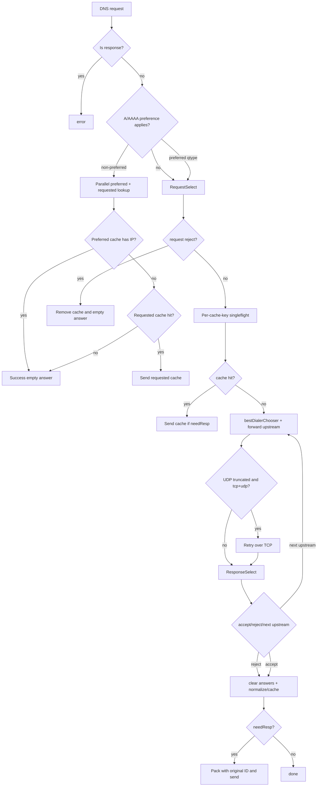
```mermaid
flowchart TD
    Req[DNS request] --> IsResp{Is response?}
    IsResp -->|yes| Err[error]
    IsResp -->|no| Prefer{A/AAAA preference applies?}
    Prefer -->|no| RouteReq[RequestSelect]
    Prefer -->|preferred qtype| RouteReq
    Prefer -->|non-preferred| Parallel[Parallel preferred + requested lookup]
    Parallel --> PreferredHasIP{Preferred cache has IP?}
    PreferredHasIP -->|yes| Empty[Success empty answer]
    PreferredHasIP -->|no| RequestedCache{Requested cache hit?}
    RequestedCache -->|yes| SendCache[Send requested cache]
    RequestedCache -->|no| Empty
    RouteReq --> ReqReject{request reject?}
    ReqReject -->|yes| RemoveCache[Remove cache and empty answer]
    ReqReject -->|no| Singleflight[Per-cache-key singleflight]
    Singleflight --> Cache{cache hit?}
    Cache -->|yes| SendCached[Send cache if needResp]
    Cache -->|no| Dial[bestDialerChooser + forward upstream]
    Dial --> Truncated{UDP truncated and tcp+udp?}
    Truncated -->|yes| RetryTCP[Retry over TCP]
    Truncated -->|no| RespRoute[ResponseSelect]
    RetryTCP --> RespRoute
    RespRoute --> Accept{accept/reject/next upstream}
    Accept -->|next upstream| Dial
    Accept -->|reject| CacheResp[clear answers + normalize/cache]
    Accept -->|accept| CacheResp
    CacheResp --> NeedResp{needResp?}
    NeedResp -->|yes| SendResp[Pack with original ID and send]
    NeedResp -->|no| Done[done]
```

### 20.17 Rust DNS fixtures

必须覆盖：

- cache key：
  - qname canonical/lower。
  - qtype/qclass 区分。
  - legacy key restore。
- fixed TTL：
  - fixed TTL 改 Deadline。
  - OriginalDeadline 保留 upstream TTL。
  - fixed TTL 0 禁用客户端 cache，但不立即删 route cache。
- Normalize：
  - A/AAAA answer TTL 归零。
  - empty success 不缓存。
  - min answer TTL。
- Handle：
  - response input 报错。
  - request reject -> empty success。
  - cache hit response ID rewrite。
  - singleflight。
- ipversion preference：
  - preferred qtype fast path。
  - non-preferred 有 preferred IP 时 reject。
  - non-preferred 无 preferred IP 时返回 requested。
- ResolveIp46：
  - disallow asis。
  - A/AAAA 并发。
  - ignore fixed TTL。
- upstream：
  - scheme defaults。
  - alias tcp+udp/http3。
  - custom DoH path。
  - stale reuse。
  - duplicate tag reject。
- forwarder：
  - reusable matrix。
  - failed reusable stale remove。
  - idle sweep。
  - max entries eviction。
- wire protocols：
  - DoH GET/POST。
  - DoH content-type。
  - UDP retry counter。
  - truncated tcp+udp fallback。
  - response question/ID validation。
- local listener:
  - addr parse。
  - tcp/udp/tcp+udp。
  - asis rejected。

### 20.18 本节验证

先跑 DNS targeted：

```bash
PATH=/root/.local/go1.25.9/bin:$PATH GOWORK=off go test -count=1 ./control ./component/dns -run 'Test(DNS|Dns|Upstream|Request|Response|Cache|DoH|ParseEndpoint|ResolveIp46|Forwarder|Truncated)'
```

结果：通过。

输出摘要：

```text
ok   github.com/daeuniverse/dae/control       0.003s
ok   github.com/daeuniverse/dae/component/dns 0.002s
```

再跑完整 DNS 相关包：

```bash
PATH=/root/.local/go1.25.9/bin:$PATH GOWORK=off go test -count=1 ./control ./component/dns
```

结果：通过。

输出摘要：

```text
ok   github.com/daeuniverse/dae/control       6.474s
ok   github.com/daeuniverse/dae/component/dns 0.002s
```

结论：

- DNS cache、cache restore、fixed TTL、DoH、UDP retry、truncated TCP fallback、response validation、local listener、upstream resolver 等现有测试在本机通过。
- 本节只更新本地 ignored 备忘录，不涉及业务源码修改。

## 21. 追加记录：TCP / UDP active datapath 和 endpoint/task pool

采集时间：2026-05-16

源码范围：

- `control/tcp.go`
- `control/udp.go`
- `control/udp_endpoint_pool.go`
- `control/udp_task_pool.go`
- `control/control_plane.go`
- `control/control_plane_core.go`

本节目标：

- 记录 transparent TCP/UDP active datapath 从 listener 到 outbound dialer 的执行流程。
- 记录 sniffing、DNS controller、BPF routing result、dial target rewrite、group selection、runtime traffic stats、UDP endpoint pool 的交互。
- 为 Rust 重构锁定 active forwarding 语义。

### 21.1 TCP handleConn 流程

入口：

- `ControlPlane.Serve` TCP accept goroutine。
- 每个 accepted conn 进入 `handleConn(ctx, lConn)`。

流程：

1. `defer lConn.Close()`。
2. 创建 request context。
3. 创建 `sniffing.NewConnSniffer(lConn, c.sniffingTimeout)`。
4. `sniffer.SniffTcp()`：
   - TLS SNI / HTTP Host。
   - sniffing error 被忽略。
   - 非 sniffing error 返回。
5. 从 accepted conn 获取：
   - src = remote addr。
   - dst = local addr。
6. `c.core.RetrieveRoutingResult(src, dst, TCP)`：
   - 从 BPF map 取真实 routing result。
7. src/dst converge。
8. 调用 `RouteDialTcp`：
   - outbound = routingResult.Outbound。
   - domain = sniffed domain。
   - mac/process/dscp/mark。
   - src/dest。
9. 成功后 `RelayTCP(sniffer, rConn)`：
   - 注意 relay 使用 sniffer 作为 reader，避免 sniffing 期间读到的首包数据丢失。
10. relay 某些常见断连错误被忽略：
    - broken pipe
    - i/o timeout
    - EOF
    - connection reset by peer
    - QUIC canceled code 0 等。

Rust parity 要求：

- TCP sniffing reader 必须参与后续 relay，不能 sniff 后丢弃 buffered first data。
- RetrieveRoutingResult 发生在 sniff 后；routing result 来自 eBPF pre-classification。

### 21.2 RouteDialTcp

输入：

- context。
- outbound index。
- sniffed domain。
- mac/dscp/process name。
- src/dest。
- mark。

流程：

1. 构造临时 `bpfRoutingResult`。
2. `ChooseDialTarget(ctx, src, routingResult, outboundIndex, dst, domain)`。
3. 如果 `shouldReroute`：
   - outboundIndex 改成 `OutboundControlPlaneRouting`。
4. outbound 分支：
   - `direct`：不重新 route。
   - `controlPlaneRouting`：
     - 调用 `Route(src, dst, domain, TCP, routingResult)`。
     - 更新 routingResult.Outbound / Mark。
     - 再次 `ChooseDialTarget`。
   - 其他：沿用原 outbound。
5. mark 为 0 时用 `c.soMarkFromDae`。
6. outbound index 越界：
   - 如果只有 built-in outbounds，认为 no-load。
   - 否则报 out of range。
7. network type：
   - L4 TCP。
   - IP version 来自 dst addr。
   - IsDns=false。
8. `strictIpVersion = dialIp`。
9. `outbound.Select(networkType, strictIpVersion)`。
10. info log：
    - network/outbound/policy/dialer/sniffed/ip/pid/dscp/pname/mac。
11. `d.DialContext(timeout, MagicNetwork("tcp", mark, c.mptcp), dialTarget)`。

关键语义：

- `domain++` 通过 `shouldReroute` 让 TCP 重新走 userspace routing。
- `dialIp` 会影响 group selection 的 strict IP version。
- `mptcp` 通过 `MagicNetwork` 进入 outbound dialer。

Rust parity 要求：

- `RouteDialTcp` 是 Web/API route-aware HTTP transport 也会用到的入口。
- shouldReroute 后必须重新 choose dial target，否则 routing/dial target 会错配。

### 21.3 RelayTCP 和流量统计

`RelayTCP(lConn, rConn)`：

- upload：
  - goroutine `io.Copy(uploadWriter, lConn)`。
  - uploadWriter 写到 rConn。
  - 每次写入成功记录 `RecordUploadTraffic`。
  - 完成后对 rConn `CloseWrite`，并设置 read deadline。
- download：
  - 当前 goroutine `io.Copy(downloadWriter, rConn)`。
  - downloadWriter 写到 lConn。
  - 每次写入成功记录 `RecordDownloadTraffic`。
  - 完成后对 lConn `CloseWrite`，并设置 read deadline。
- 两边错误会合并。

Rust parity 要求：

- 运行态流量图依赖这里的 upload/download 记录。
- half-close 行为对 TCP 长连接和代理协议很重要。

### 21.4 UDP handlePkt 总流程

入口：

- `ControlPlane.Serve` UDP read loop。
- read packet 后按 client key emit 到 `udpTaskPool`。
- task 中调用：

```go
handlePkt(ctx, udpConn, data, src, pktDst, realDst, routingResult, false)
```

输入含义：

- `src`：client addr。
- `pktDst`：original dest。
- `realDst`：当前真实目标。
- `routingResult`：BPF routing result。
- `skipSniffing`：递归重放 sniffed buffered packet 时跳过 sniffing。

流程：

1. 创建 request context。
2. 获取 scoped/default UDP endpoint pool。
3. `realSrc = src`。
4. 如果 endpoint pool 中已有 realSrc 且 `SniffedDomain != ""`：
   - fast path。
   - 直接 `ue.WriteTo(data, realDst.String())`。
   - 记录 upload。
   - 返回。
5. DNS sniff：
   - 只在 `realDst.Port() == 53` 时尝试 unpack DNS。
   - 成功则 nat timeout = `17s`。
   - 否则 default NAT timeout = `3m`。
6. 如果不是 DNS、没有 skipSniffing、且 endpoint 不存在：
   - packet sniffer pool 尝试 QUIC sniff。
   - need more 时返回等待更多 UDP 包。
   - sniff 完成后移除 sniffer session。
   - 对中间 buffered data 做 re-handle。
7. 如果 `routingResult.Must > 0`：
   - `isDns=false`，即 DNS 包也按 plain traffic。
8. mark 为 0 时设为 `soMarkFromDae`。
9. 如果 `isDns`：
   - 调 `dnsController.Handle_`。
   - 返回。
10. 非 DNS：
    - 进入 UDP endpoint / outbound dial path。

Rust parity 要求：

- 只有 UDP/53 会进入透明 DNS controller。
- `must` routing 会让 UDP/53 作为普通 UDP 代理流量，不进 DNS controller。
- QUIC sniff 的 NeedMore 会暂时不转发，直到 sniffer 完成或失败。

### 21.5 UDP sniffing 和 dial target

UDP 非 DNS路径：

- network type：
  - L4 UDP。
  - IP version 来自 realDst。
  - IsDns=false。
- outbound index 来自 routingResult。
- 调用 `ChooseDialTarget(...)` 只读取：
  - `shouldReroute`
- 但随后强制：

```go
dialTarget = realDst.String()
dialIp = true
```

原因注释：

- 不覆盖 target，修复 Google QUIC 连接问题。

含义：

- UDP QUIC sniffed domain 可以触发 `domain++` reroute。
- 但普通 UDP 最终 dial target 仍然是 IP:port，不改成 domain。

Rust parity 要求：

- 这是 TCP/UDP domain rewrite 的重要差异。
- Rust 版不能把 TCP 的 domain target rewrite 直接套到 UDP。

### 21.6 UDP endpoint 创建和复用

`UdpEndpointPool.GetOrCreate(realSrc, options)`：

- key 是 client addr。
- 现有 endpoint：
  - Touch lastActive。
  - 返回旧 endpoint。
- 不存在：
  - per-key mutex 防止并发重复创建。
  - default NAT timeout = 3m。
  - Handler 必须非 nil。
  - 调 `GetDialOption()`。
  - 用 dialer `DialContext(DefaultDialTimeout, network, target)`。
  - dialer 返回必须是 `netproxy.PacketConn`。
  - 创建 `UdpEndpoint`。
  - Touch。
  - 写 pool。
  - `trimToLimit`。
  - 启动 `ue.start()` 接收返回包。

`GetDialOption` 内部：

1. 如果 shouldReroute：
   - outboundIndex = control plane routing。
2. outbound 分支：
   - direct：不 reroute。
   - controlPlaneRouting：
     - DNS 包不 route，这里普通 UDP 才 route。
     - 调 `Route(realSrc, realDst, domain, UDP, routingResult)`。
     - 更新 outbound/mark。
3. outbound 越界处理 no-load/out-of-range。
4. `outbound.Select(networkType, strictIpVersion=dialIp)`。
5. 返回：
   - target = realDst.String()
   - dialer
   - outbound group
   - network = `MagicNetwork("udp", mark, mptcp)`
   - sniffed domain

旧 endpoint 健康检查：

- 如果 endpoint 不是新建。
- outbound policy 不是 fixed。
- dialer 对当前 networkType 不 alive。
- 则移除旧 endpoint 并重试创建。
- 最大重试 `MaxRetry = 2`。

写请求：

- `ue.WriteTo(data, dialTarget)`。
- 失败时 remove endpoint 并 retry。
- 成功记录 upload。
- 新连接 info log；旧连接 debug log。

返回包：

- `ue.start()` 从 outbound packet conn 读包。
- 调 handler：
  - `sendPkt(anyfromPool, data, from, realSrc, src, lConn)`
  - 记录 download。

Rust parity 要求：

- UDP endpoint key 当前是 client addr，而不是 client+target；这是 full-cone 行为边界。
- non-fixed policy 的旧 endpoint 会根据 dialer alive 状态被替换。
- UDP endpoint 创建失败或 write 失败会有限 retry。

### 21.7 NAT timeout 和 sendPkt

`ChooseNatTimeout(data, sniffDns)`：

- sniffDns=true 时尝试 unpack DNS。
- DNS packet：
  - return DNS msg。
  - timeout = `17s`。
- 非 DNS：
  - timeout = `3m`。

`sendPkt`：

- 使用 AnyfromPool：
  - key = from.String()
  - timeout = `5s`
- 从 `from` 地址写回 realTo。

Rust parity 要求：

- DNS NAT timeout 短于普通 UDP，是 RFC 5452 风格的资源控制。
- anyfrom timeout 很短，避免本地 source addr 绑定缓存过久。

### 21.8 UdpEndpointPool 资源控制

常量：

- cleanup interval = 1s。
- default max entries = 4096。

`SetMaxEntries`：

- <=0 时回到默认 4096。

`trimToLimit`：

- 当前 count >= maxEntries 时触发。
- target = maxEntries - max(maxEntries/20, 1)。
- removeBudget = current - target + 1。
- 优先移除 expired。
- 再用 heap 保留 removeBudget 个最老 endpoint candidate。

`Expired`：

- lastActive==0 不视为 expired。
- `now - lastActive >= NatTimeout`。

`Close`：

- cancel cleanup。
- wait。
- Flush all endpoints。

`Flush`：

- CompareAndDelete 后 close endpoint。

Rust parity 要求：

- UDP endpoint pool 是 RSS/内存控制重点。
- max entries 来自 `global.udp_endpoint_pool_size`，runtime reload 后会 apply 到 scoped pool。
- trim 不是只删 1 个，而是删到 95% 左右，减少频繁抖动。

### 21.9 UdpTaskPool

常量：

- queue length = 128。
- cleanup interval = 1s。
- max queues = 2048。

用途：

- 同一 key 的 UDP packet 顺序执行。
- 不同 key 并行。
- Serve UDP loop 不直接处理 packet，而是 emit task。

`EmitTask(key, task)`：

- 没有 queue 时创建 queue。
- queue 数达到 2048：
  - evict oldest idle queue。
  - 如果无可 evict，drop task 并增加 drop counter。
- task enqueue 不应阻塞调用方：
  - queue 满时 drop 并增加 counter。
- queue goroutine 串行执行 task。

`sweepExpiredQueues`：

- 只清理：
  - not running。
  - channel 空。
  - lastActive + agingTime <= now。

Rust parity 要求：

- UDP task pool 是顺序性和抗背压边界。
- Rust 版不能把同一 client 的 UDP 包无序并发处理。
- drop counter 是运行态观测字段。

### 21.10 TCP/UDP datapath 对比

TCP：

- sniffed domain 可改 dial target。
- `domain++` 可 reroute。
- relay 使用 sniffer reader。
- endpoint 不复用。
- runtime traffic 按 stream copy 记录。

UDP：

- 只 UDP/53 进入 DNS controller。
- QUIC sniffed domain 只影响 reroute，不改 dial target。
- endpoint 按 client addr 复用。
- full-cone packet conn。
- runtime traffic 按 packet len 记录。

共同点：

- mark 为 0 时使用 `so_mark_from_dae`。
- outbound index 越界时区分 no-load 和 out-of-range。
- group selection 使用 network type 和 strict IP version。
- mptcp 通过 `MagicNetwork` 下传。
- log 字段包含 network/outbound/policy/dialer/sniffed/ip/pid/dscp/pname/mac。

### 21.11 active datapath 图

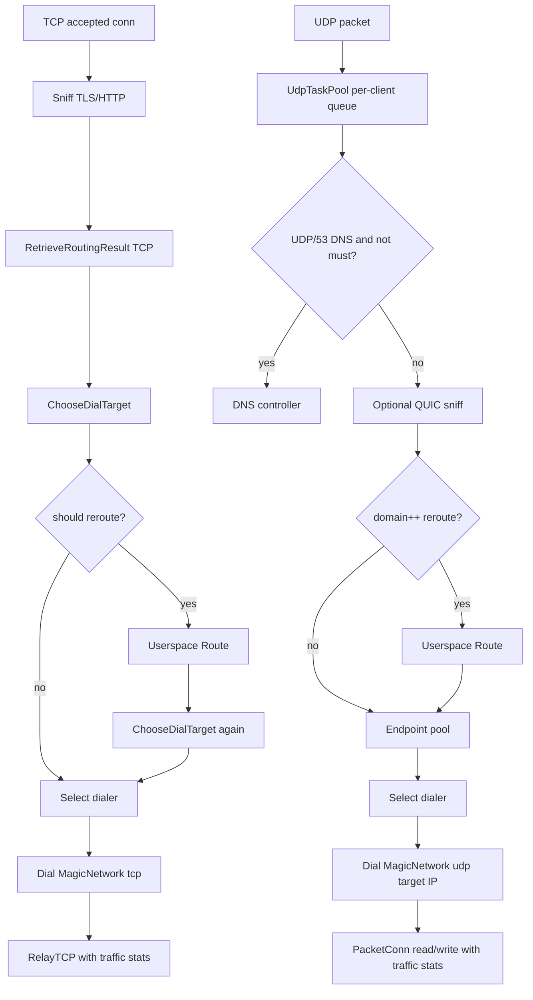
```mermaid
flowchart TD
    TCP[TCP accepted conn] --> TcpSniff[Sniff TLS/HTTP]
    TcpSniff --> TcpBpf[RetrieveRoutingResult TCP]
    TcpBpf --> TcpChoose[ChooseDialTarget]
    TcpChoose --> TcpReroute{should reroute?}
    TcpReroute -->|yes| TcpRoute[Userspace Route]
    TcpReroute -->|no| TcpSelect[Select dialer]
    TcpRoute --> TcpChoose2[ChooseDialTarget again]
    TcpChoose2 --> TcpSelect
    TcpSelect --> TcpDial[Dial MagicNetwork tcp]
    TcpDial --> TcpRelay[RelayTCP with traffic stats]

    UDP[UDP packet] --> UdpTask[UdpTaskPool per-client queue]
    UdpTask --> UdpDns{UDP/53 DNS and not must?}
    UdpDns -->|yes| DnsController[DNS controller]
    UdpDns -->|no| UdpSniff[Optional QUIC sniff]
    UdpSniff --> UdpReroute{domain++ reroute?}
    UdpReroute -->|yes| UdpRoute[Userspace Route]
    UdpReroute -->|no| UdpEndpoint[Endpoint pool]
    UdpRoute --> UdpEndpoint
    UdpEndpoint --> UdpSelect[Select dialer]
    UdpSelect --> UdpDial[Dial MagicNetwork udp target IP]
    UdpDial --> UdpRelay[PacketConn read/write with traffic stats]
```

### 21.12 Rust fixtures

TCP：

- TCP sniff success with buffered first data preserved。
- TCP sniff error ignored when `IsSniffingError`。
- RouteDialTcp direct。
- RouteDialTcp control plane reroute。
- `domain++` reroute。
- outbound out of range vs no-load。
- strict IP version when dialIp=true。
- relay traffic upload/download counters。

UDP：

- DNS packet only when dst port 53。
- must routing bypasses DNS controller。
- QUIC sniff NeedMore returns without forwarding。
- QUIC sniff domain triggers reroute but target remains IP。
- endpoint reuse by client addr。
- non-fixed policy dead dialer causes endpoint replace。
- write failure removes endpoint and retries。
- max retry returns error。
- DNS NAT timeout 17s。
- default NAT timeout 3m。
- anyfrom timeout 5s。

Pools：

- endpoint max entries trim。
- endpoint expired sweep。
- endpoint flush close。
- task queue preserves per-key ordering。
- queue overflow drops and increments counter。
- max queues eviction of idle queue。

### 21.13 本节验证

验证命令：

```bash
PATH=/root/.local/go1.25.9/bin:$PATH GOWORK=off go test -count=1 ./control -run 'Test(RelayTCP|RouteDial|UdpEndpoint|UdpTask|ChooseNatTimeout|PacketSniffer|ChooseDialTarget)'
```

结果：通过。

输出摘要：

```text
ok   github.com/daeuniverse/dae/control 0.026s
```

结论：

- UDP endpoint pool、UDP task pool、packet sniffer、ChooseDialTarget 等 targeted tests 在本机通过。
- 本节只更新本地 ignored 备忘录，不涉及业务源码修改。

## 22. 追加记录：control_plane_core / eBPF attach / LAN-WAN bind / netns / sysctl 生命周期

本节目标：

- 记录 daenew 控制平面核心如何拥有 kernel/eBPF 资源。
- 记录启动、reload、关闭时 eBPF 对象、tc filter、netns、sysctl、listen socket map 的生命周期。
- 给 Rust 重构保留 ABI、attach 顺序、cleanup 顺序和 reload ownership 边界。

证据文件：

- `control/control_plane.go`
- `control/control_plane_core.go`
- `control/bpf_utils.go`
- `control/bpf_subobjects.go`
- `control/netns_utils.go`
- `control/sysctl.go`
- `control/connectivity.go`
- `control/domain_routing_tracker.go`
- `control/routing_matcher_builder.go`
- `control/utils.go`
- `control/kern/tproxy.c`
- `control/*_test.go`

### 22.1 资源所有权分层

控制平面分两层：

| 层 | Go 类型 | 职责 |
|---|---|---|
| 外层 runtime/control plane | `ControlPlane` | outbound group、DNS controller、routing matcher、TCP/UDP listener、连接池、runtime deps、业务级 Close。 |
| 内层 kernel owner | `controlPlaneCore` | eBPF objects、domain routing map owner tracker、接口监听、tc/cgroup attach、netns 引用、reload flip、kernel 资源 Close。 |
| 运行依赖注入 | `RuntimeDeps` | netns、UDP endpoint/task pool、anyfrom pool、resolver dialer/DNS。 |

`ControlPlane` 保存：

- `core *controlPlaneCore`。
- `deferFuncs []func() error`，用于 dialer set、DNS controller/listener 等业务资源。
- `outbounds []*outbound.DialerGroup`。
- `dnsController`、`dnsListener`。
- `routingMatcher`，用户态路由镜像。
- `realDomainCache`。
- `lanInterface`、`wanInterface`。
- `sniffingTimeout`、`tproxyPortProtect`、`soMarkFromDae`、`mptcp`。
- `netns`、`udpEndpointPool`、`udpTaskPool`、`anyfromPool`。

`controlPlaneCore` 保存：

- `bpf *bpfObjects`，实际 eBPF programs/maps 句柄。
- `domainRouting *domainRoutingTracker`，解决多个 DNS cache owner 共享同一个 IP 时的 bitmap 合并和删除问题。
- `outboundId2Name map[uint8]string`，用于 health callback 日志。
- `kernelVersion *internal.Version`。
- `flip int`，用于 reload 时交替 tc filter handle，降低旧 filter 和新 filter 冲突。
- `isReload bool`，由 `NewControlPlane` 的 `_bpf != nil` 决定。
- `bpfEjected bool`，用于把 BPF 对象从旧 core 的 Close 生命周期中摘出或重新注入。
- `ifmgr *component.InterfaceManager`，负责接口 lazy bind/rebind。
- `netns *DaeNetns`。
- `closed context.Context` 和 `close context.CancelFunc`，用于 attach callback 和 health callback 退出判断。
- `deferFuncs []func() error`，用于 BPF close、interface manager close、tc filter/cgroup link detach。

Rust 重构边界：

- `ControlPlane` 和 `controlPlaneCore` 应拆成业务 runtime owner 与 kernel owner 两个资源所有者。
- BPF 对象不要散落在 DNS/TCP/UDP 模块中直接关闭，必须由 kernel owner 统一管理。
- reload 时 BPF ownership 必须显式转移，不能依赖引用计数或 drop 顺序猜测。

### 22.2 NewControlPlane 启动顺序

`NewControlPlane` 的关键顺序：

1. 设置 `QUIC_GO_DISABLE_GSO=1`，除非环境变量已经存在。
2. 读取 kernel version。
3. 检查 kernel/eBPF feature：
   - `bpf_loop`，用于 routing。
   - checksum 相关 feature。
   - WAN 绑定需要 BPF timer feature。
   - LAN 绑定需要 `sk_assign` feature。
   - basic feature version。
4. `rlimit.RemoveMemlock()`。
5. `runtimeDeps.withDefaults(log)`：
   - 没有传入 netns 时创建 fresh `DaeNetns`。
   - 没有传入 UDP endpoint/task pool 时创建 fresh pool。
   - 没有传入 anyfrom pool 时使用当前 netns 创建。
6. `InitSysctlManager(log)`。
7. `runtimeDeps.Netns.Setup()`。
8. 创建 BPF pin path：`/sys/fs/bpf/dae`。
9. 如果 `_bpf == nil`，调用 `fullLoadBpfObjects` 装载 eBPF；如果 `_bpf != nil`，复用传入的 `*bpfObjects`，这是 reload 路径。
10. 创建 `controlPlaneCore`。
11. 绑定 LAN/WAN/dae netns 的 tc/cgroup 程序。
12. 构造 direct/block 内置 dialer group。
13. 构造用户 group/outbounds。
14. 构造 routing matcher builder，并写入 BPF routing maps。
15. 创建 `ControlPlane`。
16. 构造 DNS upstream 和 DNS controller。
17. 如配置了 `dns.bind`，启动 DNS listener。
18. 之后由外部调用 `ListenAndServe` 启动 tproxy TCP/UDP listener。

启动顺序中的重要约束：

- `Netns.Setup()` 必须早于 `fullLoadBpfObjects`，因为 BPF 常量需要 `dae0_ifindex`、`dae_netns_id` 和 `dae0peer_mac`。
- BPF load 必须早于 LAN/WAN/dae0 attach。
- LAN/WAN/dae0 attach 被放在 dialer group 构建之前，注释说明是为了避免旧连接不可路由。
- routing map 写入必须在 routing builder 完成后执行，fallback rule 必须是最后一条。

### 22.3 BPF load 和 pinned map 处理

`fullLoadBpfObjects` 的输入：

- `netns *DaeNetns`
- `bpf *bpfObjects`
- `loadBpfOptions`
  - `PinPath`
  - `BigEndianTproxyPort`
  - `CollectionOptions`

装载时注入 `PARAM` 常量：

| 常量字段 | 来源 | 用途 |
|---|---|---|
| `tproxyPort` | `common.Htons(global.TproxyPort)` | kernel redirect 到控制平面的端口。 |
| `controlPlanePid` | `os.Getpid()` | kernel 判断控制平面自身连接，避免回环。 |
| `dae0Ifindex` | `netns.Dae0().Attrs().Index` | redirect 到 host veth。 |
| `dae0NetnsId` | `netns.NetnsID()` | kernel 判断 dae netns。 |
| `dae0peerMac` | `netns.Dae0Peer().Attrs().HardwareAddr` | dae0peer 二层路径重写。 |

pinned map 策略：

- `CollectionOptions.Maps.PinPath` 指向 `/sys/fs/bpf/dae`。
- C 侧带 `LIBBPF_PIN_BY_NAME` 的 map 会被 pin。
- `tproxy.c` 中明确 pinned 的 map 包括：
  - `tgid_pname_map`
  - `routing_tuples_map`
  - `cookie_pid_map`
- `domain_routing_map` 明确注释为不持久化。
- `routing_map`、`lpm_array_map` 不持久化。

兼容性处理：

- 如果 `LoadAndAssign` 返回 `ebpf.ErrMapIncompatible`，`fullLoadBpfObjects` 从错误文本中解析 map 名。
- 删除不兼容 pinned map 后 `goto retryLoadBpf` 重新装载。
- 这保证 schema 改变后不会永久卡在旧 pinned map 上。

错误增强：

- 缺 BTF 时提示重新编译 kernel BTF 配置。
- `bpf_trace_printk` 不支持时提示不要带 bpf_printk 编译。
- `bpf_probe_read` 不支持时提示打开 `CONFIG_BPF_EVENTS` 和 `CONFIG_KPROBE_EVENTS`。

Rust parity 要求：

- BPF 常量 struct layout 必须和 C/Go `dae_param` 等价。
- pinned map 兼容性错误必须能定位到 map 名并删除后重试。
- `routing_tuples_map`、`cookie_pid_map`、`tgid_pname_map` 的 pinning 行为必须保留。
- `domain_routing_map` 不能误做持久化，否则 DNS cache remove/reload 语义会变。

### 22.4 netns 生命周期

`DaeNetns` 字段：

- `setupDone atomic.Bool`
- `mu sync.Mutex`
- `dae0, dae0peer netlink.Link`
- `hostNs, daeNs netns.NsHandle`

`NewDaeNetns` 初始化：

- `hostNs = netns.None()`
- `daeNs = netns.None()`

`Setup()` 特征：

- 使用 double-check + mutex，避免并发重复创建。
- 成功后 `setupDone=true`。
- 如果已 setup，直接返回。

`setup()` 顺序：

1. `runtime.LockOSThread()`，获取 host netns handle。
2. `setupVeth()`：
   - 删除已有 `dae0`。
   - 创建 veth pair：host `dae0`，peer `dae0peer`。
   - host 侧 `dae0` up。
3. `setupNetns()`：
   - 删除已有 named netns `daens`。
   - 创建 `daens`。
   - 把 `dae0peer` 移入 `daens`。
   - 在 `daens` 中把 `dae0peer` 和 `lo` up。
   - 重新获取 `dae0peer`，确保 MAC 最新。
4. `setupSysctl()`。
5. `setupIPv4Datapath()`。
6. `setupIPv6Datapath()`。
7. `setupRoutingPolicy()`。

IPv4 datapath：

- 在 `dae0peer` 上配置 `169.254.0.11/32`。
- 添加到 `169.254.0.1` 的 link route。
- default route via `169.254.0.1 dev dae0peer`。
- 添加 permanent ARP neighbor：`169.254.0.1 -> dae0 MAC`。

IPv6 datapath：

- host `dae0` 添加 `fe80::ecee:eeff:feee:eeee/128`。
- `daens` 中 default route via 该 link-local 地址。
- 添加 permanent NDP neighbor：该 link-local -> dae0 MAC。

routing policy：

- 在 `daens` 中添加 table `2023`：
  - IPv4 local default dev lo。
  - IPv6 local default dev lo。
- 添加 fwmark rule：
  - IPv4：mark `TPROXY_MARK` mask `TPROXY_MARK` table `2023`。
  - IPv6：同上。
- IPv6 route/rule 失败时按代码记录 warning 并继续，兼容禁用 IPv6 的系统。

`With(f)`：

- 先确保 `Setup()`。
- 锁定当前 OS thread。
- `netns.Set(ns.daeNs)`。
- 执行 `f`。
- defer 切回 `hostNs`。

`Close()`：

- 删除 named netns `daens`。
- 删除 host link `dae0`。
- 关闭 `daeNs` 和 `hostNs` handle。
- 清空 `dae0/dae0peer`。
- `setupDone=false`。
- 多个 cleanup error 用 `errors.Join` 聚合。

Rust parity 要求：

- 所有 netns 切换必须绑定 OS thread。
- close 不能关闭 fd 0，Go 代码显式处理 zero-value handle。
- `DeleteNamedNetns` 对 missing netns/no mount 要幂等。
- `DeleteLink` 对 missing link 要幂等。
- `setupDone` 必须能在 close 后复位，便于测试和 reload/restart。

### 22.5 sysctl manager 和 kernel 参数

`InitSysctlManager(log)`：

- 创建新的 `SysctlManager`。
- 替换全局 `sysctl`。
- 如果旧 manager 存在，关闭旧 watcher。

`SysctlManager`：

- 使用 `fsnotify.Watcher` 监听 sysctl 文件。
- `expectations map[string]string` 保存 watch=true 时预期值。
- 监听到写事件后读取当前值：
  - 如果当前值不等于预期值，写回预期值。
  - 写回失败只记录错误。

`SysctlKeyf`：

- 把 `net.ipv6.conf.dae0.forwarding` 转换成 `/proc/sys/net/ipv6/conf/dae0/forwarding`。

watch 语义：

- `Set(value, true)` 会先添加 watcher，再记录 expectation。
- 如果后续写失败，会回滚 expectation，并在需要时移除 watcher。
- `Set(value, false)` 只写文件，不加入 expectation。

NewControlPlane 中的 auto-config：

- 有 LAN 且 `auto_config_kernel_parameter=true`：
  - `/proc/sys/net/ipv4/ip_forward = 1`
  - `net.ipv6.conf.all.forwarding = 1`
  - 对每个 LAN link：`send_redirects=0`、IPv4/IPv6 forwarding=1。
- 有 WAN 且同时有 LAN：
  - 因为 LAN forwarding 可能压制 WAN 的 `accept_ra=1`，若 WAN `accept_ra` 原值为 `1`，则设置为 `2`。

netns setup 中的 sysctl：

- host：
  - `net.ipv6.conf.dae0.disable_ipv6 = 0`，watch=true。
  - `net.ipv6.conf.dae0.forwarding = 1`，watch=true。
- `daens`：
  - `net.ipv4.tcp_early_demux = 1`，watch=false，失败忽略。
  - `net.ipv4.ip_early_demux = 1`，watch=false，失败忽略。
  - `net.ipv4.conf.dae0peer.accept_local = 1`，watch=false，失败返回。

Rust parity 要求：

- sysctl watcher 是运行态修复机制，不是一次性写入。
- watcher close 必须等待 goroutine 退出，否则 reload 会泄漏 watcher。
- auto-config=false 时 LAN bind 仍会检查 forwarding/send_redirects，不自动修正。

### 22.6 LAN/WAN lazy bind 和 tc attach

接口绑定通过 `component.InterfaceManager`：

- `bindLan(ifname, autoConfigKernelParameter)` 和 `bindWan(ifname, autoConfigKernelParameter)` 都注册 pattern。
- 支持接口不存在时 lazy-bind。
- 支持接口未来创建时 rebind。
- 删除接口时只记录 warning，等待重新创建。
- 跳过 host veth `dae0`，避免把 LAN/WAN 程序绑定到内部 veth。

公共 attach 准备：

- `addQdisc(ifname)` 添加 clsact qdisc：
  - handle `ffff:`
  - parent `HANDLE_CLSACT`
  - type `clsact`
- `linkHdrLen(ifname)`：
  - `none/ipip/ppp/tun` -> L3 程序，link header length 0。
  - `ether` -> L2 程序，link header length Ethernet。
  - 未知 encap 记录 warning，按 Ethernet 处理。
- `getIfParamsFromLink` 读取 ethtool offload：
  - tx checksum IPv4/IPv6。
  - rx checksum。
  - docker 接口启用非标准 offload 算法。
- `CheckVersionRequirement`：
  - 若 NIC 不支持 checksum offload，需要 kernel 支持 `BPF_F_ADJ_ROOM_NO_CSUM_RESET`。

LAN attach：

| 方向 | tc parent | handle | priority | 程序 |
|---|---|---|---|---|
| ingress | `HANDLE_MIN_INGRESS` | `0x2023:0b100+flip` | 2 | `TproxyLanIngressL2/L3` |
| egress | `HANDLE_MIN_EGRESS` | `0x2023:0b010+flip` | 1 | `TproxyLanEgressL2/L3` |

LAN 前置检查：

- `CheckIpforward(ifname)`，IPv4/IPv6 forwarding 必须为 1。
- `CheckSendRedirects(ifname)`，IPv4 send_redirects 必须为 0。

WAN attach：

| 方向 | tc parent | handle | priority | 程序 |
|---|---|---|---|---|
| egress | `HANDLE_MIN_EGRESS` | `0x2023:0b100+flip` | 2 | `TproxyWanEgressL2/L3` |
| ingress | `HANDLE_MIN_INGRESS` | `0x2023:0b010+flip` | 1 | `TproxyWanIngressL2/L3` |

WAN 前置约束：

- 禁止绑定 loopback。
- 有 WAN 时会尝试 `setupSkPidMonitor()`。
- `setupSkPidMonitor()` 失败只 warning：`cgroup2 is not enabled; pname routing cannot be used`。

tc filter 更新语义：

- attach 前先 `FilterDel(current)`。
- 非 reload 时还删除 flipped handle，做彻底清理。
- reload 时只删当前 handle，保留另一组 handle 给旧 core 关闭，依赖 flip 避免互相踩。
- attach 成功后将 `FilterDel(filter)` 加入 core deferFuncs。

Rust parity 要求：

- handle、priority、parent、program name 需要逐项一致。
- L2/L3 程序选择必须跟 link encap 对齐。
- reload filter flip 不能改，否则会造成新旧 core 互删 filter 或 stale filter 残留。

### 22.7 cgroup pid/pname monitor

`setupSkPidMonitor()`：

- 通过 `/proc/mounts` 找第一个 `cgroup2` mount point。
- attach 以下 cgroup programs：
  - `TproxyWanCgSockCreate` -> `AttachCGroupInetSockCreate`
  - `TproxyWanCgSockRelease` -> `AttachCgroupInetSockRelease`
  - `TproxyWanCgConnect4` -> `AttachCGroupInet4Connect`
  - `TproxyWanCgConnect6` -> `AttachCGroupInet6Connect`
  - `TproxyWanCgSendmsg4` -> `AttachCGroupUDP4Sendmsg`
  - `TproxyWanCgSendmsg6` -> `AttachCGroupUDP6Sendmsg`
- 每个 attach 返回的 link.Close 加入 core deferFuncs。

C 侧 pname 相关 map：

- `cookie_pid_map`：socket cookie -> pid/pname，pinned。
- `tgid_pname_map`：tgid -> pname，pinned，旧 redirect/WAN process name fallback 使用。

C 侧逻辑：

- sock create/connect/sendmsg 时根据 socket cookie 更新 pid/pname。
- sock release 时删除 cookie 映射。
- 获取 real command name 失败时 fallback 到 `tgid_pname_map`。
- `pid_is_control_plane` 用 `PARAM.control_plane_pid` 判断是不是控制平面自身连接。

Rust parity 要求：

- cgroup attach 不可与 tc attach 混为一类资源，关闭方式不同。
- pname routing 在没有 cgroup2 时是降级能力，不能阻止整个控制平面启动。
- `TASK_COMM_LEN=16` 的 struct layout 必须与 C/Go 一致。

### 22.8 dae0/dae0peer attach 和 listen socket map

`bindDaens()` 绑定两个内部路径：

| 位置 | netns | tc parent | handle | priority | 程序 |
|---|---|---|---|---|---|
| `dae0peer` ingress | `daens` | ingress | `0x2022:0b010+flip` | 0 | `TproxyDae0peerIngress` |
| `dae0` ingress | host | ingress | `0x2022:0b010+flip` | 0 | `TproxyDae0Ingress` |

`dae0peer`：

- 在 `daens.With` 中 add clsact qdisc。
- 在 `daens.With` 中 `FilterDel` 和 `FilterAdd`。
- attach 失败返回 `cannot attach ebpf object to filter ingress`。
- defer 中进入 `daens.With` 删除 filter。

`dae0`：

- host netns 中 add clsact qdisc。
- host netns 中 `FilterDel` 和 `FilterAdd`。
- defer 中删除 filter，忽略 not exist。

kernel 侧：

- `tproxy_dae0peer_ingress`：
  - 只接受 `skb->cb[0] == TPROXY_MARK` 的包。
  - 设置 `skb->mark = TPROXY_MARK`。
  - `bpf_skb_change_type(..., PACKET_HOST)`。
  - 根据 `skb->cb[1]` 中的 l4proto 调 `assign_listener`。
- `tproxy_dae0_ingress`：
  - 反向 tuple，用于回程路径重写。

listen socket map：

- `listen_socket_map` 是 `BPF_MAP_TYPE_SOCKMAP`，max entries 2。
- key 0 表示 TCP socket。
- key 1 表示 UDP socket。
- `ControlPlane.Serve` 启动时：
  - `updateListenSocketMap(c.core.bpf.ListenSocketMap, consts.ZeroKey, tcpListener)`。
  - `updateListenSocketMap(c.core.bpf.ListenSocketMap, consts.OneKey, udpConn)`。
- `updateListenSocketMap` 通过 `syscall.Conn.SyscallConn().Control` 取 fd，并写入 BPF map。

Rust parity 要求：

- TCP/UDP listener 必须在 tproxy control socket option 下创建。
- listener fd 写入 sockmap 后，BPF `assign_listener` 才能把包交给用户态 listener。
- listener map key 0/1 是 ABI，不能随意改。

### 22.9 routing map、routing tuples 和用户态 Route

内核 map：

- `routing_map`：
  - `BPF_MAP_TYPE_ARRAY`
  - key `u32`
  - value `match_set`
  - max entries `MAX_MATCH_SET_LEN`
  - 不 pin。
- `lpm_array_map`：
  - array-of-maps，保存多个 LPM trie。
  - 不 pin。
- `routing_tuples_map`：
  - `BPF_MAP_TYPE_LRU_HASH`
  - key `tuples_key`
  - value `routing_result`
  - pinned。

`RoutingMatcherBuilder.BuildKernspace`：

- 对每个 simulated LPM trie 创建临时 LPM map。
- 写入 `LpmArrayMap[index] = map`。
- 写完后关闭临时 map fd，array-of-maps 持有内核引用。
- 将所有 `bpfMatchSet` 批量写入 `RoutingMap`。
- fallback rule 必须是最后一条。

`BuildUserspace`：

- 构造 domain matcher。
- 构造 LPM trie。
- 保留与 kernel routing map 同样的 match set 顺序。

`RetrieveRoutingResult`：

- 根据 TCP/UDP listener 收到的 source/destination 和 l4proto 构造 `bpfTuplesKey`。
- source/destination IP 使用 IPv6 16 字节表示，IPv4 走 IPv4-mapped 语义。
- sport/dport 使用 `common.Htons`。
- 从 `RoutingTuplesMap` 读取 `bpfRoutingResult`。

`Route`：

- 使用用户态 matcher 重新匹配。
- 输入包括：
  - source/destination IP。
  - source/destination port。
  - ip version。
  - l4proto。
  - domain。
  - `routingResult.Pname`。
  - `routingResult.Dscp`。
  - `routingResult.Mac`。
- 当前实现返回 `must=false`，即 `must` 语义主要来自 kernel routing result。

Rust parity 要求：

- `bpfTuplesKey` 字节序必须一致，尤其端口必须 network byte order。
- `bpfRoutingResult` layout 必须保持：
  - mark
  - must
  - mac[6]
  - outbound
  - pname[16]
  - pid
  - dscp
  - padding
- 用户态 matcher 和 kernel matcher 必须共享同一条规则顺序，否则 `domain++` reroute 和 DNS route bitmap 会偏移。

### 22.10 DNS cache 到 domain_routing_map

DNS controller 创建时注册两个 callback：

- `CacheAccessCallback` -> `core.BatchUpdateDomainRouting(cache)`。
- `CacheRemoveCallback` -> `core.BatchRemoveDomainRouting(cache)`。

`NewCache` 中会设置：

- `DomainBitmap = plane.routingMatcher.domainMatcher.MatchDomainBitmap(fqdn)`。
- `Answer`。
- `IPs` 和 `HasAnyIP`。
- `Deadline` 和 `OriginalDeadline`。

`DnsCache` 还有 `RouteOwnerKey`：

- 新逻辑用 structured cache key 作为 owner。
- 目的是区分同域名不同 qtype/qclass、CNAME/问题域等来源。

`domainRoutingTracker`：

- `owners map[string]domainRoutingOwnerSnapshot`：
  - ownerKey -> bitmap + IP set。
- `ips map[[4]uint32]*domainRoutingIPState`：
  - IP -> owners + merged bitmap。

更新流程：

1. `buildDomainRoutingOwnerSnapshot(cache)` 将 cache IP 转成 `[4]uint32` key。
2. `syncOwner` 计算旧 snapshot 和新 snapshot 的 affected IP。
3. 对每个 affected IP 计算 desired merged bitmap。
4. 需要更新的 key 批量 `BpfMapBatchUpdate`。
5. 需要删除的 key 批量 `BpfMapBatchDelete`。
6. BPF map 更新成功后才更新 tracker 内存状态。

没有 ownerKey 的 legacy 路径：

- `BatchUpdateDomainRouting` 直接按 cache IP 写入 bitmap。
- `BatchRemoveDomainRouting` 直接按 cache IP 删除。

Rust parity 要求：

- domain routing 不能简单用 IP -> bitmap 覆盖模型。
- 多个 cache owner 共享同一个 IP 时，删除其中一个 owner 不能删除另一个 owner 的 bitmap。
- BPF map 更新失败时，不应提前修改内存 tracker 状态。

### 22.11 outbound connectivity map

`outboundAliveChangeCallback(outbound, dryrun)`：

- 每个 dialer group 创建时注册。
- `dryrun = dialMode != ip`。
- 如果 core 已 closed，直接返回。
- 如果不是初始化事件且 dryrun=true，直接返回。
- alive=true 写入 1，alive=false 写入 0。

写入 key：

| 字段 | 来源 |
|---|---|
| `Outbound` | group index |
| `L4proto` | `networkType.L4Proto.ToL4Proto()` |
| `Ipversion` | `networkType.IpVersion.ToIpVersion()` |

写入 map：

- `c.bpf.OutboundConnectivityMap.Update(key, value, ebpf.UpdateAny)`。

kernel 侧：

- `outbound_connectivity_map` 是 hash map。
- key 是 outbound/l4proto/ipversion。
- value 是 `u32` true/false。
- max entries `256 * 2 * 2`。
- WAN egress 路由后会检查 outbound alive。
- DNS 是例外，避免 DNS 自身因为 health 状态不可用而完全断掉。

Rust parity 要求：

- 非 IP dial mode 下，运行中 health 变化不默认实时刷新 kernel map，只保留初始化状态。
- IP dial mode 下 callback 需要实时更新 kernel map。
- 这和 dial mode/domain reroute 语义有关，不能只按 health UI 视角重构。

### 22.12 reload、EjectBpf、InjectBpf 和 Close 顺序

reload 入口语义：

- `NewControlPlane` 支持 `_bpf interface{}`。
- `_bpf == nil`：
  - 全新 load BPF。
  - `newControlPlaneCore(..., isReload=false)`。
  - core deferFuncs 首项包含 `bpf.Close`。
- `_bpf != nil`：
  - 断言为 `*bpfObjects`。
  - 不重新 load BPF。
  - `newControlPlaneCore(..., isReload=true)`。
  - `coreFlip` 取反。
  - core deferFuncs 不包含 `bpf.Close`。

`EjectBpf()`：

- 作用：把 BPF 从当前 core 的销毁生命周期中摘出，交给 reload 新 core 继续使用。
- 如果 `!bpfEjected && !isReload`：
  - 删除 `deferFuncs[0]`，即原先的 `bpf.Close`。
- 标记 `bpfEjected=true`。
- 返回 `c.bpf`。

`InjectBpf(bpf)`：

- 如果之前 ejected：
  - 标记 `bpfEjected=false`。
  - 将 `bpf.Close` 重新插到 deferFuncs 开头。

`Close()`：

- `ControlPlane.Close()`：
  - 先 `cancel()`。
  - 逆序执行业务 `deferFuncs`。
  - 最后 `core.Close()`。
- `controlPlaneCore.Close()`：
  - mutex 保护。
  - 已 closed 则直接返回。
  - 逆序执行 core deferFuncs。
  - `c.close()` 关闭 context。

错误回滚：

- `NewControlPlane` 在 core 创建后有 defer：
  - 如果后续构造失败，`core.Flip()` 回退。
  - `core.Close()` 清理已 attach 的资源。
- 外层业务 defer 在返回错误时逆序关闭已创建的 dialer/dns 等资源。

reload 后需要 flush 的资源：

- `FlushReloadScopedResources`：
  - gRPC global client cache。
  - meek round tripper cache。
  - xHTTP pools。
  - UDP endpoint pool。
  - anyfrom pool。
  - UDP task pool。
  - packet sniffer session manager。

Rust parity 要求：

- `EjectBpf`/`InjectBpf` 是 reload 原子切换的关键，不是可有可无的优化。
- `bpf.Close` 必须只由一个 owner 执行一次。
- close 顺序需要保持：业务资源先退，kernel attach 后退，最后 BPF close。
- reload 失败必须回退 flip 并清理新 attach，不应影响旧 core 继续工作。

### 22.13 eBPF/control plane 总流程图

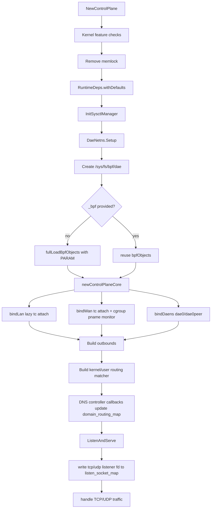
```mermaid
flowchart TD
    Start[NewControlPlane] --> KernelCheck[Kernel feature checks]
    KernelCheck --> Rlimit[Remove memlock]
    Rlimit --> RuntimeDeps[RuntimeDeps.withDefaults]
    RuntimeDeps --> Sysctl[InitSysctlManager]
    Sysctl --> Netns[DaeNetns.Setup]
    Netns --> PinPath[Create /sys/fs/bpf/dae]
    PinPath --> Bpf{_bpf provided?}
    Bpf -->|no| Load[fullLoadBpfObjects with PARAM]
    Bpf -->|yes| Reuse[reuse bpfObjects]
    Load --> Core[newControlPlaneCore]
    Reuse --> Core
    Core --> Lan[bindLan lazy tc attach]
    Core --> Wan[bindWan tc attach + cgroup pname monitor]
    Core --> DaeNs[bindDaens dae0/dae0peer]
    Lan --> Groups[Build outbounds]
    Wan --> Groups
    DaeNs --> Groups
    Groups --> Routing[Build kernel/user routing matcher]
    Routing --> Dns[DNS controller callbacks update domain_routing_map]
    Dns --> Listener[ListenAndServe]
    Listener --> SockMap[write tcp/udp listener fd to listen_socket_map]
    SockMap --> Runtime[handle TCP/UDP traffic]
```

reload ownership 图：

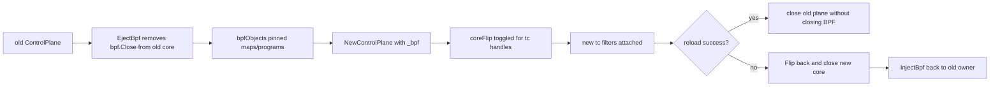
```mermaid
flowchart LR
    Old[old ControlPlane] --> Eject[EjectBpf removes bpf.Close from old core]
    Eject --> BPF[bpfObjects pinned maps/programs]
    BPF --> New[NewControlPlane with _bpf]
    New --> Flip[coreFlip toggled for tc handles]
    Flip --> Attach[new tc filters attached]
    Attach --> Success{reload success?}
    Success -->|yes| CloseOld[close old plane without closing BPF]
    Success -->|no| Rollback[Flip back and close new core]
    Rollback --> Inject[InjectBpf back to old owner]
```

### 22.14 Rust 重构模块建议

建议 Rust 侧模块拆分：

| Rust 模块 | Go 对应 | 备注 |
|---|---|---|
| `dae-kernel-netns` | `netns_utils.go` | netns/veth/route/rule/neigh/sysctl 低层封装。 |
| `dae-kernel-sysctl` | `sysctl.go` | fsnotify watcher 和 expectation rollback。 |
| `dae-ebpf-loader` | `bpf_utils.go` + generated bpf structs | object load、constants、pin path、map incompat retry。 |
| `dae-ebpf-attach` | `control_plane_core.go` LAN/WAN/dae attach | tc filter、qdisc、cgroup attach、defer cleanup。 |
| `dae-control-core` | `controlPlaneCore` | kernel owner、flip、eject/inject、domain routing tracker。 |
| `dae-routing-runtime` | `routing_matcher_builder.go` + userspace matcher | kernel map build 和 userspace mirror 必须共享规则序。 |
| `dae-runtime-control` | `ControlPlane` | DNS/TCP/UDP/outbound/pool 生命周期。 |

实现风险优先级：

1. BPF struct ABI 和 byte order。
2. reload BPF ownership。
3. tc filter handle flip。
4. netns thread pinning。
5. sysctl watcher close 和 rollback。
6. cgroup attach 失败降级。
7. domain routing owner merge。
8. listener fd 写入 sockmap。

### 22.15 本节验证计划

本节需要覆盖：

- generated BPF 对象仍可生成。
- pinned map reuse/incompatible cleanup 测试。
- netns close/idempotent cleanup 测试。
- sysctl manager watcher/rollback 测试。
- domain routing owner merge/remove 测试。
- runtime deps 和 control plane close 测试。
- routing matcher userspace/kernspace 构建测试。

计划命令：

```bash
PATH=/root/.local/go1.25.9/bin:$PATH GOWORK=off make ebpf
PATH=/root/.local/go1.25.9/bin:$PATH GOWORK=off go test -count=1 ./control -run 'Test(RuntimeDeps|ControlPlaneClose|FullLoadBpfObjects|NewDaeNetns|DaeNetnsClose|CloseNsHandle|DeleteMissingNetns|Sysctl|DomainRouting|RoutingMatcher)'
```

结果：通过。

输出摘要：

```text
make ebpf: passed
ok   github.com/daeuniverse/dae/control 6.407s
```

结论：

- BPF generated objects 可以在当前本机环境重新生成。
- pinned map reuse/incompatible cleanup、netns close、sysctl manager、domain routing owner merge、runtime deps、control plane close、routing matcher 的 targeted tests 在本机通过。
- `git diff --stat` 为空，说明 `make ebpf` 没有留下源码或生成物 diff。
- 本节只更新本地 ignored 备忘录，不涉及业务源码修改。

## 23. 追加记录：tproxy.c kernel datapath 状态机

本节目标：

- 记录 `control/kern/tproxy.c` 内部 eBPF datapath 的完整工作流。
- 记录 map/struct ABI、route loop、LAN/WAN tc 程序、dae0/dae0peer 回程、pid/pname、UDP conn state。
- 明确 Rust 重构时需要保留的内核态行为和现有测试覆盖缺口。

证据文件：

- `control/kern/tproxy.c`
- `control/kern/tests/bpf_test.c`
- `control/kern/tests/bpf_test.go`
- `control/kern/tests/bpf_test.h`
- `control/control_plane_core.go`
- `control/control_plane.go`
- `control/bpf_map_stats.go`
- `control/bpf_utils.go`
- `common/consts/ebpf.go`
- `Makefile`
- `.github/workflows/bpf-test.yml`

### 23.1 关键常量和 ABI 同步点

`tproxy.c` 中与 Go/Rust 必须同步的常量：

| C 常量 | 值 | Go 对应 | 含义 |
|---|---:|---|---|
| `TASK_COMM_LEN` | 16 | `consts.TaskCommLen` | process name 固定长度。 |
| `MAX_MATCH_SET_LEN` | `32 * 32` | `consts.MaxMatchSetLen` | routing match set 最大数量；必须是 32 的倍数。 |
| `MAX_LPM_SIZE` | 2048000 | routing LPM map 规格 | 每个 LPM trie 最大 entries。 |
| `MAX_LPM_NUM` | `MAX_MATCH_SET_LEN + 8` | LPM array map 规格 | array-of-maps 容量。 |
| `MAX_DST_MAPPING_NUM` | `65536 * 2` | routing tuples / udp conn state | 路由结果和 UDP 状态容量。 |
| `MAX_TGID_PNAME_MAPPING_NUM` | 8192 | `tgid_pname_map` | tgid -> pname fallback 容量。 |
| `MAX_COOKIE_PID_PNAME_MAPPING_NUM` | 65536 | `cookie_pid_map` | socket cookie -> pid/pname 容量。 |
| `MAX_DOMAIN_ROUTING_NUM` | 65536 | `domain_routing_map` | IP -> domain bitmap 容量。 |
| `MAX_ARG_LEN` | 128 | pid/pname parser | 读取 argv 的最大长度。 |
| `IPV6_MAX_EXTENSIONS` | 8 | IPv6 parser | 最多跳过 8 个 IPv6 extension header。 |
| `TPROXY_MARK` | `0x8000000` | `consts.TproxyMark` | tproxy fwmark 和 `skb->cb[0]` 标记。 |
| `TIMEOUT_UDP_CONN_STATE` | 300s | kernel-only | UDP conn state timer。 |

保留字 outbound：

| C 常量 | 值 | Go 对应 |
|---|---:|---|
| `OUTBOUND_DIRECT` | 0 | `consts.OutboundDirect` |
| `OUTBOUND_BLOCK` | 1 | `consts.OutboundBlock` |
| user-defined min | 2 | `consts.OutboundUserDefinedMin` |
| `OUTBOUND_MUST_RULES` | `0xFC` | `consts.OutboundMustRules` |
| `OUTBOUND_CONTROL_PLANE_ROUTING` | `0xFD` | `consts.OutboundControlPlaneRouting` |
| `OUTBOUND_LOGICAL_OR` | `0xFE` | `consts.OutboundLogicalOr` |
| `OUTBOUND_LOGICAL_AND` | `0xFF` | `consts.OutboundLogicalAnd` |
| `OUTBOUND_LOGICAL_MASK` | `0xFE` | `consts.OutboundLogicalMask` |

MatchType 顺序：

1. `DomainSet`
2. `IpSet`
3. `SourceIpSet`
4. `Port`
5. `SourcePort`
6. `L4Proto`
7. `IpVersion`
8. `Mac`
9. `ProcessName`
10. `Dscp`
11. `Fallback`

Go 侧还有 DNS routing 专用的 `MatchType_MustRules`、`MatchType_Upstream`、`MatchType_QType`，但 kernel `tproxy.c` 只认上述 11 个。

Rust parity 要求：

- enum 顺序、保留 outbound 值、`MAX_MATCH_SET_LEN` 必须从同一处生成或有 ABI test。
- `domain_routing.bitmap` 长度等于 `MAX_MATCH_SET_LEN / 32`，当前是 32 个 `u32`。
- Rust 不能用自然 enum layout 直接映射 C ABI，必须显式 `repr(C)` / `repr(u8)` 并测试 size/alignment。

### 23.2 eBPF maps 总表

| map | 类型 | key | value | max | pin | 作用 |
|---|---|---|---|---:|---|---|
| `outbound_connectivity_map` | HASH | `outbound_connectivity_query` | `u32` | `256*2*2` | no | kernel 判断 outbound 在 l4/ipversion 下是否可用。 |
| `listen_socket_map` | SOCKMAP | `u32` | socket fd | 2 | no | key 0 TCP listener，key 1 UDP listener。 |
| `redirect_track` | LRU_HASH | `redirect_tuple` | `redirect_entry` | 65536 | no | 记录 redirect 前的 ifindex/MAC/from_wan，供 dae0 回程重写。 |
| `tgid_pname_map` | LRU_HASH | `u32 tgid` | `u32[4] pname` | 8192 | yes | pid/pname fallback。 |
| `routing_tuples_map` | LRU_HASH | `tuples_key` | `routing_result` | 131072 | yes | kernel 到 userspace 的路由结果传递，也支持旧 TCP 包查 mark。 |
| `fast_sock` | SOCKHASH | `tuples_key` | socket fd | 65535 | no | 注释说用于 fast redirect，当前主路径未看到 Go 侧显式使用。 |
| `unused_lpm_type` | LPM_TRIE | `lpm_key` | `u32` | 2048000 | no | LPM map 模板，也用于 bpftest。 |
| `lpm_array_map` | ARRAY_OF_MAPS | `u32` | LPM map | `MAX_LPM_NUM` | no | routing matcher 的 IP/MAC/source IP set。 |
| `routing_map` | ARRAY | `u32` | `match_set` | `MAX_MATCH_SET_LEN` | no | kernel routing 规则线性表。 |
| `domain_routing_map` | LRU_HASH | `be32[4] ip` | `domain_routing` | 65536 | no | DNS cache 回填后的 IP -> domain rule bitmap。 |
| `cookie_pid_map` | LRU_HASH | `u64 socket_cookie` | `pid_pname` | 65536 | yes | WAN process-name routing。 |
| `udp_conn_state_map` | HASH | `tuples_key` | `udp_conn_state` | 131072 | no | UDP 方向状态和 300s timer。 |

`BPFMapStats` 会统计：

- `redirect_track`
- `routing_tuples_map`
- `domain_routing_map`
- `udp_conn_state_map`
- `cookie_pid_map`
- `tgid_pname_map`

Rust parity 要求：

- pinned 与非 pinned map 不能混淆。
- stats 读取是运行态观测面，Rust 版本需要暴露等价计数能力，否则 daed/daewing 的运行状态会缺字段或误判。
- `routing_tuples_map` 既是内核态决策缓存，也是 userspace 获取路由结果的控制面接口，不是普通 cache。

### 23.3 核心 struct layout

`tuples_key`：

- `sip union ip6`
- `dip union ip6`
- `sport u16`
- `dport u16`
- `l4proto u8`

IPv4 表示：

- `u6_addr32[2] = htonl(0x0000ffff)`。
- `u6_addr32[3] = IPv4 addr`。
- 等价 IPv4-mapped IPv6。

端口：

- `sport/dport` 在 tuple 中保持 network byte order。
- Go 侧查 `RoutingTuplesMap` 时使用 `common.Htons` 构造 key。

`routing_result`：

- `mark u32`
- `must u8`
- `mac[6]`
- `outbound u8`
- `pname[16]`
- `pid u32`
- `dscp u8`
- C 侧没有显式 padding，但 bpf2go 生成 Go struct 时有尾部 padding。

`match_set`：

- union value 16 bytes：
  - LPM index。
  - port range。
  - l4proto type。
  - ipversion。
  - pname。
  - dscp。
- `not bool`
- `type enum MatchType`
- `outbound u8`
- `must bool`
- `mark u32`

`route_params`：

- `flag[0]`：l4proto type。
- `flag[1]`：ipversion type。
- `flag[2..5]`：pname 或 `_is_wan`。
- `flag[6]`：dscp。
- `l4hdr`：TCP/UDP header。
- `saddr/daddr`：IPv6 16-byte pointer。
- `mac[4]`：把 source MAC 填入末尾 6 bytes，用 LPM 方式匹配。

Rust parity 要求：

- tuple IP/port 字节序是最容易出错的点。
- `route_params.flag` 同时复用 pname 和 `_is_wan`，Rust 如果重写为强类型结构，需要保证传入 route loop 的内存视图和现有行为一致。
- `match_set` 的 union 16 bytes 必须和 Go builder 写入一致。

### 23.4 parse_transport 和 tuple 提取

`parse_transport(skb, link_h_len, ...)`：

- L2 设备：
  - 读取 Ethernet header。
  - `offset += ETH_HLEN`。
- L3 设备：
  - 清空 ethhdr。
  - `ethh->h_proto = skb->protocol`。

IPv4：

- 读取 `iphdr`。
- `offset += iph->ihl * 4`，支持 IPv4 options。
- 只处理 TCP/UDP：
  - TCP 读取 `tcphdr`。
  - UDP 读取 `udphdr`。
  - 其他协议返回 1，调用方通常 `TC_ACT_OK`。
- `ihl = iph->ihl`。

IPv6：

- 读取 `ipv6hdr`。
- 从 `ipv6h->nexthdr` 开始。
- 使用 `bpf_loop(IPV6_MAX_EXTENSIONS)` 跳过：
  - hop-by-hop
  - routing
  - fragment
  - destination options
- extension header 超过限制或异常返回。
- 支持 TCP/UDP/ICMPv6：
  - TCP/UDP 正常读取。
  - ICMPv6 读取 `icmp6hdr`，供 NDP redirect 和忽略分支使用。
  - 其他协议返回 1。

`get_tuples`：

- 清空 `tuples`。
- 写入 l4proto。
- IPv4 转 IPv4-mapped IPv6。
- IPv6 直接拷贝 saddr/daddr。
- 提取 DSCP：
  - IPv4：`(tos & 0xfc) >> 2`。
  - IPv6：`priority/flow_lbl`。
- TCP 使用 TCP source/dest。
- 非 TCP 走 UDP source/dest。

Rust parity 要求：

- IPv6 extension header 跳过逻辑必须保留，尤其 fragment/routing/dst options。
- 非 TCP/UDP 的 IPv4 包不进入 tproxy routing；IPv6 ICMPv6 在部分 hook 被特殊处理。
- DSCP 匹配用解析出的 L3 DSCP，不是 socket metadata。

### 23.5 route loop 状态机

`route()` 初始化：

- `ctx.result = -ENOEXEC`。
- 根据 l4proto 从 TCP/UDP header 提取 host-order source/dest port。
- 如果 `dport == 53 && l4proto == UDP`，设置 DNS bit。
- 准备 source IP、dest IP、MAC 三个 LPM key。
- 运行 `bpf_loop(MAX_MATCH_SET_LEN, route_loop_cb, &ctx, 0)`。

`isdns_must_goodsubrule_badrule` bit 语义：

| bit | 名称 | 含义 |
|---:|---|---|
| `0b1000` | DNS | 当前包是 UDP/53。 |
| `0b100` | must | 前面命中了 `must_rules`，后续 outbound 必须绕过 DNS control-plane reroute。 |
| `0b10` | good_subrule | 当前 subrule 内已有 match_set 命中。 |
| `0b1` | bad_rule | 当前 rule 中至少一个 subrule 不满足。 |

match set 类型：

- `Mac`、`IpSet`、`SourceIpSet`：
  - 从 `lpm_array_map[match_set->index]` 取 LPM map。
  - LPM 命中则 good_subrule。
- `Port`、`SourcePort`：
  - host-order port 落入 range 则命中。
- `L4Proto`：
  - bitmask 与当前 l4proto type 相交则命中。
- `IpVersion`：
  - bitmask 与当前 ipversion 相交则命中。
- `DomainSet`：
  - 使用当前 destination IP 查 `domain_routing_map`。
  - 如果 bitmap 中当前 match set index 为 1，则命中。
- `ProcessName`：
  - 只有 WAN 路径 `_is_wan` 为真时才匹配 pname。
  - LAN 没有 pid/pname。
- `Dscp`：
  - DSCP 相等则命中。
- `Fallback`：
  - 直接 good_subrule。

subrule/rule 结束判断：

- `match_set->outbound != OUTBOUND_LOGICAL_OR` 表示一个 subrule 结束。
- 如果命中状态与 `not` 关系不满足，设置 bad_rule。
- subrule 结束后清空 good_subrule。
- `(match_set->outbound & OUTBOUND_LOGICAL_MASK) != OUTBOUND_LOGICAL_MASK` 表示整条 rule 结束。
- 如果当前 rule 没有 bad_rule：
  - `OUTBOUND_MUST_RULES`：设置 must bit，继续下一条 rule。
  - 普通 outbound：
    - 如果是 DNS 包且没有 must，返回 `OUTBOUND_CONTROL_PLANE_ROUTING`。
    - 否则返回实际 outbound。

route result 编码：

```text
bits 0..7    outbound
bits 8..39   mark
bit  40      must
negative     error
```

Rust parity 要求：

- route loop 是线性匹配，不是树形表达式求值。
- `must_rules` 不直接产生最终 outbound，它设置 must 状态后继续后续规则。
- UDP/53 默认返回 `OUTBOUND_CONTROL_PLANE_ROUTING`，除非 must 已经生效。
- `not` 的判断绑定在 subrule 末尾，不能在每个 match_set 上提前取反。
- 规则顺序、OR/AND sentinel 和 fallback 位置必须完全保持。

### 23.6 redirect 准备和 UDP conn state

`assign_listener`：

- TCP 查 `listen_socket_map[0]`。
- UDP 查 `listen_socket_map[1]`。
- 查不到返回 -1。
- 查到 socket 后 `bpf_sk_assign(skb, sk, 0)`。
- 最后 `bpf_sk_release(sk)`。

`prep_redirect_to_control_plane`：

- L3 设备无 Ethernet header 时：
  - `bpf_skb_change_head` 增加 Ethernet header。
  - 写入 `ethhdr.h_proto = skb->protocol`。
- 把 Ethernet destination MAC 写为 `PARAM.dae0peer_mac`。
- 构造 `redirect_tuple`：
  - IPv4 只填 `u6_addr32[3]`。
  - IPv6 拷贝完整 16 bytes。
- 构造 `redirect_entry`：
  - `ifindex = skb->ifindex`。
  - `from_wan`。
  - 保存原始 source/dest MAC。
- 写入 `redirect_track`。
- 设置：
  - `skb->cb[0] = TPROXY_MARK`。
  - `skb->cb[1] = 0`。
  - 如果 TCP SYN 或 UDP，则 `skb->cb[1] = l4proto`，供 dae0peer ingress sk_assign。

`udp_conn_state_map`：

- key 是 `tuples_key`。
- value：
  - `is_wan_ingress_direction bool`。
  - `bpf_timer timer`。
- `refresh_udp_conn_state_timer`：
  - 已存在则重启 timer。
  - 不存在则 `BPF_NOEXIST` 创建。
  - 初始化 timer callback。
  - `bpf_timer_start(..., TIMEOUT_UDP_CONN_STATE, 0)`。
- timer callback 删除 map entry。
- `copy_reversed_tuples` 用于给回程方向建状态。

UDP 方向含义：

- LAN/WAN ingress 看到回程包时，刷新 reversed tuple，标记 `is_wan_ingress_direction=true`。
- LAN/WAN egress 对新 UDP 包刷新正向 tuple，标记 false。
- egress 如果发现当前 state 是 `is_wan_ingress_direction=true`，认为是 inbound flow 的 replay/outbound，直接放行。

Rust parity 要求：

- `skb->cb[0]` 和 `skb->cb[1]` 是 dae0peer ingress 的控制通道。
- L3 设备补 Ethernet header 是 wire-level 行为，Rust 不能只在 userspace socket 层模拟。
- UDP conn state 依赖 BPF timer，Rust 版如果使用 aya/redbpf 等需要确认 timer 支持和 kernel version gating。

### 23.7 LAN egress

`do_tproxy_lan_egress`：

1. `parse_transport`。
2. 解析失败或非目标协议：`TC_ACT_OK`。
3. 如果本机发出的 ICMPv6 NDP redirect：
   - 条件：`skb->ingress_ifindex == NOWHERE_IFINDEX`、`l4proto == IPPROTO_ICMPV6`、`icmp6_type == NDP_REDIRECT`。
   - 返回 `TC_ACT_SHOT`。
4. UDP：
   - 提取 tuple。
   - 构造 reversed tuple。
   - 刷新 `udp_conn_state_map[reversed]`，标记 `is_wan_ingress_direction=true`。
   - 刷新失败则 drop。
5. 返回 `TC_ACT_PIPE`。

作用：

- LAN egress 主要维护 UDP 回程状态和过滤本机 NDP redirect。
- 不做 routing 决策。
- 使用 `PIPE` 允许后续 qdisc/filter 继续处理。

Rust parity 要求：

- LAN egress 不是无用 hook；它负责 UDP symmetric/replay 判断的状态准备。
- `TC_ACT_PIPE` 与 `TC_ACT_OK` 语义不同，tc filter 链上要保留。

### 23.8 LAN ingress

`do_tproxy_lan_ingress` 是外部 LAN 流量进入透明代理的主入口。

流程：

1. `parse_transport`。
2. 解析失败：`TC_ACT_OK`。
3. ICMPv6：`TC_ACT_OK`。
4. `get_tuples`。
5. TCP socket lookup：
   - 非 SYN 包先查 `bpf_skc_lookup_tcp(..., PARAM.dae_netns_id, 0)`。
   - 如果找到非 LISTEN socket，释放后跳到 `control_plane`。
   - 如果没找到或是 LISTEN，继续。
6. TCP 新连接：
   - 只对 `syn && !ack` 走 route。
   - 非新 TCP：
     - 查 `routing_tuples_map`。
     - 如果有结果，重设 `skb->mark = routing_result->mark`。
     - 返回 `TC_ACT_OK`。
7. UDP：
   - 刷新当前 tuple 的 UDP conn state，标记 false。
   - 如果 state 的 `is_wan_ingress_direction=true`，说明是 inbound flow replay/outbound，直接 `TC_ACT_OK`。
8. 构造 `route_params`：
   - l4proto。
   - ipversion。
   - dscp。
   - source MAC。
   - source/destination IP。
   - LAN 没有 pid/pname。
9. 调 `route()`。
10. route 负数则 drop。
11. 构造 `routing_result` 并写入 `routing_tuples_map`。
12. outbound 分支：
   - `direct`：设置 `skb->mark = mark`，`TC_ACT_OK`。
   - `block`：`TC_ACT_SHOT`。
   - 其他：检查 `outbound_connectivity_map`，不可用时 drop，UDP/53 是例外。
13. `control_plane`：
   - `prep_redirect_to_control_plane(..., from_wan=0)`。
   - `bpf_redirect(PARAM.dae0_ifindex, 0)`。

LAN ingress 的关键行为：

- LAN packet 不记录 pname/pid。
- 所有新连接/UDP 决策都会写 `routing_tuples_map`，userspace 通过同一 tuple 读取结果。
- direct 且 mark 不为 0 时仍然直接放行但设置 mark，让后续 Linux policy routing 生效。
- UDP/53 outbound 不可用时不 drop，交给 DNS/control-plane 特例处理。

Rust parity 要求：

- TCP 非 SYN 包不能重新 route，否则会破坏已有连接。
- 非 SYN 的 direct(mark:N) 要从 `routing_tuples_map` 恢复 mark。
- `bpf_skc_lookup_tcp` 的 dae netns id 是区分已有 transparent socket 的关键。

### 23.9 WAN ingress

`do_tproxy_wan_ingress`：

1. `parse_transport`。
2. 解析失败：`TC_ACT_OK`。
3. UDP：
   - 提取 tuple。
   - 构造 reversed tuple。
   - 刷新 reversed tuple，标记 `is_wan_ingress_direction=true`。
   - 刷新失败 drop。
4. 返回 `TC_ACT_PIPE`。

作用：

- WAN ingress 不 route。
- 只为 UDP 回程建立方向状态。
- 与 LAN egress 对称。

Rust parity 要求：

- WAN ingress 对 UDP state 的更新必须在 WAN egress 判断前可见。
- 保留 `PIPE`，避免改变 filter 链行为。

### 23.10 WAN egress

`do_tproxy_wan_egress` 是本机出站流量透明代理入口。

前置：

- 如果 `skb->ingress_ifindex != NOWHERE_IFINDEX`，说明不是 localhost 发出，直接 `TC_ACT_OK`。
- `parse_transport` 失败直接 `TC_ACT_OK`。
- ICMPv6 直接 `TC_ACT_OK`。
- `get_tuples`。

TCP 分支：

- 新 TCP：`syn && !ack`。
- 新 TCP route 前：
  - `pid_is_control_plane(skb, &pid_pname)`：
    - 如果是控制平面自身连接，直接 `TC_ACT_OK`。
  - 如果有 pid/pname，把 pname 拷入 `params.flag[2..5]`。
  - 填 l4proto、ipversion、dscp、MAC、IP。
  - 调 `route()`。
- 旧 TCP：
  - 查 `routing_tuples_map`。
  - 没有 routing_result 则不影响旧连接或 server connection，`TC_ACT_OK`。
  - 有则读取 outbound/mark/must。
- outbound 分支：
  - direct 且 mark=0：设置 mark 后 `TC_ACT_OK`。
  - block：`TC_ACT_SHOT`。
  - 其他或 direct 但 mark!=0：走 control plane。
- control plane 前：
  - 查 `outbound_connectivity_map`，不可用则 drop，UDP/53 例外逻辑存在但 TCP 分支实际 l4proto 是 TCP。
  - 新 TCP 且需要 control plane 时，把非 direct 或 mark/must 的 routing_result 写入 `routing_tuples_map`。

UDP 分支：

- 填 l4proto/ipversion/dscp。
- `pid_is_control_plane` 为真则 `TC_ACT_OK`。
- 刷新当前 tuple UDP state，标记 false。
- 如果 state 是 `is_wan_ingress_direction=true`，认为是 inbound flow replay/outbound，直接 `TC_ACT_OK`。
- 有 pid/pname 则写入 params。
- 调 `route()`。
- 如果 outbound 非 direct、或 mark 非 0、或 must，写 `routing_tuples_map`。
- direct 且 mark=0：`TC_ACT_OK`。
- block：`TC_ACT_SHOT`。
- 其他：查 outbound connectivity，不可用时 drop，UDP/53 例外。

最终 redirect：

- `prep_redirect_to_control_plane(..., from_wan=1)`。
- `bpf_redirect(PARAM.dae0_ifindex, 0)`。

WAN egress 的关键行为：

- 只有 localhost 出站流量才处理。
- 控制平面自身流量必须直出，避免代理循环。
- process name 只在 WAN 路径生效。
- direct + mark!=0 需要交给 control plane，因为 WAN 路径不能直接改 destination，需要配合 userspace 处理。
- 旧 TCP 缺少 routing_result 时放行，避免影响既有连接。

Rust parity 要求：

- `pid_is_control_plane` 防环必须保留。
- pname routing 是 WAN-only，不能误用于 LAN。
- direct(mark=0) 与 direct(mark!=0) 是两个不同语义。
- 旧 TCP 不可强行重建 route，否则会影响 daemon reload 前的连接。

### 23.11 dae0peer ingress 和 dae0 ingress

`tproxy_dae0peer_ingress`：

- 只接受 `skb->cb[0] == TPROXY_MARK` 的包。
- 不满足则 `TC_ACT_SHOT`。
- 设置 `skb->mark = TPROXY_MARK`。
- `bpf_skb_change_type(skb, PACKET_HOST)`。
- 从 `skb->cb[1]` 读取 l4proto：
  - TCP 新连接和 UDP 会有 l4proto。
  - established TCP 依赖 kernel socket lookup，不调用 `bpf_sk_assign`。
- 如果 l4proto 非 0，调用 `assign_listener`。
- 返回 `TC_ACT_OK`。

作用：

- 把从 LAN/WAN hook redirect 到 `dae0` 的包转成本机 `TPROXY_MARK` 流量。
- 通过 `listen_socket_map` 把新 TCP/UDP 分配给控制平面 listener。
- 配合 netns 中的 fwmark rule/table 2023，把包送进本地 transparent socket。

`tproxy_dae0_ingress`：

- 构造 reversed `redirect_tuple`：
  - IPv4 从 Ethernet 后的 IP header 取 daddr/saddr 反向。
  - IPv6 同理。
- 查 `redirect_track`。
- 没有记录则 `TC_ACT_OK`。
- 找到后：
  - Ethernet source 写回原始 dest MAC。
  - Ethernet dest 写回原始 source MAC。
  - `from_wan=true`：
    - packet type `PACKET_HOST`。
    - redirect flags `BPF_F_INGRESS`。
  - `from_wan=false`：
    - packet type `PACKET_OTHERHOST`。
    - redirect flags 0。
  - `bpf_redirect(redirect_entry->ifindex, flags)`。

Rust parity 要求：

- `redirect_track` 是回程二层重写的核心，不能只保留 routing tuples。
- `from_wan` 同时决定 packet type 和 redirect flags。
- `dae0peer_ingress` 的 drop 条件保护内部 netns，防止非 daed redirect 包误入。

### 23.12 pid/pname 采集

cgroup programs：

- `sock_create`
- `sock_release`
- `connect4`
- `connect6`
- `sendmsg4`
- `sendmsg6`

采集流程：

1. `bpf_get_socket_cookie` 获取 socket cookie。
2. cookie 为 0 返回错误。
3. `cookie_pid_map` 已存在则不重复更新。
4. `get_pid_pname`：
   - `bpf_get_current_task()`。
   - CO-RE 读取 `task->mm->arg_start`。
   - `bpf_core_read_user_str` 读 argv，最多 `MAX_ARG_LEN=128`。
   - `get_real_comm_loop_cb` 找最后一个 `/` 后、空格或 `\0` 前的 basename。
   - 拷贝最多 `TASK_COMM_LEN=16`。
   - 读取 `task->tgid`。
5. 写 `cookie_pid_map[cookie] = pid_pname`。
6. 写 `tgid_pname_map[pid] = pname`。

fallback：

- 如果读取真实 argv 失败：
  - 用 `bpf_get_current_pid_tgid() >> 32` 得 pid。
  - 尝试从 `tgid_pname_map` 找 pname。
  - 找到则写入 `cookie_pid_map`。

release：

- `sock_release` 删除 `cookie_pid_map[cookie]`。

`pid_is_control_plane`：

- 从 `cookie_pid_map` 查 pid/pname。
- 如果 pid 等于 `PARAM.control_plane_pid`，认为是控制平面自身。
- 如果没有映射但 `skb->mark & 0x100`，返回 true，作为防循环兜底。

Rust parity 要求：

- pname 是 basename，不是完整 argv，也不是 comm。
- 读取 argv 失败时要保留 tgid fallback 机制。
- `cookie_pid_map` 是 socket-cookie 维度，不能用 pid 全局替代。

### 23.13 现有 bpftest 覆盖面

`make ebpf-test` 的流程：

- `clean-ebpf` 删除 control/trace/bpftest 生成物。
- `go generate ./control/kern/tests/bpf_test.go`。
- `go clean -testcache`。
- `go test -v ./control/kern/tests/...`。

CI：

- `.github/workflows/bpf-test.yml` 在 PR 涉及 `*.c`、`*.h`、go mod/sum 或 workflow 时运行。
- clang 版本矩阵：15、16、17、18、19。
- 当前 workflow 标记 `continue-on-error: true`，即失败不会阻断整条 CI。

bpftest 当前覆盖：

- destination port match/mismatch。
- destination IP set match/mismatch。
- source IP set match/mismatch。
- source port match/mismatch。
- l4proto match/mismatch。
- ipversion match/mismatch。
- MAC match/mismatch。
- DSCP match/mismatch。
- AND/OR 组合匹配。
- `not` 匹配。
- pinned map reuse。
- pinned map incompatible error。

bpftest 当前主要限制：

- 主要入口是 `tproxy_wan_egress_l2`。
- 主要报文是 IPv4 TCP SYN。
- 没有完整覆盖：
  - `domain_routing_map` / DomainSet。
  - ProcessName。
  - UDP/53 DNS `OUTBOUND_CONTROL_PLANE_ROUTING`。
  - UDP conn state timer 和 replay 分支。
  - LAN ingress/egress 的真实差异。
  - dae0peer `assign_listener`。
  - dae0 回程 `redirect_track` 二层重写。
  - IPv6 extension header。
  - outbound connectivity map drop/UDP DNS exception。

Rust parity 测试建议：

- 复用现有 bpftest corpus 作为第一层 ABI/route-loop 回归。
- 增加 C/Go 或 Rust eBPF fixture：
  - domain bitmap 命中和 miss。
  - DNS UDP/53 非 must 返回 control-plane routing。
  - `must_rules` 后 DNS 不 reroute 到 control plane。
  - process name 只在 WAN 命中。
  - outbound connectivity false drop 和 UDP/53 exception。
  - UDP conn state 的 reversed tuple 和 timer。
  - dae0/dae0peer redirect roundtrip。
  - IPv6 TCP/UDP 和 extension header。

### 23.14 tproxy kernel datapath 图

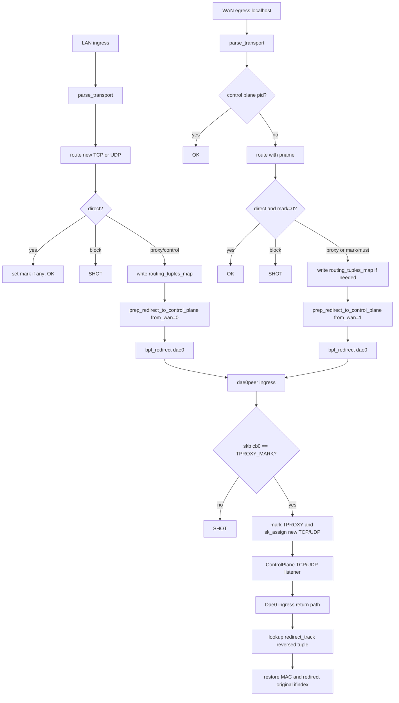
```mermaid
flowchart TD
    LanIn[LAN ingress] --> Parse1[parse_transport]
    Parse1 --> RouteLan[route new TCP or UDP]
    RouteLan --> LanDirect{direct?}
    LanDirect -->|yes| MarkLan[set mark if any; OK]
    LanDirect -->|block| ShotLan[SHOT]
    LanDirect -->|proxy/control| SaveTupleLan[write routing_tuples_map]
    SaveTupleLan --> PrepLan[prep_redirect_to_control_plane from_wan=0]
    PrepLan --> RedirectDae0[bpf_redirect dae0]

    WanEg[WAN egress localhost] --> Parse2[parse_transport]
    Parse2 --> ControlPlaneSelf{control plane pid?}
    ControlPlaneSelf -->|yes| OkSelf[OK]
    ControlPlaneSelf -->|no| RouteWan[route with pname]
    RouteWan --> WanDirect{direct and mark=0?}
    WanDirect -->|yes| OkWan[OK]
    WanDirect -->|block| ShotWan[SHOT]
    WanDirect -->|proxy or mark/must| SaveTupleWan[write routing_tuples_map if needed]
    SaveTupleWan --> PrepWan[prep_redirect_to_control_plane from_wan=1]
    PrepWan --> RedirectDae02[bpf_redirect dae0]

    RedirectDae0 --> DaePeer[dae0peer ingress]
    RedirectDae02 --> DaePeer
    DaePeer --> CbCheck{skb cb0 == TPROXY_MARK?}
    CbCheck -->|no| DropPeer[SHOT]
    CbCheck -->|yes| Assign[mark TPROXY and sk_assign new TCP/UDP]
    Assign --> User[ControlPlane TCP/UDP listener]

    User --> Return[Dae0 ingress return path]
    Return --> Track[lookup redirect_track reversed tuple]
    Track --> Rewrite[restore MAC and redirect original ifindex]
```

### 23.15 Rust 重构风险清单

高风险：

- eBPF struct layout、enum 值和 byte order。
- `routing_tuples_map` pinned lifecycle 和 reload 复用。
- `route()` 的线性 rule/subrule 语义。
- UDP/53 和 `must_rules` 的特殊关系。
- `skb->cb` 控制通道和 dae0peer `sk_assign`。
- `redirect_track` 回程重写。

中风险：

- IPv6 extension parser。
- UDP conn state timer。
- process name argv basename 提取。
- cgroup2 不可用时的降级。
- outbound connectivity map 的 dryrun/IP dial mode 语义。

低风险但必须保留：

- `bpf_printk` debug 宏。
- bpftest generated object 结构。
- `fast_sock` 当前未主用，但 ABI 上仍存在。

### 23.16 本节验证计划

计划命令：

```bash
PATH=/root/.local/go1.25.9/bin:$PATH GOWORK=off make ebpf-test
PATH=/root/.local/go1.25.9/bin:$PATH GOWORK=off make ebpf
PATH=/root/.local/go1.25.9/bin:$PATH GOWORK=off go test -count=1 ./control -run 'Test(PinnedMap|FullLoadBpfObjects|DomainRouting|RoutingMatcher|RuntimeDeps|ControlPlaneClose)'
```

说明：

- `make ebpf-test` 会执行 `clean-ebpf`，只重新生成 bpftest 产物。
- 因此跑完 bpftest 后需要再跑 `make ebpf`，恢复 control/trace 正常 BPF generated objects。
- `make ebpf` 会清掉 bpftest generated objects，因此不能在 `make ebpf` 后直接 `go test ./control/kern/tests/...`；bpftest 必须通过 `make ebpf-test` 执行。

结果：通过。

输出摘要：

```text
make ebpf-test:
  PASS
  ok   github.com/daeuniverse/dae/control/kern/tests 3.375s

make ebpf: passed

go test ./control:
  ok   github.com/daeuniverse/dae/control 6.394s
```

bpftest 实际运行用例：

```text
AndMatch1
AndMatch2
AndMismatch
DportMatch
DportMismatch
DscpMatch
DscpMismatch
IpsetMatch
IpsetMismatch
IpversionMatch
IpversionMismatch
L4protoMatch
L4protoMismatch
MacMatch
MacMismatch
NotMatch
NotMismtach
SourceIpsetMatch
SourceIpsetMismatch
SportMatch
SportMismatch
TestPinnedMapReuse
TestPinnedMapIncompatibleError
```

验证备注：

- 曾尝试在 `make ebpf` 后直接执行 `go test ./control/kern/tests/...`，失败原因是 `bpftestObjects` / `loadBpftestObjects` generated symbols 已被 `make ebpf` 的 `clean-ebpf` 清除。
- 该失败属于验证命令顺序问题，不是业务逻辑或 BPF 程序回归。
- 当前最终状态已经重新执行 `make ebpf`，`git diff --stat` 为空。
- 本节只更新本地 ignored 备忘录，不涉及业务源码修改。

## 24. 追加记录：routing matcher / domain matcher / geodata optimizer 规则生成链路

本节目标：

- 记录 `.dae` routing rule 如何从 config AST 变成 kernel `routing_map`、`lpm_array_map`、`domain_routing_map` 所需 bitmap，以及 userspace `RoutingMatcher`。
- 记录 optimizer 顺序、函数参数解析、outbound/must/mark 编码、domain matcher 实现和 geodata 展开。
- 给 Rust 重构保留规则生成端与第 23 节 kernel 消费端的 ABI 和行为对齐要求。

证据文件：

- `control/routing_matcher_builder.go`
- `control/routing_matcher_userspace.go`
- `control/routing_matcher_userspace_test.go`
- `component/routing/matcher_builder.go`
- `component/routing/function_parser.go`
- `component/routing/function_parser_test.go`
- `component/routing/optimizer.go`
- `component/routing/domain_matcher.go`
- `component/routing/domain_matcher/ahocorasick_slimtrie.go`
- `component/routing/domain_matcher/bruteforce.go`
- `component/routing/domain_matcher/go_regexp_nfa.go`
- `component/routing/domain_matcher/ahocorasick_slimtrie_test.go`
- `pkg/trie/trie.go`
- `pkg/trie/trie_test.go`
- `pkg/geodata/decode.go`
- `pkg/geodata/geodata.go`
- `common/assets/assets.go`
- `common/consts/routing.go`
- `common/consts/ebpf.go`

### 24.1 总体链路

`NewControlPlane` 中 routing 规则生成顺序：

1. `routing.ApplyRulesOptimizers(routingA.Rules, ...)`。
2. 创建 `RoutingMatcherBuilder`。
3. `RulesBuilder.Apply(rules)` 把 AST rule 展开成 `bpfMatchSet` 序列。
4. `RoutingMatcherBuilder.BuildKernspace()`：
   - 构造 LPM maps。
   - 写 `lpm_array_map`。
   - 批量写 `routing_map`。
5. `RoutingMatcherBuilder.BuildUserspace()`：
   - 构造 domain matcher。
   - 构造 userspace LPM trie。
   - 保存同一份 `bpfMatchSet` 序列。
6. DNS controller 的 `NewCache` 用 userspace domain matcher 生成 `DomainBitmap`。
7. DNS cache callback 把 IP -> `DomainBitmap` 写入 `domain_routing_map`。
8. kernel `route()` 通过 `domain_routing_map[dest_ip]` 查询 DomainSet 是否命中。
9. userspace `Route()` / `ChooseDialTarget()` 场景直接调用 `RoutingMatcher.Match()`。

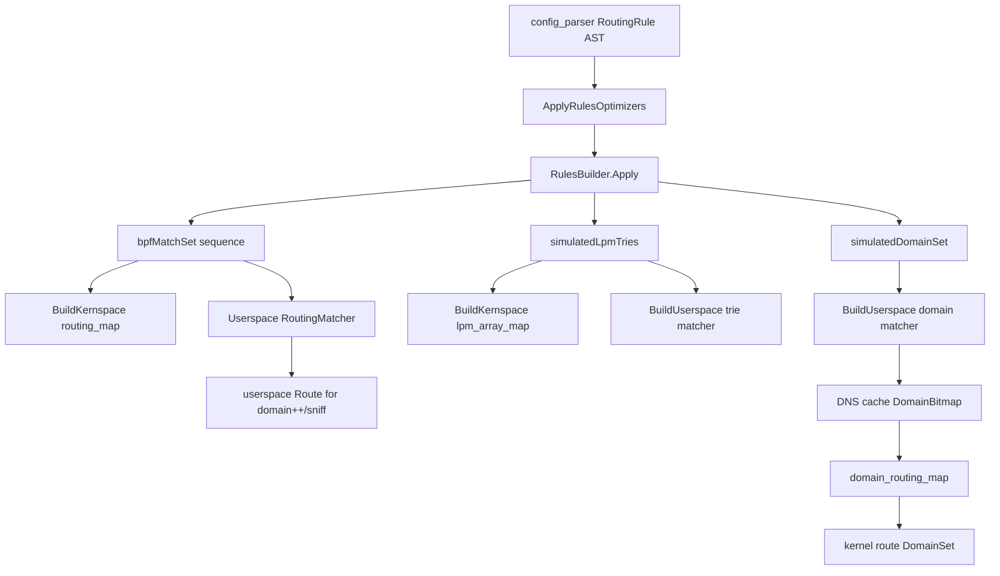
```mermaid
flowchart TD
    Config[config_parser RoutingRule AST] --> Opt[ApplyRulesOptimizers]
    Opt --> RB[RulesBuilder.Apply]
    RB --> Sets[bpfMatchSet sequence]
    RB --> LPM[simulatedLpmTries]
    RB --> DomainSets[simulatedDomainSet]
    Sets --> Kernel[BuildKernspace routing_map]
    LPM --> KernelLpm[BuildKernspace lpm_array_map]
    DomainSets --> USDomain[BuildUserspace domain matcher]
    LPM --> USLpm[BuildUserspace trie matcher]
    Sets --> USMatcher[Userspace RoutingMatcher]
    USDomain --> DnsBitmap[DNS cache DomainBitmap]
    DnsBitmap --> DomainMap[domain_routing_map]
    DomainMap --> KernelRoute[kernel route DomainSet]
    USMatcher --> UserRoute[userspace Route for domain++/sniff]
```

Rust parity 要求：

- kernel matcher 与 userspace matcher 必须共享相同 `bpfMatchSet` 顺序。
- `DomainBitmap` 的 bit index 必须等于对应 `bpfMatchSet` 在 `routing_map` 中的 index。
- LPM index 必须同时对应 `lpm_array_map[index]` 和 userspace `lpmMatcher[index]`。

### 24.2 optimizer 顺序

当前调用顺序：

```go
routing.ApplyRulesOptimizers(
    routingA.Rules,
    &routing.AliasOptimizer{},
    &routing.DatReaderOptimizer{Logger: log, LocationFinder: locationFinder},
    &routing.MergeAndSortRulesOptimizer{},
    &routing.DeduplicateParamsOptimizer{},
)
```

`ApplyRulesOptimizers`：

- 先 `DeepCloneRules`，不直接修改原 AST。
- 按传入顺序逐个 optimizer 执行。
- 任一 optimizer 返回错误则停止。

顺序语义：

| 顺序 | Optimizer | 作用 |
|---:|---|---|
| 1 | `AliasOptimizer` | 先统一函数名和 domain key，确保后续 dat/merge 看到规范形式。 |
| 2 | `DatReaderOptimizer` | 展开 geosite/geoip/ext 参数，生成真实 `Param` 列表。 |
| 3 | `MergeAndSortRulesOptimizer` | function 排序、单函数同 outbound 规则合并、param 排序。 |
| 4 | `DeduplicateParamsOptimizer` | 去重最终 param，减少 matcher 输入。 |

Rust parity 要求：

- optimizer 顺序不可随意调整；特别是 dat 展开必须发生在 merge/sort/dedup 之前。
- deep clone 行为需要保留，避免后续 debug/export 看到已变异原配置。

### 24.3 AliasOptimizer

函数别名：

| 原始函数名 | 规范函数名 |
|---|---|
| `dport` | `port` |
| `dip` | `ip` |

domain key 别名：

| 原始 key | 规范 key |
|---|---|
| 空 key | `suffix` |
| `domain` | `suffix` |
| `contains` | `keyword` |
| 其他 | 保持不变 |

只在 `function.Name == "domain"` 时重写 domain key。

Rust parity 要求：

- 默认 `domain(example.com)` 等价 `domain(suffix: example.com)`。
- `contains` 必须等价 `keyword`。
- alias 只作用于 routing function，不应污染 DNS qname/qtype/upstream matcher。

### 24.4 DatReaderOptimizer 和资产查找

支持参数：

| param key | function | 行为 |
|---|---|---|
| `geosite` | `domain` / 其他函数中出现也按参数处理 | 从 `geosite.dat` 读取 code。 |
| `geoip` | `ip` / 其他函数中出现也按参数处理 | 从 `geoip.dat` 读取 code。 |
| `ext` | `domain` 或 `qname` | 从指定外部 geosite dat 读取。 |
| `ext` | `ip` | 从指定外部 geoip dat 读取。 |

`geosite` 展开：

- 文件名无 `.dat` 后缀时自动补 `.dat`。
- code 支持 `code@attr`：
  - `strings.Cut(code, "@")`。
  - 有 attr 时只保留包含同名 attribute 的 domain item。
- `geodata.Domain` 类型映射：
  - `Domain_Full` -> `Param{Key:"full", Val:item.Value}`。
  - `Domain_RootDomain` -> `Param{Key:"suffix", Val:item.Value}`。
  - `Domain_Plain` -> `Param{Key:"keyword", Val:item.Value}`。
  - `Domain_Regex` -> `Param{Key:"regex", Val:item.Value}`。

`geoip` 展开：

- 文件名无 `.dat` 后缀时自动补 `.dat`。
- `UnmarshalGeoIp` 读取指定 code。
- `InverseMatch=true` 直接报错：`not support inverse match yet`。
- 每个 CIDR：
  - `netip.AddrFromSlice(item.Ip)`。
  - `netip.PrefixFrom(ip, int(item.Prefix)).String()`。
  - 输出 `Param{Key:"", Val:prefix}`。

`ext`：

- `param.Val` 用 `strings.SplitN(param.Val, ":", 2)`。
- 对 `domain` / `qname` 调 `loadGeoSite(fields[0], fields[1])`。
- 对 `ip` 调 `loadGeoIp(fields[0], fields[1])`。
- 其他 function 报 `unsupported extension file extraction`。
- 当前代码假定 `ext` 值形如 `file:code`，没有显式长度检查；Rust 重构可以保留错误语义或补明确错误，但要注意兼容。

资产查找 `LocationFinder`：

- 结果缓存 5 秒。
- 先清理过期缓存。
- 命中缓存直接返回 path。
- 搜索路径：
  - 如果 `DAE_LOCATION_ASSET` 非空：
    - 先查该目录。
    - 查 `externDirs`。
    - 非 Windows 查 `/usr/local/share/dae`、`/usr/share/dae`。
    - 再追加一次 `externDirs`。
  - 如果 `DAE_LOCATION_ASSET` 为空：
    - 查 `externDirs`。
    - 非 Windows 查 XDG data dirs 下的 `dae` 子目录。
    - Windows fallback 当前目录。
- 当前本机存在：
  - `/usr/local/share/dae/geosite.dat -> /root/daed/geosite.dat`
  - `/usr/local/share/dae/geoip.dat -> /root/daed/geoip.dat`

geodata decoder：

- `Decode(filename, code)` 用流式方式从 dat 中定位指定 code 的 protobuf bytes。
- `errCodeNotFound` 返回明确 code not found。
- 如果流式 decode 判断文件结构异常，会 fallback 到 `os.ReadFile` 读取整文件再遍历列表。

Rust parity 要求：

- dat 读取最好也做按 code 流式解码，避免完整读取大型 geosite/geoip 文件。
- `code@attr` 过滤必须保留。
- asset search 和 5s cache 会影响 reload 后 dat 文件替换行为，不能无缓存或永久缓存。

### 24.5 MergeAndSortRulesOptimizer

该 optimizer 做三件事。

第一，排序每条 rule 的 `AndFunctions`：

- 使用 `Function.Name` 字符串升序。
- `sort.SliceStable` 保持同名函数原相对顺序。
- 这会改变用户书写的 AND function 顺序，但保持逻辑等价，并让输出稳定。

第二，合并相邻单函数规则：

可合并条件：

- 当前 merging rule 只有一个 function。
- 下一条 rule 只有一个 function。
- function name 相同。
- function `Not` 相同。
- outbound 的 `String(true,false,true)` 相同。

合并动作：

- 把下一条 rule 的 function params append 到当前 merging rule 的 function params。

注意：

- 只合并相邻规则，不是全局按 key 分桶。
- 只合并单函数规则，多函数 AND rule 不合并。

第三，排序每个 function 的 params：

- `ip` / `sip`：
  - IPv4 在前，IPv6 在后。
  - 同版本按字符串排序。
- 其他 function：
  - 先按 `Param.Key` 排序。
  - key 相同按 `Param.Val` 排序。

Rust parity 要求：

- 排序影响最终 `bpfMatchSet` index，因此影响 domain bitmap bit 位。
- 只要 Rust 生成的顺序与 Go 不一致，DNS domain routing 就会错位。

### 24.6 DeduplicateParamsOptimizer

`deduplicateParams`：

- 使用 `Param.String(true,false)` 作为去重 key。
- 保留第一次出现的 param。
- 后续重复项丢弃。

Rust parity 要求：

- 去重发生在排序之后。
- 使用 Param 字符串形式会包含 key/value 的格式细节；Rust 最好按同样结构化含义去重并加 fixture 对齐。

### 24.7 RulesBuilder：AST 到逻辑 sentinel

`RulesBuilder.Apply` 输入是 optimized `[]*RoutingRule`。

每条 rule：

1. 打 debug：`rule.String(true,false,false)`。
2. `ParseOutbound(&rule.Outbound)` 得到：
   - `Name`。
   - `Mark`。
   - `Must`。
3. 遍历 `rule.AndFunctions`。
4. 找到 function parser。
5. `groupParamValuesByKey(f.Params)`：
   - 用 map 聚合同 key values。
   - 用 `keyOrder` 保留 key 第一次出现顺序。
6. 遍历每个 key group。
7. 为当前 key group 计算 `overrideOutbound`：
   - 默认 `OUTBOUND_LOGICAL_OR`。
   - 如果是当前 function 的最后一个 key group，则变为 `OUTBOUND_LOGICAL_AND`。
   - 如果同时也是当前 rule 的最后一个 function，则变为真实 outbound name。
8. 调 function parser callback 生成一个或多个 `bpfMatchSet`。

这套编码对应 kernel route loop：

- 同一 function 内不同 key group 是 OR。
- 不同 AndFunction 是 AND。
- 真实 outbound 只出现在整条 rule 的最后一个 match set。

例子：

```dae
domain(suffix:a.com, full:b.com) && port(443, 8443) -> proxy
```

可能编码为：

```text
DomainSet suffix -> OUTBOUND_LOGICAL_OR
DomainSet full   -> OUTBOUND_LOGICAL_AND
Port 443         -> OUTBOUND_LOGICAL_OR
Port 8443        -> proxy
```

Rust parity 要求：

- OR/AND sentinel 的生成必须从 key group 和 function 位置推导，不能只从 AST 文本位置推导。
- `groupParamValuesByKey` 保留首次 key 顺序，这会影响 bit index。

### 24.8 outbound 解析

`ParseOutbound`：

- 默认：
  - `Name = rawOutbound.Name`
  - `Mark = 0`
  - `Must = false`

支持 outbound params：

| param key | value | 行为 |
|---|---|---|
| `mark` | `ParseUint(val, 0, 32)` | 写 `Outbound.Mark`。支持 `0x...`。 |
| 空 key | `must` | `Outbound.Must=true`。 |

错误：

- 空 key 但 value 不是 `must`：`unknown outbound param`。
- 非空未知 key：`unknown outbound param key`。
- mark parse 失败：`failed to parse mark`。

`RoutingMatcherBuilder.outboundToId`：

- 保留名称：
  - `<OR>` -> `OutboundLogicalOr`。
  - `<AND>` -> `OutboundLogicalAnd`。
  - `must_rules` -> `OutboundMustRules`。
- 其他名称必须在 `outboundName2Id` 中存在。
- 未找到时报错：`outbound (group) "..." not found; please define it in section "group"`。

Rust parity 要求：

- outbound group index 从 outbounds 顺序来，direct=0、block=1、用户 group 从 2 开始。
- `must_rules` 是 outbound 名称层面的保留语义，不是普通 group。

### 24.9 FunctionParser 解析矩阵

| function | parser | 输入 | 输出 |
|---|---|---|---|
| `domain` | `PlainParserFactory` | key/value group | `DomainSet` + `MatchType_DomainSet` |
| `ip` | `IpParserFactory` | IP/CIDR | destination LPM trie + `MatchType_IpSet` |
| `sip` | `IpParserFactory` | IP/CIDR | source LPM trie + `MatchType_SourceIpSet` |
| `port` | `PortRangeParserFactory` | port/range | one or more `MatchType_Port` |
| `sport` | `PortRangeParserFactory` | port/range | one or more `MatchType_SourcePort` |
| `l4proto` | `L4ProtoParserFactory` | `tcp`/`udp` | bitmask `L4ProtoType` |
| `ipversion` | `IpVersionParserFactory` | `4`/`6` | bitmask `IpVersionType` |
| `mac` | `MacParserFactory` | MAC string | MAC as 128-bit LPM trie key |
| `pname` | `ProcessNameParserFactory` | process basename | `[16]byte` values |
| `dscp` | `UintParserFactory[uint8]` | uint8 | DSCP values |

`parsePrefixes`：

- 如果没有 `/`：
  - parse as address。
  - IPv4 -> `/32`。
  - IPv6 -> `/128`。
- 如果有 `/`：
  - parse as prefix。

`L4ProtoParserFactory`：

- `tcp` 设置 TCP bit。
- `udp` 设置 UDP bit。
- 其他 value 当前被忽略，不报错。

`IpVersionParserFactory`：

- `4` 设置 IPv4 bit。
- `6` 设置 IPv6 bit。
- 其他 value 当前被忽略，不报错。

`ProcessNameParserFactory`：

- 超过 16 bytes 时记录 info，并截断到 16 bytes。
- 使用 `copy` 写入 `[16]byte`。
- 不做 UTF-8/字符边界处理，按 byte 截断。

Rust parity 要求：

- bare IP -> host prefix 的行为必须保留。
- l4proto/ipversion 未知值当前是静默忽略，这可能不是理想行为，但要作为兼容点记录。
- pname 按 bytes 截断到 16，不是 rune/字符。

### 24.10 RoutingMatcherBuilder：bpfMatchSet 生成

Builder 状态：

- `rules []bpfMatchSet`
- `simulatedLpmTries [][]netip.Prefix`
- `simulatedDomainSet []routing.DomainSet`
- `fallback *routing.Outbound`

`addDomain`：

- 支持 key：
  - `regex`
  - `full`
  - `keyword`
  - `suffix`
- 保存 `routing.DomainSet`：
  - `Key`
  - `RuleIndex = len(b.rules)`
  - `Domains = values`
- 追加一个 `bpfMatchSet`：
  - `Type = MatchType_DomainSet`
  - `Outbound/Mark/Must` 来自 override outbound。

`addIp` / `addSourceIp`：

- 当前 values 作为一个 LPM trie。
- trie index 是 `len(simulatedLpmTries)`。
- 追加到 `simulatedLpmTries`。
- `bpfMatchSet.Value[0:4]` little-endian 写 trie index。
- 类型分别是 `IpSet` / `SourceIpSet`。

`addSourceMac`：

- 每个 MAC 转成 16-byte 地址：
  - `copy(addr16[10:], mac[:])`。
  - prefix `/128`。
- 后续与 IP 一样通过 LPM trie 匹配。
- kernel route loop 使用 `params.mac` 作为 128-bit key。

`addPort` / `addSourcePort`：

- 每个 port range 生成一个 `bpfMatchSet`。
- 多个 range 内部用 `OUTBOUND_LOGICAL_OR` 串起来。
- 最后一个 range 使用 override outbound。
- port range 用 `_bpfPortRange.Encode()`：
  - little-endian `PortStart`。
  - little-endian `PortEnd`。

`addProcessName` / `addDscp`：

- 每个 value 生成一个 `bpfMatchSet`。
- 多值内部用 `OUTBOUND_LOGICAL_OR`。
- 最后一个 value 使用 override outbound。

`addL4Proto` / `addIpVersion`：

- bitmask 写入 `Value[0]`。
- 一个 match set 表示多个 proto/version。

`addFallback`：

- `config.FunctionOrStringToFunction(fallbackOutbound)`。
- `routing.ParseOutbound`。
- 追加 `MatchType_Fallback`。
- fallback 必须是最终 match set。

Rust parity 要求：

- 对 domain/ip/mac/l4proto/ipversion，多个 values 是单 match set 或单 trie；对 port/pname/dscp，多个 values 是多个 OR match sets。
- 这个差异会影响 `RuleIndex` 和 domain bitmap，不可统一抽象掉。
- LPM index 写入 little-endian 4 bytes，必须保留。

### 24.11 BuildKernspace

`BuildKernspace`：

1. 遍历 `simulatedLpmTries`。
2. 每个 CIDR 转 `_bpfLpmKey`：
   - `PrefixLen = prefix.Bits()`。
   - IPv4 额外 `+96`，匹配 IPv4-mapped IPv6。
   - `Data = Ipv6ByteSliceToUint32Array(ip.As16())`。
3. `bpfObjects.newLpmMap(keys, values)` 创建 LPM map。
4. `LpmArrayMap.Update(uint32(i), m, ebpf.UpdateAny)`。
5. 关闭临时 map fd。
6. 检查最后一条 rule 必须是 `MatchType_Fallback`。
7. 生成 `routingsKeys = ARangeU32(len(b.rules))`。
8. `BpfMapBatchUpdate(bpf.RoutingMap, routingsKeys, b.rules, UpdateAny)`。

`newLpmMap`：

- MapSpec 复制 `UnusedLpmType` 的 flags、max entries、key/value size。
- 批量写 keys/values。
- 如果 batch update 失败，关闭 map 后返回错误。

Rust parity 要求：

- LPM map 是动态创建后塞进 array-of-maps，不是预定义固定 map。
- 写入 array-of-maps 后关闭 fd，但内核 map 引用仍由 array 持有。
- fallback rule 校验必须存在，避免 kernel route 返回 `-EPERM`。

### 24.12 BuildUserspace

`BuildUserspace`：

1. 创建 `domain_matcher.NewAhocorasickSlimtrie(log, MaxMatchSetLen)`。
2. 遍历 `simulatedDomainSet`：
   - `domainMatcher.AddSet(domains.RuleIndex, domains.Domains, domains.Key)`。
3. 遍历 `simulatedLpmTries`：
   - `trie.NewTrieFromPrefixes(prefixes)`。
   - append 到 `lpmMatcher`。
4. `domainMatcher.Build()`。
5. 检查最后 match set 是 fallback。
6. 返回：
   - `lpmMatcher`
   - `domainMatcher`
   - `matches = b.rules`

userspace `RoutingMatcher.Match`：

- 输入：
  - source/dest 16-byte IP。
  - source/dest port。
  - ipVersion。
  - l4proto。
  - domain。
  - processName。
  - tos/dscp。
  - mac 16-byte。
- 如果 domain 非空：
  - 用栈上 `[32]uint32` 作为 bitmap 缓冲。
  - `MatchDomainBitmapInto(domain, stack[:])`。
- LPM 匹配使用 `routingMatchBin128Cache` 延迟把 source/dest/mac 转成 128-bit `0/1` string。
- route loop 逻辑标注为 “modified from kern/tproxy.c; please keep sync”。

与 kernel route 的差异：

- userspace matcher没有 UDP/53 DNS control-plane bit。
- `must_rules` 命中后设置 `must=true` 并继续下一条 rule。
- 返回普通 outbound 时，如果 `must=true`，返回的 `must` 会被置 true。
- processName 匹配条件是 `processName[0] != 0 && match.Value == processName`，没有显式 WAN flag；调用方传入的 routingResult 对 LAN 通常为空。

Rust parity 要求：

- Rust userspace matcher 应该从同一份 match-set IR 构建，避免和 kernel matcher 分叉。
- `MatchDomainBitmapInto` 的复用缓冲可以减少分配，Rust 也应保留类似按需栈/对象池方案。

### 24.13 domain matcher 实现

接口：

```go
type DomainMatcher interface {
    AddSet(bitIndex int, patterns []string, typ consts.RoutingDomainKey)
    Build() error
    MatchDomainBitmap(domain string) []uint32
    MatchDomainBitmapInto(domain string, bitmap []uint32) []uint32
}
```

当前生产实现：`AhocorasickSlimtrie`。

内部结构：

- `ac []*ahocorasick.Matcher`：keyword 匹配。
- `trie []*trie.Trie`：full/suffix 匹配。
- `regexp [][]*regexp.Regexp`：regex 匹配。
- `validAcIndexes` / `validTrieIndexes` / `validRegexpIndexes`：只遍历有内容的 bit index。
- `toBuildAc` / `toBuildTrie`：Build 前临时数据，Build 后释放。

pattern 编码：

| domain key | 编码 |
|---|---|
| `full` | 验证字符后加入 trie pattern `^domain$`。 |
| `suffix`，值以 `.` 开头 | 加入 `domain$`，只匹配子域，不匹配 apex。 |
| `suffix`，值不以 `.` 开头 | 加入 `.domain$` 和 `^domain$`，同时匹配子域和 apex。 |
| `keyword` | 加入 AC pattern 原始 bytes。 |
| `regex` | `regexp.Compile` 后保存。 |

匹配流程：

1. `prepareDomainBitmap`：
   - bitmap 长度为 bitLength/32 向上取整。
   - 复用传入 slice 或分配新 slice。
   - `clear(bitmap)`。
2. domain 规范化：
   - `strings.ToLower`。
   - `strings.TrimSuffix(domain, ".")`。
3. suffix/full：
   - `suffixTrieDomain = ToSuffixTrieString("^" + domain)`。
   - 遍历 `validTrieIndexes`。
   - `trie.HasPrefix(suffixTrieDomain)` 命中则置 bit。
4. keyword：
   - `acDomain = "^" + domain + "$"`。
   - 遍历 `validAcIndexes`。
   - `ac.Contains([]byte(acDomain))` 命中则置 bit。
5. regex：
   - 遍历 `validRegexpIndexes`。
   - 任一 regexp match domain 则置 bit。

字符限制：

- full/suffix 使用 `ValidDomainChars = 0-9 a-z - . ^ _`。
- full/suffix 中出现非法字符会 warn 并跳过该 pattern。
- matcher 不验证待匹配 domain，代码注释明确避免验证。

Build：

- 对每个 AC bitIndex 构造 ahocorasick matcher。
- 对每个 trie bitIndex：
  - 先 `ToSuffixTrieStrings` 反转。
  - `trie.NewTrie(toBuild, ValidDomainChars)`。
- regexp 只记录有效 index。
- 释放 `toBuildAc` 和 `toBuildTrie`。

Rust parity 要求：

- suffix 的 “以点开头只匹配子域” 语义必须保留。
- full/suffix trie 是反向字符串 prefix 查询，不是普通后缀遍历。
- keyword AC pattern 当前没有在 AddSet 中 lower-case，匹配 domain 会 lower-case；配置/geo 数据应保持小写，Rust 不要无意改变大小写语义。

### 24.14 trie 实现

`pkg/trie.Trie` 是静态 succinct trie：

- 输入 keys 会先 `common.Deduplicate`，再 `sort.Strings`。
- 检查所有字符必须在 `ValidChars` 内。
- 使用：
  - `leaves`
  - `labelBitmap`
  - compact labels
  - rank/select compact bit list
- `HasPrefix(word)`：
  - 按字符走 trie。
  - 如果当前 node 是 leaf，立即返回 true。
  - 遇到非法字符返回 false。
  - word 结束后返回当前 node 是否 leaf。

`Prefix2bin128`：

- `netip.Prefix` 转二进制字符串。
- IPv4 prefix bits +96，匹配 IPv4-mapped IPv6。
- 按 IP bytes 从高位到低位写 `0/1`。

用途：

- routing IP/source IP/MAC LPM 在 userspace 通过这个 trie 匹配。
- domain suffix/full 通过反转后的 domain string 匹配。

Rust parity 要求：

- 生产 Rust 不一定要复刻 succinct trie 结构，但匹配结果和 memory profile 要接近。
- 对于大 geosite，domain matcher 内存占用是重点；Rust 版本应避免每条规则一个 regex 的高内存实现。

### 24.15 与 DNS domain_routing_map 的关系

domain rule 不是 kernel 直接匹配域名。

实际链路：

1. routing builder 记录每个 DomainSet 的 `RuleIndex = len(b.rules)`。
2. userspace domain matcher 用同一个 `RuleIndex` 作为 bit index。
3. DNS controller `NewCache`：
   - `DomainBitmap = plane.routingMatcher.domainMatcher.MatchDomainBitmap(fqdn)`。
4. `BatchUpdateDomainRouting`：
   - 把 DNS cache IP 转成 `[4]uint32` key。
   - 把 `DomainBitmap` 拷贝到 `bpfDomainRouting.Bitmap`。
   - 写入 `domain_routing_map`。
5. kernel route loop 到 `MatchType_DomainSet`：
   - 用 destination IP 查 `domain_routing_map`。
   - 如果 bitmap 当前 match set index 为 1，DomainSet 命中。

结果：

- kernel 只知道 IP -> domain bitmap，不知道原始域名。
- 如果 DNS cache 缺失或 IP 来自非 dae DNS，domain rule 在 kernel 中不会命中。
- userspace `Route()` 在 sniff/domain++ 场景可以直接用 domain string 重新匹配。

Rust parity 要求：

- DomainSet bit index 必须稳定。
- DNS cache restore 和 domain matcher restore 要能重新生成同样 bitmap。
- 不要把 domain matching 放进 kernel；当前架构是 DNS/userspace 预计算。

### 24.16 当前测试覆盖

已有 tests：

- `component/routing/function_parser_test.go`
  - `TestParsePrefixesUsesHostPrefixForBareAddresses`
  - 验证 bare IPv4 -> `/32`、bare IPv6 -> `/128`。
- `component/routing/domain_matcher/ahocorasick_slimtrie_test.go`
  - `TestAhocorasickSlimtrie`
  - 用 geosite 展开的 domain sets，对比 Bruteforce 和 AhocorasickSlimtrie 10000 次随机样本。
  - 验证 `MatchDomainBitmapInto` 复用 bitmap 与普通匹配一致。
- `pkg/trie/trie_test.go`
  - 验证反向 suffix trie 对 `.cn`、`^cn`、`_https._tcp...` 等 case。
- `control/routing_matcher_userspace_test.go`
  - fallback。
  - domain suffix。
  - IP + port AND。

当前测试缺口：

- optimizer 没有独立单元测试：
  - alias。
  - merge/sort。
  - deduplicate。
  - ext 缺冒号错误。
  - geosite attr filtering。
  - geoip inverse match error。
- `RulesBuilder.Apply` 没有直接测试 OR/AND sentinel 编码。
- `RoutingMatcherBuilder.BuildKernspace` 没有轻量 fake BPF map 测试。
- userspace matcher 没有覆盖：
  - `must_rules`。
  - mark。
  - source port。
  - l4proto/ipversion。
  - process name。
  - dscp。
  - MAC。
  - not。
- domain matcher 没有专门覆盖大小写 pattern 行为。

Rust fixture 建议：

- 建一个独立 IR golden 测试：
  - 输入 `.dae` routing 文本。
  - 输出 optimized rules。
  - 输出 `bpfMatchSet` 列表。
  - 输出 LPM trie index。
  - 输出 DomainSet bit index。
- 用同一 golden 同时验证 kernel map builder 和 userspace matcher。

### 24.17 本节验证计划

计划命令：

```bash
PATH=/root/.local/go1.25.9/bin:$PATH GOWORK=off go test -count=1 ./component/routing ./component/routing/domain_matcher ./pkg/trie ./control -run 'Test(ParsePrefixes|AhocorasickSlimtrie|Trie|RoutingMatcherUserspace)'
```

说明：

- 当前本机 `/usr/local/share/dae/geosite.dat` 和 `geoip.dat` 是指向 `/root/daed` 的 symlink，domain matcher test 可读取 geosite 数据。
结果：通过。

输出摘要：

```text
ok   github.com/daeuniverse/dae/component/routing 0.002s
ok   github.com/daeuniverse/dae/component/routing/domain_matcher 34.182s
ok   github.com/daeuniverse/dae/pkg/trie 0.006s
ok   github.com/daeuniverse/dae/control 0.003s
```

结论：

- `parsePrefixes` bare address host-prefix 行为通过。
- `AhocorasickSlimtrie` 与 Bruteforce 的 geosite 随机样本 bitmap 对齐通过。
- suffix trie 基础行为通过。
- userspace routing matcher fallback/domain/ip+port targeted tests 通过。
- 本节只更新本地 ignored 备忘录，不涉及业务源码修改。

## 25. 追加记录：outbound dialer / protocol adapters / group selection / health check 链路

本节目标：

- 补齐 daenew outbound 链路的 Rust 重构前资料。
- 记录节点 link 解析、协议注册、分组筛选、策略选择、健康检查、延迟缓存、内核可用性同步和实际 TCP/UDP/DNS 拨号路径。
- 当前阶段只记录和验证，不改业务源码。

代码入口：

- `control/control_plane.go`
  - `NewControlPlane`
  - `ParseGroupOverrideOption`
  - `ActivateCheck`
  - `ChooseDialTarget`
  - `chooseBestDnsDialer`
  - `TriggerLatencyChecks`
  - `SnapshotNodeLatencies`
- `control/connectivity.go`
  - `outboundAliveChangeCallback`
- `control/tcp.go`
  - `RouteDialTcp`
- `control/udp.go`
  - `handlePkt` 内部的 `UdpEndpointPool.GetOrCreate`
- `control/kern/tproxy.c`
  - `outbound_connectivity_map`
  - LAN/WAN 路径中的 outbound alive 判断。
- `component/outbound/outbound.go`
- `component/outbound/filter.go`
- `component/outbound/dialer_group.go`
- `component/outbound/dialer_selection_policy.go`
- `component/outbound/dialer/dialer.go`
- `component/outbound/dialer/register.go`
- `component/outbound/dialer/annotation.go`
- `component/outbound/dialer/alive_dialer_set.go`
- `component/outbound/dialer/connectivity_check.go`
- `component/outbound/dialer/latencies_n.go`
- `component/outbound/dialer/latency_probe.go`
- `component/outbound/dialer/direct.go`
- `component/outbound/dialer/block.go`
- `component/outbound/dialer/sockopt.go`
- `component/outbound/dialer/utils.go`
- `control/group_override_clone_cache.go`

### 25.1 outbound 初始化总流程

`NewControlPlane` 构造 outbound 的顺序：

1. 根据 `global` 构造 `dialer.GlobalOption`。
2. 将 runtime deps 的 resolver 注入到 option：
   - `ResolverDialer`
   - `ResolverFullconeDialer`
   - `ResolverDNS`
   - `TcpCheckOptionRaw.ResolverDialer`
   - `TcpCheckOptionRaw.ResolverDNS`
   - `CheckDnsOptionRaw.ResolverDialer`
   - `CheckDnsOptionRaw.ResolverDNS`
3. 根据当前 dial mode 决定是否禁用内核 alive callback：
   - `disableKernelAliveCallback := dialMode != consts.DialMode_Ip`
   - 意义：非 IP dial mode 下，内核侧不能完整判断最终 domain rewrite 后的可用性，alive 更新只保留初始化值或由 userspace 自己处理。
4. 创建内置 outbound：
   - direct：
     - outbound index `0`
     - group name `direct`
     - fixed policy index `0`
     - `NewDirectDialer(option, true)`
     - `DisableCheck: true`
   - block：
     - outbound index `1`
     - group name `block`
     - fixed policy index `0`
     - `NewBlockDialer`
     - `DisableCheck: true`
5. 创建用户节点集合：
   - `dialerSet := outbound.NewDialerSetFromLinks(option, tagToNodeList)`
   - `tagToNodeList` 的 key 是订阅 tag，空 tag 表示自定义/手动节点。
   - 每个 link 会解析成一个 `dialer.Dialer`。
6. 逐个处理 `groups`：
   - 解析 group policy。
   - 根据 group filter 和 filter_annotation 筛选节点。
   - 根据 group override health option 必要时 clone dialer。
   - 构造 `outbound.NewDialerGroup(...)`。
7. 生成 outbound name/id 映射：
   - `outboundName2Id`
   - `outboundId2Name`
8. 超过 `OutboundUserDefinedMax` 报错。
9. group name 重复报错。

Rust 重构要点：

- outbound 初始化顺序是外部可观测行为，不应重排：
  - direct/block 必须固定占用 index 0/1。
  - 用户 group index 必须与配置顺序一致。
  - 内核 map 中 outbound id 与 userspace `outbounds` 下标一致。
- `tagToNodeList` 的 map 遍历顺序本身不稳定，但 group filter 决定最终 group 内节点集合；Rust 如要提供稳定顺序，需要先确认 Go 当前行为是否依赖配置 parser 生成顺序。
- 构造失败时，`deferFuncs` 会逆序清理已经创建的 dialer/group clone，Rust 需要 RAII 或显式 rollback 保持一致。

### 25.2 协议、dialer 和 transport 注册矩阵

`component/outbound/outbound.go` 通过 blank import 完成注册。

已注册 dialer：

- `anytls`
- `http`
- `hysteria2`
- `juicity`
- `shadowsocks`
- `shadowsocksr`
- `socks`
- `trojan`
- `tuic`
- `v2ray`

已注册 protocol：

- `anytls`
- `hysteria2`
- `juicity`
- `shadowsocks`
- `trojanc`
- `tuic`
- `vless`
- `vmess`

已注册 transport：

- `simpleobfs`
- `tls`
- `ws`

Rust 重构要点：

- Rust 版不能只实现 URL parser，还要保持注册表语义：
  - link scheme / protocol / transport 必须走同一解析入口。
  - 未注册协议应以 parse error 跳过节点，而不是导致整个 control plane 启动失败。
- Go 当前行为是 `NewDialerSetFromLinks` 中单个节点解析失败只 log `failed to parse node` 并继续。
- 协议 property 必须保留：
  - `Name`
  - `Address`
  - `Protocol`
  - 原始 `Link`
  - `SubscriptionTag`

### 25.3 Dialer.GlobalOption 和实例状态

`dialer.GlobalOption` 包含两类信息：

1. outbound adapter 透传选项：
   - `AllowInsecure`
   - `TlsImplementation`
   - `UtlsImitate`
   - `BandwidthMaxTx`
   - `BandwidthMaxRx`
   - `TlsFragment`
   - `TlsFragmentLength`
   - `TlsFragmentInterval`
   - `UDPHopInterval`
2. dae 自己的健康检查和 resolver 状态：
   - `TcpCheckOptionRaw`
   - `CheckDnsOptionRaw`
   - `CheckInterval`
   - `CheckTolerance`
   - `CheckDnsTcp`
   - `ResolverDialer`
   - `ResolverFullconeDialer`
   - `ResolverDNS`

`NewGlobalOption` 会把 `global.SoMarkFromDae` 和 `global.Mptcp` 编入健康检查 resolver network：

- TCP check resolver network：
  - `common.MagicNetwork("udp", global.SoMarkFromDae, global.Mptcp)`
- UDP/DNS check resolver network：
  - `common.MagicNetwork("udp", global.SoMarkFromDae, global.Mptcp)`
- DNS check socket mark：
  - `Somark: global.SoMarkFromDae`
- 默认 `CheckDnsTcp: true`

`dialer.InstanceOption` 当前只有：

- `DisableCheck bool`

`dialer.Dialer` 内部状态：

- `GlobalOption`
- `InstanceOption`
- 底层 `netproxy.Dialer`
- `property`
- `collections [6]*collection`
- 健康检查 ticker / channel / context。
- lazy probe HTTP client / transport。

Rust 重构要点：

- `GlobalOption` 和 `InstanceOption` 要拆开：
  - global 是配置级和 group override 级。
  - instance 是 dialer wrapper 级。
- health state 当前是 lazy 分配：
  - 新建 dialer 不分配 `collection`。
  - `LastLatencySnapshot` 和 `MustGetAlive` 不分配 collection。
  - 只有注册 alive set 或显式取 latency ring 时才分配。
- 这套 lazy 行为已经有测试覆盖，Rust 版应保留，否则大量节点时 RSS 会明显变大。

### 25.4 link 解析和 Property 继承

`NewFromLink` 行为：

- 选择 resolver dialer：
  - 优先 `GlobalOption.ResolverDialer`
  - 不存在则 `newResolverFallbackDialer`
- 构造 `D.ExtraOption`：
  - 如果 `gOption != nil`，使用 `gOption.ExtraOption`。
  - 否则使用空 ExtraOption。
- 调用 outbound 库：
  - `D.NewNetproxyDialerFromLink(resolverDialer, extraOption, link)`
- 包装 property：
  - outbound library 返回的 `Property`
  - `SubscriptionTag`
  - 原始 `Link`

direct resolver fallback：

- `newResolverFallbackDialer(resolverDNS, fullcone)` 构造 direct dialer。
- `resolverDNS` 有效时写入 `FallbackDNS`。
- `NewDirectDialer(option, fullcone)` 优先复用注入的 resolver dialer：
  - fullcone 模式优先 `ResolverFullconeDialer`
  - 非 fullcone 模式优先 `ResolverDialer`
  - 否则调用 outbound library 的 `NewDirectDialer`

block dialer：

- `NewBlockDialer(option, dialCallback)` 直接用 outbound library block dialer。
- property 的 `SubscriptionTag` 和 `Link` 都为空。

Rust 重构要点：

- direct 不是普通节点；它可能是注入 resolver dialer 的复用包装。
- `Property.Link` 和 wrapper `Link` 都需要保留，WebUI latency snapshot 是按 `Property().Link` 去重。
- SS2022 需要 parent dialer 正确初始化，已有测试覆盖 `NewFromLinkSS2022DoesNotDependOnGlobalDirectDialer`。

### 25.5 DialerSet 节点池和 filter 语义

`NewDialerSetFromLinks(option, tagToNodeList)`：

- 遍历每个 subscription tag。
- 遍历 tag 下每条 node link。
- 调用 `dialer.NewFromLink`。
- 解析失败：
  - 记录 info log。
  - 跳过该节点。
- 解析成功：
  - 加入 `s.dialers`
  - `s.nodeToTagMap[d] = subscriptionTag`

支持的 filter input：

- `name`
- `subtag`

常量里还有 `link`，但当前 `filterHit` 未实现 link filter。

`name` 支持：

- `regex`
- `keyword`
- 空 key 精确匹配。

`subtag` 支持：

- `regex`
- 空 key 精确匹配。

匹配关系：

- 一个 filter group 内部多个 function 是 AND。
- 一个 function 内部多个 param 是 OR。
- `filter.Not` 表示取反。
- 多个 filter group 之间是 OR。
- 节点命中第一个 group 后立即加入结果，不再继续匹配后续 group。

`FilterAndAnnotate` 行为：

- `len(filters) != len(annotations)` 报 `[CODE BUG]`。
- 没有 filter：
  - 返回所有 dialer。
  - 每个 dialer 分配空 annotation。
- dialer set 为空：
  - 直接返回 nil，不编译 filter。
  - 这保留了旧的 lenient 行为，避免空节点池时 bad regex 直接导致启动失败。
- filter 编译是按 group 延迟执行，regex 使用 `regexp2`。

Rust 重构要点：

- filter 语义需要完整迁移，尤其是：
  - group OR。
  - function AND。
  - param OR。
  - not 与命中结果比较。
  - 空节点池不编译 regex。
- 当前 `FilterInput_Link` 是未实现常量；Rust 版不要误以为 link filter 已是现有功能。

### 25.6 filter_annotation 和 add_latency

当前 annotation 只有：

- `add_latency`

解析行为：

- `time.ParseDuration(param.Val)`。
- 只有第一次非零 `add_latency` 生效。
- 未知 annotation key 报错。

作用范围：

- `add_latency` 不改变真实探测延迟。
- 它只改变 `AliveDialerSet.SortingLatency`：
  - `raw latency + add_latency offset`
- 日志中会显示真实延迟和 offset 后的排序延迟。

Rust 重构要点：

- latency snapshot / WebUI 展示应使用真实探测结果。
- group min policy 选择应使用排序延迟。
- offset 允许正负值，因为 Go 代码只依赖 `time.Duration`，没有禁止负值。
- sparse storage 要保留：
  - offset 为 0 不进入 `dialerToLatencyOffset` map。

### 25.7 group policy parser

`NewDialerSelectionPolicyFromGroupParam` 要求 policy 恰好是一个 function。

支持 policy：

- `random`
- `min_average_10_latencies`
- `min_last_latency`
- `min_moving_average_latencies`
- `fixed(index)`

`fixed(index)` 约束：

- 不支持 not operator。
- 参数必须只有一个。
- 参数 key 必须为空。
- value 通过 `strconv.Atoi` 解析。
- index 越界不在 parser 阶段报错，而是在 `DialerGroup._select` 报错。

Rust 重构要点：

- parser 层只检查语法，不检查 group 内实际节点数量。
- `fixed` policy 不依赖 alive state；即使节点健康检查失败也会继续选固定 index。
- min policy 依赖 active health state 和 latency ring。

### 25.8 DialerGroup 网络维度和 alive set

`DialerGroup` 维护 6 个 network dimension：

1. DNS TCP IPv4
2. DNS TCP IPv6
3. DNS UDP IPv4
4. DNS UDP IPv6
5. TCP IPv4
6. TCP IPv6

非 DNS UDP 复用 DNS UDP 检查结果：

- UDP IPv4 -> DNS UDP IPv4 alive set。
- UDP IPv6 -> DNS UDP IPv6 alive set。

需要 alive state 的 policy：

- `random`
- `min_last_latency`
- `min_average_10_latencies`
- `min_moving_average_latencies`

不需要 alive state 的 policy：

- `fixed`

初始化行为：

- 即使 fixed 不创建 alive set，也会对每个 network type 调用一次 `aliveChangeCallback(true, networkType, true)`。
- 非 fixed 会创建 TCP4/TCP6/DNS UDP4/DNS UDP6 alive sets。
- 如果 `CheckDnsTcp && needAliveState`，会额外创建 DNS TCP4/DNS TCP6 alive sets。
- DNS TCP alive sets 的 callback 是空函数，不写内核 alive map；它只服务 DNS upstream 选择。
- 所有 dialer 都调用 `RegisterAliveDialerSet`，但 nil alive set 会被忽略。

Rust 重构要点：

- 6 个维度的 index 不能错：
  - `collectionIndex` 与 `aliveDialerSets` 的顺序必须一致。
- fixed policy 仍要初始化 kernel map 为 alive，否则内核会缺少该 outbound 的 connectivity 初始状态。
- DNS TCP health state 不直接同步内核 map，但 DNS path selection 会使用它。

### 25.9 Select 行为和 IP version fallback

`DialerGroup.Select(networkType, strictIpVersion)`：

1. 先按原 `networkType` 调 `_select`。
2. 如果失败是 `ErrNoAliveDialer` 且 `strictIpVersion=false`：
   - 创建 `fallbackType` copy。
   - IPv4/IPv6 翻转。
   - 用 fallback type 再选一次。
   - 原始 `networkType` 不会被修改。
3. 如果仍然 `ErrNoAliveDialer` 且 group 只有一个 dialer：
   - 临时用 `fixed(0)` 选择该 dialer。
   - 返回 latency `dialer.Timeout`。
4. 其他错误直接返回。

`_select`：

- 空 group：
  - `no dialer in this group`
- random：
  - `AliveDialerSet.GetRand`
  - 无 alive -> `ErrNoAliveDialer`
- fixed：
  - index 越界报 `selected dialer index is out of range`
  - 返回对应 dialer，latency `0`
- min policies：
  - `AliveDialerSet.GetMinLatency`
  - 无 alive -> `ErrNoAliveDialer`
  - 返回 best dialer 和 sorting latency。

Rust 重构要点：

- `strictIpVersion` 是 TCP/UDP/DNS 行为差异的关键：
  - dial IP 时通常严格。
  - dial domain 或不确定 IP version 时允许 fallback。
- fallback 必须 copy network type，不能 mutate caller 的对象。
- 单节点组的 no-alive fallback 是现有兼容行为，不能因为健康检查失败直接让单节点组不可用。

### 25.10 AliveDialerSet 状态机

`AliveDialerSet` 持有：

- `dialerToIndex`
  - dialer -> 在 `inorderedAliveDialerSet` 中的 index。
  - 初始化为 `-Init`。
  - 不可用为 `-NotAlive`。
- `dialerToLatency`
  - 只在 min policy 下创建。
- `dialerToLatencyOffset`
  - 只在存在非零 `add_latency` 时创建。
- `inorderedAliveDialerSet`
  - alive dialer 无序数组。
  - 删除时用 swap-with-last。
- `minLatency`
  - 当前 best dialer。
  - 当前 best sorting latency。
- `tolerance`
  - 新 best 需要比旧 best 至少低 `tolerance` 才切换。

`needLatencyState(policy)`：

- min policies 返回 true。
- random/fixed 返回 false。

`NotifyLatencyChange(dialer, alive)` 主要流程：

1. 根据 policy 取 raw latency：
   - `min_last_latency` -> `Latencies10.LastLatency`
   - `min_average_10_latencies` -> `Latencies10.AvgLatency`
   - `min_moving_average_latencies` -> `MovingAverageSnapshot`
2. 根据 alive 更新 alive dialer 集合：
   - not alive -> alive：append。
   - alive -> not alive：swap remove。
3. 如果有 raw latency：
   - 写入 `dialerToLatency`。
   - 计算 sorting latency。
   - 如果新 latency 足够优，更新 best。
   - 如果当前 best 变差或死亡，重新 `calcMinLatency`。
4. 如果没有 raw latency，但是 min policy 且当前 best 为空：
   - 使用第一个 alive dialer 作为初始 best。
5. best dialer 从 nil 变为非 nil：
   - 触发 alive callback true。
6. best dialer 从非 nil 变为 nil：
   - 触发 alive callback false。
7. best 在两个 alive dialer 间切换：
   - 只打日志，不触发 alive callback。

`calcMinLatency`：

- 在 alive dialers 中找最小 sorting latency。
- 如果当前 best 为空，直接设为找到的 min。
- 如果当前 best 非空，只在新 min 比当前 best 至少低 `tolerance` 时切换。

Rust 重构要点：

- alive callback 的含义是 group/network 维度是否有可用 dialer，不是 best dialer 是否变了。
- tolerance 只抑制 best dialer 切换，不抑制 raw latency 写入。
- random policy 不应分配 latency map。
- `inorderedAliveDialerSet` 是无序集合，random 从该集合随机选。

### 25.11 latency ring 和 moving average

`LatenciesN`：

- 固定容量 ring。
- 当前 `Latencies10` 使用容量 10。
- `AppendLatency`：
  - 未满时追加。
  - 满时覆盖 head，并更新 sum。
- `LastLatency`：
  - 返回最后一次 latency。
  - 空时 ok=false。
- `AvgLatency`：
  - 返回当前 ring 中 latency 平均值。
  - 空时 ok=false。

`collection`：

- `Latencies10`
- `MovingAverage`
- `Alive`
- `AliveDialerSetSet`

`Check` 成功时：

- append 实际耗时。
- 计算 avg10。
- `MovingAverage = (MovingAverage + latency) / 2`
- `Alive = true`

`Check` 失败时：

- append `Timeout`。
- `MovingAverage = (MovingAverage + Timeout) / 2`
- `Alive = false`

Rust 重构要点：

- Go 的 moving average 初始值是 0，所以第一次成功会变成 `latency/2`，不是 `latency`。
- 失败会按 10 秒 Timeout 记入 last/avg/moving average。
- WebUI snapshot 使用 TCP4/TCP6 的 `LastLatencySnapshot`，不是 group min sorting latency。

### 25.12 connectivity check 生命周期

`ActivateCheck`：

- 如果 `DisableCheck` 或已经激活，直接返回。
- 否则启动 `aliveBackground` goroutine。

`ControlPlane.ActivateCheck`：

- 遍历所有 group 的 dialer。
- 只有 `d.HasAliveDialerSets()` 时才激活检查。
- `Serve` 在启动 TCP/UDP listener goroutine 后调用 `c.ActivateCheck()`。

`aliveBackground`：

- 初始 delay：
  - 如果 `CheckInterval > 0`，随机 `[0, interval)`。
  - 否则 0。
- active check options 每轮动态计算：
  - 只有对应 collection 存在且 `AliveDialerSetSet` 非空才加入。
- 没有 active check options：
  - stop ticker。
  - 继续等待 `checkCh` 或 context done。
- 有 active check options：
  - start ticker。
  - 并发执行 checks。
- 全局并发限制：
  - `aliveCheckConcurrencyLimit = 64`
  - 全局 channel `aliveCheckConcurrency`
- 触发来源：
  - 初始 timer。
  - ticker。
  - `NotifyCheck`。
- `NotifyCheck`：
  - 非阻塞写入 `checkCh`。
  - 如果已有 check 在排队/执行，可能被合并。

Rust 重构要点：

- 不应为未被 group 使用的节点启动健康检查。
- ticker idle stop 是内存/CPU 优化点，需要保留。
- `NotifyCheck` 语义是 edge trigger + coalesce，不是每次都必须执行一轮。
- 并发限制是全局的，不是每个 dialer 独立 64。

### 25.13 TCP check 和 DNS/UDP check

TCP check：

- raw config：
  - `TcpCheckOptionRaw.Raw`
  - `TcpCheckOptionRaw.Method`
  - `TcpCheckOptionRaw.ResolverNetwork`
  - `TcpCheckOptionRaw.ResolverDialer`
  - `TcpCheckOptionRaw.ResolverDNS`
- `Option()` lazy parse，并缓存结果。
- `ParseTcpCheckOptionWithResolver`：
  - method 为空时默认 GET。
  - 没有显式 IP 时，使用 resolver dialer 解析 check URL hostname。
  - 支持 raw URL 后面附带 IPv4/IPv6 override。
- `HttpCheck`：
  - 构造 HTTP request。
  - 通过 lazy probe HTTP client 拨号。
  - probe transport 用底层 dialer 连接 check IP + port。
  - 拨号 network 使用 `common.MagicNetwork("tcp", soMark, mptcp)`。
  - URL path basename 形如 `generate_204` 时，要求 status code 等于 204。
  - 否则接受 2xx-4xx，不接受 `<200` 或 `>=500`。

DNS/UDP check：

- raw config：
  - `CheckDnsOptionRaw.Raw`
  - `CheckDnsOptionRaw.ResolverNetwork`
  - `CheckDnsOptionRaw.Somark`
  - `CheckDnsOptionRaw.ResolverDialer`
  - `CheckDnsOptionRaw.ResolverDNS`
- `Option()` lazy parse，并缓存结果。
- `ParseCheckDnsOptionWithResolver`：
  - 第一个参数必须是 host:port。
  - 后续参数可指定 IPv4/IPv6 override。
  - 没有 override 时用 resolver 解析 host。
- `DnsCheck`：
  - 使用 dialer 自身对 check DNS 发起解析。
  - lookup host 是 `consts.UdpCheckLookupHost`。
  - 返回至少一个 record 才算成功。

网络维度：

- TCP check：
  - TCP4
  - TCP6
- DNS check：
  - UDP4 DNS
  - UDP6 DNS
  - TCP4 DNS
  - TCP6 DNS

Rust 重构要点：

- TCP check 的 resolver network 中带 `mptcp`，probe transport 最终 TCP 拨号也带 `mptcp`。
- DNS check 当前构造 `tcpNetwork` / `udpNetwork` 只带 mark，没有显式带 mptcp；这是现有行为，迁移时先保持一致，除非后续明确修复。
- Raw option 是 lazy parse + cache，group override clone 的 option 也有独立 raw option cache。

### 25.14 手动 ProbeLatency 与后台健康检查的区别

`ProbeLatency`：

- 只做 TCP check。
- 检查 TCP4，然后 TCP6。
- timeout 是 4 秒。
- 成功返回：
  - `Alive: true`
  - `Latency`
  - `Message: "TCP-only"`
  - `CheckedAt: now`
- 全部失败：
  - 返回 last error message 或 `no latency result`。

后台健康检查：

- timeout 是 10 秒。
- 同时覆盖 TCP / DNS UDP / DNS TCP 维度。
- 会写入 collection latency ring。
- 会通知 alive sets。
- 会间接更新 kernel outbound connectivity map。

Rust 重构要点：

- 手动 latency probe 不等于 group min policy 的健康状态。
- WebUI 的“延迟测试”如果调用 control plane `TriggerLatencyChecks`，应理解为后台健康检查触发；如果调用单节点 `ProbeLatency`，则只是 TCP-only 手动探测。
- Rust API 设计需要把这两个概念分开命名。

### 25.15 Node latency snapshot 和 WebUI 观测语义

`ControlPlane.TriggerLatencyChecks`：

- 遍历所有 group 和 dialer。
- 使用 `seenDialers` 去重。
- 对每个 dialer 调 `NotifyCheck()`。

`ControlPlane.SnapshotNodeLatencies`：

- 遍历所有 group 和 dialer。
- 使用 dialer pointer 去重。
- 跳过 `Property().Link == ""` 的内置 dialer。
- 按 link 去重：
  - 同一 link 出现在多个 group 或 clone 中，只保留更优 snapshot。
- 每个 dialer 只看 TCP 非 DNS维度：
  - TCP4
  - TCP6
- `bestNodeLatencySnapshotForDialer` 初始值：
  - `Alive: false`
  - `Message: "no latency result"`
  - `CheckedAt: zero`
- 如果有 TCP4/TCP6 latency：
  - 选择 latency 更低的记录。
  - `LatencyMs` 写毫秒。
  - `Alive` 用对应 collection alive。
  - `Message` 用 `FormatLatencyMessage`。
  - `CheckedAt` 当前为 `time.Now()`，不是原始检查发生时间。

`preferNodeLatencySnapshot`：

- 有 latency 的优先。
- 都有 latency 时选择 latency 更低。

Rust 重构要点：

- WebUI 打开页面不应默认触发全量 probe；snapshot 应读取已有健康检查缓存。
- 当前 snapshot 的 `CheckedAt` 是读取 snapshot 的时间，不是真实探测时间；如果 Rust 版要做到更准确，需要数据结构记录 per-collection last checked at，但这属于行为增强，不是 100% parity。
- `Property().Link` 是去重 key，link 丢失会导致节点不出现在 latency snapshot。

### 25.16 outbound connectivity map 与内核阻断

`control/connectivity.go`：

- `outboundAliveChangeCallback(outbound, dryrun)` 返回 callback。
- callback key：
  - outbound id
  - L4 proto
  - IP version
- value：
  - alive -> `1`
  - not alive -> `0`
- 写入 map：
  - `bpf.OutboundConnectivityMap.Update(...)`
- `dryrun` 且非 init 时直接返回：
  - 用于非 IP dial mode。
- init callback 不受 dryrun 限制，仍会写入初始 alive。

`control/kern/tproxy.c`：

- map 定义：
  - key: `outbound_connectivity_query`
  - value: `__u32`
  - max entries: `256 * 2 * 2`
- LAN/WAN 多处路径会检查：
  - outbound id
  - l4proto
  - ipversion
- 如果 map 中存在 value 且 value 为 0：
  - 对普通流量 block / shot。
  - UDP/53 是例外，不因 outbound not alive 而直接 block。

Rust 重构要点：

- group alive callback 不是纯日志，它直接影响内核 datapath。
- fixed policy 初始化 alive map 的行为不能丢。
- 非 IP dial mode 下不持续更新 kernel alive 是现有兼容行为。
- DNS UDP/53 例外与 DNS controller 工作流强相关。

### 25.17 group override health option 和 clone cache

`ParseGroupOverrideOption(group, global, log)`：

- 从 global 复制一份 `result`。
- 只有以下字段可被 group override：
  - `TcpCheckUrl`
  - `TcpCheckHttpMethod`
  - `UdpCheckDns`
  - `CheckInterval`
  - `CheckTolerance`
- 如果没有字段变化，返回 nil。
- 如果有变化，调用 `dialer.NewGlobalOption(&result, log)`。

resolver 继承：

- `inheritGroupOverrideResolverOption(groupOption, baseOption)` 会把 base option 的 resolver 注入 group option：
  - `ResolverDialer`
  - `ResolverFullconeDialer`
  - `ResolverDNS`
  - TCP check resolver。
  - DNS check resolver。

clone cache：

- `groupOverrideHealthProfileKey` 包含：
  - TCP check URL。
  - TCP check method。
  - TCP check resolver network/dialer/DNS。
  - UDP check DNS。
  - UDP check resolver network/dialer/somark/DNS。
  - check interval。
  - check tolerance。
  - check DNS TCP。
- `countGroupOverrideHealthProfiles` 先统计所有 group 的 override profile。
- 如果某个 profile 被多个 group 共享：
  - 同一个 base dialer + 同一个 profile 复用同一个 clone。
- 如果 profile 只被一个 group 使用：
  - 直接 clone，不进共享 cache。
- cache 创建的 clone 会被加入 `deferFuncs`，control plane close 时清理。

Rust 重构要点：

- group override 不是修改原始 dialer，而是 clone wrapper 并替换 `GlobalOption`。
- clone 复用必须以 base dialer identity + health profile 为 key。
- health profile 需要包含 resolver identity，否则不同 resolver 的 group 会错误共享健康检查状态。

### 25.18 TCP active dial path

`RouteDialTcp` 流程：

1. 从 BPF routing result 取 outbound index、mark、mac、pname、dscp。
2. 调 `ChooseDialTarget`：
   - 根据 dial mode 和 sniffed domain 决定 dial IP 还是 dial domain。
   - 可能要求重新 routing。
3. 如果需要重新 routing：
   - outbound index 设为 control-plane routing。
   - 调 `Route`。
   - 重新 `ChooseDialTarget`。
4. mark 为空则使用 `soMarkFromDae`。
5. outbound index 越界：
   - no-load config 下返回 no-load error。
   - 否则返回 out of range。
6. 构造 network type：
   - TCP。
   - IP version 来自原始 dst address。
   - non-DNS。
7. `strictIpVersion := dialIp`。
8. 调 `outbound.Select(networkType, strictIpVersion)`。
9. 使用选中的 dialer：
   - network: `common.MagicNetwork("tcp", routingResult.Mark, c.mptcp)`
   - target: `dialTarget`

Rust 重构要点：

- `dialIp` 同时决定是否 strict IP version。
- 即使 target 是 domain，network type 的 ipversion 仍来自原始 dst address；fallback 是否允许由 `dialIp` 控制。
- active dial path 必须传递 mark 和 mptcp。

### 25.19 UDP active dial path

UDP path 在 `UdpEndpointPool.GetOrCreate` 中选择 dialer：

- 先根据 packet / sniffed domain / DNS controller 逻辑确定：
  - `dialTarget`
  - `domain`
  - `outboundIndex`
  - `routingResult.Mark`
  - `networkType`
- outbound index 越界处理与 TCP 类似。
- `strictIpVersion := dialIp`。
- 调 `outbound.Select(networkType, strictIpVersion)`。
- 创建 `DialOption`：
  - `Target`
  - `Dialer`
  - `Outbound`
  - `Network: common.MagicNetwork("udp", routingResult.Mark, c.mptcp)`
  - `SniffedDomain`

旧 UDP endpoint 复用校验：

- 如果 endpoint 不是新建。
- 且 outbound policy 不是 fixed。
- 且旧 dialer 对应 network type `MustGetAlive` 为 false：
  - 从 endpoint pool 删除。
  - retry 获取新 endpoint。

Rust 重构要点：

- UDP endpoint pool 与健康检查强耦合：
  - fixed policy 不因 old dialer not alive 而移除 endpoint。
  - 非 fixed policy 发现旧 dialer not alive 时必须切换。
- UDP 使用 DNS UDP health result 作为 UDP alive state。
- active UDP dial path 同样必须传递 mark 和 mptcp。

### 25.20 DNS upstream best dialer selection

`chooseBestDnsDialer(req, dnsUpstream)`：

1. 从 upstream 得到支持的 IP versions 和 L4 protos。
2. 枚举每个 `ipversion + l4proto`。
3. 对每个组合先调用 `Route`：
   - source: DNS request real src。
   - destination: upstream IP + port。
   - domain: upstream hostname。
   - l4proto: 当前 proto。
4. mark 为空则使用 `soMarkFromDae`。
5. 取 routing 后的 outbound group。
6. 构造 DNS network type：
   - `IsDns: true`
   - 当前 l4proto。
   - 当前 ipversion。
7. DNS always dial IP：
   - `outbound.Select(&networkType, true)`
8. 选择 latency 最低的可用 dialer/path。
9. 返回 `dialArgument`：
   - l4proto
   - ipversion
   - best dialer
   - best outbound
   - best target
   - mark
   - mptcp

Rust 重构要点：

- DNS upstream 选择不只是选 dialer，也会先 route upstream IP/domain。
- DNS path 使用 DNS 维度 alive set，不是普通 TCP/UDP 维度。
- DNS path strict IP version 恒为 true。
- best latency 来自 group select 的返回值：
  - random/fixed 可能是 0。
  - min policy 是 sorting latency。

### 25.21 ChooseDialTarget 与 outbound select 的关系

`ChooseDialTarget`：

- 默认 `dialMode = ip`。
- 如果 domain 非空且 dst 是 unspecified：
  - 强制 domain mode。
- 如果 outbound 不是 reserved 且 domain 非空：
  - `dial_mode: domain`：
    - 如果 DNS cache 有 A/AAAA，改为 domain dial。
    - 否则检查 real-domain verdict cache。
    - 未命中则调用 DNS controller active resolve。
    - active resolve 只决定是否 domain dial，不重新 routing。
  - `domain++`：
    - `shouldReroute = true`
    - 然后 domain dial。
  - `domain+`：
    - domain dial。
- domain dial 处理：
  - 去掉 `[ipv6]` sniffed domain 的括号。
  - 如果 domain 本身是 IP，则按 IP + port 拼 target，并设置 `dialIp=true`。
  - 如果 domain 已是 host:port，直接用。
  - 否则 `net.JoinHostPort(domain, dst.Port)`。

Rust 重构要点：

- domain mode 不影响初始 routing 结果；domain rewrite 是流量拆分后发生。
- domain++ 才显式要求 reroute。
- `dialIp` 是后续 group selection 是否 strict IP version 的关键。

### 25.22 Close 生命周期

`DialerGroup.Close`：

- 对 group 内每个 dialer unregister 所有 alive set。
- nil alive set 被 dialer 的 unregister 忽略。

`Dialer.Close`：

- cancel context。
- stop ticker。
- close probe HTTP idle connections。

`DialerSet.Close`：

- 关闭所有原始 dialer。

`ControlPlane.Close`：

- cancel control plane context。
- 逆序执行 `deferFuncs`。
- close core。

Rust 重构要点：

- 原始 dialer、group override clone、alive set registration 是三层生命周期：
  - 原始 dialer 由 DialerSet 管。
  - override clone 由 control plane defer 管。
  - group alive set registration 由 group close 管。
- Rust RAII 可以更安全，但 drop 顺序必须模拟 Go 的逆序清理。

### 25.23 Rust 重构模块划分建议

建议 Rust 模块：

- `outbound::registry`
  - protocol/dialer/transport 注册与 link parse adapter。
- `outbound::property`
  - node property、subscription tag、raw link。
- `outbound::option`
  - global option。
  - instance option。
  - group override profile key。
- `outbound::dialer`
  - dialer wrapper。
  - clone wrapper。
  - lazy probe HTTP client。
  - close/drop。
- `outbound::dialer_set`
  - tag_to_node_list -> dialer set。
  - filter compile/match。
  - annotation。
- `outbound::policy`
  - group policy parser。
  - fixed/random/min policy enum。
- `outbound::alive`
  - network type。
  - collection。
  - latency ring。
  - alive dialer set。
  - min latency cache。
- `outbound::health`
  - TCP check option parse。
  - DNS check option parse。
  - check runner。
  - global concurrency limiter。
  - trigger/coalesce channel。
- `outbound::group`
  - DialerGroup。
  - select。
  - alive callback adapter。
- `control::outbound_builder`
  - `NewControlPlane` 中 outbound 构建逻辑拆出。
  - direct/block 固定 index。
  - group override clone cache。
- `control::latency_snapshot`
  - TriggerLatencyChecks。
  - SnapshotNodeLatencies。
- `control::kernel_connectivity`
  - outbound alive callback。
  - BPF map key/value。

建议 IR：

```text
NodeLink
  raw_link
  subscription_tag
  parsed_property
  dialer_adapter

GroupConfig
  name
  policy
  filters
  annotations
  health_override

DialerGroupRuntime
  outbound_id
  name
  dialers
  annotations
  policy
  alive_sets[6]
  kernel_alive_callback

HealthCollection
  alive
  latencies_10
  moving_average
  registered_alive_sets
```

### 25.24 parity 风险清单

高风险：

- fixed policy 不创建 alive state，但仍必须初始化 kernel alive map。
- 非 fixed group 的 alive callback 会影响内核丢包行为。
- UDP 普通流量复用 DNS UDP health result。
- DNS TCP alive set callback 为空，但 DNS upstream selection 使用它。
- `strictIpVersion` 与 `dialIp` 绑定，直接影响 IPv4/IPv6 fallback。
- 单节点组 no-alive fallback 到 fixed(0) 是兼容行为。
- group override clone 不能污染原始 dialer 的 global option。
- WebUI node latency snapshot 按 link 去重，property link 丢失会导致展示缺失。
- `add_latency` 只影响 group 排序，不应污染真实 latency。
- health check lazy allocation 是内存优化点，不能在 Rust 初始化时给每个节点分配所有 collection。

中风险：

- 空节点池时不编译 bad regex。
- regex 使用 `regexp2`，语义不是 Go 标准 regexp。
- `FilterInput_Link` 常量存在但未实现。
- TCP check status 判断对 `generate_N` path 有特殊逻辑。
- `MovingAverage` 第一次成功是 `latency/2`。
- `CheckDnsOptionRaw.Option` 失败信息里写的是 `failed to parse tcp_check_url`，这是现有文案错误，Rust 若追求 100% parity 需要决定是否保留。

低风险：

- log 字段和 message 文案。
- `latencyString` 展示 offset 的格式。
- `showDuration` 使用 millisecond truncate。

### 25.25 建议 golden / fixture

建议新增 Rust rebuild parity fixture：

1. policy parser fixture：
   - `fixed(0)`
   - `fixed(1)`
   - `random`
   - 三个 min policy。
   - bad fixed param。
   - multiple policy functions。
2. filter fixture：
   - name exact / keyword / regex。
   - subtag exact / regex。
   - group OR。
   - function AND。
   - param OR。
   - not。
   - empty dialer set + bad regex 不报错。
3. annotation fixture：
   - add_latency positive。
   - add_latency negative。
   - duplicate add_latency first wins。
   - unknown annotation error。
4. alive selection fixture：
   - random skips dead dialer。
   - min_last ignores dead fast dialer。
   - min_avg10 使用 ring average。
   - min_moving_average 使用 moving average。
   - tolerance 抑制切换。
   - single dialer no-alive fallback。
   - IPv4 -> IPv6 fallback 不 mutate input。
5. health lazy fixture：
   - new dialer no collection。
   - LastLatencySnapshot 不分配 collection。
   - MustGetAlive 不分配 collection。
   - RegisterAliveDialerSet 只分配对应 collection。
6. kernel connectivity fixture：
   - init callback 写 alive。
   - dryrun 下非 init 不写。
   - alive false 写 0。
   - key 包含 outbound/l4/ipversion。
7. snapshot fixture：
   - same link 多 group 去重。
   - 选择 TCP4/TCP6 更低延迟。
   - link 空跳过。

### 25.26 当前测试覆盖

已确认的 Go tests：

- `component/outbound/dialer_group_test.go`
  - fixed policy。
  - min_last_latency。
  - min_average_10_latencies。
  - random。
  - dead dialer 不参与 random。
  - current best 变慢后重新选择。
  - IP version fallback 不 mutate input。
- `component/outbound/filter_test.go`
  - name/subtag regex/keyword/exact 组合。
  - annotation add_latency。
  - bad regex 报错。
  - empty dialer set 不编译 filter。
- `component/outbound/dialer/direct_test.go`
  - direct 优先使用 injected resolver。
  - fullcone direct 优先使用 injected fullcone resolver。
  - resolver fallback。
  - SS2022 不依赖全局 direct dialer。
- `component/outbound/dialer/lazy_state_test.go`
  - lazy health state allocation。
  - RegisterAliveDialerSet 只创建目标 collection。
  - random 不分配 latency state。
  - latency offset sparse。
  - avg10 ring。
  - moving average。
- `control/group_override_clone_cache_test.go`
  - 相同 base + profile 复用 clone。
  - 不同 profile / base 分离。
  - profile key 保留 nil/empty/boundary。
  - override profile 计数。
- `control/control_plane_test.go`
  - ChooseDialTarget domain-only target。
  - domain mode active resolve 后不 reroute。
  - RuntimeDeps defaults。
  - ControlPlane close cleanup error。

当前测试缺口：

- `outboundAliveChangeCallback` 没有 fake BPF map 单测。
- `chooseBestDnsDialer` 没有覆盖多 upstream network 组合和 min latency 选择。
- `SnapshotNodeLatencies` 没有独立单测。
- `TriggerLatencyChecks` 没有验证 seenDialers 去重。
- `ProbeLatency` 没有 TCP4/TCP6 fallback 单测。
- group override 与实际 `NewControlPlane` 集成路径覆盖不够。
- kernel `outbound_connectivity_map` 与 userspace callback 的端到端测试缺失。

### 25.27 本节验证计划

执行定向测试：

```bash
PATH=/root/.local/go1.25.9/bin:$PATH GOWORK=off go test -count=1 ./component/outbound ./component/outbound/dialer ./control -run 'Test(DialerGroup|DialerSet|Direct|Lazy|GroupOverride|ChooseDialTarget|RuntimeDeps|ControlPlaneClose)'
```

结果：通过。

输出摘要：

```text
ok   github.com/daeuniverse/dae/component/outbound 0.006s
ok   github.com/daeuniverse/dae/component/outbound/dialer 0.003s [no tests to run]
ok   github.com/daeuniverse/dae/control 0.003s
```

说明：

- 第一次定向 regex 没有命中 `component/outbound/dialer` 的 lazy/AliveDialerSet 用例，因为测试名是 `Lazily` 和 `AliveDialerSet`，不是单纯 `Lazy`。
- 补跑 dialer 定向测试。

```bash
PATH=/root/.local/go1.25.9/bin:$PATH GOWORK=off go test -count=1 ./component/outbound/dialer -run 'Test(NewDialer|RegisterAlive|AliveDialerSet|Resolver|NewFromLink)'
```

结果：通过。

输出摘要：

```text
ok   github.com/daeuniverse/dae/component/outbound/dialer 0.040s
```

执行三包全量单元测试：

```bash
PATH=/root/.local/go1.25.9/bin:$PATH GOWORK=off go test -count=1 ./component/outbound ./component/outbound/dialer ./control
```

结果：通过。

输出摘要：

```text
ok   github.com/daeuniverse/dae/component/outbound 0.003s
ok   github.com/daeuniverse/dae/component/outbound/dialer 0.034s
ok   github.com/daeuniverse/dae/control 6.415s
```

结论：

- outbound group selection、filter、annotation、direct resolver、lazy health state、group override clone cache、ChooseDialTarget 等当前 Go 行为通过本机测试。
- 本节只更新本地 ignored 备忘录，不涉及业务源码修改。

## 26. 追加记录：outbound dependency protocol adapter / link parser / transport 兼容矩阵

本节目标：

- 记录 daenew 当前实际使用的 outbound 协议适配层。
- 明确哪些协议细节不在 `/root/project/dae` 本仓库内，而是在 `github.com/ksong008/outbound` replace 依赖中。
- 为 Rust rewrite 建立 per-protocol 兼容矩阵，避免只迁移 `component/outbound` wrapper 后丢失协议 URL、transport、TLS/REALITY、SS2022、Vision、QUIC 等行为。

当前依赖基线：

```text
go.mod require:
github.com/daeuniverse/outbound v0.0.0-20250722064253-00c4fbb38759

go.mod replace:
github.com/daeuniverse/outbound => github.com/ksong008/outbound v0.0.0-20260503111656-34ca7d09e020

module cache:
/root/go/pkg/mod/github.com/ksong008/outbound@v0.0.0-20260503111656-34ca7d09e020
```

Rust rewrite 判断：

- daenew 的 outbound 运行行为必须以 replace 后的 `github.com/ksong008/outbound` 为准。
- `component/outbound` 只负责 group/filter/health/check/selection；协议解析和实际 adapter 绝大部分在 outbound dependency。
- Rust 版如果把 outbound 协议也重写，需要把本节矩阵作为协议兼容要求。

### 26.1 registry 和链式 link 解析

入口：

- outbound dependency:
  - `dialer/register.go`
  - `dialer/dialer.go`
- dae wrapper:
  - `component/outbound/dialer/register.go`

`dialer.FromLinkRegister(name, creator)`：

- 每个 dialer package 在 `init()` 里注册 link scheme。
- `NewNetproxyDialerFromLink(d, gOption, link)` 根据 URL scheme 找 creator。
- 未注册 scheme 返回：
  - `unexpected link type: <scheme>`

链式 link 语法：

- `NewNetproxyDialerFromLink` 先调用 `common.GetTagFromLinkLikePlaintext(link)` 提取覆盖名称。
- 然后按 `->` 拆分 link：
  - `links := strings.Split(linklike, "->")`
- 构建顺序是从右到左：
  - `for i := len(links)-1; i >= 0; i--`
- 每层 link 都会包装上一个 dialer：
  - 最右侧是最底层。
  - 最左侧是最外层。
- `Property` 聚合：
  - `Name` 用 `_property.Name + "->" + oldName`
  - `Protocol` 用 `_property.Protocol + "->" + oldProtocol`
  - `Address` 用 `_property.Address + "->" + oldAddress`
  - `Link` 保留去 tag 后的 `linklike`
- 如果 plaintext tag 提供 overwritten name，最终 `Property.Name` 被覆盖。

Rust 重构要点：

- link parser 必须支持 `->` 多层链式组合。
- 构建顺序必须是右到左，否则 transport/protocol 包装顺序会反。
- property 聚合顺序是用户可见行为，WebUI 协议链展示会依赖它。
- 单个节点 link parse error 在 dae `DialerSet` 层被跳过，不应让整个配置启动失败。

### 26.2 ExtraOption 影响面

`dialer.ExtraOption` 字段：

- `AllowInsecure`
- `TlsImplementation`
- `TlsFragment`
- `TlsFragmentLength`
- `TlsFragmentInterval`
- `UtlsImitate`
- `BandwidthMaxTx`
- `BandwidthMaxRx`
- `UDPHopInterval`

主要影响：

- TLS / uTLS：
  - `TlsImplementation`
  - `UtlsImitate`
  - `AllowInsecure`
  - TLS fragment。
- VLESS / VMess / Trojan / HTTP / WS / xHTTP 等 transport 包装：
  - 透传 TLS implementation、uTLS fingerprint、ALPN、allow insecure。
- Hysteria2：
  - `BandwidthMaxTx`
  - `BandwidthMaxRx`
  - `UDPHopInterval`
- Shadowsocks v2ray-plugin：
  - TLS 包装和 WS passthrough UDP。
- direct / MagicNetwork：
  - MPTCP 和 SO_MARK 不是 ExtraOption，而是 runtime DialContext network string 里的 MagicNetwork。

Rust 重构要点：

- `ExtraOption` 是协议适配层的全局配置，不等同于 dae 的 `dialer.GlobalOption`。
- dae 的 `GlobalOption` 包含 health check；outbound dependency 的 `ExtraOption` 只关心 adapter 参数。

### 26.3 MagicNetwork、SO_MARK 和 MPTCP

`netproxy.MagicNetwork`：

```go
type MagicNetwork struct {
    Network string
    Mark    uint32
    Mptcp   bool
}
```

编码：

- 普通可打印 network，例如 `"tcp"` / `"udp"`：
  - mark = 0
  - mptcp = false
- 魔法编码：
  - flag 1B
  - network len 1B
  - network bytes
  - mark 4B
  - mptcp 1B

direct dialer：

- TCP：
  - `mptcp=true` 使用 `tcpDialerMptcp`，该 dialer 调过 `SetMultipathTCP(true)`。
  - `mark != 0` 时设置 `SO_MARK`。
  - 支持 fallback DNS。
- UDP：
  - `mark != 0` 时设置 `SO_MARK`。
  - fullcone 模式用 `ListenUDP` / `ListenPacket`。
  - UDP 不使用 MPTCP。

Rust 重构要点：

- MagicNetwork 是 dae control plane 与 outbound adapter 的 ABI，Rust 版必须保留 mark + mptcp 传递。
- TCP adapter 层如果把 UDP/TCP tunnel 转成下层 TCP，需要继续传递 MPTCP。
- 有些 QUIC family adapter 内部把 TCP request 转成 UDP underlay；这时 MPTCP 不适用，但 SO_MARK 仍要保留。

### 26.4 VLESS / VMess link parser

注册：

- `dialer/v2ray/v2ray.go`
  - `vmess`
  - `vless`
- `protocol/vless/dialer.go`
  - protocol `vless`
- `protocol/vmess/dialer.go`
  - protocol `vmess`
  - protocol `vmess+tls+grpc`

VLESS URL 字段：

- fragment -> `Ps`
- host -> `Add`
- port -> `Port`
- user -> `ID`
- `type` -> `Net`
- `headerType` -> `Type`
- `host` -> `Host`
- `sni` -> `SNI`
- `path` -> `Path`
- `mode` -> `XHTTPMode`
- `extra` -> `XHTTPExtra`
- `security` -> `TLS`
- `flow` -> `Flow`
- `alpn` -> `Alpn`
- allow insecure aliases：
  - `allowInsecure`
  - `allow_insecure`
  - `allowinsecure`
  - `skipVerify`
- `fp` -> `Fingerprint`
- `pbk` -> `PublicKey`
- `sid` -> `ShortId`
- `spx` -> `SpiderX`

VLESS defaults：

- `type` 为空时默认 `tcp`。
- `headerType` 为空时默认 `none`。
- `security` 为空时默认 `none`。
- `type=grpc` 时：
  - `Path = serviceName`
- `type=meek` 时：
  - `Path = url`
- `type=mkcp/kcp` 时：
  - `Path = seed`

VLESS flow：

- `canonicalVlessFlow` 会 trim space。
- `flow=none` 视为空。
- 支持：
  - 空 flow。
  - `xtls-rprx-vision`
- 其他 flow 在 `protocol/vless.NewDialer` 报错：
  - `unsupported xtls flow type`

VMess URL：

- 优先解析 `vmess://` 后的 base64 JSON。
- base64 标准和 URL-safe 都尝试。
- 如果不是 JSON，则尝试旧格式：
  - `vmess://BASE64(Security:ID@Add:Port)?remarks=...&obfsParam=...&path=...&obfs=...&tls=...`
- `aid` 为空时默认 `0`。
- `NewV2Ray` 只支持 AEAD：
  - `Aid != "0" && Aid != ""` 会报错。
- VMess cipher 由 `getAutoCipher()` 进入 `protocol.NewDialer`。

Rust 重构要点：

- VLESS `flow=none` 不能显示或导出成 `flow=none`，必须 canonical 为空。
- `type=xhttp` 的 mode/extra/reality 字段必须保留。
- VMess 非 AEAD alterId 不支持，这是现有行为。
- VMess UUID 如果短于 32 或长于 36，`protocol/vmess` 会转成 UUID5，这也是兼容行为。

### 26.5 VLESS / VMess transport 选择

`V2Ray.Dialer` 根据 `Net` 包装 transport，然后再包 protocol。

支持 `Net`：

- `ws`
- `tcp`
- `grpc`
- `http`
- `http2`
- `h2`
- `meek`
- `httpupgrade`
- `xhttp`

`ws`：

- security `tls` 或 `reality` 时使用 `wss`。
- `sni` 为空时使用 `host`。
- 传给 `ws.NewWs`：
  - host
  - sni
  - allowInsecure

`tcp`：

- security `tls`：
  - 使用 `tls.NewTls`。
  - `fp` 覆盖 global `UtlsImitate`。
  - 传入 sni、allowInsecure、utlsImitate、alpn。
- security `reality`：
  - 仅 VLESS 支持。
  - 使用 `tls.NewReality`。
  - 传入 sni、fp、sid、pbk、spx。
- `Type` 必须是 `none` 或空，否则报 unexpected field。

`grpc`：

- serviceName 来自 `Path`。
- 空时默认 `GunService`。
- `ServerName` 使用 sni 或 host。
- grpc dialer 内部有 global client connection cache，cache key 包含 address/serverName/dialer/allowInsecure/somark/mptcp。

`http` / `http2` / `h2`：

- security tls 时使用 `https`，否则 `http`。
- 走 `protocol/http.NewHTTPProxy` 的 transport 模式。
- 传入：
  - sni
  - allowInsecure
  - tlsImplementation
  - utlsImitate
  - host
  - alpn
  - transport=1

`meek`：

- 如果 path 是 `https://...`，要求 tls/utls 启用。
- 传入：
  - url
  - alpn
  - serverName
  - allowInsecure
- 只支持 TCP。

`httpupgrade`：

- security tls 使用 `https`，否则 `http`。
- 传入：
  - host
  - path
  - allowInsecure
  - serverName
- 只支持 TCP。

`xhttp`：

- security tls 或 reality 时使用 `https`。
- sni 优先级：
  - sni
  - host
  - address
- `fp` 覆盖 global `UtlsImitate`。
- 传入：
  - host
  - sni
  - allowInsecure
  - tlsImplementation
  - utlsImitate
  - security
  - alpn
  - mode
  - extra
  - reality params。

Rust 重构要点：

- VLESS protocol 是最外层 protocol；transport 先包下层，再由 `protocol.NewDialer("vless", ...)` 包协议。
- VMess 与 VLESS 共享 V2Ray parser，但 protocol.NewDialer 名称不同。
- reality 只允许 VLESS，VMess reality 必须报错。

### 26.6 XTLS Vision

入口：

- `protocol/vless/dialer.go`
- `protocol/vless/vision/*`

常量：

- `XRV = "xtls-rprx-vision"`

行为：

- flow 为空：
  - 普通 VLESS。
- flow `xtls-rprx-vision`：
  - 只支持 client mode。
  - `xudp = true && flow == XRV`。
  - TCP/UDP 都会先用下层 TCP 连接 proxy address。
  - VLESS Conn 创建后再包 vision。
- UDP + Vision：
  - 返回 `vision.NewPacketConn(conn, key, magicNetwork.Network, addr)`。
- TCP + Vision：
  - 返回 `vision.NewConn(conn, key)`。

Vision 对下层 TLS 的要求：

- `vision.NewConn` 要求 overlay connection 的 intrinsic conn 是：
  - Go `*tls.Conn`
  - `*utls.UConn`
  - `*tls.RealityUConn`
- 否则报：
  - `XTLS only supports TLS and REALITY directly for now`

Rust 重构要点：

- Vision 不是简单标签，它依赖对 TLS/REALITY 连接内部 buffer/state 的访问。
- 如果 Rust rewrite 没有等价 TLS 内部 hook，需要重新设计 Vision 层。
- WebUI 协议识别时，`flow=xtls-rprx-vision` 应归为 VLESS VISION，而不是 VLESS TCP。

### 26.7 TLS / uTLS / REALITY

TLS transport：

- scheme：
  - `tls`
  - `utls`
  - 空 scheme 时可由 `ExtraOption.TlsImplementation` 补。
- query：
  - `sni`
  - `allowInsecure`
  - `allow_insecure`
  - `allowinsecure`
  - `skipVerify`
  - `utlsImitate`
  - `alpn`
  - `passthroughUdp`
- global：
  - `option.AllowInsecure`
  - `option.TlsImplementation`
  - `option.UtlsImitate`
  - TLS fragment。

TLS DialContext：

- TCP：
  - 下层 `DialContext(ctx, network, addr)` 保留原 MagicNetwork。
  - 可先包 fragment conn。
  - `tls` 用 Go crypto/tls。
  - `utls` 用 uTLS client hello ID。
  - handshake 后返回 tls conn。
- UDP：
  - `passthroughUdp=true` 时透传给下层。
  - 否则不支持 `tls+udp`。

REALITY：

- query：
  - `sni`
  - `fp`
  - `sid`
  - `pbk`
  - `spx`
- `sid`：
  - hex decode 到 8 bytes。
- `pbk`：
  - raw URL base64 decode 为 X25519 public key。
- `sni=nosni`：
  - ServerName 置空。
- `spx`：
  - 默认 `/`。
  - 必须以 `/` 开头。
  - 支持 query 中 `p/c/t/i/r` 控制 spider 行为。
- 使用 uTLS 构造 handshake。
- 通过 session id 携带 REALITY auth。
- VerifyPeerCertificate 检查 REALITY 签名或普通 x509 verify。

Rust 重构要点：

- REALITY 依赖 uTLS handshake state 修改，Rust 版需要等价实现。
- `fp` 既是 fingerprint，又会影响 User-Agent spider 行为。
- TLS fragment 是 global 行为，不能只在 VLESS tcp 中实现，还要覆盖 TLS transport 和 wss。

### 26.8 xHTTP 详细兼容点

入口：

- `transport/xhttp/xhttp.go`

URL query：

- `security`
- `host`
- `sni`
- `alpn`
- `mode`
- `extra`
- `allowInsecure` aliases
- `utlsImitate`
- `pbk`
- `sid`
- `spx`

default：

- `security` 为空且 scheme 是 `https` 时，security=tls。
- `host` 为空时使用 URL hostname。
- `sni` 为空时使用 host。
- `alpn` 为空时默认 `h2`。

mode normalize：

- mode 空或 `auto`：
  - scheme 不是 https -> error。
  - security reality + 有 downloadSettings -> `stream-up`。
  - security reality + 无 downloadSettings -> `stream-one`。
  - 非 reality -> `packet-up`。
- `stream-up`：
  - 允许。
- `stream-one`：
  - 只允许 https。
- `packet-up`：
  - 只允许 https。

ALPN：

- TLS/REALITY security 下只支持：
  - exact `h3`
  - exact `http/1.1`
  - 或包含 `h2`
- exact `h3`：
  - 只在 security=tls 时启用 H3。
  - reality + h3 不支持。

extra JSON 支持：

- `headers`
- `noGRPCHeader`
- `downloadSettings`
- `scMaxEachPostBytes`
- `scMinPostsIntervalMs`
- `xmux`
- `xPaddingBytes`
- `xPaddingObfsMode`
- `xPaddingKey`
- `xPaddingHeader`
- `xPaddingPlacement`
- `xPaddingMethod`
- `noSSEHeader`
- `scMaxBufferedPosts`
- `uplinkHTTPMethod`
- `uplinkHttpMethod`
- `sessionPlacement`
- `sessionKey`
- `seqPlacement`
- `seqKey`
- `uplinkDataPlacement`
- `uplinkDataKey`
- `uplinkChunkSize`

当前不支持：

- `noSSEHeader`
- `scMaxBufferedPosts`
- `downloadSettings.xhttpSettings.mode`
- `downloadSettings.xhttpSettings.extra` 中除 `xmux` 之外的字段。

packet-up defaults：

- `PacketMaxBytes` 默认 `1 << 20`。
- `PacketMinGap` 默认 `30ms`。

placement：

- session 默认 placement 是 path。
- seq 默认 placement 是 path。
- uplink data 默认 body。
- header/cookie/query/path/body 多种 placement 都存在。

Rust 重构要点：

- xHTTP 是目前最复杂的 transport，不能用简单 HTTP POST 代替。
- mode auto 的 reality 分支会根据 downloadSettings 改成 stream-one/stream-up。
- H3 只适用于 TLS，不适用于 REALITY。
- `extra` 导出会 canonical JSON，空 `{}` 会省略。

### 26.9 Shadowsocks / SS2022 / SIP003

注册：

- link scheme：
  - `shadowsocks`
  - `ss`
- protocol：
  - `shadowsocks`
  - `shadowsocks_2022`
  - `shadowsocks_stream`

SS URL parse：

- 支持 SIP002：
  - `ss://BASE64(method:password)@server:port/?plugin=...#name`
  - `ss://method:password@server:port#name`
- 如果直接 parse 失败，会对 `ss://` 后内容 base64 decode 再 parse。
- cipher 转小写。

cipher 分类：

- AEAD：
  - `aes-256-gcm`
  - `aes-128-gcm`
  - `chacha20-poly1305`
  - `chacha20-ietf-poly1305`
  - protocol `shadowsocks`
- 2022：
  - `2022-blake3-aes-256-gcm`
  - `2022-blake3-aes-128-gcm`
  - `2022-blake3-chacha20-poly1305`
  - protocol `shadowsocks_2022`
- stream：
  - cfb/ctr/ofb/rc4-md5/chacha20/salsa20/camellia/idea/rc2/seed/none/plain 等。
  - protocol `shadowsocks_stream`

SS2022：

- password 用 `:` 拆多级 PSK。
- 每个 PSK 必须是符合 cipher key length 的 base64。
- `uPSK` 是最后一个 key。
- TCP：
  - 下层 dial proxy address。
  - `NewTCPConn` 带 target addr info。
- UDP：
  - 下层 UDP dial proxy address。
  - `NewUdpConn` 使用 block cipher encrypt/decrypt。

SIP003 plugin：

- `obfs-local` / `simpleobfs` 映射为 `simple-obfs`。
- `simple-obfs`：
  - 支持 obfs `http` / `tls`。
  - host 为空默认 `cloudflare.com`。
  - path 透传到 simpleobfs。
- `v2ray-plugin`：
  - 仅支持 opts.Obfs 为空的模式。
  - `tls=tls` 时先包 TLS，`passthroughUdp=1`。
  - 再包 WS，`passthroughUdp=1`。
  - 再包 mux，`PassthroughUdp=true`。
- 其他 plugin 当前不支持。

Rust 重构要点：

- SS2022 必须显示/识别为独立协议能力，不能当普通 shadowsocks AEAD。
- SS2022 password 的多 PSK 规则要保留。
- v2ray-plugin 对 UDP 的 passthrough/mux 行为是兼容点。

### 26.10 ShadowsocksR

注册：

- `shadowsocksr`
- `ssr`

parse：

- `ssr://` 后先直接 parse。
- 失败后 base64 decode 再 parse。
- 格式：
  - `server:port:proto:method:obfs:BASE64(password)/?remarks=...&protoparam=...&obfsparam=...`
- IPv6 host 中包含冒号时，会把前几段重新合并为 host。
- `remarks` / `protoparam` / `obfsparam` 用 URL-safe base64 decode。

Dialer layering：

1. obfs dialer。
2. `shadowsocks_stream` protocol。
3. SSR protocol wrapper `transport/shadowsocksr/proto.Dialer`。

SSR proto wrapper：

- TCP：
  - 只支持 inner dialer 是 `*shadowsocks_stream.Dialer`。
  - 先取 `DialTcpTransport`。
  - 初始化 SSR protocol server info。
  - 写 target addr。
- UDP：
  - 取 `DialUdpTransport`。
  - 包 SSR packet protocol。

Rust 重构要点：

- SSR 不是单层 shadowsocks；必须保留 obfs + stream cipher + protocol 三层。
- SSR proto 初始化依赖 inner shadowsocks stream cipher 的 IV/key。

### 26.11 Trojan / Trojan-Go

注册：

- `trojan`
- `trojan-go`
- protocol `trojanc`

Trojan URL parse：

- user password 是 trojan password。
- `peer` 优先于 `sni`。
- sni 为空使用 hostname。
- allow insecure aliases 同 VLESS。
- `type` 非空时强制 scheme 视为 `trojan-go`。

默认 Trojan：

- 非 grpc 时先包 TLS。
- 然后包 `trojanc`。

Trojan-Go：

- `type=ws`：
  - TLS 后包 WS。
  - host/path 来自 query。
- `type=grpc`：
  - grpc 包含 TLS，不先包 TLS。
  - serviceName 为空默认 `GunService`。
  - 如果 parse 时 type=grpc 且 serviceName 为空，serviceName 使用 path。
- `type=httpupgrade`：
  - 包 HTTP Upgrade。
- `encryption=ss;cipher;password`：
  - 在 trojanc 前包一层 shadowsocks。
  - 该 shadowsocks header 的 `IsClient=false`。

`trojanc` protocol：

- TCP/UDP 都通过下层 TCP 连接 proxy。
- UDP 返回 packet conn over trojan TCP stream。
- 下层 network 使用 MagicNetwork TCP，保留 mark/mptcp。

Rust 重构要点：

- Trojan UDP 是 TCP tunnel 上的 packet conn。
- Trojan-Go grpc 的 TLS 包含在 grpc dialer 中，不要重复包 TLS。
- Trojan-Go SS encryption 是额外 inner layer，不能忽略。

### 26.12 HTTP / HTTPS proxy

注册：

- `http`
- `https`

parse：

- default port：
  - http -> 80。
  - https -> 443。
- user/password 支持 basic auth。
- query：
  - `sni`
  - allow insecure aliases。

HTTPS：

- `protocol/http.NewHTTPProxy` 里再包 TLS。
- TLS ALPN 默认 `h2,http/1.1`。
- 可传：
  - `tlsImplementation`
  - `utlsImitate`
  - `alpn`
- HTTP proxy only supports TCP。
- UDP 返回 unsupported。

Rust 重构要点：

- HTTPS proxy 是 HTTP proxy + TLS transport，不是 CONNECT 目标本身的 TLS。
- HTTP proxy 的 transport 模式也被 V2Ray HTTP transport 复用。

### 26.13 SOCKS5

注册：

- `socks`
- `socks5`

parse：

- `socks` scheme 会 canonical 成 `socks5`。
- 支持 username/password。

DialContext：

- TCP：
  - 下层 TCP 连接 socks server。
  - greeting 后 `CONNECT target`。
- UDP：
  - 先下层 TCP 连接 socks server。
  - `UDP ASSOCIATE target`。
  - 如果 server 返回 bind IP 是 unspecified，用 socks server host 替换。
  - 再用下层 UDP 连接 UDP associate address。
  - 返回 `PktConn`，保留 TCP control conn。

Rust 重构要点：

- SOCKS UDP associate 需要同时持有 TCP control connection 和 UDP packet conn。
- 用户名/密码长度超过 255 时不会走 auth method。

### 26.14 Hysteria2

注册：

- `hysteria2`
- `hy2`
- protocol `hysteria2`

URL fields：

- user/password：
  - auth user/password。
- host：
  - server，可含 port hopping port。
  - 没有端口时协议层默认 443。
- query：
  - `insecure`
  - `sni`
  - `pinSHA256`
  - `maxTx`
  - `maxRx`

bandwidth：

- URL `maxTx/maxRx` 同时存在时优先。
- 否则使用 global `BandwidthMaxTx/BandwidthMaxRx`。
- 单独存在一个不会生效。

pinSHA256：

- normalize：
  - lower。
  - 去掉 `:` 和 `-`。
- 设置 `VerifyPeerCertificate`，要求任意 raw cert sha256 命中。

underlay：

- Hysteria2 总是 QUIC/UDP underlay。
- TCP target 和 UDP target 都走 Hysteria2 client。
- underlay network：
  - `Network: "udp"`
  - 保留 Mark。
  - 保留 Mptcp 字段，但 UDP 下无实际 MPTCP。
- port hopping：
  - server port 字符串包含 `-` 或 `,` 时使用 `udphop`。
  - `UDPHopInterval` 来自 ExtraOption。
- client 按 underlay network route 缓存。

Rust 重构要点：

- Hysteria2 是 UDP underlay 协议，TCP 代理流量也会转成 QUIC stream。
- port hopping 端口字符串不能简单 parse 为 u16。
- pinSHA256 校验逻辑要按 raw cert hash。

### 26.15 TUIC

注册：

- `tuic`

URL fields：

- user：
  - UUID。
- password：
  - password。
- query：
  - `sni` / `peer`
  - allow insecure aliases。
  - `disable_sni`
  - `congestion_control`
  - `alpn`
  - `udp_relay_mode`

行为：

- TLS min version TLS 1.3。
- `disable_sni=true`：
  - sni 置空。
  - allowInsecure 置 true。
- `udp_relay_mode=quic`：
  - parser 会设置 flag。
  - protocol 当前代码里保留 FIXME，实际仍使用 native mode。
- QUIC config：
  - datagram enabled。
  - keepalive 3s。
  - handshake idle timeout 8s。
- TCP request：
  - underlay UDP network 只保留 Mark。
  - 不带 MPTCP。
- UDP request：
  - 直接使用原 network。

Rust 重构要点：

- TUIC 的 user 必须是 UUID。
- `udp_relay_mode=quic` 当前不是完整生效行为，Rust 先做 parity 不应擅自改成 QUIC relay。
- TCP 通过 UDP underlay，不要误用 TCP underlay。

### 26.16 Juicity

注册：

- `juicity`

URL fields：

- user：
  - UUID。
- password。
- query：
  - `sni` / `peer`
  - allow insecure aliases。
  - `congestion_control`
  - `pinned_certchain_sha256`

TLS：

- ALPN 固定 `h3`。
- TLS min version TLS 1.3。
- `pinned_certchain_sha256` 支持：
  - URL base64。
  - Std base64。
  - hex。
- pinned certchain 时：
  - `InsecureSkipVerify=true`
  - VerifyPeerCertificate 对整条 cert chain hash。

QUIC：

- datagram disabled。
- keepalive 5s。
- handshake idle timeout 8s。
- client ring reserved stream capability。

UDP 特殊逻辑：

- UDP target port 0 时走 `DialAuth`，生成 underlay key 后构造 `TransportPacketConn`。
- 其他 UDP 返回 packet conn over Juicity stream。

Rust 重构要点：

- Juicity 与 TUIC 都是 QUIC family，但 datagram、UDP relay、认证链完全不同。
- pinned cert chain hash 不是单证书 pin，与 Hysteria2 pinSHA256 不同。

### 26.17 Anytls

注册：

- `anytls`
- protocol `anytls`

parse：

- scheme 必须 `anytls://`。
- user 是 auth。
- host 是 proxy address。
- `peer` 优先于 `sni`。
- sni 为空使用 hostname。
- `insecure=1` 才置 insecure。

行为：

- TLS config：
  - ServerName = sni。
  - InsecureSkipVerify = insecure。
  - sni 为空时 ServerName 设置为 `127.0.0.1`，用于禁用真实 SNI。
- password sha256 作为 key。
- TCP/UDP 都走 anytls session。
- UDP target hostname 会替换为 magic domain：
  - `sp.v2.udp-over-tcp.arpa`
- 下层连接始终使用 TCP MagicNetwork，保留 Mark/MPTCP。
- session 有 idle reuse map。

Rust 重构要点：

- Anytls 是 session multiplexing 协议，不是简单 TLS 包一层。
- UDP 是 packet stream over TCP/TLS session。
- SNI 空时用 127.0.0.1 是现有行为。

### 26.18 WS / gRPC / HTTPUpgrade / Meek / SimpleObfs

WS：

- scheme：
  - `ws`
  - `wss`
- query：
  - `host`
  - `sni`
  - allow insecure aliases。
  - `alpn`
  - `passthroughUdp`
- wss 使用 TLS config。
- wss 支持 TLS fragment。
- UDP：
  - passthroughUdp=true 时透传。
  - 否则 unsupported。

gRPC：

- `grpc.Dialer` 使用全局 client connection cache。
- cache key：
  - address
  - serverName
  - dialer identity
  - allowInsecure
  - somark
  - mptcp
- 需要保留 CleanGlobalClientConnectionCache 钩子。

HTTPUpgrade：

- query：
  - `host`
  - `path`
  - `serverName`
  - allowInsecure / skipVerify。
- scheme https 时包 TLS，ALPN 固定 `http/1.1`。
- 请求：
  - GET path。
  - `Connection: upgrade`
  - `Upgrade: websocket`
- 返回必须是 101 且 upgrade/connection header 符合。
- UDP unsupported。

Meek：

- query 必须有 `url`。
- `url` 的 scheme 必须 https。
- ALPN 默认：
  - `h2`
  - `http/1.1`
- 只支持 TCP。
- 内部使用 polling config：
  - max write 65536。
  - initial polling 100ms。
  - max polling 1000ms。
  - min polling 10ms。
  - backoff 1.5。

SimpleObfs：

- query:
  - `type` 或 `obfs`
  - `host`
  - `path` 或 `uri`
- 支持：
  - http
  - tls
- TCP：
  - 对下层 TCP conn 包 obfs。
- UDP：
  - 直接透传到下层。

Rust 重构要点：

- WS/TLS passthrough UDP 是 SS v2ray-plugin 能支持 UDP 的关键。
- gRPC cache key 必须包含 somark/mptcp，否则不同路由会错误复用连接。
- HTTPUpgrade 的 bufio TODO 是现有风险，但 Rust parity 阶段先保持协议交互。

### 26.19 Property.Link 和 ExportToURL

各 adapter 返回 `Property`：

- `Name`
- `Address`
- `Protocol`
- `Link`

关键 canonical 行为：

- VLESS：
  - `flow=none` 省略。
  - xHTTP `mode=auto` 省略。
  - xHTTP `extra` 会 JSON canonicalize，空 `{}` 省略。
  - reality params 在 `security=reality` 时导出。
- VMess：
  - 导出为 base64 JSON。
  - `V = "2"`。
- Shadowsocks：
  - SS2022 使用 `url.UserPassword(cipher, password)`。
  - 非 SS2022 使用 base64url `cipher:password`。
- Trojan：
  - trojan-go 会导出 host/encryption/type/path。
- Hysteria2：
  - 只有 maxTx/maxRx 都 >0 才导出。
- TUIC/Juicity：
  - allow insecure 导出为 `allow_insecure=1`。

Rust 重构要点：

- WebUI 和导入/导出都依赖 canonical link。
- link canonical 不是原样保存；很多字段会省略或规范化。
- 对 Rust rewrite 来说，parser 和 exporter 都要做 golden 测试。

### 26.20 Rust 协议模块设计建议

建议 Rust 拆分：

- `outbound_link`
  - tag extraction。
  - `->` chain parser。
  - scheme registry。
  - property chain aggregation。
- `outbound_options`
  - ExtraOption。
  - TLS/uTLS/global fragment。
  - bandwidth/udp-hop。
- `outbound_magic_network`
  - MagicNetwork encode/decode。
  - mark/mptcp propagation helpers。
- `protocol_v2ray`
  - vless/vmess parser/exporter。
  - transport selection IR。
  - vision flow handling。
- `transport_tls`
  - TLS/uTLS。
  - fragment。
  - REALITY。
- `transport_xhttp`
  - mode/extra/downloadSettings/xmux/padding/placement。
- `protocol_ss`
  - ss sip002。
  - ss2022。
  - shadowsocks stream。
  - sip003 plugins。
- `protocol_ssr`
  - SSR parser。
  - obfs/proto wrappers。
- `protocol_trojan`
  - trojan/trojan-go。
- `protocol_quic_family`
  - hysteria2。
  - tuic。
  - juicity。
- `protocol_anytls`
- `protocol_proxy`
  - http proxy。
  - socks5。
- `transport_misc`
  - ws。
  - grpc。
  - httpupgrade。
  - meek。
  - simpleobfs。

建议统一 IR：

```text
OutboundLinkChain
  raw
  overwritten_name
  layers[]

Layer
  scheme
  raw_url
  parsed_config
  property

ProtocolAdapter
  build(next, extra_option) -> Dialer
  export() -> canonical_url

TransportAdapter
  build(next, extra_option) -> Dialer
  supported_networks
  passthrough_udp

MagicNetwork
  network
  mark
  mptcp
```

### 26.21 高风险 parity 清单

高风险：

- `->` 链式 link 构建顺序。
- VLESS Vision 需要 TLS/REALITY intrinsic conn，不能只做普通 stream。
- REALITY 需要 uTLS handshake state 修改。
- xHTTP mode auto 与 reality/downloadSettings 的分支。
- SS2022 cipher/password 多 PSK。
- SSR 依赖 stream cipher IV/key 初始化 protocol。
- Trojan-Go grpc 不应重复包 TLS。
- Hysteria2 port hopping。
- TUIC `udp_relay_mode=quic` 当前 flag 不实际启用 QUIC relay。
- Juicity pinned cert chain hash 与 Hysteria2 pinSHA256 是两套不同语义。
- gRPC global connection cache key 包含 mptcp/somark。
- direct TCP MPTCP 和 SO_MARK。

中风险：

- allow insecure aliases 多套拼写。
- `peer` 和 `sni` 优先级。
- xHTTP `extra` canonical JSON。
- WS/TLS `passthroughUdp`。
- HTTP/Meek/HTTPUpgrade 都只支持 TCP。
- `Property.Link` 是 canonical link，不一定是输入原文。

低风险：

- display protocol string。
- fragment range parse error 文案。
- exporter query 参数顺序由 URL encoder 决定。

### 26.22 建议 golden fixture

协议 parser/exporter golden：

- VLESS TCP TLS Vision。
- VLESS TCP REALITY Vision。
- VLESS xHTTP TLS packet-up。
- VLESS xHTTP REALITY auto -> stream-one。
- VLESS xHTTP `flow=none` export omit。
- VMess AEAD JSON。
- VMess old URL format。
- SS AEAD SIP002。
- SS2022 multi PSK。
- SS simple-obfs。
- SS v2ray-plugin tls+ws。
- SSR IPv6 host。
- Trojan normal。
- Trojan-Go ws/grpc/httpupgrade。
- Trojan-Go `encryption=ss;...`。
- HTTP/HTTPS proxy with auth。
- SOCKS5 with auth and UDP associate。
- Hysteria2 port hopping and pinSHA256。
- TUIC disable_sni。
- Juicity pinned_certchain_sha256 base64/hex。
- Anytls empty sni behavior。
- `linkA -> linkB -> linkC` property chain aggregation。

Runtime fixture：

- direct MagicNetwork mark/mptcp。
- gRPC cache key differs by mark/mptcp。
- TLS passthrough UDP。
- WS passthrough UDP。
- xHTTP H3 only for TLS exact alpn h3。
- REALITY rejects bad sid/pbk/spx。

### 26.23 本节验证

执行 outbound dependency 定向测试：

```bash
PATH=/root/.local/go1.25.9/bin:$PATH GOWORK=off go test -count=1 \
  ./dialer/v2ray \
  ./dialer/shadowsocks \
  ./dialer/http \
  ./dialer/hysteria2 \
  ./dialer/tuic \
  ./dialer/juicity \
  ./dialer/anytls \
  ./dialer/socks \
  ./dialer/shadowsocksr \
  ./protocol/vless \
  ./protocol/vless/vision \
  ./protocol/vmess \
  ./protocol/shadowsocks \
  ./protocol/shadowsocks_2022 \
  ./protocol/hysteria2 \
  ./protocol/tuic \
  ./protocol/juicity \
  ./transport/tls \
  ./transport/ws \
  ./transport/httpupgrade \
  ./transport/simpleobfs \
  ./transport/xhttp
```

结果：通过。

输出摘要：

```text
ok   github.com/daeuniverse/outbound/dialer/v2ray 0.004s
ok   github.com/daeuniverse/outbound/dialer/shadowsocks 0.006s
ok   github.com/daeuniverse/outbound/dialer/http 0.002s
?    github.com/daeuniverse/outbound/dialer/hysteria2 [no test files]
?    github.com/daeuniverse/outbound/dialer/tuic [no test files]
?    github.com/daeuniverse/outbound/dialer/juicity [no test files]
?    github.com/daeuniverse/outbound/dialer/anytls [no test files]
?    github.com/daeuniverse/outbound/dialer/socks [no test files]
?    github.com/daeuniverse/outbound/dialer/shadowsocksr [no test files]
ok   github.com/daeuniverse/outbound/protocol/vless 0.006s
ok   github.com/daeuniverse/outbound/protocol/vless/vision 0.003s
ok   github.com/daeuniverse/outbound/protocol/vmess 0.006s
?    github.com/daeuniverse/outbound/protocol/shadowsocks [no test files]
ok   github.com/daeuniverse/outbound/protocol/shadowsocks_2022 0.002s
ok   github.com/daeuniverse/outbound/protocol/hysteria2 0.002s
ok   github.com/daeuniverse/outbound/protocol/tuic 0.002s
ok   github.com/daeuniverse/outbound/protocol/juicity 0.002s
ok   github.com/daeuniverse/outbound/transport/tls 0.002s
ok   github.com/daeuniverse/outbound/transport/ws 0.002s
ok   github.com/daeuniverse/outbound/transport/httpupgrade 0.002s
ok   github.com/daeuniverse/outbound/transport/simpleobfs 0.002s
ok   github.com/daeuniverse/outbound/transport/xhttp 0.247s
```

结论：

- 当前 replace 后 outbound dependency 的关键 parser/protocol/transport 单元测试通过。
- 本节记录的是 Rust rebuild 需要 100% 对齐的外部 dependency 行为。
- 本节仍只更新本地 ignored 备忘录，不涉及 daenew 业务源码修改。

## 27. 追加记录：common / netutils / assets / geodata / logger / ebpf_internal 基础支撑层

本节范围：

- `common/utils.go`
- `common/debug.go`
- `common/json/fuzzy_decoder.go`
- `common/netutils/dns.go`
- `common/netutils/dnsconfig_unix.go`
- `common/netutils/ip46.go`
- `common/netutils/netproxy_udp.go`
- `common/netutils/url.go`
- `common/assets/assets.go`
- `common/bitlist/bitlist.go`
- `common/consts/*.go`
- `pkg/anybuffer/anybuffer.go`
- `pkg/geodata/{decode.go,geodata.go}`
- `pkg/logger/logger.go`
- `pkg/ebpf_internal/*.go`
- `component/interface_manager.go`

本节定位：

- 这些模块不是独立业务入口，但定义了 config、routing、DNS、outbound、control plane、eBPF loader 的共享语义。
- Rust 重构不能只按调用处重写，否则会在边界行为上丢失兼容性，例如 fuzzy bool、hierarchical overlay、MagicNetwork、DNS TCP framing、geodata streaming decode、保留 outbound index。
- 这里应作为 Rust workspace 的 foundation crate 设计输入。

### 27.1 common/utils：基础解析、overlay、路径安全、MagicNetwork

`common/utils.go` 需要按功能分组迁移，不建议在 Rust 里做成一个大 utils crate。

字符串/数组辅助：

- `CloneStrings`：返回新 slice，输入为 `nil` 时返回 `nil`。
- `ARangeU32`：生成 `[0,n)` 的 `uint32` 数组。
- `Deduplicate`：基于 `map[T]struct{}` 去重，保留第一次遇到的顺序；输入 `nil` 返回 `nil`。
- `StringSet`：把字符串列表转成 set。
- `MapKeys`：只接受 map 类型且 key kind 为 string；非 map 或非 string key 返回错误。

Base64：

- `Base64UrlDecode` 和 `Base64StdDecode` 会先 `TrimSpace`。
- 长度不是 4 的倍数时自动补 `=`。
- 解码失败时返回原始输入字符串和错误。
- Rust 需要保留这个失败返回原文的调用契约，不能直接返回空字符串。

MAC 和端口：

- `ParseMac` 要求严格 6 段冒号分隔，每段按 base16 解析为单字节。
- `ParsePortRange` 支持单端口 `N` 和范围 `N-M`。
- 空字段报 `bad port range`。
- 端口必须在 `0..65535`，超过 uint16 范围报错。
- 单端口会写成 `[N,N]`。

层级 overlay：

- `SetValueHierarchicalMap` 把 `a.b.c` 写入嵌套 map。
- 如果路径中已有值不是 `map[string]interface{}`，返回 `ErrOverlayHierarchicalKey`。
- `SetValueHierarchicalStruct` 先用 `GetValueHierarchicalStruct` 找到字段，再通过 `FuzzyDecode` 写入。
- `GetValueHierarchicalStruct` 只看 struct field 的 `mapstructure` tag。
- 不支持匿名 field、json tag、大小写模糊匹配。
- 错误信息会包含完整 key、最后成功字段名、当前 kind、缺失成员名。

`FuzzyDecode` 是 config parser 默认值和 CLI/patch overlay 的重要兼容点：

- 支持所有 int/uint 宽度，使用 base 0 解析，因此 `0x10` 等格式有效。
- `time.Duration` 作为 `int64` 特例，按 Go duration 字符串解析。
- bool 支持：
  - true：`true,t,1,y,yes,on`
  - false：`false,f,0,n,no,off`
  - 大小写不敏感。
- string 原样写入。
- `UrlOrEmpty`：
  - 空字符串写成 `{Url:nil, Empty:true}`。
  - 非空必须能 `url.Parse`。
- slice：
  - `[]string` 按逗号 split。
  - `[]time.Duration` 只解析单个 duration，然后放入长度为 1 的 slice。
  - 其他 slice 类型不支持。

路径安全：

- `EnsureFileInSubDir(filePath, dir)` 做两层检查：
  - 先用绝对路径和 `filepath.Rel` 做 lexical path 检查。
  - 再用 `EvalSymlinks` 检查真实路径，拒绝 symlink 逃逸。
- 目标目录不存在时，如果 `EvalSymlinks(absDir)` 返回 `os.IsNotExist`，允许继续。
- 文件路径不存在时，如果 file symlink 检查遇到 `os.IsNotExist`，允许继续。
- `..sibling` 这类名字不是逃逸，应允许。
- Rust 需要用 `std::fs::canonicalize` 时小心：Go 当前行为允许部分路径尚不存在。

网络/字节序：

- `ConvergeAddr` 把 IPv4-mapped IPv6 归并成 IPv4。
- `ConvergeAddrPort` 同样归并 `AddrPort`。
- `AddrToDnsType`：IPv4 -> A，否则 -> AAAA。
- `Htons` / `Ntohs` 用 BigEndian 和 unsafe 处理 host/network order。
- `GenerateCertChainHash`：
  - 第一张证书 hash 作为初始 chainHash。
  - 后续证书对 `prev_chain_hash || cert_hash` 再 sha256。
  - 空 rawCerts 返回 nil。

HTTP method：

- `IsValidHttpMethod` 是固定白名单：`GET,POST,PUT,PATCH,DELETE,COPY,HEAD,OPTIONS,LINK,UNLINK,PURGE,LOCK,UNLOCK,PROPFIND,CONNECT,TRACE`。

默认接口：

- `GetDefaultIfnames`：
  - 遍历 netlink link。
  - 跳过非 UP 接口。
  - IPv4/IPv6 route 中 `Dst == nil` 视为默认路由。
  - 每个接口命中后只追加一次。
  - 最后 Deduplicate。

`MagicNetwork`：

- 如果 `mark == 0 && !mptcp`，返回原始 network 字符串。
- 否则编码为 outbound/netproxy `MagicNetwork{Network, Mark, Mptcp}`。
- 这是 daenew 把 SO_MARK 和 MPTCP 从 config/control 传到 outbound/netproxy 的 ABI。
- Rust rebuild 时，任何 TCP、UDP、DNS、connectivity check、direct dialer 只要经过此路径，都必须能传递 mark/mptcp。

### 27.2 common/json：FuzzyBoolDecoder

`common/json/fuzzy_decoder.go` 注册的是 jsoniter bool decoder。

语义：

- JSON number：`float64 != 0` 为 true。
- JSON string：
  - `""` 和 `"0"` 为 false。
  - 其他字符串全部 true。
- JSON bool：原值。
- JSON null：skip 后 false。
- object/array 当前不支持，遇到会报 `not number, string or bool`。

Rust 注意：

- 如果未来 config JSON/TOML/YAML parser 统一为 serde，需要自定义 bool deserializer。
- 不能简单使用 serde 默认 bool，否则 `"1"`、`1`、`""` 的历史兼容会丢失。

### 27.3 netutils DNS：system DNS cache、resolv.conf、ResolveNetip

全局 system DNS 状态：

- `systemDnsMu`
- `systemDns`
- `systemDnsNextUpdateAfter`
- `FallbackDns`
- `ErrBadDnsAns`

更新逻辑：

- `TryUpdateSystemDns` 强制读 `/etc/resolv.conf`。
- `TryUpdateSystemDnsElapse(k)` 如果当前时间早于 `systemDnsNextUpdateAfter`，返回 `update too quickly`。
- 成功更新后把下一次可更新时间设为 `now+k`。
- `SystemDns`：
  - 如果还没有有效 `systemDns`，先更新。
  - 每次调用都会尝试 `tryUpdateSystemDnsElapse(5s)`，错误被忽略。
  - 返回当前 `systemDns`。

`tryUpdateSystemDns`：

- 读取 `dnsReadConfig("/etc/resolv.conf")`。
- 从最多 3 个 nameserver 中选第一个非 loopback。
- 如果没有非 loopback，使用 `FallbackDns`。
- 因此透明代理场景下，本机 loopback resolver 不会作为 outbound 健康检查/外部解析的首选。

`dnsconfig_unix.go`：

- 默认 nameserver：`127.0.0.1:53`、`[::1]:53`。
- 默认：ndots=1、timeout=5s、attempts=2。
- `nameserver` 只接受 IP literal，并最多 3 个。
- `domain` 覆盖 search 为一个 rooted suffix。
- `search` 写入多个 rooted suffix。
- `options` 支持 `ndots:N`、`timeout:N`、`attempts:N`、`rotate`、`single-request`、`single-request-reopen`、`use-vc`、`usevc`、`tcp`。
- `ndots` 范围限制为 0..15；timeout/attempts 小于 1 修正为 1。
- 未知 option 标记 `unknownOpt=true`。
- OpenBSD `lookup` 被记录。
- `serverOffset()` 只有 rotate 为 true 时递增，否则永远 0。
- `dnsDefaultSearch()` 从 hostname 第一个点后生成 rooted suffix。

`ResolveNetip` / `ResolveNS` / `ResolveSOA`：

- 三者都进入 `resolve`。
- `ResolveNetip` 只提取目标 typ 的 A/AAAA RR。
- RR 类型不匹配跳过。
- 类型匹配但 Go type 断言失败返回 `ErrBadDnsAns`。

`resolve` 关键语义：

- 对 host 先做 `dnsmessage.CanonicalName`。
- A/AAAA 对 IP literal 有 fast path：
  - IPv4 或 IPv4-mapped IPv6 查询 A，返回 synthetic A，TTL=0。
  - IPv6 查询 AAAA，返回 synthetic AAAA，TTL=0。
  - family 不匹配返回 nil，无错误。
- 构造 DNS request：
  - random ID：`fastrand.Intn(MaxUint16+1)`。
  - RecursionDesired=true。
  - SetQuestion(fqdn, typ)。
- network 必须能 `netproxy.ParseMagicNetwork`。
- TCP DNS：
  - request 前加 2-byte big-endian length。
  - response 先 `io.ReadFull` 2-byte length，再读完整 body。
  - 如果 response length 大于 buffer cap，返回 `too big dns resp`。
- UDP DNS：
  - 用 `WriteUDPConn` 写。
  - 启动 goroutine 每 3 秒重发一次，直到 context done 或写失败。
  - 用 `ReadUDPConn` 读。
- response unpack 后直接返回 `msg.Answer`。
- 当前代码没有校验 DNS response ID 是否等于 request ID，也没有校验 Question 回包一致性；Rust 100% 对齐阶段应保留或明确记录为后续增强项，不能静默改变行为导致差异。

### 27.4 netproxy UDP helper

`common/netutils/netproxy_udp.go` 是 UDP over netproxy 的小 ABI：

- `WriteUDPConn(conn, addr, payload)`：
  - 如果 conn 实现 `netproxy.PacketConn`，调用 `WriteTo(payload, addr)`。
  - 否则 fallback 到 `conn.Write(payload)`。
- `ReadUDPConn(conn, payload)`：
  - 如果 conn 实现 `netproxy.PacketConn`，调用 `ReadFrom` 并丢弃 source addr。
  - 否则 fallback 到 `conn.Read(payload)`。

影响：

- DNS resolver、control DNS 转发、部分 outbound adapter 依赖 packet semantics。
- Rust netproxy trait 需要区分 stream conn 和 packet conn；不能把 UDP adapter 简化成 only read/write stream。

### 27.5 ResolveIp46：A/AAAA 并发、race 取消、现有异常点

`ResolveIp46(ctx, dialer, dns, host, network, race)`：

- 创建 A 和 AAAA 两个 goroutine。
- 分别调用 `ResolveNetip` 查询 TypeA / TypeAAAA。
- `race=false` 时两边都等待完成。
- `race=true` 时任一侧完成后 cancel 另一侧。
- 如果 context 里有 key `"logger"`，结束时 trace 输出 A/AAAA 和 err4/err6。
- 返回首个 IPv4 和首个 IPv6。

需要记录的现有异常：

- 函数声明了 `_err4, _err6`，最终返回 `return ipv46, _err4, _err6`。
- A 查询失败会写 `_err4 = e`。
- AAAA 查询失败当前写的是命名返回值 `err6 = e`，不是 `_err6 = e`。
- 因此非 context canceled 的 AAAA 错误可能不会随最终返回值返回。
- 这是现有行为/潜在 bug，Rust 100% parity 阶段要先写 fixture 固化，再决定是否在 Rust 版修正。

### 27.6 netutils URL

`common/netutils/url.go`：

- `URL.Port()` 如果 URL 自带 port，返回显式 port。
- scheme 为 `http` 时默认 `80`。
- scheme 为 `https` 时默认 `443`。
- 其他 scheme 返回空字符串。

Rust 可以用 `url` crate 包装一层，不能直接把 `Url::port()` 的 None 暴露给调用方，否则 http/https 默认端口行为会变。

### 27.7 assets LocationFinder

`common/assets/assets.go`：

- `LocationFinder` 内部有 mutex 和 filename -> CacheItem map。
- `CacheTimeout = 5s`。
- 每次 `GetLocationAsset`：
  - 先清理过期 cache。
  - 命中未过期 cache 直接返回 path。
  - 成功查找后写入 5s cache。

搜索路径：

- 如果设置 `DAE_LOCATION_ASSET`：
  - 先查 env 指定目录。
  - 再查 `externDirs`。
  - 非 Windows 加 `/usr/local/share/dae` 和 `/usr/share/dae`。
  - 然后再次追加 `externDirs`。
- 如果没有设置 `DAE_LOCATION_ASSET`：
  - 先查 `externDirs`。
  - 非 Windows 查 XDG data home 和 data dirs，每个目录后拼 app name `dae`。
  - Windows 使用当前目录绝对路径。

注意：

- `DAE_LOCATION_ASSET` 分支中 `externDirs` 会追加两次，这是当前行为。
- `GetLocationAsset` 返回第一个存在的文件。
- `os.Stat` 遇到非 not-exist 错误会立即返回错误。
- 找不到时错误格式包含 filename 和完整 searchDirs。
- Rust 版建议保留 cache TTL 和搜索顺序；重复 externDirs 是否去重应在 parity fixture 后再决定。

### 27.8 geodata streaming decode

`pkg/geodata/decode.go` 和 `geodata.go` 是内存占用敏感路径。

`Decode(filename, code)`：

- 打开文件后调用 `emitBytes`。
- `emitBytes` 用 protobuf wire format 流式扫描 GeoIPList/GeoSiteList。
- 不默认整文件读入内存。
- country/site code 比较使用 `strings.EqualFold`。

`emitBytes` 状态机：

- `count=1/3`：读取 field type，必须是 byte `10`。
- `count=2/4`：读取 varint length，支持多 byte varint。
- `count=5`：读取 code value。
- code 命中：
  - seek 回当前 GeoIP/GeoSite entry 的 varint 开头。
  - 下一轮读取完整 entry bytes。
- code 不命中：
  - seek 跳过当前 entry 剩余部分。
  - 回到 `count=1` 扫下一条。
- EOF 视为 `errCodeNotFound`。
- 部分读取、非法 field、非法 varint 分别映射为专用错误。

`UnmarshalGeoIp` / `UnmarshalGeoSite`：

- 优先 `Decode(filepath, code)`。
- 成功后只 unmarshal 单个 `GeoIP` 或 `GeoSite`。
- `errCodeNotFound` 返回 code not found。
- 对以下错误 fallback 到 `os.ReadFile` 整文件方式：
  - `errFailedToReadBytes`
  - `errFailedToReadExpectedLenBytes`
  - `errInvalidGeodataFile`
  - `errInvalidGeodataVarintLength`
- fallback 后 unmarshal list 并线性搜索。
- `UnmarshalGeoSite` fallback warning 文案仍写的是 `failed to decode geoip file`，这是现有日志文案。

Rust 重构价值：

- 这是降低 RSS 的关键路径之一，不能退化成默认加载全量 geosite/geoip。
- Rust 应实现 streaming protobuf entry extractor，或者用 `prost`/`quick-protobuf` 做 length-delimited entry 扫描。
- fixture 需要覆盖 code 命中、大小写不敏感、code 不存在、文件损坏 fallback、varint 跨多字节。

### 27.9 bitlist / anybuffer / trie 支撑

`pkg/anybuffer.Buffer[T]`：

- 泛型 unsigned buffer，结构只有 `buf []T`。
- `NewBuffer(size)`：
  - size=0 时使用 default 64。
  - 否则容量为 size，长度 0。
- `NewBufferFrom` 接管现有 slice。
- `Slice()` 直接返回底层 slice。
- `Reset()` 保留容量。
- `Truncate(0)` 等同 Reset。
- `Grow` 和 `Extend` 逻辑来自 bytes.Buffer，但没有 read offset。
- `makeSlice` 捕获 panic 并转成 `ErrTooLarge` panic。

`common/bitlist.CompactBitList`：

- 用 `uint16` 作为底层单位。
- `unitBitSize` 可变，支持任意位宽。
- `Set(iUnit, v)`：
  - `bits.Len64(v) > unitBitSize` 直接 panic。
  - 根据 unitBitSize 跨 uint16 写入。
  - 更新 `unitNum = max(unitNum, iUnit+1)`。
- `Get(iUnit)`：
  - 如果当前 buffer 不足以覆盖该 unit，返回 0。
  - 支持跨多个 uint16 读取。
- `Append(v)` 等价于 `Set(unitNum, v)`。
- `Tighten()` copy 到长度等于当前 len 的新 slice，释放多余 capacity。

使用位置：

- `pkg/trie` 的 slim trie labels/ranks/selects 使用 CompactBitList 压缩。

Rust 建议：

- 可做 `CompactBitList<T=u16>`，位操作必须按 Go 的低位顺序对齐。
- `Tighten` 可以对应 `Vec::shrink_to_fit()`，但要注意 Go 当前行为是先复制一份再 NewBufferFrom。
- 需要用 6-bit 和 19-bit fixture 对齐现有测试。

### 27.10 consts ABI：保留索引、dial mode、eBPF 参数

`common/consts` 是跨模块 ABI，Rust 应集中成一个 `dae-abi` 或 `dae-core-types` crate。

应用名：

- `AppName = "dae"`。

Dial mode：

- `ip`
- `domain`
- `domain+`
- `domain++`
- parse 只接受这四个字符串。
- 错误格式为 `unsupported dial mode: <mode>`。

Dialer selection policy：

- `random`
- `fixed`
- `min_avg10`
- `min_moving_avg`
- `min`

拨号默认值：

- `UdpCheckLookupHost = "connectivitycheck.gstatic.com."`
- `DefaultDialTimeout = 8s`

L4 proto：

- `tcp` -> TCP。
- `udp` 当前 `ToL4Proto()` 返回 `unix.IPPROTO_IDP`，而 `ToL4ProtoType()` 返回 `L4ProtoType_UDP`。
- 这里需要在 Rust 重构前做 fixture 核对；如果这是历史 bug，也不能无记录改掉。

IP version：

- `4`
- `6`
- IPv4-mapped IPv6 视为 IPv4。

DNS request outbound index：

- reject=0xFC
- asis=0xFD
- logical OR=0xFE
- logical AND=0xFF
- user-defined max=reject-1

DNS response outbound index：

- accept=0xFC
- reject=0xFD
- logical OR=0xFE
- logical AND=0xFF
- user-defined max=accept-1
- `IsReserved()` 基于 String 是否不是 `<index: ...>`。

eBPF/outbound ABI：

- `BpfPinRoot = "/sys/fs/bpf"`
- `TaskCommLen = 16`
- ParamKey：ZeroKey、BigEndianTproxyPortKey、DisableL4TxChecksumKey、DisableL4RxChecksumKey、ControlPlanePidKey、ControlPlaneNatDirectKey、ControlPlaneDnsRoutingKey、OneKey=1。
- DisableL4ChecksumPolicy：enable、restore、set-zero 三态。
- MatchType：DomainSet、IpSet、SourceIpSet、Port、SourcePort、L4Proto、IpVersion、Mac、ProcessName、Dscp、Fallback、MustRules、Upstream、QType。
- OutboundIndex：
  - direct=0
  - block=1
  - user-defined min=2
  - must_rules=0xFC
  - control plane routing=0xFD
  - OR=0xFE
  - AND=0xFF
  - user-defined max=must_rules-1
- `MaxMatchSetLen` 默认 `32*32`，可由 link-time/string var `MaxMatchSetLen_` 覆盖，必须是 32 的倍数。
- Kernel feature gate：
  - Basic 5.2
  - Ftrace 5.5
  - CgSocketCookie 5.7
  - SkAssign 5.7
  - Checksum 5.8
  - ProgTypeSkLookup 5.9
  - Sockmap 5.10
  - BpfTimer 5.15
  - HelperBpfGetFuncIp 5.15
  - BpfLoop 5.17
- Tproxy：mark `0x08000000`、string `"0x08000000"`、Recognize `0x2017`、LoopbackIfIndex 1。
- link header length：none=0、ethernet=14。

Routing const：

- domain key：full / keyword / suffix / regex。
- routing functions：domain/ip/sip/port/sport/l4proto/ipversion/mac/pname/dscp。
- DNS functions：qname/qtype/upstream。
- outbound param：mark。

Reload state：

- `ReloadSend = '0'`
- `ReloadProcessing = '1'`
- `ReloadDone = '2'`
- `ReloadError = '3'`

### 27.11 logger / debug

`pkg/logger.SetLogger`：

- `logrus.ParseLevel(logLevel)` 失败时 fallback 到 info。
- formatter 使用 `logrus-prefixed-formatter`：
  - `DisableTimestamp` 来自参数。
  - `FullTimestamp=true`。
  - `TimestampFormat="Jan 02 15:04:05"`。
- 如果传入 `lumberjack.Logger`，设置为 log output。

`common/debug.ReportMemory(tag)`：

- 只有当前 logrus standard logger 开启 debug level 时才工作。
- 读取 `/proc/<pid>/status`。
- 扫描 `VmHWM` 行，输出 high watermark。
- 文件读取失败时 Debugf 记录错误。

Rust 建议：

- logger crate 需要支持同等级 fallback 和 timestamp 开关。
- 如果替换为 tracing，必须保留用户可见 log level 字符串和文件滚动能力。
- `ReportMemory` 可作为 Linux-only debug helper，用 `/proc/self/status` 读取 VmHWM。

### 27.12 ebpf_internal

`pkg/ebpf_internal` 是从 cilium/ebpf internal 派生出来的一组 loader helper。

字节序：

- `NativeEndian` 根据 build tag 选择 BigEndian/LittleEndian。
- `ClangEndian` 对应 `"eb"` 或 `"el"`。
- Rust 端可以用 `cfg(target_endian)` 暴露同等常量。

版本：

- `Version [3]uint16`。
- `NewVersion("Major.Minor.Patch")`：
  - patch 可选。
  - 少于 major/minor 两段报 invalid version。
- `NewVersionFromCode(code)` 按 Linux version code 拆成 major/minor/patch。
- `String()`：
  - patch 为 0 时输出 `vX.Y`。
  - 否则 `vX.Y.Z`。
- `Less` 按三段逐项比较。
- `Kernel()`：
  - patch/sublevel 超过 255 时 clamp 为 255。
  - 按 Linux `KERNEL_VERSION` 打包。
- `KernelVersion()`：
  - 首选 vDSO `LINUX_VERSION_CODE`。
  - 失败后 fallback 到 `uname` release parse。
  - 结果用 `sync.Once` 缓存。
- `KernelRelease()` 直接 `uname` release。

vDSO：

- 读取 `/proc/self/auxv` 找 `AT_SYSINFO_EHDR`。
- 权限不足时错误提示会说明 process may not be dumpable due to file capabilities。
- 从 `/proc/self/mem` 对 vDSO 地址建 SectionReader。
- 读取 ELF note section，找 name=`Linux`、desc size=4、type=0 的 note。

Safe ELF：

- `NewSafeELFFile` / `OpenSafeELFFile` 捕获 `debug/elf` panic，转为 error。
- `Symbols` / `DynamicSymbols` 也捕获 panic。
- `SectionsByType` 返回指定 section type 的列表。

raw socket：

- `OpenRawSock(index)`：
  - `AF_PACKET`
  - `SOCK_RAW | SOCK_NONBLOCK | SOCK_CLOEXEC`
  - protocol `ETH_P_ALL` big-endian。
  - bind 到 `SockaddrLinklayer{Ifindex:index, Protocol:ETH_P_ALL}`。
- 需要 Linux capability，测试/验证要区分权限问题和代码问题。

Rust 建议：

- 可拆为 `dae-ebpf-support`。
- Safe ELF 可用 `object` 或 `goblin`，但必须把 parser panic/error 边界转为 Result。
- Kernel version detect 需要保留 vDSO first、uname fallback、once cache。
- raw socket 走 `nix`/`libc`，错误值直接透传。

### 27.13 InterfaceManager

`component/interface_manager.go` 是 link event watcher。

生命周期：

- `NewInterfaceManager(log)`：
  - 创建 cancel context。
  - 初始化 callbacks 和 upLinks。
  - `netlink.LinkSubscribeWithOptions`：
    - `ListExisting=true`
    - ErrorCallback 打 debug log。
  - 订阅失败只打 error，不阻止返回 manager。
  - 启动 monitor goroutine。

monitor：

- context done 时 close(done)。
- channel 关闭时退出。
- `RTM_NEWLINK`：
  - 如果 ifName 已在 upLinks，跳过。
  - 记录 upLinks。
  - 遍历 callbacks，`path.Match(pattern, ifName)` 命中则收集 newCallback。
  - 解锁后执行 callback。
- `RTM_DELLINK`：
  - 删除 upLinks。
  - 同样匹配 pattern，收集 delCallback。
  - 解锁后执行 callback。

注册：

- `RegisterWithPattern(pattern, initCallback, newCallback, delCallback)`：
  - 先 `netlink.LinkList()`。
  - 对已存在 link 做 `path.Match`。
  - 命中则写 upLinks，并在解锁后执行 initCallback。
  - 无论 LinkList 是否失败，都会 append callback。
- `Register(ifname, ...)`：
  - 先按 name 查 link。
  - 查到则写 upLinks，并解锁后执行 initCallback。
  - append callback pattern 为 ifname。
- `Close()` 只 cancel context。

Rust 重构注意：

- callback 必须在释放 mutex 后执行，避免 callback 里再注册或访问 netlink 时死锁。
- pattern 语义是 Go `path.Match`，不是 regexp。
- 订阅失败当前不 fatal，这会影响无权限/无 netlink 环境下的 daemon 行为。

### 27.14 Rust foundation crate 建议

建议拆分：

- `dae-core-types`：consts、dial mode、selection policy、outbound/dns index、routing function name。
- `dae-config-util`：fuzzy decode、hierarchical overlay、UrlOrEmpty、path safety。
- `dae-netutil`：MagicNetwork wrapper、DNS resolver、resolv.conf parser、Ip46 resolver、URL default port、UDP packet helper trait。
- `dae-asset`：LocationFinder、XDG path、5s cache。
- `dae-geodata`：streaming GeoIP/GeoSite decode。
- `dae-bitpack`：anybuffer/compact bitlist/trie support。
- `dae-logger`：log level parse、formatter/file rotation adapter。
- `dae-ebpf-support`：endian、kernel version、safe ELF、raw socket。
- `dae-netlink-watch`：InterfaceManager 等价层。

依赖方向：

- `dae-core-types` 不依赖其他 crate。
- `dae-config-util` 可依赖 `url`、`serde`，不依赖 runtime。
- `dae-netutil` 依赖 outbound trait 抽象或 Rust netproxy trait。
- `dae-geodata` 不应依赖 control/runtime。
- `dae-ebpf-support` 可以 Linux-only feature gate。

### 27.15 parity 风险清单

高风险：

- `FuzzyDecode` 和 `FuzzyBoolDecoder` 的历史宽松解析。
- `EnsureFileInSubDir` 对不存在路径的允许行为。
- `MagicNetwork` 的 mark/mptcp 透传。
- DNS TCP length-prefixed read full body。
- DNS UDP `PacketConn` helper 和 3 秒重发。
- `ResolveIp46` race 取消语义，以及 AAAA 错误返回异常。
- geodata streaming decode，避免退化成全量 read。
- `consts` 中 reserved index 数值。
- eBPF kernel feature version 和 tproxy mark。

中风险：

- `LocationFinder` 搜索顺序和 5 秒 cache。
- `dnsconfig_unix` 对 unknown option 的保留字段。
- `CompactBitList` 跨 uint16 bit packing 顺序。
- `L4ProtoStr_UDP.ToL4Proto()` 当前返回 `IPPROTO_IDP` 的既有行为。
- logger timestamp 格式和 fallback level。

低风险：

- `Url.Port` 默认端口。
- `BoolToString`。
- `IsValidHttpMethod` 白名单。
- `MapKeys` 只支持 string key。

### 27.16 fixture / validation 设计

Rust rebuild fixture 应优先覆盖：

- base64 trim/padding/error-return-original。
- port range 单值、范围、空字段、越界。
- fuzzy bool/int/duration/url/slice。
- hierarchical struct 只按 `mapstructure` tag。
- path safety：normal child、`..sibling`、lexical escape、symlink directory escape、symlink file escape。
- DNS：IP literal A/AAAA fast path、TCP DNS response one byte chunk read、UDP PacketConn WriteTo/ReadFrom、MagicNetwork mark/mptcp parse roundtrip。
- ResolveIp46：race=false 等待 A/AAAA、race=true 一侧完成取消另一侧、AAAA error 返回行为 fixture。
- assets：env path 优先、externDirs 顺序、not-exist 错误包含 search path、cache TTL。
- geodata：streaming code hit/miss、corrupt fallback、EqualFold。
- bitlist：6-bit、19-bit、Tighten 后容量。
- ebpf_internal：Version parse/string/kernel code、endian cfg、SafeELF panic/error 包装。

### 27.17 本节验证

执行：

```bash
PATH=/root/.local/go1.25.9/bin:$PATH GOWORK=off go test -count=1 ./common/... ./pkg/anybuffer ./pkg/ebpf_internal ./pkg/geodata ./pkg/logger
```

结果：通过。

输出摘要：

```text
ok   github.com/daeuniverse/dae/common 0.005s
?    github.com/daeuniverse/dae/common/assets [no test files]
ok   github.com/daeuniverse/dae/common/bitlist 0.005s
?    github.com/daeuniverse/dae/common/consts [no test files]
?    github.com/daeuniverse/dae/common/json [no test files]
ok   github.com/daeuniverse/dae/common/netutils 0.009s
ok   github.com/daeuniverse/dae/common/subscription 0.003s
?    github.com/daeuniverse/dae/pkg/anybuffer [no test files]
?    github.com/daeuniverse/dae/pkg/ebpf_internal [no test files]
?    github.com/daeuniverse/dae/pkg/geodata [no test files]
?    github.com/daeuniverse/dae/pkg/logger [no test files]
```

结论：

- common/netutils 的 DNS TCP full-read、UDP PacketConn 语义、路径安全、bitlist 等现有测试通过。
- geodata、assets、logger、ebpf_internal 当前没有直接单元测试，本节只记录源码语义和后续 Rust fixture 设计。
- 本节仍只更新本地 ignored 备忘录，不涉及 daenew 业务源码修改。

## 28. 追加记录：CLI 用户入口、提权链路、completion、honk 和 sysdump 兼容细节

本节补齐第 15、16 节中未完全展开的 CLI 表面：

- `cmd/cmd.go`
- `cmd/run.go`
- `cmd/reload.go`
- `cmd/suspend.go`
- `cmd/validate.go`
- `cmd/export.go`
- `cmd/trace.go`
- `cmd/sysdump.go`
- `cmd/completion.go`
- `cmd/honk.go`
- `cmd/internal/su.go`
- `cmd/internal/su_test.go`

本节目标：

- Rust 重构后的 CLI 必须保持用户可见命令、flag、输出、退出行为和提权顺序。
- CLI 是 daed、systemd、脚本、release 包、用户排障工具的外部契约，不只是 daemon 的启动包装。

### 28.1 root command 和版本输出

root command：

- `Use = "dae [flags] [command [argument ...]]"`
- `Short = "dae is a high-performance transparent proxy solution."`
- `Long` 同 Short。
- `CompletionOptions.DisableDefaultCmd = true`，cobra 默认 completion 命令被禁用，项目自己注册隐藏 completion 命令。

版本：

- 全局 `Version` 默认 `"unknown"`，构建时注入。
- `config.Version = Version`，因此 config outline/export 也使用同一个版本。
- `rootCmd.Version` 是多行：
  - dae version。
  - `go runtime <version> <GOOS>/<GOARCH>`。
  - copyright。
  - AGPLv3 license URL。

Rust parity：

- Rust 版不能只输出裸版本号，否则现有脚本或用户排障信息会变少。
- 如果 Go runtime 行在 Rust 中无法保留，应替换成等价 runtime/build 信息，并在 release notes 中标注迁移。

### 28.2 AutoSu 提权顺序和参数

`cmd/internal/su.go`：

`AutoSu()`：

- 如果 `os.Geteuid() == 0`，直接返回。
- 依次尝试：
  1. `sudo`
  2. `doas`
  3. `run0`
  4. `pkexec`
- 如果都找不到，直接返回，不报错。
- 找到后 log：

```text
use [ <path> ] to elevate privileges to run [ <os.Args[0]> ]
```

- 使用 `os.StartProcess(path, append(arg, os.Args...), ProcAttr{Files: stdin/stdout/stderr})`。
- 等待子进程退出。
- `Wait` 出错时 `os.Exit(1)`。
- 正常时用子进程 exit code 退出当前进程。

`sudo`：

- 必须 `exec.LookPath("sudo")` 成功且文件存在并可执行。
- 参数：

```text
sudo --preserve-env=TERM,LANG,LC_ALL,LC_CTYPE -p "Please enter the password for %u to continue: " --
```

- 注意：当前测试明确禁止 `sudo -E`，只允许 preserve-env allowlist。

`doas`：

- 参数：

```text
doas -u root
```

`run0`：

- systemd v256 引入。
- 参数只有：

```text
run0
```

`pkexec`：

- 参数：

```text
pkexec --keep-cwd --user root
```

`isExistAndExecutable(path)`：

- 空路径返回 false。
- `os.Stat` 成功后要求 `mode & 0111 == 0111`。
- 这里要求 owner/group/other 三组执行位都存在，比“任一执行位”更严格。

Rust parity：

- 提权顺序要保持，否则不同发行版上用户看到的认证方式会变。
- `sudo --preserve-env` allowlist 要保持，不能改成 `-E`。
- 找不到提权工具时当前行为是不报错返回，由后续权限敏感操作失败；Rust 版不要在 AutoSu 层提前 fatal。

### 28.3 run command 用户契约

`run`：

- `Use = "run"`
- `Short = "To run dae in the foreground."`

flags：

- `--config` / `-c`，必填，缺失时 fatal：

```text
Argument "--config" or "-c" is required but not provided.
```

- `--logfile`，空值表示输出到 stdout/stderr。
- `--logfile-maxsize`，默认 30，单位 MB。
- `--logfile-maxbackups`，默认 3。
- `--disable-timestamp`。
- `--disable-pidfile`。
- `--disable-sudo`。

权限：

- `--disable-sudo` 且非 root，fatal：

```text
Auto-sudo is disabled and current user is not root.
```

- 未禁用 sudo 时先调用 `internal.AutoSu()`。

启动前网络检查 URL：

- 初始列表：
  - `http://edge.microsoft.com/captiveportal/generate_204`
  - `http://www.gstatic.com/generate_204`
  - `http://www.qualcomm.cn/generate_204`
- init 阶段使用 `rand.Shuffle` 打乱顺序。

pid/progress：

- pid 文件：`/var/run/dae.pid`。
- progress 文件：`/var/run/dae.progress`。
- OnReady：
  - `sdnotify.Ready()`。
  - 未禁用 pidfile 时写 pid。
  - 写 progress 为 `ReloadDone`。

pprof：

- `global.pprof_port == 0` 不启动。
- 非零时监听 `localhost:<port>`。
- reload 成功后 restart。

signal：

- `SIGUSR1` reload。
- `SIGUSR2` suspend/no-load。
- `SIGHUP` 忽略。
- 其他注册信号进入 stop。
- 代码注册了 `SIGKILL`，但系统不会投递给进程处理；这是现有注册列表，不代表可捕获。

Rust parity：

- 文件路径和 progress byte 必须保持，否则 `reload` / `suspend` 命令和 daed 管理链会断。
- startup connectivity URL 随机化不是核心协议，但会影响首选探测目标分布，建议保留。

### 28.4 reload / suspend 命令输出语义

`reload`：

- `Use = "reload [pid]"`
- `Short = "To reload config file without interrupt connections."`
- flag：
  - `--abort` / `-a`，创建 `/var/run/dae.abort`，用于中断既有连接。
- 总是先 `internal.AutoSu()`。
- 未传 pid 时读 `/var/run/dae.pid`。
- pid 非数字时显示 help 并 exit 1。
- 如果已有 progress 且第一字节既不是 `ReloadDone` 也不是 `ReloadError`，输出：

```text
/var/run/dae.progress shows another reload operation is in progress.
```

- 发送 reload 前写 progress 为 `ReloadSend`。
- 发送 `SIGUSR1`。
- 500ms 后如果 progress 仍是 `ReloadSend`，认为老版本 daemon，不再等，输出 `OK`。
- 否则每 200ms 轮询。
- 看到 `ReloadDone` 或 `ReloadError` 时打印 progress 文件第一行之后的 content。

`readSignalProgressFile()`：

- 读取 `/var/run/dae.progress`。
- 按第一个 `\n` 切分。
- 第一行长度必须为 1，否则返回 `unexpected format: <content>`。
- 返回 code byte 和剩余 content。

`suspend`：

- `Use = "suspend [pid]"`
- `Short = "To suspend dae. This command puts dae into no-load state. Recover it by 'dae reload'."`
- 复用同一个 package 全局 `abort` flag 变量。
- 未传 pid 时读 `/var/run/dae.pid`。
- `--abort` 时创建 `/var/run/dae.abort`。
- 发送 `SIGUSR2`。
- 不轮询 progress，成功 kill 后直接输出 `OK`。

Rust parity：

- reload 的旧版本 fallback 500ms 行为要保留；这是兼容旧 daemon 的用户体验。
- suspend 不等待 progress 是当前行为，不能误改成和 reload 一样，否则脚本时序会变。
- `abort` 是一次性文件协议，daemon 收到 signal 后通过 `os.Remove(AbortFile) == nil` 消费。

### 28.5 validate / export / completion / honk

`validate`：

- `Use = "validate"`
- `Short = "To validate dae config."`
- flag：
  - `--config` / `-c`
- cfg 缺失时 stdout 输出：

```text
Argument "--config" or "-c" is required but not provided.
```

- 只调用 `daeengine.ReadConfigFile(cfgFile)`。
- 不启动 runtime，不订阅远程，不加载 eBPF。
- 解析失败时 stdout 输出 error 并 exit 1。
- 成功时无输出。

`export`：

- `Use = "export"`
- 无子命令时显示 help。
- `export outline`：
  - `Use = "outline"`
  - 输出 `config.ExportOutlineJson(Version)`，末尾 `fmt.Println` 带换行。

`completion`：

- `Use = "completion [bash|zsh|fish]"`
- `Args = cobra.ExactArgs(1)`。
- `ValidArgs = ["bash","zsh","fish"]`。
- `Hidden = true`。
- bash：`parent.GenBashCompletion`。
- zsh：`parent.GenZshCompletion`。
- fish：`parent.GenFishCompletion(&buf, true)`。
- 不支持的 shell 返回：

```text
unsupported shell type (must be bash, zsh or fish): <sh>
```

`honk`：

- `Use = "honk"`
- 输出：

```text
Honk! Honk! Honk! This is dae!
```

- 然后连续 3 次输出 bell/光标上移序列：

```text
\a\a\a\x1b[1A
```

- 每次之间 sleep 300ms。
- 最后 `os.Exit(0)`。

Rust parity：

- `completion` 虽然 hidden，但包安装和 shell integration 可能依赖。
- `honk` 是低优先级彩蛋，但如果目标是 100% 实现，需要保留命令名和输出。

### 28.6 trace command build tag 边界

`cmd/trace.go`：

- build tag：`trace`。
- 未带 trace tag 的普通构建不会注册 `trace` 命令。
- PreRun 先 `trace.ReadKallsyms()`。
- Run 先 `internal.AutoSu()`。

flags：

- `--ipv4` / `-4`
- `--ipv6` / `-6`
- `--l4-proto` / `-p`，默认 `tcp`。
- `--port` / `-P`，默认 `80`。
- `--drop-only`
- `--output` / `-o`，默认 `/dev/stdout`。
- `--ringbuf-size`，默认 `trace.DefaultRingbufSize`。

校验：

- IPv4 和 IPv6 不能同时设置。
- 两者都未设置时默认 IPv4。
- `l4-proto` 只接受 `tcp` / `udp`。
- ringbuf-size 由 trace 包解析，错误 fatal。
- signal context 只监听 `SIGINT` / `SIGTERM`。

Rust parity：

- trace 应作为 feature-gated command。
- 普通 release binary 是否包含 trace，要和 daenew 当前 build tag 策略对齐。

### 28.7 sysdump CLI 补充

`sysdump`：

- `Use = "sysdump"`
- `Short = "To dump up system network config"`
- 输出文件：

```text
dae-sysdump.<unix>.tar.gz
```

采集流程：

1. 创建临时目录，前缀 `sysdump`。
2. dump routing。
3. dump network interfaces。
4. dump `/proc/sys/net`。
5. dump `nft list ruleset`。
6. dump `iptables-save -c`。
7. dump `ip6tables-save -c`。
8. 打包 tar.gz。
9. 删除临时目录。

归档安全：

- `createSysdumpArchive(sourceDir, targetFile)`：
  - 对每个路径计算相对路径。
  - 跳过 sourceDir 本身。
  - 拒绝 `.`、绝对路径、`..` 逃逸。
  - tar header name 为 `<baseName>/<rel>`，并转成 slash。
  - 非 regular file 只写 header，不 copy 内容。
  - close 错误用 `errors.Join` 合并。

容错：

- 单项采集失败多数只打印错误，不让整个 sysdump 中断。
- 归档失败会输出 `Failed to create tar archive: ...` 并返回。

Rust parity：

- sysdump 的重点是“尽量收集”，不是遇到 nft/iptables 缺失就失败。
- tar path safety 必须保留。

### 28.8 CLI Rust 模块建议

建议拆分：

- `dae-cli`
  - command tree、argument parser、stdout/stderr 契约。
- `dae-privilege`
  - sudo/doas/run0/pkexec 检测和 exec。
- `dae-runtime-control-client`
  - pid/progress/abort/signal 协议。
- `dae-sysdump`
  - network state collector 和 archive。
- `dae-trace-cli`
  - trace feature gated command。

Rust parser：

- 可选 `clap`。
- 但需要注意：
  - cobra 的 help/usage 文字不必逐字完全相同，但命令、flag、默认值、退出码和主要错误输出要兼容。
  - shell completion 脚本输出格式会随 parser 变化，如果安装包依赖固定生成方式，需要单独验收。

### 28.9 本节验证

执行：

```bash
PATH=/root/.local/go1.25.9/bin:$PATH GOWORK=off go test -count=1 ./cmd ./cmd/internal
PATH=/root/.local/go1.25.9/bin:$PATH GOWORK=off go test -count=1 ./cmd/internal -run TestBuildSudoArgsUsesPreserveEnvAllowlist
```

结果：通过。

输出摘要：

```text
?    github.com/daeuniverse/dae/cmd [no test files]
ok   github.com/daeuniverse/dae/cmd/internal 0.001s
ok   github.com/daeuniverse/dae/cmd/internal 0.001s
```

结论：

- `cmd/internal` 当前唯一单元测试确认 sudo 参数使用 preserve-env allowlist，且没有 `-E`。
- `cmd` package 当前没有直接单元测试，本节记录的是源码级 CLI 契约。
- 本节仍只更新本地 ignored 备忘录，不涉及 daenew 业务源码修改。

## 29. 追加记录：engine runtime facade、配置视图、订阅解析并发和 route-aware HTTP transport

本节补充第 15 节未细化的 `engine` 包实现：

- `engine/runtime.go`
- `engine/helpers.go`
- `engine/runtime_test.go`

本节定位：

- `engine` 是 CLI、daed API-only runtime、control plane 之间的 facade。
- Rust 重构时不能把它简单理解成“启动 control plane”，它还负责订阅解析、runtime resource 复用、reload 回滚、WebUI runtime overview、route-aware HTTP transport、post-startup GC 和空配置构造。

### 29.1 Engine 结构和共享资源所有权

`Engine` 持有：

- `controlPlane`
- `reloadCh`
- `exitCh`
- `subscriptionConfigDir`
- `checkNetworkLinks`
- `onReady`
- `httpTransport`
- `netns`
- `udpEndpointPool`
- `udpTaskPool`
- `anyfromPool`
- `fallbackDNS`
- `bootstrapDirect`
- `bootstrapDirectFullcone`
- `lastPostStartupGC`
- `lastPostStartupHeapAlloc`

`New(opts)`：

- 复制 `opts.CheckNetworkLinks`，空时使用默认三条 network check URL。
- 创建 `control.NewDaeNetns(nil)`。
- 创建 Engine scoped：
  - `UdpEndpointPool`
  - `UdpTaskPool`
  - `AnyfromPoolWithNetns`
- 初始化 `http.Transport`：
  - `DialContext = e.routeAwareDialContext`
  - `TLSHandshakeTimeout = 10s`
  - `DisableKeepAlives = true`
  - `DisableCompression = false`
  - `MaxIdleConns = 100`
  - `IdleConnTimeout = 90s`
  - `ExpectContinueTimeout = 1s`
  - `ForceAttemptHTTP2 = true`

Rust parity：

- Engine scoped pools 是 reload 之间复用和清理的关键资源。
- HTTP transport 不是普通 direct transport，它会经过 control-plane routing。

### 29.2 dry runtime 和 Reload/Stop API

`Run(..., dry=true)`：

- 记录 `Dry run in api-only mode`。
- 不创建 control plane。
- 进入 reload loop。
- 收到普通 reload message 时直接 `msg.Callback <- nil`。
- 收到 nil message 时退出。

Reload API：

- `Reload(conf)` -> `ReloadWithAbort(conf,false)`。
- `ReloadWithContext(ctx, conf)` -> `ReloadWithAbortContext(ctx, conf,false)`。
- `ReloadWithAbort(conf, abort)` -> background context。
- `ReloadWithAbortContext`：
  - nil ctx 转为 `context.Background()`。
  - 向 `reloadCh` 发送 reloadMessage。
  - 等待 callback 或 ctx done。
  - 如果 runtime 没有运行，send 会阻塞直到 ctx 超时。

Stop API：

- `timeout <= 0`：
  - 直接发送 nil 到 `reloadCh`。
  - 如果 exitCh 非 nil，等待 exitCh。
- `timeout > 0`：
  - 发送 nil 超时返回 `timeout sending dae shutdown signal`。
  - 等待 exitCh 超时返回 `timeout waiting for dae shutdown`。

Rust parity：

- API-only/dry runtime 是 daed 对接场景的一部分，必须保留 reload noop 成功行为。
- `ReloadWithContext` 在 runtime 未启动时要能随 ctx 超时返回，不能永久挂死。

### 29.3 reload 回滚和 listener 复用补充

reload 时：

- 重新创建 logger，并保留旧 log output。
- `current.EjectBpf()` 取出 BPF object。
- 如果 `conf.Dns` 和 `newConf.Dns` 深度相等，迁移 DNS cache。
- 如果旧新 `dns.bind` 都非空且 trim 后相等：
  - 先停止旧 DNS listener。
  - 避免新 control plane 绑定同一端口失败。
- 创建新 control plane 失败：
  - 尝试用旧 conf rollback。
  - 如果 rollback 也失败：
    - 如果旧 DNS listener 已停止，尝试 restart。
    - close BPF object。
    - close current。
    - fatal。
- 新 control plane 创建成功：
  - `next.InjectBpf(obj)`。
  - `e.setControlPlane(next)`。
  - 如 `AbortConnections`，调用 old.AbortConnections。
  - close old control plane。
  - `control.FlushReloadScopedResources(e.udpEndpointPool, e.anyfromPool, e.udpTaskPool)`。
  - `maybePostStartupGC(force=false)`。

listener 复用：

- 初次启动用 `ListenAndServe` 产生 listener。
- reload 后等待旧 serve result，把旧 listener 交给新 control plane `Serve`。
- 如果 reload 时 listener 不可用，reload 失败并终止 run loop。

Rust parity：

- BPF object eject/inject 和 DNS listener same-bind stop 是 reload 不断流/不冲突的核心。
- DNS cache 只在 DNS 配置完全相同时迁移。
- reload scoped resource flush 不等同于关闭 Engine scoped pool。

### 29.4 RuntimeOverview 和 WebUI 数据面

`GetRuntimeOverview(windowSec, maxPoints)`：

- 先尝试取 `ControlPlane()`。
- 如果 control plane 未初始化：
  - 只要错误是 `ErrControlPlaneNotInit`，不返回错误。
  - active TCP connections 记 0。
- UDP sessions 从 Engine scoped `udpEndpointPool.Count()` 取。
- 调用 `snapshotRuntimeStats(activeTCPConnections, udpSessions, windowSec, maxPoints)`。
- UDP task queues/drop total 默认来自 snapshot。
- 如果 Engine scoped `udpTaskPool` 非 nil：
  - `UDPTaskQueues = e.udpTaskPool.Count()`
  - `UDPTaskDropTotal = e.udpTaskPool.DropCount()`
- samples 从 control snapshot 复制到 engine 的 `RuntimeTrafficSample`。
- DNS observability stats 原样嵌入。

Rust parity：

- WebUI 在 control plane 未初始化时仍可能请求 overview，此时不应直接 500。
- UDP task pool 统计要优先使用 Engine scoped pool，不能只使用全局 snapshot。
- samples 需要保留 timestamp/upload/download 三元组。

### 29.5 route-aware HTTP transport

用途：

- `Engine.HTTPTransport()` 返回 `e.httpTransport`。
- daed/API 侧如果使用这个 transport 发出请求，应经过 dae 当前 control-plane route，而不是系统默认路由。

`routeAwareDialContext(ctx, network, addr)`：

- `net.SplitHostPort(addr)`。
- `routeAwareDialTarget(host, rawPort)`。
- 获取当前 control plane。
- 调用 `ctl.RouteDialTcp`：
  - `Outbound = consts.OutboundControlPlaneRouting`
  - `Domain = domain`
  - `Dest = dest`
  - `Src = 0.0.0.0:0`
  - `Mark = 0`
  - Mac/ProcessName 为空。
- 返回 `netproxy.FakeNetConn`。

`routeAwareDialTarget(host, rawPort)`：

- 空 host 报 `empty host`。
- port 必须能按 uint16 解析。
- host 是 IP literal：
  - domain 为空。
  - dest 为该 IP:port。
- host 是域名：
  - domain 为原 host。
  - dest 为 unspecified IPv4 `0.0.0.0:port`。

关键语义：

- 域名不会在 engine HTTP transport 层做系统 DNS 解析。
- 域名交给 control plane route/dial 链路处理，避免绕过 dae DNS/routing。

Rust parity：

- 这是 daed2.0 / API 请求走代理策略的关键入口。
- 不能用 reqwest/hyper 默认 resolver 直接解析域名，否则 route-aware 语义失效。

### 29.6 wait-for-network gate

`waitForNetwork(log, global)`：

- 单次 HTTP client timeout 为 5s。
- DialContext 使用 `bootstrapDirect`。
- network 参数通过 `common.MagicNetwork("tcp", global.SoMarkFromDae, global.Mptcp)` 携带 mark/mptcp。
- 对所有 checkNetworkLinks 并发请求。
- 任一返回 HTTP status `200 <= code < 500` 即 success，并 cancel 其他请求。
- 如果错误是 timeout，返回 `timedOut=true`。
- wait loop：
  - success 才退出。
  - timedOut 时立即下一轮。
  - 非 timeout 且失败时 sleep 5s。
- 最后日志记录 attempts 和 startup phase。

触发条件：

- `!globalConf.DisableWaitingNetwork`
- `len(globalConf.WanInterface) > 0`
- 用 `onceWaiting.Do` 保证 Engine 生命周期内只等待一次。

Rust parity：

- network gate 应在 control plane 创建前执行。
- `MagicNetwork` mark/mptcp 仍需要传给 bootstrap direct。
- timeout 和非 timeout 的重试节奏不同。

### 29.7 newControlPlane：订阅解析、persist.d 清理和 runtime deps

`newControlPlane(...)`：

1. debug level 时 marshal config 并打印。
2. `prepareRuntimeConfigView(conf)`。
3. `applyGlobalRuntimeTuning(&globalConf)`。
4. 解析 `global.fallback_resolver` 为 `netip.AddrPort`，失败返回：

```text
invalid global.fallback_resolver "<value>": <err>
```

5. 初始化：
   - `bootstrapDirect = direct.NewDirectDialerLaddr(... FullCone:false, FallbackDNS:fallbackResolver)`
   - `bootstrapDirectFullcone = direct.NewDirectDialerLaddr(... FullCone:true, FallbackDNS:fallbackResolver)`
6. 手动 node 写入 `tagToNodeList[""]`。
7. 需要时执行 wait-for-network。
8. subscription 存在但 `subscriptionConfigDir == ""`，直接错误：

```text
subscription config dir is required when subscription entries are present
```

订阅解析：

- `subscriptionResolveConcurrency = 6`。
- HTTP client timeout 30s。
- client dialer 使用 `bootstrapDirect` + `MagicNetwork("tcp", conf.Global.SoMarkFromDae, conf.Global.Mptcp)`。
- 每个 subscription 并发调用 `subscription.ResolveSubscription`。
- 结果按原 index 写入 results slice，后续顺序遍历。
- 单个订阅失败只 warn，并设置 `resolvingFailed=true`。
- 成功且 nodes 非空时 append 到 `tagToNodeList[tag]`。
- 全部完成后记录订阅数量和是否失败。

`persist.d` 清理：

- 如果 `subscriptionConfigDir != ""`：
  - 读 `<subscriptionConfigDir>/persist.d`。
  - 目录不存在忽略。
  - 其他读目录错误返回。
  - 对每个 `*.sub` 文件取 tag。
  - 如果该 tag 不在当前 `tagToNodeList`，删除该 persist 文件。

无节点/无接口 warning：

- `tagToNodeList` 空：
  - 如果 resolvingFailed，输出 `No node found because all subscription resolving failed.`
  - 否则 `No node found.`
- LAN/WAN 都空时输出 `No interface to bind.`

传给 `control.NewControlPlane` 的 runtime deps：

- `Netns`
- `UdpEndpointPool`
- `UdpTaskPool`
- `AnyfromPool`
- `ResolverDialer`
- `ResolverFullconeDialer`
- `ResolverDNS`

Rust parity：

- 订阅解析失败是部分容忍，不是全局失败。
- 并发上限 6 应保留或明确配置化。
- persist.d 清理依赖 tagToNodeList；Rust 版不能留下过期订阅缓存无限增长。
- runtime deps 由 Engine 注入，control plane 不应自己创建这些共享池。

### 29.8 prepareRuntimeConfigView / preprocess auto WAN

`prepareRuntimeConfigView(conf)`：

- 复制 `conf.Global`。
- `LanInterface` 和 `WanInterface` 会新建 slice。
- 调用 `preprocessWanInterfaceAuto(&global)`。
- 返回：
  - global 副本。
  - routing。
  - dns。

`preprocessWanInterfaceAuto(global)`：

- 遍历 `global.WanInterface`。
- 看到字符串 `"auto"`：
  - 调用 `common.GetDefaultIfnames()`。
  - 失败时返回 `failed to convert 'auto': <err>`。
  - 把默认路由接口 append 进去。
- 其他值原样 append。
- 最后 Deduplicate。

测试覆盖确认：

- 修改返回的 `globalConf.LanInterface/WanInterface` 不会反向修改原 conf。
- 修改返回的 routing/dns rules 不应影响原配置中的 rules 指针。

Rust parity：

- `auto` 只在运行态视图展开，配置源对象不要被污染。
- 要保持 deduplicate 顺序。

### 29.9 post-startup GC 门槛

常量：

- `postStartupGCMinInterval = 5s`
- `postStartupGCHeapGrowthBytes = 64MiB`

`maybePostStartupGC(log, force)`：

- 先读取 heapBefore。
- 加锁读取上次 GC 时间和上次 GC 后 heap。
- `force=false` 时跳过条件：
  - 上次 GC 时间非零且距今小于 5s。
  - 或者 lastHeapAfter > 0，并且：
    - `heapBefore < lastHeapAfter + 64MiB`
    - 且 `heapBefore*2 < lastHeapAfter*3`
- 不跳过时：
  - 记录 lastPostStartupGC。
  - 执行 `runtime.GC()`。
  - 读取 heapAfter。
  - 写 lastPostStartupHeapAlloc。
  - 日志记录 heapBefore/heapAfter/force。

Rust parity：

- 这是为了降低启动/订阅解析后的 RSS 峰值影响，不应在每次 reload 无条件 full GC。
- Rust 没有 Go GC，但如果重构后仍有大对象启动阶段缓存，应保留“启动后释放/压缩”策略和冷却门槛。

### 29.10 helpers：空配置、读取配置、必要 outbound、FlatDesc

空 section 常量：

- `group {}`
- `subscription {}`
- `node {}`
- `routing {}`
- `dns {}`
- `global {}`

`mustBuildEmptyConfig()`：

- parse `global{} routing{}`。
- `config.New`。
- 初始化失败 panic。

`EmptyConfig()`：

- deepcopy `emptyConfigTemplate`。
- suspend/no-load reload 使用它构造空运行态配置。

`ReadConfigFile(cfgFile)`：

- `config.NewMerger(cfgFile).Merge()`。
- `config.New(sections)`。
- 返回 config 和 includes。

`ParseConfig(globalSection, dnsSection, routingSection)`：

- nil section 用空 section 替代。
- 拼接顺序：
  1. global
  2. dns
  3. routing
  4. empty group
  5. empty subscription
  6. empty node
- parse 后 `config.New`。

`NecessaryOutbounds(routing)`：

- fallback 先转 function，append fallback outbound name。
- 遍历 routing rules：
  - outbound name 为 `must_rules` 时保留。
  - 其他 `must_` 前缀会被 trim。
- 最后 Deduplicate。

`ExportFlatDesc()`：

- 从 `config.Config{}` reflect 类型开始。
- 使用 `config.SectionSummaryDesc` 和 `config.SectionDescription`。
- 按 `mapstructure` tag 生成 mapping。
- slice 标记 `IsArray=true`，类型取 elem。
- pointer 类型取 elem。
- 只递归同 package scope 或 builtin struct。
- 每个节点输出：
  - Name
  - Mapping
  - IsArray
  - DefaultValue
  - Required
  - Type
  - Desc

Rust parity：

- EmptyConfig 必须和 suspend/no-load reload 语义一致。
- ParseConfig 是 API 拼接局部配置片段的重要入口，默认 section 顺序要保留。
- FlatDesc/outline 是 WebUI 设置页和配置编辑器输入，字段名和 mapping 要稳定。

### 29.11 本节验证

执行：

```bash
PATH=/root/.local/go1.25.9/bin:$PATH GOWORK=off go test -count=1 ./engine
```

结果：通过。

输出摘要：

```text
ok   github.com/daeuniverse/dae/engine 0.014s
```

已覆盖的关键点：

- runtime 未服务时 `ReloadWithContext` 随 ctx timeout 返回。
- dry runtime reload/stop 正常。
- invalid fallback resolver 被拒绝。
- post-startup GC cooldown。
- runtime config view 不污染源配置。
- UDP endpoint pool size runtime tuning。
- route-aware dial target 对域名不做系统解析。
- IP literal 保持为具体 dest。
- RuntimeOverview 包含 DNS observability stats。
- RuntimeOverview 使用 Engine scoped UDP task pool telemetry。

结论：

- `engine` 当前关键 facade 行为已有较好的单元测试覆盖。
- Rust 重构应先把这些测试转成跨语言 fixture，再迁移到 Rust 实现。
- 本节仍只更新本地 ignored 备忘录，不涉及 daenew 业务源码修改。

## 30. 阶段性重构架构图：Rust workspace、运行链路和实现分层

本节把前面 1-29 节分散记录收束成 Rust rebuild 前期资料。

目标：

- 给后续 Rust 实现提供模块边界和依赖方向。
- 避免一开始就写成一个巨大 binary crate。
- 保留 daenew 当前 Go 实现的关键 ABI：配置语义、outbound 链式 link、DNS controller、eBPF map、runtime/reload、WebUI/API 观测。

### 30.1 Rust workspace 总体 crate 图

建议 workspace：

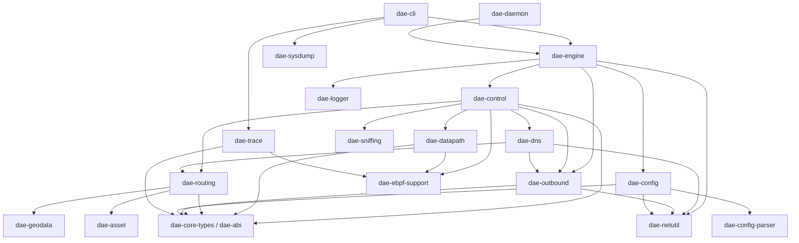
```mermaid
flowchart TD
  cli[dae-cli]
  daemon[dae-daemon]
  engine[dae-engine]
  control[dae-control]
  datapath[dae-datapath]
  dns[dae-dns]
  routing[dae-routing]
  outbound[dae-outbound]
  sniff[dae-sniffing]
  config[dae-config]
  parser[dae-config-parser]
  abi[dae-core-types / dae-abi]
  netutil[dae-netutil]
  geodata[dae-geodata]
  asset[dae-asset]
  ebpf[dae-ebpf-support]
  logger[dae-logger]
  trace[dae-trace]
  sysdump[dae-sysdump]

  cli --> engine
  cli --> sysdump
  cli --> trace
  daemon --> engine
  engine --> control
  engine --> config
  engine --> outbound
  engine --> netutil
  engine --> logger
  control --> datapath
  control --> dns
  control --> routing
  control --> outbound
  control --> sniff
  control --> ebpf
  control --> abi
  datapath --> abi
  datapath --> ebpf
  dns --> routing
  dns --> outbound
  dns --> netutil
  routing --> geodata
  routing --> asset
  routing --> abi
  outbound --> netutil
  outbound --> abi
  config --> parser
  config --> abi
  config --> netutil
  trace --> ebpf
  trace --> abi
```

依赖原则：

- `dae-core-types / dae-abi` 在最底层，只放稳定枚举、保留索引、wire layout、dial mode、policy、reload state。
- `dae-config-parser` 不依赖 runtime/control，只负责 grammar/AST。
- `dae-config` 负责 schema/default/desc/marshal/patch/include 之后的 typed config。
- `dae-engine` 是 runtime facade，持有共享 pool、subscription、HTTP transport、reload orchestration。
- `dae-control` 负责 control plane 生命周期、BPF attach、DNS controller、routing map、outbound group 初始化。
- `dae-datapath` 封装 TCP/UDP active datapath，不直接读配置文件。
- `dae-outbound` 可以分两步：
  - 第一阶段通过 FFI/bridge 对齐现有 outbound behavior。
  - 第二阶段逐协议 Rust native。
- `dae-ebpf-support` 保持 Linux-only feature，隔离 kernel/version/ELF/raw socket。

### 30.2 启动链路图

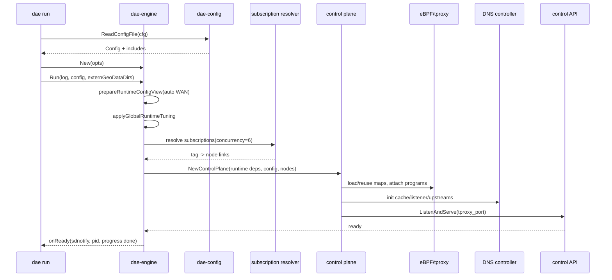
```mermaid
sequenceDiagram
  participant CLI as dae run
  participant Engine as dae-engine
  participant Config as dae-config
  participant Sub as subscription resolver
  participant CP as control plane
  participant BPF as eBPF/tproxy
  participant DNS as DNS controller
  participant API as control API

  CLI->>Config: ReadConfigFile(cfg)
  Config-->>CLI: Config + includes
  CLI->>Engine: New(opts)
  CLI->>Engine: Run(log, config, externGeoDataDirs)
  Engine->>Engine: prepareRuntimeConfigView(auto WAN)
  Engine->>Engine: applyGlobalRuntimeTuning
  Engine->>Sub: resolve subscriptions(concurrency=6)
  Sub-->>Engine: tag -> node links
  Engine->>CP: NewControlPlane(runtime deps, config, nodes)
  CP->>BPF: load/reuse maps, attach programs
  CP->>DNS: init cache/listener/upstreams
  CP->>API: ListenAndServe(tproxy_port)
  API-->>Engine: ready
  Engine-->>CLI: onReady(sdnotify, pid, progress done)
```

关键保持点：

- `prepareRuntimeConfigView` 不污染原配置对象。
- subscription 失败是局部失败；只有配置目录缺失等结构性问题才失败。
- fallback resolver 必须先解析为 `AddrPort`。
- Engine scoped pools 注入 control plane。
- ready 之后写 pid/progress，而不是 control plane 刚创建完成就写。

### 30.3 reload 链路图

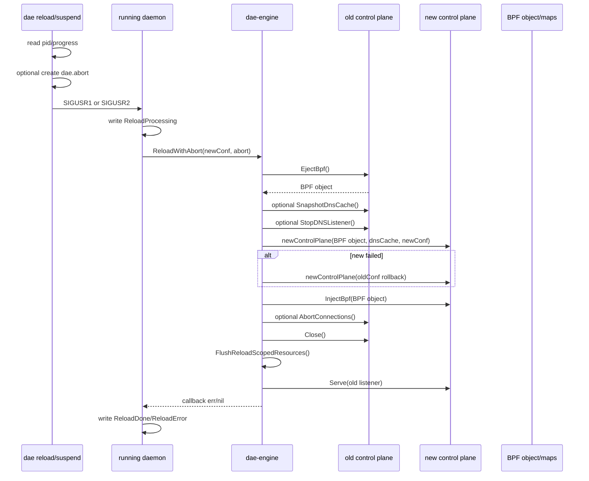
```mermaid
sequenceDiagram
  participant Cmd as dae reload/suspend
  participant Run as running daemon
  participant Engine as dae-engine
  participant Old as old control plane
  participant New as new control plane
  participant BPF as BPF object/maps

  Cmd->>Cmd: read pid/progress
  Cmd->>Cmd: optional create dae.abort
  Cmd->>Run: SIGUSR1 or SIGUSR2
  Run->>Run: write ReloadProcessing
  Run->>Engine: ReloadWithAbort(newConf, abort)
  Engine->>Old: EjectBpf()
  Old-->>Engine: BPF object
  Engine->>Old: optional SnapshotDnsCache()
  Engine->>Old: optional StopDNSListener()
  Engine->>New: newControlPlane(BPF object, dnsCache, newConf)
  alt new failed
    Engine->>New: newControlPlane(oldConf rollback)
  end
  Engine->>New: InjectBpf(BPF object)
  Engine->>Old: optional AbortConnections()
  Engine->>Old: Close()
  Engine->>Engine: FlushReloadScopedResources()
  Engine->>New: Serve(old listener)
  Engine-->>Run: callback err/nil
  Run->>Run: write ReloadDone/ReloadError
```

关键保持点：

- reload progress 文件第一字节协议不变。
- DNS cache 只有 DNS config 完全相等时迁移。
- 相同 dns.bind reload 前要停旧 DNS listener。
- BPF object eject/inject 是不中断 reload 的核心。
- reload scoped resources flush 后，Engine scoped pool 本体继续存在。

### 30.4 TCP/UDP active datapath 总图

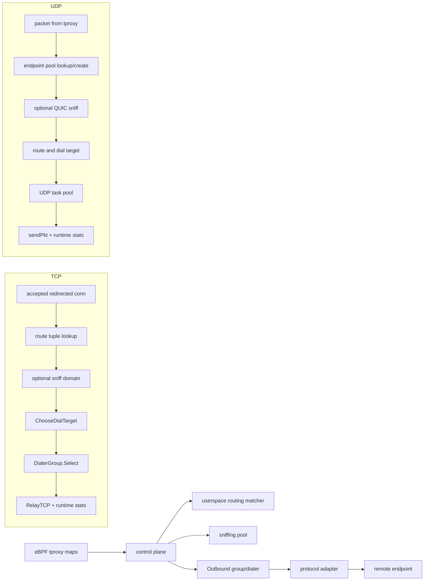
```mermaid
flowchart LR
  Kernel[eBPF tproxy maps] --> CP[control plane]
  CP --> Route[userspace routing matcher]
  CP --> Sniff[sniffing pool]
  CP --> Out[Outbound group/dialer]
  Out --> Node[protocol adapter]
  Node --> Remote[remote endpoint]

  subgraph TCP
    T1[accepted redirected conn] --> T2[route tuple lookup]
    T2 --> T3[optional sniff domain]
    T3 --> T4[ChooseDialTarget]
    T4 --> T5[DialerGroup.Select]
    T5 --> T6[RelayTCP + runtime stats]
  end

  subgraph UDP
    U1[packet from tproxy] --> U2[endpoint pool lookup/create]
    U2 --> U3[optional QUIC sniff]
    U3 --> U4[route and dial target]
    U4 --> U5[UDP task pool]
    U5 --> U6[sendPkt + runtime stats]
  end
```

关键保持点：

- TCP 和 UDP 都要携带 mark/mptcp。
- sniffed domain 影响 dial target，但不重新跑所有路由语义。
- UDP endpoint/task pool 有容量、drop、flush 语义。
- runtime stats 是数据面写入、WebUI 按需 snapshot。

### 30.5 DNS controller 总图

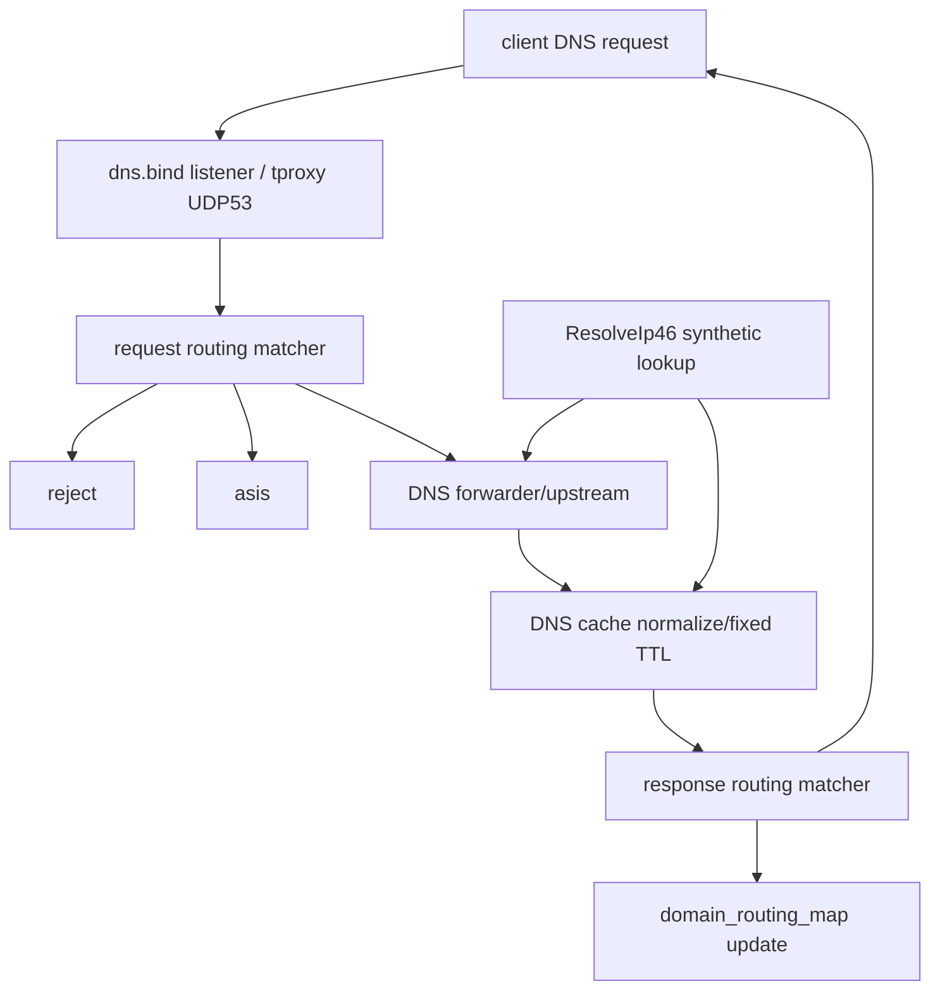
```mermaid
flowchart TD
  Client[client DNS request] --> Listener[dns.bind listener / tproxy UDP53]
  Listener --> ReqRoute[request routing matcher]
  ReqRoute --> Reject[reject]
  ReqRoute --> AsIs[asis]
  ReqRoute --> Upstream[DNS forwarder/upstream]
  Upstream --> Cache[DNS cache normalize/fixed TTL]
  Cache --> RespRoute[response routing matcher]
  RespRoute --> DomainMap[domain_routing_map update]
  RespRoute --> Client

  ControlLookup[ResolveIp46 synthetic lookup] --> Cache
  ControlLookup --> Upstream
```

关键保持点：

- request routing 和 response routing 是两套 matcher。
- cache key、fixed TTL、eviction、domain_routing_map owner tracker 都要保留。
- TCP/UDP/DoT/DoH/DoQ/upstream refresh stats 属于同一观测面。
- `domain` / `domain+` / `domain++` dial mode 对 DNS controller 和 active datapath都有影响。

### 30.6 outbound/group/health 总图

```mermaid
flowchart TD
  ConfigNodes[node section] --> Pool[tagToNodeList]
  Subs[subscription section] --> Resolver[ResolveSubscription]
  Resolver --> Pool
  Pool --> Group[DialerGroup]
  Group --> Filter[filter_annotation + add_latency]
  Filter --> Alive[AliveDialerSet]
  Alive --> Policy[random/fixed/min/min_avg10/min_moving_avg]
  Policy --> Select[Select(network, ipversion)]
  Select --> Adapter[protocol adapter]
  Adapter --> Health[connectivity check / ProbeLatency]
  Health --> LatencyRing[latency ring/cache]
```

关键保持点：

- 手动节点 tag 为空字符串，订阅节点按 subscription tag 分组。
- group policy parser 影响 selection 和 alive set。
- min 类策略依赖延迟状态，不能为了省内存把运行态观测完全懒加载。
- WebUI 手动 probe 和后台健康检查要区分。

### 30.7 推荐实现顺序

第一阶段：可测试纯逻辑。

1. `dae-core-types / dae-abi`
2. `dae-config-parser`
3. `dae-config`
4. `dae-netutil`
5. `dae-geodata`
6. `dae-routing`
7. `dae-sniffing`

第二阶段：运行态但不接管系统。

1. `dae-outbound` link parser / protocol adapter compatibility fixtures。
2. `dae-dns` userspace controller 和 cache。
3. `dae-engine` dry runtime、HTTP transport、overview snapshot。
4. `dae-cli` validate/export/completion。

第三阶段：系统接管能力。

1. `dae-ebpf-support`
2. `dae-control`
3. `dae-datapath`
4. eBPF map attach / netns / sysctl / tproxy integration。
5. reload BPF eject/inject。

第四阶段：排障和发布。

1. `dae-trace`
2. `dae-sysdump`
3. install/systemd/release workflow。
4. daed / dae-wing 链路对接。

### 30.8 跨语言 fixture 优先级

P0：

- config parse/marshal/patch/default/outline。
- routing matcher 函数矩阵。
- DNS controller cache/request/response。
- outbound link parser 和 protocol transport matrix。
- group selection policy + latency ring。
- MagicNetwork mark/mptcp。
- reload progress 文件协议。
- eBPF map struct layout 和 reserved index。

P1：

- subscription parse/fetch/persist。
- sniffing TLS/HTTP/QUIC。
- runtime overview samples/downsample。
- geodata streaming decode。
- sysdump archive safety。

P2：

- honk。
- completion script exact body。
- logger formatter exact spacing。

### 30.9 阶段性结论

- 当前 memo 已覆盖 daenew 主要运行链路、DNS、routing、outbound、tproxy/eBPF、runtime、CLI、support utilities。
- 后续进入 Rust 代码前，建议先把 P0 fixture 从 Go 测试中抽取为语言无关 golden corpus。
- 真正的风险不在“Rust 能不能实现”，而在是否保持 daemon 外部契约、WebUI/daed 观测字段、kernel map ABI 和 outbound dependency 的历史兼容。

## 31. P0 跨语言 golden fixture 抽取方案

本节目标：

- 把第 30 节的 P0 项拆成可执行 golden corpus。
- 后续 Rust 实现不靠人工“看起来一致”，而是用同一份输入/输出跑 Go 和 Rust。
- 本节仍是设计和记录，不新建 fixture 文件，不修改业务源码。

### 31.1 fixture 存放和格式建议

建议后续新增目录：

```text
testdata/rebuild-golden/
  config/
  routing/
  dns/
  outbound/
  abi/
  reload/
  runtime/
```

格式建议：

- 小型输入输出：JSON。
- 配置原文：`.dae`。
- DNS wire：base64 或 hex。
- 二进制 layout：JSON 记录 sizeof、align、field offset、encoded bytes。
- 域名 matcher corpus：TSV 或 JSONL。

每条 fixture 建议包含：

```json
{
  "name": "case-name",
  "source": "go test/function name",
  "input": {},
  "want": {},
  "notes": "compatibility notes"
}
```

Rust 验收规则：

- Rust 单元测试直接读取同一 fixture。
- Go 侧保留生成/校验命令，避免 fixture 漂移。
- 任何“修复历史 bug”必须先把 fixture 标为 `compat=false` 或另建 migration fixture，不能静默改。

### 31.2 config parser / config schema golden

来源测试：

- `pkg/config_parser/config_parser_test.go`
- `config/marshal_test.go`
- `config/outline_test.go`
- `config/hardening_test.go`
- `engine/runtime_test.go`

建议 fixture：

1. `config/parser/full_example.dae`
   - 输入来自 `TestParse` 中的大配置。
   - 需要保留：
     - include section。
     - global 参数。
     - subscription URL。
     - node 多协议 link。
     - group filter/policy。
     - routing rules 和 fallback。
   - 输出：
     - section 顺序。
     - 每个 section 的 name。
     - function/param/rule AST。

2. `config/marshal/example_roundtrip.dae`
   - 输入来自 `../example.dae`。
   - 输出：
     - marshal 后再次 parse/config.New 与原配置 DeepEqual。
     - group `FilterAnnotation` 需要按当前测试做 normalize，因为 marshal roundtrip 不比较该字段。

3. `config/hardening/invalid_fallback_function_list.json`
   - 输入：

```dae
global {}
routing {
  fallback: fixed(0) && fixed(1)
}
```

   - 输出错误必须包含 `invalid routing fallback`。

4. `config/hardening/invalid_fallback_resolver.json`
   - 输入：

```dae
global {
  fallback_resolver: bad-resolver
}
routing {}
```

   - 输出错误必须包含 `invalid global.fallback_resolver`。

5. `config/runtime_view/auto_wan_no_mutation.json`
   - 输入：
     - global lan/wan slice。
     - routing rules。
     - dns request/response rules。
   - 输出：
     - runtime view 可变。
     - 原 config 中 slice/rules 不被污染。

6. `config/outline/export_outline.json`
   - 输入 version。
   - 输出 `ExportOutlineJson(version)`。
   - 该 fixture 是 WebUI 设置页兼容基础。

Rust 注意：

- `mapstructure` tag、default tag、required tag 是 schema 输出来源。
- `ParseConfig(global,dns,routing)` 会自动拼 empty group/subscription/node，不能漏。
- `EmptyConfig` 是 suspend/no-load reload 语义的一部分。

### 31.3 routing / matcher golden

来源测试：

- `component/routing/function_parser_test.go`
- `control/routing_matcher_userspace_test.go`
- `component/routing/domain_matcher/ahocorasick_slimtrie_test.go`
- `pkg/trie/trie_test.go`

建议 fixture：

1. `routing/prefix/bare_ip_to_host_prefix.json`
   - 输入：
     - `192.0.2.1`
     - `2001:db8::1`
     - `2001:db8::/48`
   - 输出：
     - `192.0.2.1/32`
     - `2001:db8::1/128`
     - `2001:db8::/48`

2. `routing/userspace/fallback.json`
   - matcher：
     - single fallback -> direct。
   - query：
     - dest `203.0.113.42`
     - domain empty。
   - want outbound direct。

3. `routing/userspace/domain_suffix.json`
   - domain set：
     - rule index 0
     - suffix `example.com`
   - rules：
     - domain match -> direct。
     - fallback -> block。
   - query:
     - `www.example.com` -> direct。
     - `www.invalid.test` -> block。

4. `routing/userspace/ip_and_port_or.json`
   - ip set:
     - `203.0.113.0/24`
   - port:
     - `443-443`
   - logical:
     - ip rule outbound logical OR。
     - port rule outbound direct。
     - fallback block。
   - query:
     - dest `203.0.113.42:443` -> direct。
     - dest `198.51.100.42:8443` -> block。

5. `routing/domain_matcher/bruteforce_vs_slimtrie.jsonl`
   - 输入：
     - simulated domain sets。
     - deterministic random seed `200`。
     - 10000 samples。
   - 输出：
     - bruteforce bitmap == slimtrie bitmap。
     - `MatchDomainBitmapInto` 等于分配版输出。

6. `routing/trie/reversed_domain_prefix.json`
   - 输入 trie entries 包含：
     - `nc.`
     - `nc...` 相关 case。
     - `nc.ude.ctsu.srorrim.pct_.sptth_`。
   - 输出：
     - `nc.tset^` true。
     - `nc^` false。
     - `nc.` true。
     - `nc.^` true。
     - `nc._` true。
     - `n` false。
     - `n^` false。

Rust 注意：

- domain matcher 输出是 bitmap words，不只是 bool。
- logical OR/AND sentinel 与 BPF userspace matcher一致。
- bare IP 自动补 host prefix 是函数 parser 行为，不能交给下游默认库决定。

### 31.4 DNS golden

来源测试：

- `control/dns_control_test.go`
- `control/dns_cache_restore_test.go`
- `control/dns_http_test.go`
- `component/dns/dns_test.go`
- `component/dns/upstream_test.go`
- `common/netutils/dns_test.go`

建议 fixture 分组：

#### 31.4.1 DNS cache key

`dns/cache_key/qtype_qclass.json`

- 输入：
  - qname `Example.COM`
  - qtype A / AAAA
  - qclass INET / 3
- 输出：
  - qname canonical lowercase fqdn `example.com.`
  - A 和 AAAA key 不同。
  - INET 和 class 3 key 不同。
  - structured key 可 parse roundtrip。
  - legacy key `example.com.1` parse 为 INET A。

#### 31.4.2 Normalize/cache TTL

`dns/cache_ttl/min_answer_ttl.json`

- 输入：
  - response A records TTL 300 和 60。
- 输出：
  - effective deadline = now + 60s。
  - original deadline = now + 60s。

`dns/cache_ttl/fixed_domain_ttl.json`

- 输入：
  - fixed_domain_ttl `example.com: 10`
  - upstream TTL 60。
- 输出：
  - client deadline = now + 10s。
  - original deadline = now + 60s。

`dns/cache_ttl/fixed_domain_ttl_zero.json`

- 输入：
  - fixed_domain_ttl `example.com: 0`
  - upstream TTL 60。
- 输出：
  - normal lookup misses。
  - internal lookup hits until original TTL。
  - cache map still contains internal entry for routing association。

`dns/cache_ttl/update_deadline_ignores_fixed_ttl.json`

- 输入：
  - fixed_domain_ttl upstream.example=0。
  - explicit deadline +24h。
- 输出：
  - effective/original 都等于 explicit deadline。

#### 31.4.3 Cache eviction/stats

`dns/cache/expired_lookup_removes.json`

- expired lookup returns nil。
- remove callback called once。
- map entry removed。

`dns/cache/stats_no_mutation.json`

- live entry counted。
- expired but original-deadline-live entry counted live。
- `CacheStats()` 不触发 remove callback。
- `CacheStats()` 不修改 map。

`dns/cache/evict_oldest_when_full.json`

- cache 达到 `dnsCacheMaxEntries`。
- 插入新 entry 后 size 保持 capped。
- deadline 最旧 entry 被删。

#### 31.4.4 Packed DNS response

`dns/packed_response/lookup_restores_request_id.json`

- 输入 request id `0x4321`。
- cache answer TTL 0。
- 输出 packed response 前 2 bytes 等于 request id。

`dns/packed_response/cname_restore.json`

- snapshot 中保留 packed CNAME + A。
- restore 后：
  - question domain bitmap 使用 alias。
  - target A IP 仍用于 domain routing include ip。
  - packed response 包含 CNAME + A。

#### 31.4.5 Response validation

`dns/validation/question_and_id.json`

- matching question accepted。
- missing question rejected，错误含 `dns response missing question`。
- mismatched question rejected，错误含 `dns response question mismatch`。
- require id 时 mismatched id rejected。
- 不 require id 时 mismatched id allowed。

#### 31.4.6 DoH request/response

`dns/doh/get_small_payload.json`

- 小 payload 使用 GET。
- Accept=`application/dns-message`。
- Content-Type 空。
- Host=upstream hostname。
- query 参数 `dns` 是 raw-url-base64，且 DNS ID 被置零。

`dns/doh/post_large_payload.json`

- 大 payload 使用 POST。
- Content-Type=`application/dns-message`。
- query 无 `dns`。
- body 为 ID 置零后的 DNS message。

`dns/doh/reject_status_and_content_type.json`

- 502 返回错误 `doh server returned status 502 Bad Gateway`，status failure counter +1。
- `text/html; charset=utf-8` 返回错误 `unexpected doh content-type ...`，content-type failure counter +1。
- `application/dns-message; charset=binary` 接受。
- invalid content-type header byte 拒绝。

#### 31.4.7 UDP/TCP resolver helper

`dns/netutils/tcp_full_read_one_byte_chunks.json`

- TCP response length prefix + payload 每次只读 1 byte。
- ResolveNetip 仍返回 `1.2.3.4`。

`dns/netutils/udp_packet_conn_semantics.json`

- PacketConn 使用 `WriteTo(addr)` 和 `ReadFrom`。
- 不应 fallback 到 stream `Write/Read`。

`dns/forwarder/udp_retry_counter.json`

- 第一次 read timeout。
- 第二次 read 成功。
- UDP write count=2。
- retry counter +1。

#### 31.4.8 Upstream resolver

`dns/upstream/cache_refresh_dedupe.json`

- refresh interval 内复用同一 upstream pointer。
- interval 后重新 resolve。
- refresh 失败保留 stale upstream。
- retry deadline = now + retry interval。
- success/failure/stale counters 增量正确。
- 并发 refresh 只调用一次 Resolve，多个 caller 共享结果。

#### 31.4.9 Synthetic ResolveIp46 asis guard

`dns/resolve_ip46/asis_original_target_guard.json`

- DNS request fallback 为 `asis`。
- synthetic domain verification 不能把原始流量目标当 DNS upstream 使用。
- 返回无验证 IP，并带错误。

Rust 注意：

- DNS fixture 应区分 client lookup 和 internal lookup。
- DNS ID 置零只用于 DoH request payload，cache packed response 回包仍要恢复 request id。
- fixed_domain_ttl=0 不是删除内部 cache，而是禁用 client response cache。

### 31.5 outbound/group golden

来源测试：

- `component/outbound/dialer_group_test.go`
- `component/outbound/filter_test.go`
- `component/outbound/dialer/lazy_state_test.go`
- `component/outbound/dialer/direct_test.go`
- `control/group_override_clone_cache_test.go`
- outbound dependency protocol tests，见第 26 节。

建议 fixture：

#### 31.5.1 group selection

`outbound/group/fixed.json`

- 2 个 dialer。
- fixed index 1 -> 永远选 dialer 1。
- 改 fixed index 0 -> 永远选 dialer 0。

`outbound/group/min_last_latency.json`

- case 1：latencies `[200,100,300,150]`，alive 全 true -> index 1。
- case 2：latencies `[50,300,120,250]`，alive `[false,true,true,true]` -> index 2。
- case 3：latencies `[400,220,180,190]`，alive `[true,false,true,true]` -> index 2。

`outbound/group/min_avg10.json`

- dialer0 三次 300ms。
- dialer1 三次 100ms。
- want dialer1，returned latency=100ms。

`outbound/group/min_moving_avg.json`

- dialer0 moving average 400ms。
- dialer1 moving average 120ms。
- want dialer1。
- dialer1 worsen 到 800ms 后 want dialer0。

`outbound/group/random_alive.json`

- 100 次 select total=100。
- dead dialer never selected。
- 这里不要求固定分布，只要求存活过滤和总数。

`outbound/group/ipversion_fallback_no_mutation.json`

- IPv4 dead，IPv6 alive。
- 输入 networkType IPv4。
- Select 可 fallback，但不得修改输入 networkType 的 IpVersion。

#### 31.5.2 filter and annotation

`outbound/filter/name_and_subscription_tag.json`

- nodes：
  - HK-Netflix / premium-sub
  - JP-Game / game-sub
  - SG-Standard / standard-sub
  - US-Backup / backup-sub
- filter group 1：
  - name regex `^(HK|JP)-`
  - subscription tag regex `premium|game`
  - add_latency 10ms
- filter group 2：
  - name keyword `Backup`
  - add_latency 25ms
- want matched：
  - HK-Netflix 10ms
  - JP-Game 10ms
  - US-Backup 25ms

`outbound/filter/bad_regex.json`

- 非空 dialer set + regex `[` -> error。
- 空 dialer set + regex `[` -> no error，保持历史 lenient 行为。

#### 31.5.3 lazy health state

`outbound/dialer/lazy_state.json`

- new dialer：
  - probe client/transport nil。
  - health collections nil。
  - no alive sets。
  - LastLatencySnapshot 不分配 collection，返回 ok=false。
  - MustGetAlive 不分配 collection，默认 alive=true。
  - MustGetLatencies10 才创建 collection。
  - probe HTTP client 首次使用才创建，后续复用。

`outbound/alive_set/random_skips_latency_state.json`

- random policy 不分配 latency map。
- dead dialer 被排除。

`outbound/alive_set/latency_offset_sparse.json`

- 只有非零 add_latency 存入 offset map。
- 等 raw latency 时 zero offset dialer 胜出。

#### 31.5.4 direct dialer and SS2022 bootstrap

`outbound/direct/injected_resolver.json`

- `NewDirectDialer` fullcone=false 时优先 `ResolverDialer`。
- fullcone=true 时优先 `ResolverFullconeDialer`。
- prop name 为 `direct`。
- 全局 direct nil 时 fallback resolver dialer 仍能构造。

`outbound/protocol/ss2022_no_global_direct_dependency.json`

- outbound direct globals nil。
- `ss://2022-blake3-aes-128-gcm:...@example.com:443#node` 仍能 NewFromLink。
- parent dialer 非 nil。

#### 31.5.5 group override clone cache

`outbound/group_override/clone_profile_key.json`

- 相同 base dialer + 等价 health profile 复用同一 clone。
- 不同 interval/DNS/resolver/base dialer 不共享 clone。
- string slice profile key 区分：
  - nil vs empty。
  - `["ab","c"]` vs `["a","bc"]`。
  - `["","a"]` vs `["a",""]`。
- count profiles：
  - shared profile count=2。
  - unique profile count=1。

Rust 注意：

- min 类策略需要运行态 latency state，不能只做静态 filter。
- lazy allocation 是内存优化结果，Rust 不必逐对象同形，但必须保持“不读延迟时不触发 probe/分配重状态”的目标。
- group override clone cache 是降低重复健康检查资源占用的重要路径。

### 31.6 ABI / eBPF / reload golden

来源：

- `common/consts/*.go`
- `control/bpf_utils_test.go`
- `control/domain_routing_tracker_test.go`
- `control/bpf_loader_upgrade_test.go`
- `common/netutils/dns_test.go`
- `engine/runtime_test.go`
- `cmd/reload.go`

建议 fixture：

#### 31.6.1 const ABI

`abi/consts/reserved_indices.json`

- Outbound:
  - direct=0
  - block=1
  - user-defined min=2
  - must_rules=0xFC
  - control-plane-routing=0xFD
  - OR=0xFE
  - AND=0xFF
- DNS request:
  - reject=0xFC
  - asis=0xFD
  - OR=0xFE
  - AND=0xFF
- DNS response:
  - accept=0xFC
  - reject=0xFD
  - OR=0xFE
  - AND=0xFF
- reload states:
  - send='0'
  - processing='1'
  - done='2'
  - error='3'
- tproxy:
  - mark `0x08000000`
  - recognize `0x2017`
  - loopback ifindex 1。

`abi/consts/dial_mode_policy.json`

- dial mode only accepts `ip/domain/domain+/domain++`。
- group policy strings：
  - random
  - fixed
  - min_avg10
  - min_moving_avg
  - min

#### 31.6.2 MagicNetwork

`abi/magic_network/mark_mptcp.json`

- mark=0,mptcp=false -> original network string。
- mark!=0 or mptcp=true -> encoded MagicNetwork。
- parse roundtrip must recover:
  - network。
  - mark。
  - mptcp。

#### 31.6.3 BPF domain routing owner tracker

`abi/domain_routing/shared_ip_merge.json`

- owner A bitmap 0x1 for IP 203.0.113.10。
- owner B bitmap 0x2 for same IP。
- merged bitmap 0x3。
- remove owner A -> bitmap 0x2。
- remove owner B -> IP removed。

`abi/domain_routing/structured_owner_separation.json`

- owner key INET 和 qclass=3 分离。
- remove INET owner 后 class3 owner 仍保留。

`abi/domain_routing/replace_snapshot_no_leak.json`

- owner first snapshot has IP20 + IP21。
- second snapshot only IP20。
- repeat update idempotent。
- IP21 removed。
- final remove removes IP20。

#### 31.6.4 BPF map lifecycle

`abi/bpf/new_lpm_map_failure_closes.json`

- batch update failure 时返回 nil map。
- error 包含原 batch error。
- created map fd 被 close 到 -1。

`abi/bpf/remove_pinned_map_error.json`

- pinned map path 是非空目录。
- removePinnedMap 返回 remove error。
- 原路径仍存在。

`abi/bpf/pinned_reuse_and_incompatible_delete.json`

- 需要 root/eBPF 环境。
- 首次 load 后存在 `routing_tuples_map`。
- 第二次 load 可复用 compatible pinned map。
- incompatible pinned map 会被删除并替换成新 map。

#### 31.6.5 reload file protocol

`reload/progress_file_protocol.json`

- progress 文件第一行必须长度 1。
- code 不在 done/error 时 reload 命令认为正在进行。
- reload 发送前写 `ReloadSend`。
- 500ms 后仍是 send -> 旧 daemon fallback 输出 `OK`。
- done/error 时打印第一行之后 content。
- abort 文件是 one-shot create/remove。

Rust 注意：

- ABI fixture 应该由 Go 侧生成一次并进入版本控制，Rust 按同一 JSON 校验。
- 真实 eBPF loader fixture 可单独标记 `requires_root=true` / `requires_bpf_fs=true`，避免普通 CI 误判。

### 31.7 P0 fixture 生成命令建议

建议后续增加 Go 侧生成命令，例如：

```bash
PATH=/root/.local/go1.25.9/bin:$PATH GOWORK=off go test ./... -run TestWriteRebuildGoldenFixtures
```

或分模块：

```bash
go test ./config ./pkg/config_parser -run TestWriteConfigGolden
go test ./component/routing ./control -run TestWriteRoutingGolden
go test ./control ./component/dns ./common/netutils -run TestWriteDnsGolden
go test ./component/outbound ./component/outbound/dialer -run TestWriteOutboundGolden
go test ./control ./common -run TestWriteAbiGolden
```

生成器规则：

- 默认只校验 fixture。
- 设置 `DAE_UPDATE_REBUILD_GOLDEN=1` 时才重写 fixture。
- fixture 输出需要稳定排序。
- DNS wire 使用 base64，不直接写不可读二进制。
- 时间使用固定 unix timestamp。
- 随机测试必须固定 seed。

### 31.8 本节验证

执行 P0 相关现有测试：

```bash
PATH=/root/.local/go1.25.9/bin:$PATH GOWORK=off go test -count=1 ./config ./pkg/config_parser ./component/routing ./component/routing/domain_matcher ./pkg/trie ./common/netutils
PATH=/root/.local/go1.25.9/bin:$PATH GOWORK=off go test -count=1 ./component/dns ./component/outbound ./component/outbound/dialer
PATH=/root/.local/go1.25.9/bin:$PATH GOWORK=off go test -count=1 ./control -run 'Test(DnsCacheKeyIncludesQuestionTypeAndClass|NormalizeAndCacheDnsRespUsesQuestionClassInCacheKey|DNSForwarderReusable|ShouldReportDnsDialFailure|LookupDnsRespCache|DnsDataWithZeroIDDoesNotMutateInput|SweepDnsCacheUsesLatestDeadline|CacheStatsCountsOnlyLiveDnsEntriesWithoutMutation|DoUDPForwardDNSTracksRetryCounter|NormalizeAndCacheDnsRespUsesMinimumAnswerTTL|ValidateDnsResponseForRequest|NormalizeAndCacheDnsRespSkipsEmptySuccess|UpdateDnsCacheTtlAppliesFixedDomainTTL|FixedDomainTTLZeroDisablesClientResponseCache|UpdateDnsCacheDeadlineIgnoresFixedDomainTTL|UpdateDnsCacheEvictsOldestWhenCacheFull|SweepDnsForwarderCacheRemovesIdleEntries|GetDnsForwarderEvictsOldestWhenCacheFull|RestoreDnsCacheSnapshot|DomainRoutingTrackerKeepsStructuredOwnersSeparateOnRemove|UpdateDnsCacheDeadlineAssignsRouteOwnerKey|RuntimeStatsSnapshotIncludesDnsObservabilityStats)'
```

结果：通过。

输出摘要：

```text
ok   github.com/daeuniverse/dae/config 0.021s
ok   github.com/daeuniverse/dae/pkg/config_parser 0.006s
ok   github.com/daeuniverse/dae/component/routing 0.019s
ok   github.com/daeuniverse/dae/component/routing/domain_matcher 34.558s
ok   github.com/daeuniverse/dae/pkg/trie 0.003s
ok   github.com/daeuniverse/dae/common/netutils 0.015s
ok   github.com/daeuniverse/dae/component/dns 0.004s
ok   github.com/daeuniverse/dae/component/outbound 0.004s
ok   github.com/daeuniverse/dae/component/outbound/dialer 0.045s
ok   github.com/daeuniverse/dae/control 0.007s
```

结论：

- P0 可抽取 fixture 的现有 Go 测试基线通过。
- `component/routing/domain_matcher` 测试耗时较长，后续 golden 生成应把 10000 sample corpus 固定并落盘，避免每次随机重算。
- 真实 eBPF loader/pinned map 复用属于环境依赖验证，应独立标记，不放入普通 P0 快速测试。
- 本节仍只更新本地 ignored 备忘录，不涉及 daenew 业务源码修改。

## 32. P1 跨语言 golden fixture 抽取方案

P1 范围来自第 30 节：

- subscription parse/fetch/persist。
- sniffing TLS/HTTP/QUIC。
- runtime overview samples/downsample。
- geodata streaming decode。
- sysdump archive safety。
- packet sniffer pool 作为 sniffing 运行态资源补充纳入本节。

本节目标：

- P1 不一定阻塞最小 Rust runtime，但会影响完整产品体验、WebUI 可观测性、订阅可靠性和现场排障能力。
- 仍然只记录设计，不创建 fixture 文件，不改源码。

### 32.1 subscription golden

来源测试：

- `common/subscription/subscription_test.go`

建议 fixture：

`subscription/http_file_persist_safe_tag.json`

- 输入：
  - tag `safe-tag`。
  - URL scheme `http-file://...`。
  - HTTP response body 是 base64：`ss://example`。
- 输出：
  - 返回 tag=`safe-tag`。
  - nodes=`["ss://example"]`。
  - 写入 `<configDir>/persist.d/safe-tag.sub`。
  - persist 文件内容等于原始 base64 payload。

`subscription/http_file_reject_path_traversal.json`

- 输入：
  - tag `../../escape`。
  - URL scheme `http-file://...`。
- 输出：
  - 返回错误，错误包含 `persist filename`。
  - HTTP server 不应被访问。
  - 不应在 configDir 父目录创建 `escape.sub`。

后续还应补的 fixture：

- 普通 http/https 订阅。
- 本地 file 订阅。
- SIP008 / base64 / plaintext 多格式内容解析顺序。
- 订阅 fetch 失败后 `http-file` fallback 读取 persist 文件。
- tag 为空时的默认 tag 行为。

Rust 注意：

- path traversal 必须在网络请求前拒绝，不能先 fetch 再发现持久化路径不安全。
- persist 文件保存的是原始 payload，不是解析后的 nodes。

### 32.2 sniffing golden

来源测试：

- `component/sniffing/tls_test.go`
- `component/sniffing/quic_test.go`
- `component/sniffing/sniffer_test.go`
- `component/sniffing/internal/quicutils/cipher_test.go`
- `control/packet_sniffer_pool_test.go`

#### 32.2.1 TLS ClientHello

`sniffing/tls/client_hello_sni.jsonl`

输入应使用现有 hex stream：

- `tlsStreamGoogle` -> `www.google.com`
- `tlsStreamWindowsOdinGame` -> `odin.game.daum.net`
- `tlsCurlIpsb` -> `ip.sb`
- `tlsWebTelegramOrm + tlsWebTelegramOrm2` -> `web.telegram.org`

输出：

- `SniffTcp()` 返回对应 SNI。
- multi-reader stream 能正确跨段读取。
- timeout 300ms。

#### 32.2.2 QUIC reassemble

`sniffing/quic/reassemble.json`

- 输入：
  - `QuicStream2_1`
  - 如果 first packet 返回 NeedMore，再 append `QuicStream2_2`。
- 输出：
  - 最终 domain 非空。
  - `NeedMore()` 语义在第一段不足时为 true。
  - crypto frame reassemble 后可 sniff。

`sniffing/quic/single_packet.json`

- 输入：
  - `QuicStream3`
- 输出：
  - domain 非空。
  - 不应 NeedMore。

后续建议把 domain 具体值落盘，而不是只验证非空。当前 Go 测试只要求非空，Rust parity 若只对齐非空会漏掉解析精度。

#### 32.2.3 HTTP sniffing

当前没有直接 HTTP sniffing 单元测试，但源码语义应补 fixture：

`sniffing/http/host_header.json`

- 首字节必须 printable，否则 NotApplicable。
- 方法只接受 `common.IsValidHttpMethod` 白名单。
- 前 12 字节内必须出现空格分隔 method。
- `Host:` key 大小写不敏感。
- 返回 value 原文；当前实现没有 trim leading space。
- 找不到 host 返回 `ErrNotFound`。

#### 32.2.4 Sniffer buffer ownership

`sniffing/buffer/data_copy_vs_view.json`

- `Data()` 返回 detached copy。
- 修改 Data 返回值不影响内部 buffer。
- `DataView()` 返回内部 retained packet slice。
- `Data()` 和 `DataView()` 指针不同。

`sniffing/buffer/close_waits_for_active_read.json`

- stream read 阻塞时，`Close()` 不能先释放 buffer。
- read 结束后 Close 返回，并释放 internal buffer。

`sniffing/buffer/packet_max_buffered_bytes.json`

- append 超过 `PacketSnifferMaxBufferedBytes` 后 `SniffUdp()` 返回 `ErrDataTooLarge`。
- `NeedMore()` false。
- buffer len 清零。

#### 32.2.5 PacketSnifferPool

`sniffing/pool/normal_reassemble.json`

- key：
  - laddr `1.1.1.1:1111`
  - raddr `2.2.2.2:2222`
- 多段 QUIC data 进入同一 sniffer。
- NeedMore 时继续 append。
- 找到后 remove。

`sniffing/pool/mismatched_flow.json`

- 每段使用不同 raddr port。
- 每个 sniffer 都 NeedMore 后被 remove。
- 不应拼出 domain。

`sniffing/pool/sweep_touch_evict.json`

- expired sniffer 被 sweep。
- touch 后 fresh sniffer 保留。
- pool 满/主动 evict 时删除 oldest，保留 newer。

Rust 注意：

- `DataView()` 这种内部 view 在 Rust 中可用借用表达，但对外 API 要避免悬垂引用。
- packet sniffer pool 依赖 flow key，不能跨 flow 拼 QUIC fragment。
- QUIC fixture 应保存 hex，不保存 Go 变量名。

### 32.3 runtime overview golden

来源测试：

- `control/runtime_stats_test.go`
- `engine/runtime_test.go` 中 runtime overview 相关测试。

建议 fixture：

`runtime_stats/aggregate_across_shards.json`

- 输入：
  - shard count 2。
  - time `1700000000.125s`。
  - shard0 upload 100。
  - shard1 download 200。
  - active connections=3。
  - udp sessions=4。
  - udp task queues=5。
  - udp task drops=6。
  - packet sniffer sessions=7。
  - snapshot at now + 250ms。
- 输出：
  - upload total 100。
  - download total 200。
  - active connections 3。
  - udp sessions 4。
  - udp task queues 5。
  - udp task drops 6。
  - packet sniffer sessions 7。
  - samples 非空。
  - upload/download rate 非零。

`runtime_stats/multiple_buckets.json`

- 输入：
  - base `1700000100`。
  - shard0 record upload 120 at base。
  - shard1 record download 80 at base + bucket duration。
  - snapshot at base + 2 bucket duration。
- 输出：
  - totals 120/80。
  - samples 至少两个 bucket。

`runtime_stats/dns_observability_fields.json`

- 输入 hook 返回：
  - cache hit 11。
  - expired removal 12。
  - udp retry 13。
  - truncated tcp fallback 14。
  - doh status failure 15。
  - doh content-type failure 16。
  - upstream refresh success 17。
  - upstream refresh failure 18。
  - stale reuse 19。
- 输出 snapshot 含全部字段。

`runtime_stats/engine_scoped_udp_task_pool.json`

- 输入：
  - global snapshot UDP task queues/drop 是 99/88。
  - Engine scoped pool 有 1 个 running task，drop 0。
- 输出：
  - overview UDPTaskQueues=1。
  - UDPTaskDropTotal=0。
  - PacketSnifferSessions 保留 snapshot 值。

Rust 注意：

- WebUI 时间轴问题依赖 samples timestamp/rate，fixture 要包含窗口、maxPoints、bucket duration。
- DNS observability 字段属于 runtime overview，不应另开不兼容 API。

### 32.4 geodata streaming decode golden

来源：

- `pkg/geodata/decode.go`
- `pkg/geodata/geodata.go`
- 当前没有直接单元测试。

建议先补 Go fixture 生成器：

`geodata/streaming/geoip_hit_miss.json`

- 构造小型 `GeoIPList`：
  - entry `CN`。
  - entry `US`。
- 输出：
  - Decode `cn` 大小写不敏感命中 CN。
  - Decode `US` 命中 US。
  - Decode `ZZ` 返回 code not found。

`geodata/streaming/geosite_hit_miss.json`

- 构造小型 `GeoSiteList`。
- 验证 EqualFold、miss。

`geodata/streaming/corrupt_fallback.json`

- 构造损坏 wire：
  - invalid field type。
  - invalid varint。
  - short read。
- 输出：
  - `UnmarshalGeoIp/GeoSite` 在对应错误下 fallback 到 ReadFile。
  - 如果 fallback 文件可解析，返回目标 entry。

`geodata/streaming/multibyte_varint.json`

- 构造 entry 长度超过 127，使 varint 多 byte。
- 输出：
  - streaming decode 仍能定位 code。

Rust 注意：

- Rust 版不能退化为默认整文件读入；这个模块是 RSS 优化重点。
- fallback 行为要区分 file read/open error 和 decode structure error。
- `UnmarshalGeoSite` 现有 warning 文案写 geoip，是历史日志文案，不建议作为功能 fixture 强制。

### 32.5 assets LocationFinder golden

来源：

- `common/assets/assets.go`
- 当前没有直接单元测试。

建议 fixture：

`assets/location_finder/search_order_env.json`

- 设置 `DAE_LOCATION_ASSET`。
- 同名文件同时存在 env dir 和 externDirs。
- 输出：
  - env dir 优先。
  - 成功后写入 5s cache。

`assets/location_finder/search_order_xdg.json`

- 未设置 env。
- externDirs 优先。
- 非 Windows 查 XDG data dirs + app name。

`assets/location_finder/not_found_error.json`

- 找不到文件时错误包含 filename 和 searchDirs。

`assets/location_finder/cache_ttl.json`

- 第一次找到 path。
- TTL 内即使文件状态变化仍返回 cached path。
- TTL 后重新 stat/search。

Rust 注意：

- `DAE_LOCATION_ASSET` 分支里 externDirs 当前会 append 两次，这是现有行为；是否去重应作为兼容选择明确记录。
- cache 是 filename 粒度，不是 full path 粒度。

### 32.6 sysdump golden

来源：

- `cmd/sysdump.go`
- 当前没有直接单元测试。

建议 fixture：

`sysdump/archive/path_safety.json`

- sourceDir 内：
  - regular file。
  - nested dir/file。
  - non-regular entry。
- 输出：
  - tar header name 为 `<baseName>/<rel>`。
  - slash 分隔。
  - 非 regular 只写 header。
  - regular file 内容正确。

`sysdump/archive/reject_escape.json`

- 通过可控 walk 或 symlink case 验证：
  - rel 为绝对路径或 `..` 前缀时返回 `unsafe sysdump archive path`。

`sysdump/enum_strings.json`

- scope:
  - universe/site/link/host/nowhere/unknown。
- protocol:
  - babel/bgp/bird/boot/dhcp/kernel/static/unspec 等。
- route type:
  - unicast/local/broadcast/blackhole/unreachable/prohibit/unknown 等。

`sysdump/collector_best_effort.json`

- nft/iptables/ip6tables 缺失时只输出错误，不让整个 sysdump 失败。
- create archive 失败才中断最终输出。

Rust 注意：

- sysdump 是排障工具，采集失败应局部容错。
- archive path safety 要保留，避免打包逃逸路径。

### 32.7 P1 fixture 生成命令建议

建议后续新增：

```bash
go test ./common/subscription -run TestWriteSubscriptionGolden
go test ./component/sniffing ./control -run TestWriteSniffingGolden
go test ./control ./engine -run TestWriteRuntimeStatsGolden
go test ./pkg/geodata -run TestWriteGeodataGolden
go test ./common/assets -run TestWriteAssetsGolden
go test ./cmd -run TestWriteSysdumpGolden
```

统一规则：

- 默认校验。
- `DAE_UPDATE_REBUILD_GOLDEN=1` 才更新。
- 大型 TLS/QUIC payload 使用 hex 文件或 JSONL 外链，避免 JSON 太大。
- runtime 时间全部固定 unix timestamp。
- 涉及 HTTP server 的 fixture 记录请求方法、path、header、body，不记录本机随机端口。

### 32.8 本节验证

执行：

```bash
PATH=/root/.local/go1.25.9/bin:$PATH GOWORK=off go test -count=1 ./common/subscription
PATH=/root/.local/go1.25.9/bin:$PATH GOWORK=off go test -count=1 ./component/sniffing ./control -run 'Test(RuntimeStatsSnapshot|SnapshotRuntimeStatsIncludesDnsObservabilityStats|PacketSniffer)'
PATH=/root/.local/go1.25.9/bin:$PATH GOWORK=off go test -count=1 ./pkg/geodata ./common/assets ./cmd
```

结果：通过。

输出摘要：

```text
ok   github.com/daeuniverse/dae/common/subscription 0.003s
ok   github.com/daeuniverse/dae/component/sniffing 0.002s
ok   github.com/daeuniverse/dae/control 0.004s
?    github.com/daeuniverse/dae/pkg/geodata [no test files]
?    github.com/daeuniverse/dae/common/assets [no test files]
?    github.com/daeuniverse/dae/cmd [no test files]
```

结论：

- subscription、sniffing、packet sniffer pool、runtime stats 的现有 Go 测试基线通过。
- geodata、assets、sysdump 当前主要缺 fixture/test，应优先补 Go 侧 golden 生成器后再写 Rust。
- 本节仍只更新本地 ignored 备忘录，不涉及 daenew 业务源码修改。

## 33. 从备忘录进入 Rust 实现的阶段门禁和执行队列

本节目标：

- 把 1-32 节记录转成后续可执行队列。
- 控制风险：先 fixture，再纯逻辑 crate，再 runtime facade，最后系统接管/eBPF。
- 本节仍不改源码，只定义进入实现阶段的门禁。

### 33.1 阶段 0：Go golden 生成器

目标：

- 在 Go 侧先固化 daenew 当前行为。
- Rust 侧只消费 fixture，不重新解释 Go 测试意图。

建议任务顺序：

1. 新增 `testdata/rebuild-golden/`。
2. 新增各模块 `TestWrite*Golden`。
3. 默认只校验 fixture。
4. `DAE_UPDATE_REBUILD_GOLDEN=1` 才更新。
5. CI 普通测试只跑校验，不自动改文件。

最小第一批：

- config parser/schema。
- routing matcher。
- DNS cache/DoH/upstream resolver。
- outbound group selection/filter/lazy state。
- ABI const/MagicNetwork/reload state。

门禁：

```bash
PATH=/root/.local/go1.25.9/bin:$PATH GOWORK=off go test -count=1 \
  ./config ./pkg/config_parser \
  ./component/routing ./component/routing/domain_matcher ./pkg/trie \
  ./control \
  ./component/dns \
  ./component/outbound ./component/outbound/dialer \
  ./common ./common/netutils
```

注意：

- `./control` 全量可能触发环境相关测试；普通门禁可先用 P0 -run pattern。
- eBPF loader/pinned map 用独立 root/capability gate。

### 33.2 阶段 1：Rust workspace 空壳和纯类型

目标：

- 建立 workspace，但不接入 Go runtime。
- 只实现常量、枚举、解析 helper，确保 Rust 能读 P0 fixture。

建议 crate：

- `dae-core-types`
- `dae-config-parser`
- `dae-config`
- `dae-netutil`
- `dae-golden`

第一批实现：

- const ABI。
- reload state。
- dial mode parse。
- selection policy parse。
- outbound/dns reserved index。
- MagicNetwork encode/decode。
- fuzzy bool / fuzzy decode 基础。
- port range / MAC parse。

门禁：

```bash
cargo test -p dae-core-types
cargo test -p dae-netutil
cargo test -p dae-golden
```

验收：

- Rust 读取 `abi/consts/*.json` 全部通过。
- Rust 读取 `config/fuzzy/*.json` 全部通过。
- 不依赖 root、netns、BPF、网络。

### 33.3 阶段 2：config parser/schema/marshal

目标：

- 先让 Rust 能完整 parse `.dae` 配置，输出和 Go AST/schema 对齐。
- 不做 runtime。

实现范围：

- grammar/tokenizer/parser。
- section/function/param/rule AST。
- include merger 的安全边界。
- typed config schema/default。
- marshal roundtrip。
- outline/FlatDesc export。
- patch/hierarchical overlay。

门禁：

```bash
cargo test -p dae-config-parser
cargo test -p dae-config
```

Go 对照：

```bash
PATH=/root/.local/go1.25.9/bin:$PATH GOWORK=off go test -count=1 ./config ./pkg/config_parser
```

验收：

- `example.dae` roundtrip 等价。
- invalid fallback function list / fallback resolver 错误语义等价。
- `ParseConfig(global,dns,routing)` 自动补空 section。
- outline JSON 字段稳定。

### 33.4 阶段 3：routing/geodata/domain matcher

目标：

- Rust 完成 userspace routing matcher 和 domain matcher。
- geodata streaming decode 不退化到整文件读入。

实现范围：

- prefix parse。
- routing function parser。
- domain matcher full/keyword/suffix/regex。
- slim trie 或等价结构。
- geodata streaming extractor。
- routing matcher userspace logical OR/AND/fallback。

门禁：

```bash
cargo test -p dae-routing
cargo test -p dae-geodata
```

Go 对照：

```bash
PATH=/root/.local/go1.25.9/bin:$PATH GOWORK=off go test -count=1 \
  ./component/routing ./component/routing/domain_matcher ./pkg/trie ./pkg/geodata
```

验收：

- domain matcher bitmap words 等价。
- bare IP host prefix 等价。
- routing matcher fallback/domain/ip+port case 等价。
- geodata code hit/miss/fallback 等价。

### 33.5 阶段 4：DNS userspace controller

目标：

- Rust 先实现 DNS cache/forwarder/upstream resolver 的 userspace 部分。
- 不先接 eBPF/tproxy。

实现范围：

- DNS cache key。
- fixed_domain_ttl。
- cache eviction / stats。
- packed response restore request ID。
- DoH GET/POST。
- UDP retry。
- response validation。
- upstream resolver refresh/dedupe/stale reuse。
- ResolveIp46 synthetic lookup guard。

门禁：

```bash
cargo test -p dae-dns
```

Go 对照：

```bash
PATH=/root/.local/go1.25.9/bin:$PATH GOWORK=off go test -count=1 ./control ./component/dns ./common/netutils -run 'Test(Dns|DoH|Upstream|ResolveIp46|LookupDns|UpdateDns|SweepDns|ValidateDns)'
```

验收：

- P0 DNS golden 全通过。
- DNS observability counter 字段齐全。
- client lookup/internal lookup 区分。
- DoH ID zeroing 和 response ID restore 语义不混淆。

### 33.6 阶段 5：outbound group/health/link parser

目标：

- 先实现 group/filter/selection/latency 状态。
- 协议 adapter 可先保持 Go/outbound bridge 或按第 26 节逐协议迁移。

实现范围：

- DialerSet filter。
- subscription tag match。
- add_latency annotation。
- alive set。
- latency ring / moving average。
- random/fixed/min/min_avg10/min_moving_avg。
- direct resolver injection。
- group override health profile clone cache。
- outbound link parser compatibility matrix。

门禁：

```bash
cargo test -p dae-outbound
```

Go 对照：

```bash
PATH=/root/.local/go1.25.9/bin:$PATH GOWORK=off go test -count=1 ./component/outbound ./component/outbound/dialer
```

验收：

- min 策略可使用运行态 latency，不因懒加载破坏选择。
- 不点延迟测试时可读取后台健康检查结果。
- random policy 不分配不必要 latency map。
- SS2022 不依赖全局 direct dialer。

### 33.7 阶段 6：engine/CLI/API-only runtime

目标：

- 实现 Rust runtime facade，但暂不接管真实 tproxy。
- 先保证 daed/API-only 对接面。

实现范围：

- `Engine::new`。
- dry runtime。
- reload channel。
- Stop timeout。
- RuntimeOverview。
- route-aware HTTP transport 抽象。
- subscription resolve concurrency/persist cleanup。
- EmptyConfig/ParseConfig。
- CLI validate/export/completion。

门禁：

```bash
cargo test -p dae-engine
cargo test -p dae-cli
```

Go 对照：

```bash
PATH=/root/.local/go1.25.9/bin:$PATH GOWORK=off go test -count=1 ./engine ./cmd ./cmd/internal ./common/subscription
```

验收：

- dry runtime reload/stop 通过。
- route-aware target 对域名不系统解析。
- RuntimeOverview 未初始化 control plane 时仍可返回。
- subscription unsafe tag 网络请求前拒绝。

### 33.8 阶段 7：control/datapath/eBPF 系统接管

目标：

- 最后进入高风险部分：真实 tproxy、eBPF map、netns、sysctl、active TCP/UDP。

实现范围：

- eBPF support。
- kernel version gate。
- map layout/pinned map reuse。
- domain_routing_map owner tracker。
- control-plane netns/sysctl/tc attach。
- TCP handleConn。
- UDP endpoint/task pool。
- packet sniffer pool。
- reload BPF eject/inject。

门禁：

```bash
cargo test -p dae-ebpf-support
cargo test -p dae-control
cargo test -p dae-datapath
```

Go 对照：

```bash
PATH=/root/.local/go1.25.9/bin:$PATH GOWORK=off go test -count=1 ./control
make ebpf-test
make ebpf
```

环境门禁：

- root。
- BPF fs mounted。
- netns permission。
- memlock。
- kernel feature version。

验收：

- P0 ABI fixture 全通过。
- pinned compatible map 复用。
- incompatible pinned map 替换。
- active TCP/UDP 路径 mark/mptcp 透传。
- reload 不丢 DNS cache 迁移语义。

### 33.9 阶段 8：trace/sysdump/install/release

目标：

- 最后补齐排障、安装、发布。

实现范围：

- trace feature-gated CLI。
- ringbuf size parser。
- BTF target discovery。
- bounded skb tracker。
- sysdump archive。
- install/systemd。
- release workflow。

验收：

- trace 输出字段与 Go 版可映射。
- sysdump best-effort collector 和 tar path safety 通过 fixture。
- systemd ready/reload 状态兼容。

### 33.10 当前建议的下一项实际修改

如果进入源码修改，建议第一项不是 Rust runtime，而是：

```text
新增 Go 侧 P0 golden fixture 生成器骨架
```

理由：

- 风险低。
- 不改变 daenew runtime 行为。
- 能立即把当前 Go 行为固化为 Rust 验收资产。
- 后续每个 Rust crate 都能用同一批 fixture 验收。

建议首个 commit 范围：

- `testdata/rebuild-golden/README.md`
- `testdata/rebuild-golden/abi/...`
- `testdata/rebuild-golden/config/...`
- Go test helper：只生成 const ABI、MagicNetwork、reload state、简单 config hardening fixture。

不建议首个 commit 就碰：

- eBPF loader。
- tproxy datapath。
- outbound 协议 native rewrite。
- daed/dae-wing 对接。

### 33.11 阶段门禁结论

- 目前文档准备已经足够支撑“先 fixture 后 Rust”的方式。
- 下一步一旦开始改源码，应先做 fixture 基础设施，保持 runtime 行为零变化。
- Rust 实现进入 active datapath 前，至少要让 P0 config/routing/DNS/outbound/ABI fixture 全部通过。

## 34. 追加复核：LAN/WAN 流量进出路线和同物理口行为

本节只记录当前 `daenew` Go/eBPF 实现的实际行为，不修改业务代码。重点复核 `lan_interface` 和 `wan_interface` 指向同一个物理口、同一个 Linux netdevice/ifindex 时，tc attach、ingress/egress 顺序、回程和重构风险。

### 34.1 本节范围

问题：

- `lan_interface` 与 `wan_interface` 分别代表什么。
- 正常分离接口时，LAN/WAN 流量如何进入控制面。
- 两者填写同一个物理口时，是否会挂两套 tc filter。
- 两套 filter 在同一 hook 上的执行顺序和返回值是否能让双方都生效。
- 哪些行为必须在 Rust 重构中逐字保持。

注意：

- 本节的“同物理口”指配置中的 LAN/WAN 都解析到同一个 netdevice/ifindex，例如都写 `eth1`。
- 如果是 VLAN 子接口、PPPoE 接口、macvlan、bridge port 等，它们可能共享同一块网卡硬件，但在 Linux 里是不同 netdevice；此时按各自 ifindex 绑定，不等同于本节的“同一个 tc filter 链”。

### 34.2 配置入口和预处理

配置含义：

- `lan_interface`：绑定 LAN 入口/出口 tc 程序，用于代理局域网或转发进入本机的流量。
- `wan_interface`：绑定 WAN 入口/出口 tc 程序，用于代理本机进程流量；支持 `auto` 自动探测默认出口接口。

源码事实：

- `prepareRuntimeConfigView` 会复制 `conf.Global.LanInterface` 和 `conf.Global.WanInterface`，避免运行态预处理反向污染原始配置。
- 只对 `wan_interface` 执行 `preprocessWanInterfaceAuto`；`lan_interface` 不展开 `auto`。
- `preprocessWanInterfaceAuto` 会把 `auto` 替换成 `common.GetDefaultIfnames()` 的结果，并对 WAN 列表自身去重。
- `NewControlPlane` 里 LAN 列表会再次 `common.Deduplicate`，但没有做 LAN/WAN 跨列表去重。
- 因此如果用户显式把 `lan_interface` 和 `wan_interface` 都写成同一个 ifname，当前实现会保留这个重叠，并分别尝试绑定 LAN 与 WAN 程序。

证据：

- `engine/runtime.go:610-617`
- `engine/helpers.go:115-129`
- `control/control_plane.go:328-357`

文档侧也把“同接口同时写入 LAN/WAN”作为可用配置示例：`docs/en/troubleshooting.md:60-62` 明确说明同一个 `eth1` 同时作为 WAN 和 LAN 时，需要同时写入 `wan_interface` 与 `lan_interface`。

### 34.3 controlPlaneCore attach 顺序

`NewControlPlane` 的绑定顺序：

1. 先绑定 LAN。
2. 再绑定 WAN。
3. 最后绑定 `dae0` / `dae0peer`。

LAN attach：

- `bindLan` 注册 lazy-bind callback。
- `_bindLan` 对目标 ifname 添加 clsact qdisc，读取链路头长度和 offload 参数。
- LAN ingress filter：
  - parent：`HANDLE_MIN_INGRESS`
  - handle：`0x2023:0b100+flip`
  - priority：`2`
  - name：`dae_lan_ingress_l2` 或 `dae_lan_ingress_l3`
- LAN egress filter：
  - parent：`HANDLE_MIN_EGRESS`
  - handle：`0x2023:0b010+flip`
  - priority：`1`
  - name：`dae_lan_egress_l2` 或 `dae_lan_egress_l3`

WAN attach：

- `bindWan` 注册 lazy-bind callback。
- `_bindWan` 禁止绑定 loopback，添加 clsact qdisc，读取链路头长度和 offload 参数。
- WAN egress filter：
  - parent：`HANDLE_MIN_EGRESS`
  - handle：`0x2023:0b100+flip`
  - priority：`2`
  - name：`dae_wan_egress_l2` 或 `dae_wan_egress_l3`
- WAN ingress filter：
  - parent：`HANDLE_MIN_INGRESS`
  - handle：`0x2023:0b010+flip`
  - priority：`1`
  - name：`dae_wan_ingress_l2` 或 `dae_wan_ingress_l3`

同一个接口上最终的 tc 顺序：

```text
ingress:
  priority 1: WAN ingress
  priority 2: LAN ingress

egress:
  priority 1: LAN egress
  priority 2: WAN egress
```

这是当前同物理口能够工作的关键。WAN ingress 和 LAN egress 都返回 `TC_ACT_PIPE`，让同一 hook 后面的 filter 继续执行；如果 Rust/eBPF 重构把这些返回值简化成 `TC_ACT_OK`，同接口场景会直接退化。

证据：

- `control/control_plane_core.go:273-317`
- `control/control_plane_core.go:455-497`
- `control/kern/tproxy.c:998-1034`
- `control/kern/tproxy.c:1315-1345`

### 34.4 InterfaceManager lazy-bind 行为

`InterfaceManager.RegisterWithPattern` 不是只注册精确 ifname，也支持 `path.Match` pattern。注册时会：

- `LinkList` 扫描当前存在的 link。
- 对匹配 link 立即执行 `initCallback`。
- 记录 callback，后续 `RTM_NEWLINK` / `RTM_DELLINK` 时按 pattern 回调。

静态启动路径：

- LAN 先注册并立即 `_bindLan`。
- WAN 后注册并立即 `_bindWan`。
- `_bindLan` / `_bindWan` 内部调用 `_ = c.addQdisc(ifname)`，即 clsact 已存在也不会阻断后续 filter attach。
- 因此同一个现有接口在启动时可以同时挂上 LAN/WAN 四个 filter。

热插拔/接口重建风险：

- `bindLan.newlinkCallback` 和 `bindWan.newlinkCallback` 都会先调用 `c.addQdisc`。
- 这两个 newlink callback 如果命中同一个新建接口，第一个 callback 添加 clsact 成功，第二个 callback 可能因为 clsact 已存在而返回错误。
- 当前 newlink callback 在 `addQdisc` 出错时会 `return`，不会继续调用 `_bindLan` / `_bindWan`。
- 由于控制面注册顺序是 LAN 再 WAN，同物理口重建时更可能出现“LAN 重新绑定成功，WAN 重新绑定被 clsact exists 阻断”的边界。

结论：

- 同物理口静态启动是当前设计支持的行为。
- 同物理口 lazy rebind / hotplug 路径有风险，Rust 重构时应避免把 qdisc exists 当作致命错误；Go 侧如果后续补 fixture，也应覆盖这个路径。

证据：

- `component/interface_manager.go:116-144`
- `control/control_plane_core.go:162-177`
- `control/control_plane_core.go:218-227`
- `control/control_plane_core.go:402-411`

### 34.5 分离 LAN/WAN 时的正常流向

本机进程流量：

```text
local process
  -> WAN egress tc
  -> route()
  -> direct/block/control-plane
  -> dae0/dae0peer
  -> userspace listener
  -> outbound dialer
```

局域网客户端流量：

```text
LAN client
  -> LAN ingress tc
  -> route()
  -> direct/block/control-plane
  -> dae0/dae0peer
  -> userspace listener
  -> outbound dialer
```

回程：

```text
userspace/dae0
  -> tproxy_dae0_ingress
  -> redirect_track lookup
  -> original ifindex
  -> from_wan decides host ingress or LAN egress style return
```

其中 `prep_redirect_to_control_plane` 会把原始 ifindex、源/目的 MAC、`from_wan` 写入 `redirect_track`，后续 `tproxy_dae0_ingress` 依赖这份状态决定怎么回送。

证据：

- `control/kern/tproxy.c:908-948`
- `control/kern/tproxy.c:1663-1730`

### 34.6 LAN ingress 逻辑

LAN ingress 是“外部进入透明代理”的主路径。

关键行为：

- 解析 L2/L3/L4。
- ICMPv6 直接放行。
- TCP：
  - 新 SYN 进入新连接路由。
  - 非 SYN 如果已存在 dae netns socket，会进入 control plane。
  - 非 SYN 且没有已有 routing result 时放行，注释里称为 single-arm 场景。
- UDP：
  - 刷新 `udp_conn_state_map`，方向标记为 `false`。
  - 如果已有状态是 `is_wan_ingress_direction=true`，认为这是 inbound flow 的 outbound replay，直接放行。
- 调用 `route()`，写 `routing_tuples_map`。
- LAN 包明确不写 pid/pname：`NOTICE: No pid pname info for LAN packet.`
- direct：设置 mark 后放行。
- block：丢弃。
- 其他 outbound：`prep_redirect_to_control_plane(..., from_wan=0)`，然后 redirect 到 `dae0`。

证据：

- `control/kern/tproxy.c:1049-1249`

Rust 重构要求：

- LAN ingress 不应引入 pname 语义。
- LAN ingress 的 UDP `is_wan_ingress_direction` 判断必须保持。
- `from_wan=0` 的回程语义必须保持，否则 LAN 客户端流量回包方向会错。

### 34.7 LAN egress 逻辑

LAN egress 不是主要路由入口，它承担两个辅助职责：

- 过滤本机发出的 NDP redirect。
- 对 UDP 回程/反向 tuple 刷新 `udp_conn_state_map`，并写入 `is_wan_ingress_direction=true`。

最后返回 `TC_ACT_PIPE`。

在分离接口时，这个返回值只是让 tc 继续后续动作；在同物理口时，它更关键：LAN egress priority 1 运行后必须继续进入 WAN egress priority 2，才能让本机进程流量被 WAN egress 处理。

证据：

- `control/kern/tproxy.c:998-1034`

Rust 重构要求：

- 不要把 LAN egress 误当作“无用路径”删除。
- 不要把尾部 `TC_ACT_PIPE` 改成 `TC_ACT_OK`。

### 34.8 WAN ingress 逻辑

WAN ingress 也不是主要路由入口，它主要维护 UDP 方向状态：

- 解析 L2/L3/L4。
- UDP 时复制反向 tuple。
- 刷新 `udp_conn_state_map`，并写入 `is_wan_ingress_direction=true`。
- 最后返回 `TC_ACT_PIPE`。

在同物理口 ingress 链上，WAN ingress priority 1 先执行，随后 LAN ingress priority 2 才执行实际路由。这解释了为什么同接口可以同时代理 LAN 流量：WAN ingress 不截断链路，只做状态维护。

证据：

- `control/kern/tproxy.c:1315-1345`

Rust 重构要求：

- WAN ingress 的返回值必须保持 `PIPE`。
- WAN ingress 不应做 route。
- UDP reverse state 的方向标记必须保持。

### 34.9 WAN egress 逻辑

WAN egress 是“本机进程透明代理”的主路径。

关键保护条件：

```c
if (skb->ingress_ifindex != NOWHERE_IFINDEX)
    return TC_ACT_OK;
```

含义：

- 只有 `ingress_ifindex == 0` 的本机原生发包才进入 WAN egress 路由。
- 从 LAN 进来再转发出去的包、从 dae0 回到物理口 egress 的包，一般带有非零 ingress ifindex，会被 WAN egress 放行，避免被误认为本机进程流量。

WAN egress 主逻辑：

- TCP SYN / UDP 新流调用 `route()`。
- 可使用 cgroup socket 侧记录的 pid/pname。
- 控制面自身 pid 直接放行，避免环路。
- direct 且 mark 为 0：放行。
- direct 但 mark 非 0、或代理 outbound、或 must：进入 control plane。
- block：丢弃。
- 非 direct 路由结果写入 `routing_tuples_map`，其中 WAN 路径会保存 pid/pname。
- `prep_redirect_to_control_plane(..., from_wan=1)`，然后 redirect 到 `dae0`。

证据：

- `control/kern/tproxy.c:1362-1648`

Rust 重构要求：

- `ingress_ifindex != 0` 的 early return 是同物理口场景的核心保护，必须保留。
- pname 只属于 WAN/local process 路径，不能扩散到 LAN ingress。
- direct + mark 非 0 必须继续走 control plane，不能简单 direct。

### 34.10 dae0peer / dae0 回程与 from_wan

`dae0peer` ingress：

- 只接受 `skb->cb[0] == TPROXY_MARK` 的包。
- 设置 `skb->mark = TPROXY_MARK`。
- 改包类型为 `PACKET_HOST`。
- 对 UDP 和新 TCP 调用 `assign_listener`，把包交给 userspace listener。

`dae0` ingress：

- 从回包中反向构造 `redirect_tuple`。
- 查 `redirect_track` 找到原始 ifindex、MAC 和 `from_wan`。
- 重写二层 MAC。
- `from_wan=true`：
  - `PACKET_HOST`
  - `BPF_F_INGRESS`
  - 回到原 ifindex 的 ingress 侧，面向本机栈。
- `from_wan=false`：
  - `PACKET_OTHERHOST`
  - flags 为 0
  - 回到原 ifindex 的 egress 侧，面向 LAN 客户端。

证据：

- `control/kern/tproxy.c:1663-1730`

Rust 重构要求：

- `redirect_track` 的 key/value ABI、MAC 保存、ifindex 保存、`from_wan` 语义必须完全兼容。
- 同物理口下，`from_wan` 不是“接口角色”，而是“这条流从 WAN egress 还是 LAN ingress 被送入控制面”的来源标记。

### 34.11 LAN/WAN 同一个物理口的实际推演

配置示例：

```dae
global {
  lan_interface: eth1
  wan_interface: eth1
}
```

启动 attach：

```text
eth1 ingress:
  prio 1 dae_wan_ingress
  prio 2 dae_lan_ingress

eth1 egress:
  prio 1 dae_lan_egress
  prio 2 dae_wan_egress
```

LAN 客户端访问外网：

```text
client packet enters eth1 ingress
  -> WAN ingress refreshes UDP reverse state if UDP, then PIPE
  -> LAN ingress route/direct/block/redirect
  -> non-direct uses from_wan=0 into dae0
  -> userspace/outbound
  -> return packet via dae0_ingress
  -> from_wan=0 redirects to eth1 egress
  -> LAN egress refreshes UDP state, then PIPE
  -> WAN egress sees ingress_ifindex != 0, returns OK
  -> packet leaves to LAN client
```

本机进程访问外网：

```text
local packet leaves eth1 egress
  -> LAN egress refreshes UDP reverse state, then PIPE
  -> WAN egress sees ingress_ifindex == 0
  -> WAN egress route/direct/block/redirect
  -> non-direct uses from_wan=1 into dae0
  -> userspace/outbound
  -> return packet via dae0_ingress
  -> from_wan=1 redirects to eth1 ingress / host stack
```

同物理口下最重要的协作点：

- ingress 上 WAN 在前、LAN 在后。
- egress 上 LAN 在前、WAN 在后。
- WAN ingress 和 LAN egress 必须返回 `TC_ACT_PIPE`。
- WAN egress 必须用 `skb->ingress_ifindex != 0` 排除非本机原生流量。
- LAN ingress 必须保持“无 pid/pname”。
- `from_wan` 必须跟“进入控制面的路径”绑定，而不是跟 ifname 绑定。

### 34.12 风险和待验证点

已确认不是缺陷的点：

- LAN/WAN 同一个 ifname 不会被配置预处理跨列表去重；这是支持同接口双角色的必要条件。
- 同一接口上四个 filter 的 handle/name/priority 不相同，静态启动时可以共存。
- WAN ingress / LAN egress 返回 `PIPE` 是有意设计，不应重构成 `OK`。
- WAN egress 只处理 `ingress_ifindex == 0` 的本机流量，这是防止同物理口转发流量被误拦的核心条件。

需要后续 fixture 或实机验证的点：

- 同物理口 hotplug / link delete+recreate 时，第二个 lazy-bind callback 可能因为 clsact 已存在提前返回，导致只重绑 LAN 或只重绑 WAN。
- pattern 匹配场景下，如果多个 LAN/WAN pattern 命中同一个 ifname，也可能复现相同 qdisc exists 风险。
- `dae0_ingress` 的 `from_wan=true` 会 redirect 到原接口 ingress；同物理口下 ingress 链包含 LAN ingress，必须用实机包流确认 TCP/UDP 回程不会被错误二次路由。源码里 UDP 有 `is_wan_ingress_direction` 保护，TCP 非 SYN/已有 socket 的行为需要以 packet fixture 或实机 trace 固化。
- PPPoE 场景应绑定 ppp/pppoe 生成的逻辑接口，而不是物理口；这是文档已有建议，但 Rust 重构文档应继续保留这个部署约束。

### 34.13 Rust 重构要求

Rust 版本必须保留以下行为：

- 配置层：
  - `wan_interface:auto` 只展开 WAN。
  - LAN/WAN 列表各自去重，但不能跨列表去重。
  - 同一个 ifname 同时存在于 LAN/WAN 时，必须保留双 attach。
- attach 层：
  - LAN ingress priority 2。
  - LAN egress priority 1。
  - WAN ingress priority 1。
  - WAN egress priority 2。
  - clsact already exists 不应阻断后续 filter attach，尤其是 lazy rebind。
- BPF 层：
  - WAN ingress 尾部 `TC_ACT_PIPE`。
  - LAN egress 尾部 `TC_ACT_PIPE`。
  - WAN egress 的 `skb->ingress_ifindex != NOWHERE_IFINDEX` early return。
  - LAN ingress `from_wan=0`。
  - WAN egress `from_wan=1`。
  - LAN path 不记录 pid/pname。
  - WAN path 保留 pid/pname。
  - UDP `is_wan_ingress_direction` 状态机。
- 回程层：
  - `redirect_track` ABI。
  - `PACKET_HOST` / `PACKET_OTHERHOST` 区分。
  - `BPF_F_INGRESS` 只用于 `from_wan=true`。

建议加入 golden/fixture：

- `same_if_attach_plan`: 给定 `lan_interface=["eth1"]`、`wan_interface=["eth1"]`，期望 attach plan 为同 ifindex 四个 tc filters，priority 如上。
- `same_if_ingress_chain`: WAN ingress 返回 `PIPE`，随后 LAN ingress 可接管路由。
- `same_if_egress_chain`: LAN egress 返回 `PIPE`，随后 WAN egress 只接管 `ingress_ifindex=0` 的本机包。
- `same_if_udp_state`: WAN ingress / LAN egress 设置 reverse tuple `is_wan_ingress_direction=true`，LAN ingress / WAN egress 新流设置 false。
- `same_if_hotplug_rebind`: clsact exists 时仍继续 filter attach。

### 34.14 本节验证记录

静态检查命令：

```bash
git status --short --branch
wc -l DAENEW_RUST_REBUILD_MEMO_2026-05-16.md
git check-ignore -v DAENEW_RUST_REBUILD_MEMO_2026-05-16.md
rg -n "LanInterface|WanInterface|preprocessWanInterfaceAuto|bindLan|bindWan" engine control component config docs
rg -n "SEC\\(\"tc|do_tproxy_lan|do_tproxy_wan|from_wan|NOWHERE_IFINDEX|TC_ACT_PIPE" control/kern/tproxy.c
nl -ba control/control_plane_core.go | sed -n '202,526p'
nl -ba control/kern/tproxy.c | sed -n '998,1730p'
PATH=/root/.local/go1.25.9/bin:$PATH GOWORK=off go test -count=1 ./engine -run TestPrepareRuntimeConfigViewDoesNotMutateSource
PATH=/root/.local/go1.25.9/bin:$PATH GOWORK=off go test -count=1 ./control -run 'TestChooseDialTarget|TestRoutingMatcherUserspace'
```

当前结论：

- 同物理口是当前实现和文档都支持的用法。
- 静态启动 attach 行为是明确的：同接口四个 filter 共存，靠 priority 和 `PIPE` 协作。
- 最大风险不在静态启动，而在 lazy rebind/hotplug 里 `addQdisc` already exists 导致第二个 callback 不继续 attach。
- Rust 重构时不能按“接口角色唯一”建模；必须按“同 ifindex 上多个 tc 程序按优先级协作”建模。
- 本节追加后执行的 `./engine` 配置视图定向测试和 `./control` 路由/拨号定向测试均通过。

## 35. 追加预研：BPF netkit 替代 dae 内部 veth 的可行性验证

本节记录计划将 `DaeNetns` 的内部 `dae0` / `dae0peer` veth pair 按条件替换为 netkit pair 的前期验证。目标不是立即改业务逻辑，而是判断是否值得进入实现阶段，并明确自动启用/自动回落 veth 的边界。

### 35.1 当前 daenew 依赖 veth 的位置

当前 `DaeNetns` 固定创建 veth：

```text
host netns: dae0
dae netns:  dae0peer
```

关键源码：

- `control/netns_utils.go:276-299`：`setupVeth()` 创建 `dae0 type veth peer name dae0peer`，host 侧 `dae0` up。
- `control/netns_utils.go:301-337`：`setupNetns()` 创建 `daens`，把 `dae0peer` 移入 `daens`，并把 peer 和 lo 拉起。
- `control/bpf_utils.go:197-199`：BPF 参数依赖 `dae0_ifindex`、`dae0_netns_id`、`dae0peer_mac`。
- `control/control_plane_core.go:530-604`：在 `dae0peer` 和 `dae0` 上挂 tc ingress 程序。
- `control/kern/tproxy.c:908-948`：redirect 到控制面前写 `dae0peer_mac` 和 `redirect_track`。
- `control/kern/tproxy.c:1243` / `1648`：LAN/WAN hook redirect 到 `PARAM.dae0_ifindex`。
- `control/kern/tproxy.c:1663-1730`：`dae0peer_ingress` 接包进入 userspace，`dae0_ingress` 根据 `redirect_track` 回送。

因此 netkit 的最低兼容要求是：

- 有 host/peer 两个 netdevice。
- 支持一端移动到 `daens`。
- L2 模式下有以太网 MAC，能满足当前 `dae0peer_mac`、静态 neigh、二层改写路径。
- host 侧有稳定 ifindex，可作为 `PARAM.dae0_ifindex`。
- 两端可以拉起、配置地址、路由和邻居。
- 至少能继续挂当前 tc clsact/ingress 程序；如果改成 netkit native BPF link，则需要额外改 BPF section/attach type/返回值语义。

### 35.2 外部资料结论

已知资料：

- netkit 是 Linux 内核中的 BPF-programmable network device，面向跨 network namespace 场景。
- Cilium 性能文档把 netkit 作为 veth 替代方向，并说明 netkit 用于降低 network namespace 切换开销；Cilium 文档要求 kernel >= 6.8，并把该能力标记为 beta。
- libbpf/cilium-ebpf 都已经有 netkit attach 概念：`bpf_program__attach_netkit` / `AttachNetkit`，attach 点是 `NetkitPrimary` / `NetkitPeer`。

对 dae 的含义：

- netkit 值得验证，因为 dae 的 `daens` 正是长期存在的内部 network namespace。
- 但 dae 不是 CNI，不能直接照搬 Cilium 的 L3 netkit + host-routing 模型；dae 当前是 L2 veth + tc + redirect_track 模型。
- 第一阶段应考虑 `netkit mode l2` 替换内部 veth，保留现有 tc 程序；不要一开始就把 `dae0`/`dae0peer` tc attach 改成 netkit native attach。

### 35.3 本机环境探测

命令：

```bash
uname -a
ip -V
ip link help netkit
zgrep -E 'CONFIG_NETKIT|CONFIG_BPF_SYSCALL|CONFIG_BPF_JIT|CONFIG_NET_NS' /proc/config.gz
modinfo netkit
```

结果：

```text
kernel: Linux localhost 6.19.11-x64v3-xanmod1
iproute2: iproute2-6.15.0, libbpf 1.1.2
CONFIG_BPF_SYSCALL=y
CONFIG_BPF_JIT=y
CONFIG_BPF_JIT_ALWAYS_ON=y
CONFIG_BPF_JIT_DEFAULT_ON=y
CONFIG_NET_NS=y
CONFIG_NETKIT=y
netkit: builtin, BPF-programmable network device, alias rtnl-link-netkit
```

`ip link help netkit` 输出支持：

```text
netkit [ mode MODE ] [ POLICY ] [ scrub SCRUB ] [ peer [ POLICY <options> ] ]
MODE: l3 | l2
POLICY: forward | blackhole
SCRUB: default | none
```

本机满足基础内核、iproute2、BPF、netns 条件。

### 35.4 netkit pair 跨 netns 功能验证

验证动作：

```bash
ip netns add dae-netkit-probe-ns
ip link add daenk0 type netkit mode l2 peer name daenkp
ip link set daenkp netns dae-netkit-probe-ns
ip link set daenk0 up
ip -n dae-netkit-probe-ns link set daenkp up
ip addr add 169.254.222.1/30 dev daenk0
ip -n dae-netkit-probe-ns addr add 169.254.222.2/30 dev daenkp
ping -c 2 169.254.222.2
ip netns exec dae-netkit-probe-ns ping -c 2 169.254.222.1
```

结果：

```text
host link: daenk0@if... link/ether ... link-netns dae-netkit-probe-ns
peer link: daenkp@if... link/ether ... link-netnsid 0
ping host->peer: ok
ping peer->host: ok
```

结论：

- `netkit mode l2` 可以提供当前 veth 所需的两端 link。
- peer 可以移动到 `daens` 类 netns。
- 两端都有以太网 MAC。
- 基础 IP 连通正常。

### 35.5 clsact / tc filter 兼容验证

验证动作：

```bash
tc qdisc add dev daenk0 clsact
ip netns exec dae-netkit-probe-ns tc qdisc add dev daenkp clsact
tc filter add dev daenk0 ingress matchall action pass
ip netns exec dae-netkit-probe-ns tc filter add dev daenkp ingress matchall action pass
```

结果：

```text
clsact host: ok
clsact peer: ok
tc filter host ingress: ok
tc filter peer ingress: ok
```

结论：

- 本机 netkit 设备可挂 clsact。
- 当前 `bindDaens()` 继续在 `dae0` / `dae0peer` 上挂 tc ingress 的低风险替换方案具备基础可行性。
- 这还不是完整 dae datapath 验证，因为尚未把 `tproxy_dae0peer_ingress` / `tproxy_dae0_ingress` 真正挂到 netkit 并跑代理流量。

### 35.6 cilium/ebpf netkit attach 能力验证

当前依赖：

```text
github.com/cilium/ebpf v0.21.0
github.com/vishvananda/netlink v1.1.0
```

探测结果：

- `cilium/ebpf v0.21.0` 已有：
  - `ebpf.AttachNetkitPrimary`
  - `ebpf.AttachNetkitPeer`
  - `link.AttachNetkit`
  - ELF section parser支持 `netkit/primary`、`netkit/peer`
- `vishvananda/netlink v1.1.0` 未发现 netkit link 类型封装。
- `golang.org/x/sys` 已有 `IFLA_NETKIT_*`、`NETKIT_L2/L3`、`NETKIT_PASS/DROP/REDIRECT/NEXT` 常量。

执行：

```bash
PATH=/root/.local/go1.25.9/bin:$PATH GOWORK=off go test -count=1 github.com/cilium/ebpf/link -run TestHaveNetkit
PATH=/root/.local/go1.25.9/bin:$PATH GOWORK=off go test -count=1 github.com/cilium/ebpf/link -run TestAttachNetkit
```

结果：

```text
ok github.com/cilium/ebpf/link 0.002s
ok github.com/cilium/ebpf/link 0.062s
```

结论：

- 本机内核支持 netkit BPF link attach。
- Go BPF attach 侧已经可用。
- 设备创建侧不能直接用当前 `vishvananda/netlink v1.1.0` 的高层 Link 类型完成；实现时需要：
  - 升级 `vishvananda/netlink` 并确认是否已有 netkit 支持；
  - 或引入 `github.com/jsimonetti/rtnetlink/v2` 的 netkit driver；
  - 或写一个最小 raw rtnetlink 创建器。

### 35.7 轻量性能探测

测试方法：

- 分别创建 veth pair 和 `netkit mode l2` pair。
- 一端留 host netns，一端移入测试 netns。
- 配置同样的 `/30` IPv4。
- 使用 Python TCP socket 发送固定大小数据。
- 该测试只看明显退化/明显异常，不作为最终性能报告；Python 本身会影响绝对值。

128MiB 结果：

```text
veth   host->ns: 4276.0 MiB/s
veth   ns->host: 3718.2 MiB/s
netkit host->ns: 4795.4 MiB/s
netkit ns->host: 4294.7 MiB/s
```

512MiB 结果：

```text
veth   host->ns: 3048.9 MiB/s
veth   ns->host: 4347.4 MiB/s
netkit host->ns: 3905.6 MiB/s
netkit ns->host: 4225.6 MiB/s
```

ping 100 次，间隔 0.01s：

```text
veth   host->ns rtt avg: 0.016 ms
veth   ns->host rtt avg: 0.017 ms
netkit host->ns rtt avg: 0.018 ms
netkit ns->host rtt avg: 0.018 ms
```

观察：

- netkit 没有明显退化。
- 吞吐方向上有抖动，但 netkit 至少和 veth 同级；host->ns 两轮都更好。
- ping 平均延迟基本同级。
- 真正收益需要在 dae 完整 datapath 中验证，尤其是 tproxy redirect、tc ingress、userspace listener、DNS/UDP 回程。

### 35.8 引入方案建议

建议分三阶段，不建议一次性改成 native netkit BPF attach。

阶段 1：netkit 作为内部 link type 替换 veth，继续使用现有 tc 程序。

- 新增内部 device kind：
  - `veth`
  - `netkit`
- 默认策略：
  - `auto`
  - 条件满足用 netkit，不满足回落 veth。
- netkit 创建：
  - `mode l2`
  - policy `forward`
  - peer policy `forward`
- 其余路径尽量不动：
  - 仍使用 `dae0` / `dae0peer` 名称。
  - 仍使用 `setupNetns()` 迁移 peer。
  - 仍配置 IPv4/IPv6 addr、route、neigh。
  - 仍在 `bindDaens()` 里挂 tc ingress。
  - 仍使用 `PARAM.dae0_ifindex` 和 `PARAM.dae0peer_mac`。

阶段 2：能力探测和自动回落。

推荐探测条件：

- kernel >= 6.8，或更实际地检测 `CONFIG_NETKIT` / `ip link add type netkit` 成功。
- `CONFIG_BPF_SYSCALL=y`
- `CONFIG_BPF_JIT=y`
- `CONFIG_NET_NS=y`
- 能创建临时 `netkit mode l2` pair。
- 能移动 peer 到临时 netns。
- 能拉起两端。
- 能添加 clsact。
- 能在两端添加最小 tc filter。
- 可选：`cilium/ebpf/link` netkit feature test 通过。

只要任一条件失败：

```text
log warn/debug -> fallback veth
```

不要让 netkit 探测失败阻断 daemon 启动。

阶段 3：评估 native netkit attach。

- 当前 `tc/dae0peer_ingress` 和 `tc/dae0_ingress` 是 `SCHED_CLS` tc section。
- netkit native attach 需要 `AttachNetkitPrimary/Peer` 或 netkit ELF section。
- netkit 返回值语义是 `NETKIT_PASS/DROP/REDIRECT/NEXT`，与 `TC_ACT_OK/SHOT/REDIRECT/PIPE` 不完全相同。
- `dae0peer_ingress` / `dae0_ingress` 当前主要返回 `OK/SHOT/redirect`，理论上比 LAN/WAN 的 `PIPE` 路径更容易迁移，但仍需专门验证。
- 不建议阶段 1 改 native attach；先用 netkit device + tc 保持行为兼容。

### 35.9 风险

主要风险：

- 当前 `vishvananda/netlink v1.1.0` 没有 netkit high-level link 类型；实现需要依赖升级或新建最小 rtnetlink 代码。
- `setupSysctl()` 里有针对 `dae0` / `dae0peer` 的 sysctl；netkit 是否暴露完全一致的 sysctl 行为需要完整 daemon 启动验证。
- 当前 BPF 注释和行为依赖 L2 veth 语义，netkit 必须使用 L2 mode，不能直接用 L3 mode。
- 完整 tproxy 回程尚未验证；基础 ping/TCP socket 不等于 dae 代理链路通过。
- 一些发行版 kernel 可能低于 6.8 或未启用 `CONFIG_NETKIT`；必须保留 veth 回落。
- 若未来使用 native netkit attach，mprog anchor/replace/reload 语义需要和当前 tc filter flip/reload 语义重新对齐。

### 35.10 是否值得引入

阶段性判断：值得进入小步实现，但只建议做“可回落的实验性 auto netkit”。

理由：

- 本机内核和工具链支持完整，实际创建/跨 netns/连通/tc 兼容均通过。
- cilium/ebpf 的 netkit attach 能力已通过本机测试。
- 轻量性能探测没有发现退化，吞吐结果有一定正向信号。
- dae 的内部 `daens` 是 daemon 启动时创建的固定命名空间，不像 CNI 那样要迁移大量已有 pod；自动探测失败回落 veth 的实现边界可控。

不建议：

- 不建议默认强制 netkit。
- 不建议第一步改 BPF attach 到 native netkit。
- 不建议移除 veth。

建议实现顺序：

1. 抽象 `setupVeth()` 为 `setupLinkPair()`，保留 veth 原实现。
2. 新增 `probeNetkitSupport()`，只做临时 link/netns/clsact 探测并清理。
3. 新增 `setupNetkitL2()`，创建 `dae0` / `dae0peer` netkit pair。
4. 默认 `auto`：probe 成功走 netkit，失败走 veth。
5. 启动日志明确输出：
   - `dae netns link mode: netkit`
   - 或 `dae netns link mode: veth fallback: <reason>`
6. 跑完整本机 daemon smoke：
   - DNS UDP/53。
   - TCP proxy。
   - UDP proxy。
   - reload。
   - close/cleanup。
   - `dae0` / `dae0peer` 无残留。
7. 只有阶段 1 稳定后，再评估 native netkit attach。

## 36. netkit 阶段 1 落地记录：auto netkit + veth fallback

本节记录 35 节预研后的第一阶段实现。目标仍然是低风险替换内部 link type，不改 native netkit BPF attach，不改 tproxy 业务逻辑。

### 36.1 实现范围

变更文件：

- `control/netns_utils.go`
- `control/control_plane_core.go`
- `control/netns_utils_test.go`
- `cmd/sysdump.go`
- `go.mod`
- `go.sum`

核心行为：

- `DaeNetns` 默认使用 `DAE_NETNS_LINK=auto`。
- `auto` 启动时先做 netkit 预检：
  - 创建临时 `netkit mode l2` pair。
  - 两端设置 up。
  - 两端添加 `clsact` qdisc。
  - 清理临时 link。
- 预检通过后，实际创建 `dae0` / `dae0peer` netkit pair，并继续走原 `setupNetns()`、sysctl、IPv4/IPv6 route/neigh、tc ingress attach。
- 预检失败或实际 setup 失败时：
  - 清理临时/半初始化 netns 和 link。
  - 自动回落原 veth。
  - 日志输出 `dae netns link mode: veth fallback: <reason>`。
- 保留强制模式，便于验证和排障：
  - `DAE_NETNS_LINK=auto`
  - `DAE_NETNS_LINK=netkit`
  - `DAE_NETNS_LINK=veth`

netkit 创建参数：

```text
mode l2
policy forward
peer policy forward
scrub none
peer scrub none
```

使用 `scrub none` 的原因：dae 当前内部链路仍承载现有 tproxy/mark 语义，第一阶段不应让 netkit 默认 scrub 清空 skb mark/priority。

### 36.2 依赖适配

- `github.com/vishvananda/netlink` 从 `v1.1.0` 升级到 `v1.3.1`。
- `github.com/vishvananda/netns` 随 tidy 从 `v0.0.4` 升级到 `v0.0.5`。
- `netlink v1.3.1` 已有 `Netkit` high-level link 类型，避免新增 raw rtnetlink 或 shell `ip link` runtime 依赖。
- 适配点：
  - `netlink.Rule.Mark` 从 `int` 变为 `uint32`。
  - `netlink.Rule.Mask` 从 `int` 变为 `*uint32`。
  - `netlink.Route.Protocol` 变为专用类型，`cmd/sysdump.go` 显式转 `int`。

### 36.3 本机功能验证

常规单元测试：

```bash
PATH=/root/.local/go1.25.9/bin:$PATH GOWORK=off go test ./control -run 'Test(ParseNetnsLinkMode|SetupLinkPairAndNetnsWith|DaeNetnsSetupRealLinkModes|DaeNetnsSetupRealFallbackToVethAfterNetkitProbeFailure|NewDaeNetns|CloseNsHandle|DaeNetnsClose|DeleteMissing)' -count=1
```

结果：

```text
ok github.com/daeuniverse/dae/control 0.004s
```

真实 netns setup 验证：

```bash
PATH=/root/.local/go1.25.9/bin:$PATH GOWORK=off DAE_TEST_NETNS_SETUP=1 go test ./control -run 'TestDaeNetnsSetupReal(LinkModes|FallbackToVethAfterNetkitProbeFailure)' -count=1 -v
```

结果：

```text
forced-veth: dae netns link mode: veth
forced-netkit: dae netns link mode: netkit
auto: dae netns link mode: netkit
dae netns link mode: veth fallback: preflight failed: simulated netkit probe failure
PASS
```

说明：

- 当前本机满足 netkit 条件，`auto` 实际选择 netkit。
- 强制 veth 和强制 netkit 都能完整完成 `Setup()` 和 `Close()`。
- 模拟 netkit preflight 失败时，`auto` 能清理并继续完成 veth fallback。
- 真实 fallback 测试直接调用 netns helper，已显式 `LockOSThread`，避免 netns 切换过程中 goroutine 换线程导致偶发状态污染。
- 测试后无 `daens` / `dae0` / benchmark link 残留。

### 36.4 编译和包测试

相关包测试：

```bash
PATH=/root/.local/go1.25.9/bin:$PATH GOWORK=off go test ./cmd ./control ./engine ./config ./component/... ./common/... ./pkg/... ./trace -count=1
```

结果：通过。

全量 `go test ./...` 记录：

- `cmd` 的 `netlink.Route.Protocol` 类型适配问题已修复。
- `control/kern/tests` 仍会因为本地缺少 `bpftestObjects` / `loadBpftestObjects` 生成物失败；这是现有 bpf2go 测试生成物边界，不是 netkit 逻辑失败。

正式构建路径：

```bash
PATH=/root/.local/go1.25.9/bin:$PATH GOWORK=off make dae OUTPUT=/tmp/dae-netkit-test
```

结果：

```text
go build -tags=trace -o /tmp/dae-netkit-test ...
```

生成文件：

```text
/tmp/dae-netkit-test 26M
dae version unstable-20260515.r970.1cca04a
go runtime go1.25.9 linux/amd64
```

### 36.5 veth/netkit 对比测试：含 CPU 开销

测试方法：

- 临时创建同名结构的 veth 或 netkit pair。
- 一端在 host netns，一端移入临时 netns。
- 两端配置同样 `/30` IPv4。
- 两端添加 `clsact` qdisc，模拟 dae 第一阶段的 qdisc 条件。
- Python TCP socket 传输 1GiB。
- 固定 CPU affinity 到 CPU0。
- 每个方向先 warm up 一次，再记录 3 次。
- CPU 开销统计 client + server 两个进程的 user+sys。

1GiB 平均结果：

| mode | direction | avg throughput | min throughput | avg CPU | avg CPU cost |
| --- | --- | ---: | ---: | ---: | ---: |
| veth | host->ns | 5109.9 MiB/s | 4352.6 MiB/s | 79.1% | 0.156 ms/MiB |
| veth | ns->host | 4767.3 MiB/s | 4303.8 MiB/s | 78.1% | 0.165 ms/MiB |
| netkit | host->ns | 5434.1 MiB/s | 5089.3 MiB/s | 77.1% | 0.142 ms/MiB |
| netkit | ns->host | 5298.6 MiB/s | 4929.6 MiB/s | 74.5% | 0.140 ms/MiB |

观察：

- 本机 1GiB 测试中 netkit 两个方向吞吐均高于 veth。
- CPU/MiB 两个方向 netkit 均低于 veth。
- 该测试仍是 socket/link/qdisc 层轻量对比，不等于完整 dae datapath 压测；但已经足以说明阶段 1 引入 netkit 没有明显性能退化。

### 36.6 daemon smoke 验证

验证方法：

- 使用 `/tmp/dae-netkit-test run` 启动真实 daemon。
- 因本机已有 `/usr/bin/daed` 和 `/sys/fs/bpf/dae` pinned map，测试通过独立 mount namespace 挂载临时 bpffs：
  - `unshare -m --propagation private -- mount -t bpf bpf /sys/fs/bpf`
  - 避免触碰宿主正在运行的 daed pinned map。
- 临时网络拓扑：
  - client netns：`dsmc`，`10.252.0.2/24`，默认网关 `10.252.0.1`。
  - server netns：`dsms`，`10.253.0.2/24`，默认网关 `10.253.0.1`。
  - host LAN/WAN 测试口：`dsm_lan` / `dsm_wan`。
  - dae 配置 `lan_interface: dsm_lan`，route fallback `direct`。
  - DNS upstream 为 server netns 内本地 UDP DNS：`10.253.0.2:5300`。
- 客户端 DNS 请求发往 `198.51.100.53:53`，由 dae 透明 DNS 接管后转发到本地 upstream。

覆盖模式：

```text
DAE_NETNS_LINK=netkit
DAE_NETNS_LINK=veth
DAE_NETNS_LINK=auto
```

结果：

```text
baseline TCP/UDP direct OK
netkit: TCP proxy OK, UDP proxy OK, DNS UDP/53 OK, reload OK
veth:   TCP proxy OK, UDP proxy OK, DNS UDP/53 OK, reload OK
auto:   TCP proxy OK, UDP proxy OK, DNS UDP/53 OK, reload OK, selected netkit
```

reload 细节：

- dae runtime reload 信号是 `SIGUSR1`，不是 `SIGHUP`。
- `cmd/run.go` 对 `SIGHUP` 是 ignore。
- `cmd/reload.go` 发送 `SIGUSR1`。
- smoke 日志确认 reload 完整经过：
  - `[Reload] Received reload signal; prepare to reload`
  - `[Reload] Load new config`
  - `[Reload] Load new control plane`
  - `[Reload] Stopped old control plane`
  - `[Reload] Serve`
  - `[Reload] Finished`

资源清理：

- smoke 后无临时 `dsm*`、`daens`、`dae0`、`dae0peer` 残留。
- 宿主 `/sys/fs/bpf/dae` 由正在运行的 daed 持有，本次 smoke 未触碰。

### 36.7 当前判断

阶段 1 值得保留：

- 默认 auto 对老内核/无 netkit 环境安全，因为失败会回落 veth。
- 当前机器 auto 能走 netkit。
- 不改变 BPF 程序 section、不改变 tc attach、不改变 tproxy 业务逻辑。
- 本地测试显示 netkit 在吞吐和 CPU/MiB 上都有正向信号。
- 完整 daemon smoke 已覆盖 TCP proxy、UDP proxy、透明 DNS UDP/53、reload 和退出清理。

后续仍需评估：

- daed/dae-wing 链路是否需要展示当前 link mode。
- 更长时间运行下 netkit 与 veth 的 RSS/CPU 曲线。

## 37. OpenWrt/BTF 兼容补丁评估与落地：bpf_get_current_task fallback

背景：

- 用户询问 `320a9e5216aea94075027ed50bec01ae5e7056d2` 是否需要。
- 该 upstream commit 的目标是恢复通过 cmdline 解析真实进程名，避免 `bpf_get_current_comm()` 截断/不准确。
- 当前 `daenew` 已经有等价的 `task->mm->arg_start` + `bpf_core_read_user_str()` 解析路径，因此不需要直接 cherry-pick `320a9e5`。
- 真正和 OpenWrt/老内核兼容性相关的是后续思路：如果当前 cgroup program type 不支持 `bpf_get_current_task` helper，应降级到 `bpf_get_current_comm()`，保证 BPF 能加载。

### 37.1 本次实现

变更文件：

- `control/kern/tproxy.c`
- `control/bpf_utils.go`

C 侧：

- `struct dae_param` 增加 `has_bpf_get_current_task`。
- `get_pid_pname()` 先写入 tgid：
  - `pid_pname->pid = bpf_get_current_pid_tgid() >> 32`
- 如果 `PARAM.has_bpf_get_current_task == 0`：
  - 使用 `bpf_get_current_comm()` 写入 `pname`。
  - 不访问 `bpf_get_current_task()` 和 `task->mm->arg_start`。
- 如果支持 helper：
  - 保持原有精准 cmdline 解析路径。

Go 侧：

- 加载 BPF 前通过 `features.HaveProgramHelper` 探测：
  - `ebpf.CGroupSock` + `asm.FnGetCurrentTask`
  - `ebpf.CGroupSockAddr` + `asm.FnGetCurrentTask`
- 两类 cgroup 程序都支持时，`has_bpf_get_current_task=1`。
- 任一类型不支持或探测失败时，`has_bpf_get_current_task=0`，BPF 降级到 `bpf_get_current_comm()`。

保守点：

- upstream `c7e0296` 只探测 `CGroupSockAddr`。
- 当前 `daenew` 的 `get_pid_pname()` 被 `sock_create`、`connect/sendmsg` 等 cgroup 程序共用，因此本次要求 `CGroupSock` 和 `CGroupSockAddr` 都支持，避免某一类程序 verifier 失败。

预期效果：

- 新内核：继续使用 cmdline 解析，进程名更准确。
- 老内核/OpenWrt：如果 `bpf_get_current_task` helper 不可用，仍可加载 BPF，只是进程名退化为 `comm`，可能截断或不够准确。
- BTF 包如 `package_kernel_vmlinux-btf` 只解决 BTF relocation 来源；本补丁解决 helper 不可用时的加载兼容性。

### 37.2 本机验证

构建：

```bash
PATH=/root/.local/go1.25.9/bin:$PATH GOWORK=off make dae OUTPUT=/tmp/dae-netkit-test
```

结果：通过。

相关包测试：

```bash
PATH=/root/.local/go1.25.9/bin:$PATH GOWORK=off go test ./cmd ./control ./engine ./config ./component/... ./common/... ./pkg/... ./trace -count=1
```

结果：通过。

真实 daemon smoke：

- 继续使用隔离 mount namespace + 临时 bpffs，避免触碰宿主 daed pinned map。
- 覆盖 `DAE_NETNS_LINK=netkit`、`veth`、`auto`。
- 每个模式覆盖：
  - TCP proxy。
  - UDP proxy。
  - 透明 DNS UDP/53。
  - `SIGUSR1` reload。

结果：

```text
netkit: TCP OK, UDP OK, DNS OK, reload OK
veth:   TCP OK, UDP OK, DNS OK, reload OK
auto:   TCP OK, UDP OK, DNS OK, reload OK, selected netkit
```

日志关键行：

```text
dae netns link mode: netkit
bpf_get_current_task is supported for cgroup process-name tracking
Loaded eBPF programs and maps
Ready
[Reload] Finished
```

清理：

- smoke 后无 `dsmc` / `dsms` / `daens` netns 残留。
- smoke 后无 `dsm_*` / `dae0` / `dae0peer` link 残留。
